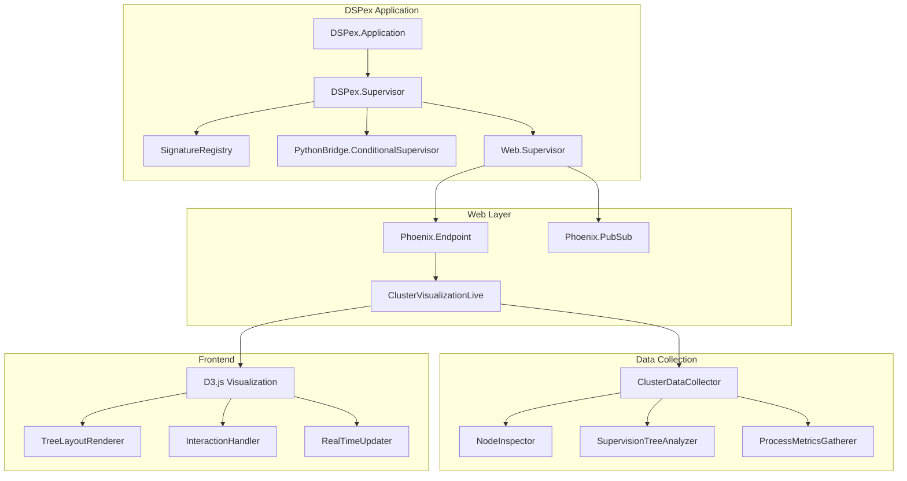

# Design Document

## Overview

The cluster visualization system will be implemented as a Phoenix LiveView application integrated into the existing DSPex architecture. The system consists of three main components:

1. **Backend Data Collection**: Elixir modules that gather cluster topology and process information
2. **Web Interface**: Phoenix LiveView pages with real-time updates
3. **Frontend Visualization**: D3.js-powered interactive visualizations

The design leverages Elixir's built-in distributed computing capabilities and integrates seamlessly with the existing DSPex supervision tree without requiring external dependencies beyond Phoenix and D3.js.

## Architecture

### High-Level Architecture



### Component Integration

The visualization system will be added to the existing DSPex application as a new supervised component, ensuring it doesn't interfere with core functionality while providing comprehensive monitoring capabilities.

## Components and Interfaces

### 1. Data Collection Layer

#### ClusterDataCollector
**Purpose**: Central module for gathering cluster-wide topology and metrics data.

**Interface**:
```elixir
defmodule DSPex.Visualization.ClusterDataCollector do
  @spec get_cluster_topology() :: {:ok, map()} | {:error, term()}
  def get_cluster_topology()
  
  @spec get_node_supervision_tree(node()) :: {:ok, map()} | {:error, term()}
  def get_node_supervision_tree(node)
  
  @spec get_cluster_health() :: {:ok, map()} | {:error, term()}
  def get_cluster_health()
end
```

**Key Functions**:
- Discover all connected nodes using `Node.list([:visible, :connected])`
- Collect supervision tree data from each node
- Gather process metrics and health information
- Cache data for 5 seconds to optimize performance

#### NodeInspector
**Purpose**: Inspect individual nodes for processes, applications, and system metrics.

**Interface**:
```elixir
defmodule DSPex.Visualization.NodeInspector do
  @spec get_node_info(node()) :: {:ok, map()} | {:error, term()}
  def get_node_info(node)
  
  @spec get_supervision_tree(node(), pid()) :: {:ok, map()} | {:error, term()}
  def get_supervision_tree(node, supervisor_pid)
  
  @spec get_process_metrics(node(), pid()) :: {:ok, map()} | {:error, term()}
  def get_process_metrics(node, process_pid)
end
```

#### SupervisionTreeAnalyzer
**Purpose**: Analyze and format supervision tree data for visualization.

**Interface**:
```elixir
defmodule DSPex.Visualization.SupervisionTreeAnalyzer do
  @spec analyze_tree(map()) :: {:ok, map()} | {:error, term()}
  def analyze_tree(raw_tree_data)
  
  @spec calculate_tree_layout(map()) :: {:ok, map()} | {:error, term()}
  def calculate_tree_layout(tree_data)
  
  @spec add_visualization_metadata(map()) :: map()
  def add_visualization_metadata(tree_data)
end
```

### 2. Web Layer

#### Phoenix Application Integration
The web layer will be added to DSPex as an optional component that starts only when visualization is needed.

**New Dependencies**:
```elixir
# In mix.exs
{:phoenix, "~> 1.7.0"},
{:phoenix_live_view, "~> 0.20.0"},
{:phoenix_html, "~> 3.3"},
{:plug_cowboy, "~> 2.5"}
```

#### DSPexWeb.Endpoint
**Purpose**: Phoenix endpoint for serving the web interface.

**Configuration**:
```elixir
defmodule DSPexWeb.Endpoint do
  use Phoenix.Endpoint, otp_app: :dspex
  
  socket "/live", Phoenix.LiveView.Socket,
    websocket: [connect_info: [session: @session_options]]
  
  plug Plug.Static,
    at: "/",
    from: :dspex,
    gzip: false,
    only: ~w(assets fonts images favicon.ico robots.txt)
  
  plug DSPexWeb.Router
end
```

#### ClusterVisualizationLive
**Purpose**: Main LiveView module for the cluster visualization interface.

**Interface**:
```elixir
defmodule DSPexWeb.Live.ClusterVisualizationLive do
  use Phoenix.LiveView
  
  def mount(_params, _session, socket)
  def handle_event("refresh_data", _params, socket)
  def handle_event("toggle_auto_refresh", _params, socket)
  def handle_event("change_view_mode", %{"view_mode" => mode}, socket)
  def handle_info(:refresh_cluster_data, socket)
end
```

**State Management**:
- `cluster_data`: Current cluster topology and metrics
- `loading`: Boolean indicating data loading state
- `error_message`: Error message for display
- `view_mode`: Current visualization mode (tree, force, hierarchical)
- `auto_refresh`: Boolean for automatic refresh toggle
- `last_updated`: Timestamp of last data refresh

### 3. Frontend Visualization

#### D3.js Integration
**Purpose**: Interactive visualization using D3.js for rendering cluster topology.

**Key Components**:

**TreeLayoutRenderer**:
```javascript
class TreeLayoutRenderer {
  constructor(container, data) {
    this.container = container;
    this.data = data;
    this.svg = null;
    this.simulation = null;
  }
  
  render() {
    this.createSVG();
    this.calculateLayout();
    this.renderNodes();
    this.renderLinks();
    this.addInteractivity();
  }
  
  calculateLayout() {
    // Position nodes horizontally by cluster node
    // Position processes vertically by supervision level
  }
}
```

**InteractionHandler**:
```javascript
class InteractionHandler {
  constructor(renderer) {
    this.renderer = renderer;
  }
  
  addZoomPan() {
    // Implement zoom and pan functionality
  }
  
  addTooltips() {
    // Show process details on hover
  }
  
  addClickHandlers() {
    // Handle expand/collapse and detail panel
  }
}
```

## Data Models

### ClusterTopology
```elixir
%{
  nodes: [
    %{
      name: atom(),
      alive: boolean(),
      memory_usage: integer(),
      process_count: integer(),
      supervisor_count: integer(),
      applications: [atom()],
      uptime: integer(),
      supervision_trees: [SupervisionTree.t()]
    }
  ],
  total_nodes: integer(),
  total_supervisors: integer(),
  total_processes: integer(),
  timestamp: DateTime.t()
}
```

### SupervisionTree
```elixir
%{
  name: String.t(),
  pid: String.t(),
  type: :supervisor | :worker,
  alive: boolean(),
  memory: integer(),
  message_queue_len: integer(),
  level: integer(),
  coordinates: %{x: float(), y: float()},
  children: [SupervisionTree.t()],
  metadata: %{
    application: atom(),
    strategy: atom(),
    restart_count: integer(),
    uptime: integer()
  }
}
```

### ProcessMetrics
```elixir
%{
  pid: String.t(),
  memory: integer(),
  message_queue_len: integer(),
  cpu_usage: float(),
  status: :running | :waiting | :suspended,
  registered_name: atom() | nil,
  initial_call: {module(), atom(), integer()},
  current_function: {module(), atom(), integer()}
}
```

## Error Handling

### Backend Error Handling
1. **Node Communication Failures**: Gracefully handle unreachable nodes by marking them as offline
2. **Process Inspection Errors**: Skip processes that can't be inspected and log warnings
3. **Data Collection Timeouts**: Implement 10-second timeouts for remote calls
4. **Memory Protection**: Limit supervision tree depth to prevent excessive memory usage

### Frontend Error Handling
1. **WebSocket Connection Loss**: Automatically reconnect and show connection status
2. **Data Parsing Errors**: Display error messages and fallback to cached data
3. **Rendering Failures**: Gracefully degrade to simpler visualizations
4. **Performance Issues**: Implement virtual scrolling for large datasets

### Error Recovery Strategies
```elixir
defmodule DSPex.Visualization.ErrorHandler do
  def handle_node_error(node, error) do
    Logger.warn("Failed to inspect node #{node}: #{inspect(error)}")
    %{name: node, alive: false, error: error}
  end
  
  def handle_process_error(pid, error) do
    Logger.debug("Failed to inspect process #{inspect(pid)}: #{inspect(error)}")
    nil  # Skip this process
  end
end
```

## Testing Strategy

### Unit Testing
1. **Data Collection**: Test cluster data gathering with mock nodes
2. **Tree Analysis**: Test supervision tree parsing and layout calculation
3. **Web Interface**: Test LiveView event handling and state management

### Integration Testing
1. **Multi-Node Setup**: Test with actual distributed Erlang nodes
2. **Real Supervision Trees**: Test with DSPex's actual supervision structure
3. **WebSocket Communication**: Test real-time updates and error scenarios

### Performance Testing
1. **Large Clusters**: Test with 10+ nodes and complex supervision trees
2. **Memory Usage**: Ensure visualization doesn't impact core DSPex performance
3. **Update Frequency**: Test real-time updates under load

### Test Data Generation
```elixir
defmodule DSPex.Visualization.TestDataGenerator do
  def generate_cluster_topology(node_count \\ 3) do
    # Generate realistic test data for development and testing
  end
  
  def generate_supervision_tree(depth \\ 4, breadth \\ 3) do
    # Generate complex supervision trees for testing
  end
end
```

## Performance Considerations

### Backend Optimization
1. **Caching**: Cache cluster data for 5 seconds to reduce system load
2. **Selective Updates**: Only collect changed data for real-time updates
3. **Depth Limiting**: Default maximum supervision tree depth of 5 levels
4. **Lazy Loading**: Load process details on-demand rather than upfront

### Frontend Optimization
1. **Virtual Rendering**: Use virtual scrolling for large process lists
2. **Level of Detail**: Show less detail when zoomed out
3. **Debounced Updates**: Batch rapid changes to prevent excessive re-rendering
4. **Canvas Fallback**: Switch to Canvas rendering for >1000 elements

### Memory Management
```elixir
defmodule DSPex.Visualization.PerformanceMonitor do
  @max_processes_per_node 1000
  @max_tree_depth 5
  @cache_ttl 5_000
  
  def should_limit_data?(data) do
    count_processes(data) > @max_processes_per_node
  end
  
  def limit_tree_depth(tree, max_depth \\ @max_tree_depth) do
    # Truncate trees that are too deep
  end
end
```

## Security Considerations

### Access Control
1. **Local Access Only**: By default, bind to localhost only
2. **Optional Authentication**: Support for basic auth if needed
3. **Process Isolation**: Visualization runs in separate supervision tree

### Data Protection
1. **Sensitive Information**: Filter out sensitive process data
2. **Resource Limits**: Prevent excessive resource consumption
3. **Error Information**: Sanitize error messages in production

## Deployment and Configuration

### Configuration Options
```elixir
# config/config.exs
config :dspex, DSPexWeb.Endpoint,
  http: [port: 4000],
  server: true,
  live_view: [signing_salt: "cluster_viz"]

config :dspex, :visualization,
  enabled: true,
  auto_refresh_interval: 5_000,
  max_tree_depth: 5,
  cache_ttl: 5_000
```

### Optional Startup
The web interface will be optional and only start when explicitly enabled:

```elixir
defmodule DSPex.Application do
  def start(_type, _args) do
    children = base_children() ++ web_children()
    
    opts = [strategy: :one_for_one, name: DSPex.Supervisor]
    Supervisor.start_link(children, opts)
  end
  
  defp web_children do
    if Application.get_env(:dspex, :visualization)[:enabled] do
      [DSPexWeb.Supervisor]
    else
      []
    end
  end
end
```

This design provides a comprehensive, performant, and maintainable cluster visualization system that integrates seamlessly with the existing DSPex architecture while providing powerful monitoring and debugging capabilities.