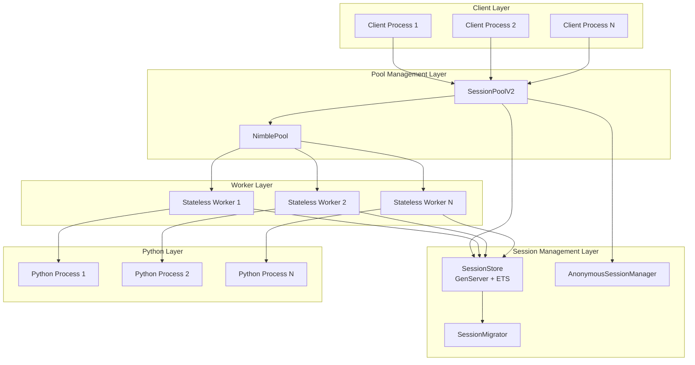

# Design Document

## Overview

This design document outlines the complete architectural redesign of DSPex's session management system. The current implementation suffers from fundamental flaws where sessions are stored locally in workers but accessed globally via session affinity, causing routing failures, scalability limitations, and performance degradation.

The proposed solution implements a **centralized session store** architecture that decouples session state from worker instances, enabling true stateless workers and horizontal scalability. This design addresses all identified issues while maintaining backward compatibility during migration.

## Architecture

### High-Level Architecture



### Current vs Proposed Architecture Comparison

**Current (Problematic) Architecture:**
```
Client → SessionPoolV2 → SessionAffinity (ETS) → Specific Worker → Local Session Storage
```

**Proposed (Fixed) Architecture:**
```
Client → SessionPoolV2 → Any Available Worker → Centralized SessionStore → Session Data
```

## Components and Interfaces

### 1. Centralized Session Store (`DSPex.PythonBridge.SessionStore`)

The core component that manages all session data using ETS for performance with GenServer for coordination.

#### Interface

```elixir
defmodule DSPex.PythonBridge.SessionStore do
  # Session CRUD operations
  @spec create_session(String.t(), keyword()) :: {:ok, Session.t()} | {:error, term()}
  def create_session(session_id, opts \\ [])
  
  @spec get_session(String.t()) :: {:ok, Session.t()} | {:error, :not_found}
  def get_session(session_id)
  
  @spec update_session(String.t(), (Session.t() -> Session.t())) :: {:ok, Session.t()} | {:error, term()}
  def update_session(session_id, update_fn)
  
  @spec delete_session(String.t()) :: :ok
  def delete_session(session_id)
  
  # Session lifecycle management
  @spec cleanup_expired_sessions() :: non_neg_integer()
  def cleanup_expired_sessions()
  
  # Monitoring and statistics
  @spec get_stats() :: map()
  def get_stats()
end
```

#### Implementation Details

- **Storage**: ETS table with `:set`, `:public`, `:named_table` options for concurrent access
- **Coordination**: GenServer for cleanup scheduling and complex operations
- **TTL Management**: Automatic cleanup of expired sessions based on `last_accessed + ttl`
- **Concurrency**: Optimized for high concurrent read/write operations

### 2. Session Data Structure

```elixir
defmodule DSPex.PythonBridge.Session do
  @type t :: %__MODULE__{
    id: String.t(),
    programs: map(),           # {program_id => program_data}
    metadata: map(),           # Additional session metadata
    created_at: integer(),     # System.monotonic_time(:second)
    last_accessed: integer(),  # System.monotonic_time(:second)
    ttl: integer()            # Time-to-live in seconds
  }
  
  defstruct [:id, :programs, :metadata, :created_at, :last_accessed, :ttl]
end
```

### 3. Stateless Worker Architecture

Workers are transformed to be completely stateless, fetching session data on demand.

#### Python Bridge Communication Protocol

```elixir
# New session store communication commands
%{
  "command" => "get_session",
  "args" => %{"session_id" => session_id}
}

%{
  "command" => "update_session", 
  "args" => %{
    "session_id" => session_id,
    "operation" => "set_program",
    "program_id" => program_id,
    "program_data" => program_data
  }
}
```

#### Updated Python Worker Implementation

```python
class DSPyBridge:
    def __init__(self, mode="standalone", worker_id=None):
        self.mode = mode
        self.worker_id = worker_id
        # NO local session storage - all data fetched from centralized store
        
    def create_program(self, args):
        session_id = args.get("session_id", "anonymous")
        program_id = args.get("id")
        
        # Fetch session from centralized store
        session = self.get_session_from_store(session_id)
        
        # Create program
        program = self._create_program_from_signature(args.get("signature"))
        
        # Update session in centralized store
        self.update_session_in_store(session_id, "programs", program_id, program)
        
        return {"program_id": program_id, "status": "created"}
```

### 4. Session Migration System (`DSPex.PythonBridge.SessionMigrator`)

Handles dynamic session redistribution for load balancing and maintenance.

#### Interface

```elixir
defmodule DSPex.PythonBridge.SessionMigrator do
  @spec migrate_session(String.t(), String.t(), String.t()) :: {:ok, Session.t()} | {:error, term()}
  def migrate_session(session_id, from_worker, to_worker)
  
  @spec rebalance_sessions(map()) :: :ok
  def rebalance_sessions(target_distribution)
  
  @spec evacuate_worker(String.t()) :: :ok
  def evacuate_worker(worker_id)
end
```

#### Migration Process

1. **Preparation**: Validate source and target workers
2. **State Transfer**: Copy session data (already centralized, so minimal work)
3. **Routing Update**: Update any worker-specific routing if needed
4. **Verification**: Confirm successful migration
5. **Cleanup**: Remove old references

### 5. Anonymous Session Manager (`DSPex.PythonBridge.AnonymousSessionManager`)

Replaces problematic anonymous sessions with temporary sessions.

#### Interface

```elixir
defmodule DSPex.PythonBridge.AnonymousSessionManager do
  @spec create_anonymous_session(keyword()) :: {:ok, String.t()}
  def create_anonymous_session(opts \\ [])
  
  @spec execute_anonymous(atom(), map()) :: {:ok, term()} | {:error, term()}
  def execute_anonymous(command, args)
end
```

#### Implementation Strategy

- Generate unique temporary session IDs: `"temp_" <> Base.encode64(:crypto.strong_rand_bytes(16))`
- Short TTL (5 minutes default) for automatic cleanup
- Automatic cleanup after operation completion
- No session affinity binding required

## Data Models

### Session Store Schema

```elixir
# ETS Table Structure
# Table: :dspex_sessions
# Type: :set
# Key: session_id (String.t())
# Value: Session.t()

{session_id, %Session{
  id: session_id,
  programs: %{
    "program_1" => %{
      signature: %{...},
      created_at: timestamp,
      execution_count: 0
    }
  },
  metadata: %{
    worker_affinity: nil,  # No longer used
    created_by: "client_process",
    tags: ["user_session"]
  },
  created_at: 1642678800,
  last_accessed: 1642678900,
  ttl: 3600
}}
```

### Migration State Tracking

```elixir
# ETS Table: :dspex_session_migrations
# Tracks ongoing migrations for monitoring and rollback

{migration_id, %{
  session_id: String.t(),
  from_worker: String.t(),
  to_worker: String.t(),
  status: :pending | :in_progress | :completed | :failed,
  started_at: integer(),
  completed_at: integer() | nil,
  error: term() | nil
}}
```

## Error Handling

### Error Categories and Strategies

#### 1. Session Store Unavailable
- **Detection**: ETS table not found or GenServer not responding
- **Strategy**: Graceful degradation with local caching
- **Recovery**: Automatic retry with exponential backoff

#### 2. Session Data Corruption
- **Detection**: Invalid session structure or missing required fields
- **Strategy**: Attempt data recovery or create new session
- **Recovery**: Log corruption details and notify administrators

#### 3. Migration Failures
- **Detection**: Migration timeout or worker unavailability
- **Strategy**: Rollback to previous state
- **Recovery**: Retry migration with different target worker

#### 4. TTL Cleanup Failures
- **Detection**: Cleanup process exceptions or timeouts
- **Strategy**: Continue with partial cleanup and retry
- **Recovery**: Manual cleanup tools and monitoring alerts

### Error Recovery Mechanisms

```elixir
defmodule DSPex.PythonBridge.SessionErrorRecovery do
  def handle_session_error(error, context) do
    case error do
      {:session_not_found, session_id} ->
        create_recovery_session(session_id, context)
        
      {:session_corrupted, session_id} ->
        backup_and_recreate_session(session_id, context)
        
      {:store_unavailable, _reason} ->
        enable_local_cache_mode(context)
        
      {:migration_failed, migration_id} ->
        rollback_migration(migration_id, context)
    end
  end
end
```

## Testing Strategy

### Unit Tests

#### Session Store Tests
- Session CRUD operations
- TTL expiration and cleanup
- Concurrent access scenarios
- Error handling and recovery

#### Worker Integration Tests
- Stateless worker session access
- Session data consistency across workers
- Error propagation and handling

#### Migration Tests
- Session migration between workers
- Load rebalancing scenarios
- Worker evacuation procedures
- Migration failure and rollback

### Integration Tests

#### End-to-End Session Lifecycle
- Session creation through anonymous manager
- Program creation and execution across multiple workers
- Session expiration and cleanup
- Error scenarios and recovery

#### Performance Tests
- High concurrent session access
- Session store throughput benchmarks
- Memory usage patterns
- Migration performance under load

### Load Tests

#### Scalability Testing
- 10,000+ concurrent sessions
- 1,000+ operations per second
- Worker scaling scenarios
- Memory leak detection

#### Stress Testing
- Session store failure scenarios
- Worker failure during operations
- Network partition simulation
- Resource exhaustion scenarios

## Performance Considerations

### Optimization Strategies

#### 1. ETS Configuration
```elixir
:ets.new(@sessions_table, [
  :set,
  :public, 
  :named_table,
  {:read_concurrency, true},
  {:write_concurrency, true},
  {:decentralized_counters, true}
])
```

#### 2. Batch Operations
- Batch session updates to reduce ETS operations
- Bulk cleanup operations for expired sessions
- Batch migration operations for load rebalancing

#### 3. Caching Strategy
- Worker-local session caching for frequently accessed sessions
- TTL-based cache invalidation
- Cache warming for predictable access patterns

### Performance Targets

| Metric | Target | Measurement Method |
|--------|--------|-------------------|
| Session Creation | < 1ms | Average latency over 1000 operations |
| Session Lookup | < 0.5ms | Average latency over 10000 operations |
| Session Update | < 2ms | Average latency over 1000 operations |
| Concurrent Sessions | 10,000+ | Sustained load test |
| Session Throughput | 1,000+ ops/sec | Peak throughput measurement |
| Memory Usage | < 1MB per 1000 sessions | Memory profiling |

## Security Considerations

### Session Isolation
- Sessions are isolated by session_id
- No cross-session data access
- Secure session ID generation using cryptographic random bytes

### Access Control
- Worker authentication for session store access
- Session ownership validation
- Audit logging for session operations

### Data Protection
- Session data encryption at rest (optional)
- Secure cleanup of sensitive session data
- Memory scrubbing for deleted sessions

## Migration and Deployment Strategy

### Phase 1: Dual Operation Mode
- Run both old and new session systems in parallel
- Route percentage of traffic to new system
- Compare results and validate consistency

### Phase 2: Gradual Migration
- Increase traffic percentage to new system
- Monitor performance and error rates
- Implement rollback procedures

### Phase 3: Complete Cutover
- Switch all traffic to new system
- Decommission old session management code
- Clean up legacy data structures

### Rollback Plan
- Immediate traffic routing back to old system
- Session data export/import utilities
- Automated rollback triggers based on error rates