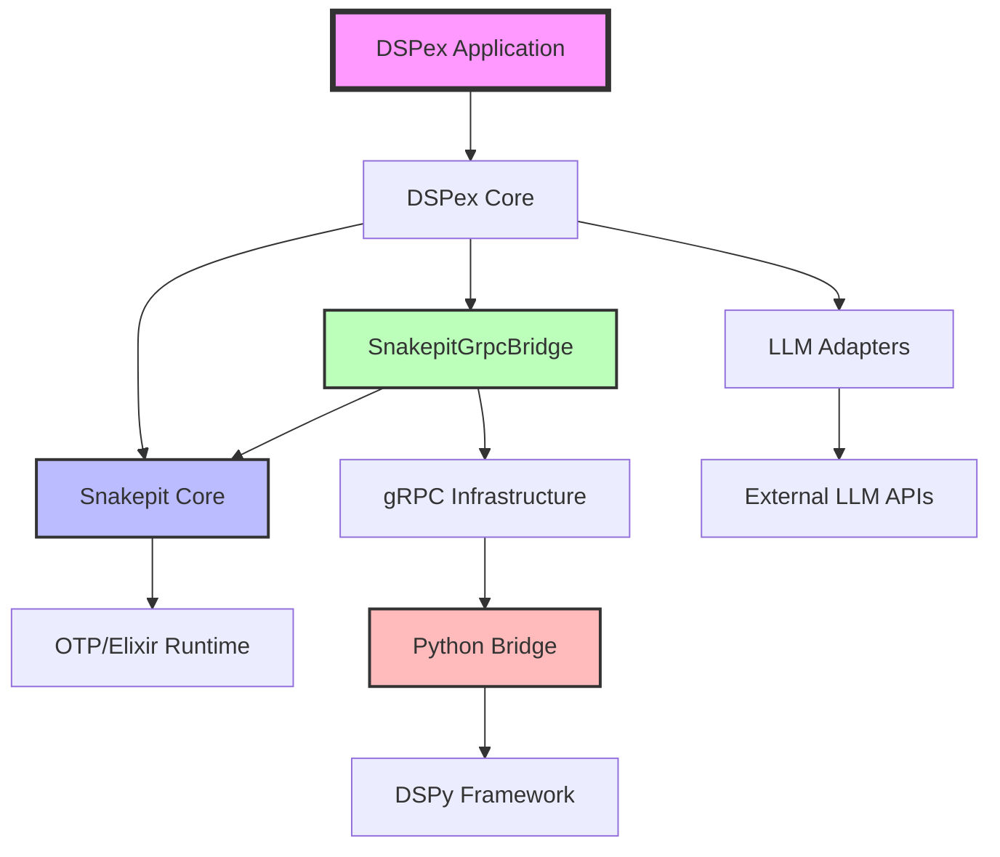

# DSPex Dependency and Coupling Analysis

## Dependency Graph

### High-Level Component Dependencies



### Detailed Module Dependencies

#### DSPex Internal Dependencies

```
DSPex (main module)
├─→ DSPex.Pipeline
├─→ DSPex.Config
├─→ DSPex.Settings
├─→ DSPex.LM
├─→ DSPex.Models
└─→ DSPex.Examples

DSPex.Bridge
├─→ DSPex.Utils.ID
├─→ DSPex.Bridge.Tools
└─→ Snakepit.execute_in_session/4

DSPex.Modules.*
├─→ DSPex.Utils.ID
└─→ Snakepit.Python.call/3

DSPex.Context
├─→ Snakepit.Bridge.SessionStore
└─→ DSPex.Context.Monitor

DSPex.Variables
└─→ Snakepit.Bridge.Variables

DSPex.Python.Bridge
└─→ Snakepit.execute_in_session/4
```

#### Snakepit Internal Dependencies

```
Snakepit (main module)
├─→ Snakepit.Pool
├─→ Snakepit.Adapter
├─→ Snakepit.SessionHelpers
└─→ Snakepit.Telemetry

Snakepit.Pool
├─→ Snakepit.Pool.Registry
├─→ Snakepit.Pool.WorkerSupervisor
├─→ Snakepit.Pool.WorkerStarter
└─→ Snakepit.Pool.ProcessRegistry
```

## Coupling Analysis

### Tight Coupling Points

#### 1. DSPex → Snakepit API Coupling
- **50+ direct calls** to Snakepit functions
- **Main coupling points**:
  - `Snakepit.Python.call/3` - 30+ occurrences
  - `Snakepit.execute_in_session/4` - 15+ occurrences
  - `Snakepit.execute/3` - 5+ occurrences

#### 2. Session Management Coupling
```elixir
# DSPex.Context is completely coupled to Snakepit
defmodule DSPex.Context do
  alias Snakepit.Bridge.SessionStore
  
  # All operations delegate to SessionStore
  defdelegate start_link(opts), to: SessionStore
  defdelegate get(session_id, key, default), to: SessionStore
  defdelegate put(session_id, key, value), to: SessionStore
end
```

#### 3. Variable System Coupling
```elixir
# DSPex.Variables delegates everything to Snakepit
defmodule DSPex.Variables do
  defdelegate defvariable(ctx, name, type, default, opts), 
    to: Snakepit.Bridge.Variables
  defdelegate get(ctx, identifier, default), 
    to: Snakepit.Bridge.Variables
  defdelegate set(ctx, identifier, value), 
    to: Snakepit.Bridge.Variables
end
```

### Loose Coupling Points

#### 1. LLM Adapter System
- Uses behavior pattern for extensibility
- Adapters are pluggable
- No direct dependencies on specific LLM providers

#### 2. Configuration System
- Environment-based configuration
- Runtime configuration possible
- Decoupled from implementation details

## Circular Dependencies

### Current State: No Circular Dependencies ✓
- DSPex depends on Snakepit
- Snakepit has no dependencies on DSPex
- SnakepitGrpcBridge depends on Snakepit core

### Risk Areas for Future
1. If Snakepit modules start importing DSPex types
2. If shared utilities are created without clear ownership
3. If bidirectional communication is implemented incorrectly

## Interface Boundaries

### 1. DSPex ↔ Snakepit Interface
```elixir
# Main execution interface
@spec execute(String.t(), map(), keyword()) :: 
  {:ok, map()} | {:error, term()}

# Session-based interface  
@spec execute_in_session(String.t(), String.t(), map(), keyword()) :: 
  {:ok, map()} | {:error, term()}

# Python call interface
@spec call(String.t(), map(), keyword()) :: 
  {:ok, map()} | {:error, term()}
```

### 2. Snakepit ↔ Python Bridge Interface
- gRPC protocol buffers define the interface
- Binary serialization for large objects
- Session context passed through headers

### 3. DSPex ↔ External LLMs Interface
```elixir
# Adapter behavior
@callback call(request :: map(), config :: map()) :: 
  {:ok, response :: map()} | {:error, term()}

@callback stream(request :: map(), config :: map()) :: 
  {:ok, Stream.t()} | {:error, term()}
```

## Dependency Injection Points

### 1. Adapter Selection
```elixir
# Runtime adapter selection
config :snakepit,
  pools: [
    default: [
      adapter: Snakepit.Adapters.GRPCPython,
      adapter_args: ["--adapter", "custom_adapter"]
    ]
  ]
```

### 2. LLM Provider Selection
```elixir
# Runtime LLM selection
config :dspex,
  llm_adapter: DSPex.LLM.Adapters.Gemini,
  llm_config: %{
    model: "gemini-2.0-flash-exp",
    api_key: System.get_env("GEMINI_API_KEY")
  }
```

## Migration Impact Analysis

### Breaking Changes
1. **Namespace changes**: All DSPex.Bridge, DSPex.Modules will move
2. **Import updates**: Applications using DSPex will need updates
3. **Configuration changes**: Some config will move to Snakepit

### Non-Breaking Changes (with compatibility layer)
1. **Public API**: Main DSPex functions remain the same
2. **Behavior**: Functionality preserved through delegation
3. **Performance**: No degradation expected

### Risk Mitigation
1. **Compatibility modules**: Temporary forwarding modules
2. **Deprecation warnings**: Clear migration messages
3. **Dual support period**: Both old and new APIs work

## Metrics

### Code Coupling Metrics
- **DSPex → Snakepit calls**: 50+ direct dependencies
- **Shared modules**: 2 (Context, Variables - already delegated)
- **Circular dependencies**: 0
- **Interface violations**: 0

### Module Cohesion
- **DSPex cohesion**: Medium (mixed orchestration + bridge)
- **Snakepit cohesion**: High (focused on pooling)
- **Target cohesion**: High for both after refactoring

## Recommendations

### 1. Immediate Actions
- Create compatibility layer before moving code
- Document all public APIs that will change
- Set up migration tooling

### 2. Refactoring Sequence
1. Move Python bridge components first
2. Move Elixir DSPy modules second
3. Update examples and tests third
4. Remove compatibility layer last

### 3. Testing Strategy
- Maintain parallel test suites during migration
- Test both old and new APIs
- Performance benchmarks before/after
- Integration tests for both architectures

### 4. Communication Plan
- Announce deprecation schedule
- Provide migration guides
- Offer automated migration tools
- Support period for questions