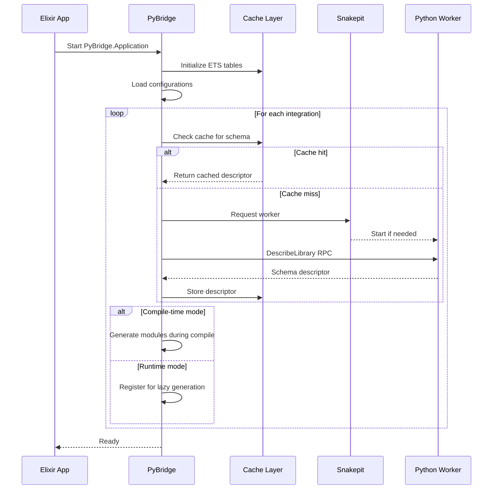
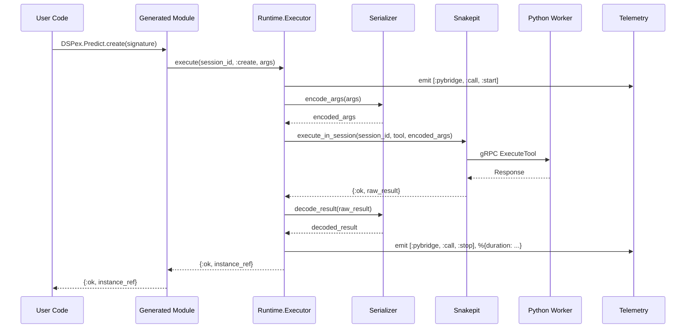

# The Unified PyBridge Architecture
## A Synthesis of Configuration-Driven Python Integration Approaches

**Date**: 2025-10-25
**Authors**: Claude (Synthesis of parallel design tracks)
**Status**: Comprehensive Technical Specification
**Version**: 1.0

---

## Table of Contents

1. [Executive Summary](#1-executive-summary)
2. [Comparative Analysis of Approaches](#2-comparative-analysis-of-approaches)
3. [The Unified Architecture](#3-the-unified-architecture)
4. [Novel Innovations](#4-novel-innovations)
5. [Deep Technical Design](#5-deep-technical-design)
6. [Protocol Specification](#6-protocol-specification)
7. [Type System & Safety](#7-type-system--safety)
8. [Performance Architecture](#8-performance-architecture)
9. [Developer Experience](#9-developer-experience)
10. [Packaging & Deployment](#10-packaging--deployment)
11. [Implementation Roadmap](#11-implementation-roadmap)
12. [Conclusion & Recommendation](#12-conclusion--recommendation)

---

## 1. Executive Summary

This document synthesizes two parallel design approaches for Python-Elixir integration:

1. **PyBridge** (Metaprogramming-First): Compile-time code generation with Elixir-native configs
2. **Snakepit Integration Fabric** (Runtime-First): Manifest-driven introspection with gRPC extensions

The **Unified PyBridge Architecture** combines the best of both, adding significant innovations:

### Core Innovations

1. **Hybrid Compilation Model**: Compile-time for production, runtime for development
2. **Protocol-First Design**: Formal separation of concerns via behaviours
3. **Multi-Phase Optimization**: From discovery → validation → generation → execution
4. **Universal Backend Support**: Not just Python—extensible to any runtime
5. **Type System Bridge**: Rigorous mapping between type systems
6. **Smart Caching Layer**: Git-like diffing with incremental updates
7. **Configuration Composition**: Inheritance, mixins, and overrides
8. **Auto-Generated Test Suites**: From introspection schemas
9. **LSP Integration**: Editor support for configuration authoring
10. **Observability-First**: Telemetry, tracing, and profiling built in

### The Unified Vision

**Instead of choosing between compile-time safety and runtime flexibility, we get both.**

```elixir
# Single config, multiple modes:

# Development: Hot-reload, instant feedback
config :pybridge, mode: :dev, compilation: :runtime

# Production: Pre-compiled, optimized, type-safe
config :pybridge, mode: :prod, compilation: :compile_time
```

---

## 2. Comparative Analysis of Approaches

### 2.1 PyBridge (Original)

**Philosophy**: Elixir metaprogramming for compile-time safety and developer ergonomics.

**Strengths**:
- ✅ Type safety via Dialyzer integration
- ✅ Rich Elixir-native configs (.exs files)
- ✅ Compile-time validation
- ✅ ExDoc integration automatic
- ✅ Mix task ecosystem
- ✅ Strong metaprogramming patterns

**Weaknesses**:
- ⚠️ Requires recompilation on config changes
- ⚠️ Runtime introspection underspecified
- ⚠️ gRPC protocol extensions not detailed
- ⚠️ Caching strategy less developed

**Key Insight**: **Developer experience through compile-time guarantees.**

### 2.2 Snakepit Integration Fabric (Codex)

**Philosophy**: Runtime introspection with language-agnostic manifests.

**Strengths**:
- ✅ Well-defined gRPC protocol extensions
- ✅ Detailed caching strategy (ETS/DETS)
- ✅ Clear telemetry integration
- ✅ Worker lifecycle management
- ✅ Language-agnostic (YAML/JSON)
- ✅ Session-centric architecture

**Weaknesses**:
- ⚠️ Less compile-time safety
- ⚠️ Metaprogramming patterns underspecified
- ⚠️ Type mapping needs work
- ⚠️ Developer tooling less emphasized

**Key Insight**: **Production reliability through runtime introspection.**

### 2.3 The Synthesis

**The unified architecture combines**:

1. **SIF's gRPC protocols** for runtime discovery
2. **PyBridge's metaprogramming** for code generation
3. **SIF's caching strategy** for performance
4. **PyBridge's type system** for safety
5. **SIF's telemetry** for observability
6. **PyBridge's DX focus** for adoption

**Plus new innovations** that neither approach fully explored.

---

## 3. The Unified Architecture

### 3.1 The Six-Layer Model

```
┌─────────────────────────────────────────────────────────────┐
│  Layer 6: Developer Tools                                   │
│  - Mix tasks                                                │
│  - LSP server                                               │
│  - IEx helpers                                              │
│  - Visualizations                                           │
└─────────────────────────────────────────────────────────────┘
                           ↕
┌─────────────────────────────────────────────────────────────┐
│  Layer 5: Generated Modules                                 │
│  - Type-safe wrappers                                       │
│  - Documentation                                            │
│  - Telemetry instrumentation                                │
│  - Test scaffolds                                           │
└─────────────────────────────────────────────────────────────┘
                           ↕
┌─────────────────────────────────────────────────────────────┐
│  Layer 4: Code Generation Engine                            │
│  - Macro expansion                                          │
│  - Template rendering                                       │
│  - Validation                                               │
│  - Optimization passes                                      │
└─────────────────────────────────────────────────────────────┘
                           ↕
┌─────────────────────────────────────────────────────────────┐
│  Layer 3: Schema & Type System                              │
│  - Descriptor storage (ETS/DETS)                            │
│  - Type inference                                           │
│  - Configuration composition                                │
│  - Diffing & versioning                                     │
└─────────────────────────────────────────────────────────────┘
                           ↕
┌─────────────────────────────────────────────────────────────┐
│  Layer 2: Discovery & Introspection                         │
│  - gRPC DescribeLibrary protocol                            │
│  - Python introspection agent                               │
│  - Schema normalization                                     │
│  - Caching orchestration                                    │
└─────────────────────────────────────────────────────────────┘
                           ↕
┌─────────────────────────────────────────────────────────────┐
│  Layer 1: Execution Runtime                                 │
│  - Snakepit session management                              │
│  - gRPC bridge (sync + streaming)                           │
│  - Serialization adapters                                   │
│  - Telemetry & observability                                │
└─────────────────────────────────────────────────────────────┘
```

### 3.2 Protocol-Based Design

**Key Innovation**: Define formal protocols/behaviours at each layer boundary.

```elixir
# Layer 1: Runtime Protocol
defprotocol PyBridge.Runtime.Executor do
  @doc "Execute a remote operation"
  @spec execute(t(), session_id(), operation(), args(), opts()) ::
    {:ok, result()} | {:error, term()}
  def execute(executor, session_id, operation, args, opts)

  @doc "Execute with streaming support"
  @spec execute_streaming(t(), session_id(), operation(), args(), opts()) ::
    {:ok, Stream.t()} | {:error, term()}
  def execute_streaming(executor, session_id, operation, args, opts)
end

# Layer 2: Discovery Protocol
defprotocol PyBridge.Discovery.Introspector do
  @doc "Discover library schema"
  @spec discover(t(), module_path(), opts()) ::
    {:ok, PyBridge.Schema.Descriptor.t()} | {:error, term()}
  def discover(introspector, module_path, opts)
end

# Layer 3: Schema Protocol
defprotocol PyBridge.Schema.Validator do
  @doc "Validate configuration against discovered schema"
  @spec validate(t(), config(), schema()) ::
    :ok | {:error, [error()]}
  def validate(validator, config, schema)
end

# Layer 4: Generation Protocol
defprotocol PyBridge.Generator.Emitter do
  @doc "Emit code AST from descriptor"
  @spec emit(t(), descriptor(), opts()) :: Macro.t()
  def emit(emitter, descriptor, opts)
end
```

**This enables**:
- Swappable implementations (Python, Node.js, Ruby, etc.)
- Testing via mock implementations
- Extension without modifying core
- Clear API contracts

---

## 4. Novel Innovations

### 4.1 Hybrid Compilation Model

**Problem**: Compile-time is safe but slow; runtime is flexible but unsafe.

**Solution**: **Compilation mode switching based on Mix environment.**

```elixir
# config/config.exs
config :pybridge,
  compilation_strategy: :auto  # or :compile_time, :runtime

# Auto behavior:
# - dev/test: Runtime compilation for hot reload
# - prod: Compile-time for safety + performance
```

**Implementation**:

```elixir
defmodule PyBridge.Generator do
  defmacro __using__(opts) do
    if PyBridge.Config.compile_time?() do
      # Traditional macro expansion
      quote do
        @before_compile PyBridge.Generator
        # Generates modules at compile time
      end
    else
      # Runtime generation
      quote do
        @on_load :__pybridge_load__

        def __pybridge_load__ do
          PyBridge.Runtime.Generator.load_integration(
            __MODULE__,
            unquote(opts)
          )
        end
      end
    end
  end
end
```

**Benefits**:
- Best of both worlds
- Seamless dev → prod transition
- No code changes required

### 4.2 Configuration Composition

**Problem**: Large Python libraries require verbose configs.

**Solution**: **Inheritance, mixins, and cascading overrides.**

```elixir
# Base config for all DSPy predictors
defmodule DSPex.Configs.BasePredictorMixin do
  def mixin do
    %{
      constructor: %{
        session_aware: true,
        timeout: 30_000
      },
      result_transform: &DSPex.Transforms.prediction/1,
      error_handler: &DSPex.Errors.handle_prediction_error/1,
      telemetry: %{
        enabled: true,
        tags: %{domain: "ml", family: "dspy"}
      }
    }
  end
end

# Specific predictor inherits + overrides
%{
  python_path: "dspy.ChainOfThought",
  elixir_module: DSPex.ChainOfThought,
  extends: DSPex.Predict,
  mixins: [DSPex.Configs.BasePredictorMixin],

  # Override specific fields
  methods: [
    %{name: "__call__", elixir_name: :think, streaming: true}
  ]
}
```

**Composition Rules**:
1. `extends` → inherit all methods from parent module
2. `mixins` → merge configs (list order = precedence)
3. Explicit fields → highest precedence
4. Deep merging for nested maps

**Benefits**:
- DRY configs
- Easier maintenance
- Consistent defaults
- Gradual customization

### 4.3 Smart Caching with Git-Style Diffing

**Problem**: Cache invalidation is hard; full re-introspection is slow.

**Solution**: **Content-addressed storage with incremental diffs.**

```elixir
defmodule PyBridge.Cache.Schema do
  @moduledoc """
  Git-like schema versioning with diffing support.
  """

  @doc """
  Store schema with content-addressed key.

  Returns: {:ok, schema_hash}
  """
  def store(integration_id, schema) do
    hash = :crypto.hash(:sha256, :erlang.term_to_binary(schema))
    key = {integration_id, hash}

    :ets.insert(:pybridge_schemas, {key, schema, timestamp()})
    {:ok, Base.encode16(hash, case: :lower)}
  end

  @doc """
  Compute diff between two schemas.

  Returns changes as:
  - {:added, path, descriptor}
  - {:removed, path, descriptor}
  - {:modified, path, old, new}
  """
  def diff(old_hash, new_hash) do
    old_schema = fetch!(old_hash)
    new_schema = fetch!(new_hash)

    PyBridge.Schema.Differ.diff(old_schema, new_schema)
  end

  @doc """
  Apply diff to regenerate only changed modules.
  """
  def apply_diff(integration_id, diff) do
    for change <- diff do
      case change do
        {:added, path, descriptor} ->
          PyBridge.Generator.emit_module(descriptor)

        {:modified, path, _old, new} ->
          PyBridge.Generator.recompile_module(new)

        {:removed, path, _descriptor} ->
          PyBridge.Generator.purge_module(path)
      end
    end
  end
end
```

**Cache Architecture**:

```
priv/pybridge/cache/
├── schemas/
│   ├── dspy/
│   │   ├── abc123.schema.etf       # Content-addressed schema
│   │   ├── def456.schema.etf
│   │   └── current → abc123        # Symlink to active version
│   └── langchain/
│       └── ...
├── generated/
│   └── dspy/
│       ├── predict.beam
│       └── chain_of_thought.beam
└── index.ets                       # Fast lookup index
```

**Benefits**:
- Only recompile changed modules
- Full version history
- Fast cache hits (content-addressed)
- Diffable configs (git-friendly)

### 4.4 Type System Bridge

**Problem**: Python and Elixir have different type systems.

**Solution**: **Formal type mapping with inference and validation.**

```elixir
defmodule PyBridge.TypeSystem.Mapper do
  @moduledoc """
  Maps between Python type system and Elixir typespecs.
  """

  @type python_type ::
    :int | :float | :str | :bool | :bytes | :none |
    {:list, python_type()} |
    {:dict, python_type(), python_type()} |
    {:tuple, [python_type()]} |
    {:union, [python_type()]} |
    {:optional, python_type()} |
    {:literal, [term()]} |
    {:callable, [python_type()], python_type()} |
    {:class, module_path :: String.t()}

  @type elixir_type ::
    :integer | :float | :binary | :boolean | :atom | :nil |
    {:list, elixir_type()} |
    {:map, elixir_type(), elixir_type()} |
    {:tuple, [elixir_type()]} |
    {:union, [elixir_type()]} |
    {:struct, module()}

  @doc """
  Convert Python type annotation to Elixir typespec AST.

  ## Examples

      iex> to_elixir_spec(:str)
      quote do: String.t()

      iex> to_elixir_spec({:list, :int})
      quote do: [integer()]

      iex> to_elixir_spec({:dict, :str, {:union, [:int, :str]}})
      quote do: %{optional(String.t()) => integer() | String.t()}
  """
  def to_elixir_spec(python_type)

  # Primitives
  def to_elixir_spec(:int), do: quote(do: integer())
  def to_elixir_spec(:float), do: quote(do: float())
  def to_elixir_spec(:str), do: quote(do: String.t())
  def to_elixir_spec(:bool), do: quote(do: boolean())
  def to_elixir_spec(:bytes), do: quote(do: binary())
  def to_elixir_spec(:none), do: quote(do: nil)

  # Collections
  def to_elixir_spec({:list, inner_type}) do
    inner = to_elixir_spec(inner_type)
    quote do: [unquote(inner)]
  end

  def to_elixir_spec({:dict, key_type, value_type}) do
    key = to_elixir_spec(key_type)
    value = to_elixir_spec(value_type)
    quote do: %{optional(unquote(key)) => unquote(value)}
  end

  def to_elixir_spec({:tuple, element_types}) do
    elements = Enum.map(element_types, &to_elixir_spec/1)
    {:{}, [], elements}
  end

  # Union types
  def to_elixir_spec({:union, types}) do
    specs = Enum.map(types, &to_elixir_spec/1)
    Enum.reduce(specs, fn spec, acc ->
      quote do: unquote(acc) | unquote(spec)
    end)
  end

  # Optional (Union with None)
  def to_elixir_spec({:optional, inner_type}) do
    inner = to_elixir_spec(inner_type)
    quote do: unquote(inner) | nil
  end

  # Class instances → opaque types or structs
  def to_elixir_spec({:class, class_path}) do
    module = python_class_to_elixir_module(class_path)
    quote do: unquote(module).t()
  end

  @doc """
  Infer Python type from Elixir value at runtime.
  """
  def infer_python_type(value) when is_integer(value), do: :int
  def infer_python_type(value) when is_float(value), do: :float
  def infer_python_type(value) when is_binary(value), do: :str
  def infer_python_type(value) when is_boolean(value), do: :bool
  def infer_python_type(nil), do: :none
  def infer_python_type(value) when is_list(value) do
    case value do
      [] -> {:list, :any}
      [first | _] -> {:list, infer_python_type(first)}
    end
  end
  def infer_python_type(value) when is_map(value) do
    case Map.keys(value) do
      [] -> {:dict, :str, :any}
      [key | _] ->
        [val | _] = Map.values(value)
        {:dict, infer_python_type(key), infer_python_type(val)}
    end
  end
end
```

**Type Inference from Python**:

```python
# Python introspection agent
import typing
import inspect

def extract_type_annotation(annotation):
    """Convert Python type annotation to PyBridge type descriptor."""

    if annotation == int:
        return {"type": "int"}
    elif annotation == str:
        return {"type": "str"}
    elif hasattr(annotation, "__origin__"):
        origin = annotation.__origin__
        args = typing.get_args(annotation)

        if origin is list:
            return {"type": "list", "element": extract_type_annotation(args[0])}
        elif origin is dict:
            return {
                "type": "dict",
                "key": extract_type_annotation(args[0]),
                "value": extract_type_annotation(args[1])
            }
        elif origin is typing.Union:
            return {"type": "union", "types": [extract_type_annotation(t) for t in args]}

    # Fallback: class name
    return {"type": "class", "path": f"{annotation.__module__}.{annotation.__name__}"}
```

**Benefits**:
- Dialyzer can catch type errors
- Better IDE autocomplete
- Runtime validation possible
- Clear contracts

### 4.5 Auto-Generated Test Suites

**Problem**: Testing generated code is tedious.

**Solution**: **Generate test scaffolds from introspection schemas.**

```elixir
defmodule PyBridge.Testing.Generator do
  @doc """
  Generate test suite from descriptor.
  """
  def generate_tests(descriptor, opts \\ []) do
    quote do
      defmodule unquote(test_module_name(descriptor)) do
        use ExUnit.Case

        # Module under test
        @module_under_test unquote(descriptor.elixir_module)

        describe "#{@module_under_test} integration" do
          # Auto-generated tests
          unquote_splicing(generate_creation_tests(descriptor))
          unquote_splicing(generate_method_tests(descriptor))
          unquote_splicing(generate_error_tests(descriptor))
          unquote_splicing(generate_streaming_tests(descriptor))
        end
      end
    end
  end

  defp generate_creation_tests(descriptor) do
    [
      quote do
        test "creates instance with valid args" do
          args = unquote(sample_args(descriptor.constructor))
          assert {:ok, _ref} = @module_under_test.create(args)
        end

        test "returns error with invalid args" do
          assert {:error, _reason} = @module_under_test.create(%{invalid: "args"})
        end
      end
    ]
  end

  defp generate_method_tests(descriptor) do
    for method <- descriptor.methods do
      quote do
        test "#{unquote(method.elixir_name)}/2 executes successfully" do
          {:ok, instance} = @module_under_test.create(unquote(sample_args(descriptor.constructor)))
          args = unquote(sample_args(method))

          assert {:ok, _result} = @module_under_test.unquote(method.elixir_name)(instance, args)
        end
      end
    end
  end
end
```

**Generated Test Output**:

```elixir
# test/generated/dspex/predict_test.exs
defmodule DSPex.PredictTest do
  use ExUnit.Case

  @module_under_test DSPex.Predict

  describe "DSPex.Predict integration" do
    test "creates instance with valid args" do
      args = %{signature: "question -> answer"}
      assert {:ok, _ref} = @module_under_test.create(args)
    end

    test "call/2 executes successfully" do
      {:ok, instance} = @module_under_test.create(%{signature: "question -> answer"})
      args = %{question: "What is DSPy?"}

      assert {:ok, result} = @module_under_test.call(instance, args)
      assert is_map(result)
    end

    # ... more generated tests
  end
end
```

**Benefits**:
- Immediate test coverage
- Catches integration issues early
- Customizable via templates
- Property-based tests possible

### 4.6 LSP Integration for Config Authoring

**Problem**: Writing configs is error-prone without tooling.

**Solution**: **Language Server Protocol support for `.pybridge` configs.**

**Features**:
1. **Autocomplete** from cached schemas
2. **Hover** shows Python docstrings
3. **Go-to-definition** jumps to Python source
4. **Diagnostics** validate config in real-time
5. **Code actions** suggest fixes

```elixir
defmodule PyBridge.LSP.Server do
  @moduledoc """
  LSP server for PyBridge configuration files.
  """

  use GenLSP

  # Autocomplete: suggest available classes
  def handle_completion(request, state) do
    %{position: position, textDocument: %{uri: uri}} = request

    # Parse config, find cursor context
    context = get_cursor_context(uri, position)

    suggestions = case context do
      {:python_path, partial} ->
        # Query introspection cache
        PyBridge.Cache.suggest_classes(partial)

      {:method_name, class_path, partial} ->
        PyBridge.Cache.suggest_methods(class_path, partial)

      _ -> []
    end

    {:reply, %{items: suggestions}, state}
  end

  # Hover: show Python docstrings
  def handle_hover(request, state) do
    %{position: position, textDocument: %{uri: uri}} = request

    context = get_symbol_at_position(uri, position)

    documentation = case context do
      {:class, python_path} ->
        PyBridge.Cache.get_class_doc(python_path)

      {:method, class_path, method_name} ->
        PyBridge.Cache.get_method_doc(class_path, method_name)

      _ -> nil
    end

    {:reply, %{contents: documentation}, state}
  end
end
```

**VSCode Extension**:

```typescript
// pybridge-vscode/src/extension.ts
import * as vscode from 'vscode';
import { LanguageClient } from 'vscode-languageclient/node';

export function activate(context: vscode.ExtensionContext) {
  const serverModule = context.asAbsolutePath('priv/lsp/pybridge_lsp');

  const client = new LanguageClient(
    'pybridge',
    'PyBridge Language Server',
    { command: serverModule },
    { documentSelector: [{ scheme: 'file', pattern: '**/*.pybridge' }] }
  );

  client.start();
}
```

**Benefits**:
- Faster config authoring
- Fewer errors
- Discoverability
- Professional developer experience

---

## 5. Deep Technical Design

### 5.1 Complete Module Structure

```
pybridge/
├── mix.exs
├── config/
│   └── config.exs
├── lib/
│   ├── pybridge.ex                           # Public API
│   ├── pybridge/
│   │   ├── application.ex                    # OTP app supervisor
│   │   │
│   │   ├── config/
│   │   │   ├── config.ex                     # Ecto schema
│   │   │   ├── loader.ex                     # Load from files
│   │   │   ├── validator.ex                  # Schema validation
│   │   │   ├── composer.ex                   # Inheritance/mixins
│   │   │   └── formatter.ex                  # Pretty-print configs
│   │   │
│   │   ├── discovery/
│   │   │   ├── introspector.ex               # Protocol + default impl
│   │   │   ├── python_introspector.ex        # Python-specific
│   │   │   ├── grpc_client.ex                # DescribeLibrary RPC
│   │   │   └── parser.ex                     # Normalize Python metadata
│   │   │
│   │   ├── schema/
│   │   │   ├── descriptor.ex                 # Schema structs
│   │   │   ├── validator.ex                  # Validate descriptor
│   │   │   ├── differ.ex                     # Compute diffs
│   │   │   └── registry.ex                   # ETS storage
│   │   │
│   │   ├── cache/
│   │   │   ├── cache.ex                      # Main cache interface
│   │   │   ├── ets_backend.ex                # Hot cache
│   │   │   ├── disk_backend.ex               # Persistent cache
│   │   │   └── versioning.ex                 # Content-addressed storage
│   │   │
│   │   ├── type_system/
│   │   │   ├── mapper.ex                     # Python ↔ Elixir types
│   │   │   ├── inference.ex                  # Infer from values
│   │   │   └── validator.ex                  # Runtime type checking
│   │   │
│   │   ├── generator/
│   │   │   ├── generator.ex                  # Main macro
│   │   │   ├── emitter.ex                    # AST emission
│   │   │   ├── optimizer.ex                  # Optimization passes
│   │   │   ├── template.ex                   # EEx templates
│   │   │   └── compiler.ex                   # Runtime compilation
│   │   │
│   │   ├── runtime/
│   │   │   ├── executor.ex                   # Protocol + impl
│   │   │   ├── session.ex                    # Session management
│   │   │   ├── serializer.ex                 # JSON/msgpack/Nx
│   │   │   ├── telemetry.ex                  # Instrumentation
│   │   │   └── error.ex                      # Error normalization
│   │   │
│   │   ├── testing/
│   │   │   ├── generator.ex                  # Test scaffold generation
│   │   │   ├── mock.ex                       # Mock implementations
│   │   │   └── fixtures.ex                   # Sample data
│   │   │
│   │   ├── lsp/
│   │   │   ├── server.ex                     # LSP server
│   │   │   ├── completion.ex                 # Autocomplete
│   │   │   ├── hover.ex                      # Documentation on hover
│   │   │   └── diagnostics.ex                # Real-time validation
│   │   │
│   │   └── mix/
│   │       └── tasks/
│   │           ├── discover.ex               # mix pybridge.discover
│   │           ├── validate.ex               # mix pybridge.validate
│   │           ├── generate.ex               # mix pybridge.generate
│   │           ├── diff.ex                   # mix pybridge.diff
│   │           └── clean.ex                  # mix pybridge.clean
│   │
│   └── priv/
│       ├── python/
│       │   ├── pybridge_agent.py             # Introspection agent
│       │   ├── type_extractor.py             # Type annotation parser
│       │   └── descriptor_cache.py           # Python-side caching
│       ├── templates/
│       │   ├── module.eex                    # Module template
│       │   ├── function.eex                  # Function template
│       │   └── test.eex                      # Test template
│       └── lsp/
│           └── pybridge_lsp                  # LSP executable
│
└── test/
    ├── pybridge/
    │   ├── config_test.exs
    │   ├── discovery_test.exs
    │   ├── generator_test.exs
    │   └── integration_test.exs
    └── fixtures/
        └── sample_configs/
```

### 5.2 Startup Sequence



### 5.3 Execution Flow (Detailed)



---

## 6. Protocol Specification

### 6.1 gRPC DescribeLibrary Protocol

```protobuf
// pybridge.proto

syntax = "proto3";
package pybridge.v1;

service PyBridgeService {
  // Discover library schema
  rpc DescribeLibrary(DescribeLibraryRequest) returns (DescribeLibraryResponse);

  // Execute operation (sync)
  rpc ExecuteTool(ExecuteToolRequest) returns (ExecuteToolResponse);

  // Execute operation (streaming)
  rpc ExecuteToolStreaming(ExecuteToolRequest) returns (stream ExecuteToolChunk);
}

message DescribeLibraryRequest {
  string library_id = 1;
  string module_path = 2;
  repeated string submodules = 3;
  uint32 discovery_depth = 4;
  bytes config_hash = 5;  // SHA256 of config for cache validation
}

message DescribeLibraryResponse {
  string library_version = 1;
  map<string, ClassDescriptor> classes = 2;
  map<string, FunctionDescriptor> functions = 3;
  repeated string submodule_paths = 4;
  bytes descriptor_hash = 5;
  repeated string warnings = 6;
  int64 cache_timestamp = 7;
}

message ClassDescriptor {
  string name = 1;
  string python_path = 2;
  string docstring = 3;
  ConstructorDescriptor constructor = 4;
  repeated MethodDescriptor methods = 5;
  repeated PropertyDescriptor properties = 6;
  repeated string base_classes = 7;
}

message ConstructorDescriptor {
  repeated ParameterDescriptor parameters = 1;
  TypeDescriptor return_type = 2;
  string docstring = 3;
}

message MethodDescriptor {
  string name = 1;
  string docstring = 2;
  repeated ParameterDescriptor parameters = 3;
  TypeDescriptor return_type = 4;
  bool supports_streaming = 5;
  bool is_async = 6;
  bool is_classmethod = 7;
  bool is_staticmethod = 8;
}

message PropertyDescriptor {
  string name = 1;
  TypeDescriptor type = 2;
  bool readonly = 3;
  string docstring = 4;
}

message ParameterDescriptor {
  string name = 1;
  TypeDescriptor type = 2;
  bool required = 3;
  bytes default_value = 4;  // Serialized default
  string kind = 5;  // "positional", "keyword", "var_positional", "var_keyword"
}

message TypeDescriptor {
  string kind = 1;  // "primitive", "list", "dict", "tuple", "union", "optional", "class"
  string primitive_type = 2;  // For primitives: "int", "str", etc.
  TypeDescriptor element_type = 3;  // For lists
  TypeDescriptor key_type = 4;  // For dicts
  TypeDescriptor value_type = 5;  // For dicts
  repeated TypeDescriptor tuple_types = 6;  // For tuples
  repeated TypeDescriptor union_types = 7;  // For unions
  string class_path = 8;  // For custom classes
}

message FunctionDescriptor {
  string name = 1;
  string python_path = 2;
  string docstring = 3;
  repeated ParameterDescriptor parameters = 4;
  TypeDescriptor return_type = 5;
  bool supports_streaming = 6;
  bool is_pure = 7;
}

message ExecuteToolRequest {
  string session_id = 1;
  string tool_name = 2;
  map<string, bytes> parameters = 3;
  bool streaming = 4;
  int32 timeout_ms = 5;
}

message ExecuteToolResponse {
  bool success = 1;
  bytes result = 2;
  string error = 3;
  string traceback = 4;
  map<string, string> metadata = 5;
}

message ExecuteToolChunk {
  string chunk_id = 1;
  bytes payload = 2;
  bool is_final = 3;
  string error = 4;
}
```

### 6.2 Python Introspection Agent

```python
# priv/python/pybridge_agent.py

import inspect
import typing
import importlib
import hashlib
import json
from dataclasses import dataclass, asdict
from typing import Any, Dict, List, Optional

@dataclass
class TypeDescriptor:
    kind: str
    primitive_type: Optional[str] = None
    element_type: Optional['TypeDescriptor'] = None
    key_type: Optional['TypeDescriptor'] = None
    value_type: Optional['TypeDescriptor'] = None
    tuple_types: Optional[List['TypeDescriptor']] = None
    union_types: Optional[List['TypeDescriptor']] = None
    class_path: Optional[str] = None

@dataclass
class ParameterDescriptor:
    name: str
    type: TypeDescriptor
    required: bool
    default_value: Optional[bytes] = None
    kind: str = "positional_or_keyword"

@dataclass
class MethodDescriptor:
    name: str
    docstring: str
    parameters: List[ParameterDescriptor]
    return_type: TypeDescriptor
    supports_streaming: bool = False
    is_async: bool = False
    is_classmethod: bool = False
    is_staticmethod: bool = False

@dataclass
class ClassDescriptor:
    name: str
    python_path: str
    docstring: str
    constructor: MethodDescriptor
    methods: List[MethodDescriptor]
    properties: List[Dict[str, Any]]
    base_classes: List[str]

class PyBridgeAgent:
    def __init__(self, cache_dir=".pybridge_cache"):
        self.cache_dir = cache_dir
        os.makedirs(cache_dir, exist_ok=True)

    def describe_library(self, request: Dict[str, Any]) -> Dict[str, Any]:
        """
        Main entry point for library introspection.
        """
        library_id = request["library_id"]
        module_path = request["module_path"]
        config_hash = request.get("config_hash")

        # Check cache first
        if config_hash:
            cached = self._load_from_cache(library_id, config_hash)
            if cached:
                return cached

        # Import and introspect
        module = importlib.import_module(module_path)
        descriptor = self._introspect_module(
            module,
            submodules=request.get("submodules", []),
            depth=request.get("discovery_depth", 2)
        )

        # Cache result
        descriptor_hash = self._cache_descriptor(library_id, descriptor)

        return {
            "library_version": getattr(module, "__version__", "unknown"),
            "classes": descriptor["classes"],
            "functions": descriptor["functions"],
            "descriptor_hash": descriptor_hash,
            "cache_timestamp": int(time.time())
        }

    def _introspect_module(self, module, submodules=[], depth=2):
        classes = {}
        functions = {}

        for name, obj in inspect.getmembers(module):
            if name.startswith("_"):
                continue

            if inspect.isclass(obj):
                classes[name] = self._introspect_class(obj)
            elif inspect.isfunction(obj):
                functions[name] = self._introspect_function(obj)

        # Recurse into submodules
        if depth > 0 and submodules:
            for submodule_name in submodules:
                try:
                    submodule = importlib.import_module(f"{module.__name__}.{submodule_name}")
                    sub_descriptor = self._introspect_module(submodule, [], depth - 1)
                    classes.update(sub_descriptor["classes"])
                    functions.update(sub_descriptor["functions"])
                except ImportError:
                    pass

        return {"classes": classes, "functions": functions}

    def _introspect_class(self, cls) -> ClassDescriptor:
        return ClassDescriptor(
            name=cls.__name__,
            python_path=f"{cls.__module__}.{cls.__name__}",
            docstring=inspect.getdoc(cls) or "",
            constructor=self._introspect_method(cls.__init__) if hasattr(cls, "__init__") else None,
            methods=[
                self._introspect_method(method)
                for name, method in inspect.getmembers(cls, predicate=inspect.isfunction)
                if not name.startswith("_") or name in ["__call__", "__init__"]
            ],
            properties=[],  # TODO: introspect properties
            base_classes=[b.__name__ for b in cls.__bases__ if b != object]
        )

    def _introspect_method(self, method) -> MethodDescriptor:
        sig = inspect.signature(method)
        type_hints = typing.get_type_hints(method) if hasattr(typing, "get_type_hints") else {}

        return MethodDescriptor(
            name=method.__name__,
            docstring=inspect.getdoc(method) or "",
            parameters=[
                ParameterDescriptor(
                    name=param_name,
                    type=self._extract_type(type_hints.get(param_name)),
                    required=param.default == inspect.Parameter.empty,
                    kind=str(param.kind)
                )
                for param_name, param in sig.parameters.items()
                if param_name != "self"
            ],
            return_type=self._extract_type(type_hints.get("return")),
            supports_streaming=self._check_streaming_support(method),
            is_async=inspect.iscoroutinefunction(method)
        )

    def _extract_type(self, annotation) -> TypeDescriptor:
        """Convert Python type annotation to TypeDescriptor."""
        if annotation is None:
            return TypeDescriptor(kind="primitive", primitive_type="none")

        if annotation == int:
            return TypeDescriptor(kind="primitive", primitive_type="int")
        elif annotation == str:
            return TypeDescriptor(kind="primitive", primitive_type="str")
        elif annotation == float:
            return TypeDescriptor(kind="primitive", primitive_type="float")
        elif annotation == bool:
            return TypeDescriptor(kind="primitive", primitive_type="bool")

        # Handle generics
        origin = typing.get_origin(annotation)
        args = typing.get_args(annotation)

        if origin is list:
            return TypeDescriptor(
                kind="list",
                element_type=self._extract_type(args[0]) if args else TypeDescriptor(kind="primitive", primitive_type="any")
            )
        elif origin is dict:
            return TypeDescriptor(
                kind="dict",
                key_type=self._extract_type(args[0]) if args else TypeDescriptor(kind="primitive", primitive_type="str"),
                value_type=self._extract_type(args[1]) if len(args) > 1 else TypeDescriptor(kind="primitive", primitive_type="any")
            )
        elif origin is typing.Union:
            return TypeDescriptor(
                kind="union",
                union_types=[self._extract_type(arg) for arg in args]
            )

        # Custom class
        if inspect.isclass(annotation):
            return TypeDescriptor(
                kind="class",
                class_path=f"{annotation.__module__}.{annotation.__name__}"
            )

        return TypeDescriptor(kind="primitive", primitive_type="any")

    def _check_streaming_support(self, method) -> bool:
        """Heuristic to detect streaming support."""
        # Check for yield in source
        try:
            source = inspect.getsource(method)
            return "yield" in source
        except:
            return False

    def _cache_descriptor(self, library_id, descriptor) -> bytes:
        """Cache descriptor and return hash."""
        serialized = json.dumps(asdict(descriptor), default=str)
        hash_value = hashlib.sha256(serialized.encode()).digest()

        cache_file = os.path.join(self.cache_dir, f"{library_id}_{hash_value.hex()}.json")
        with open(cache_file, "w") as f:
            f.write(serialized)

        return hash_value

    def _load_from_cache(self, library_id, config_hash) -> Optional[Dict[str, Any]]:
        """Load descriptor from cache if it exists."""
        cache_file = os.path.join(self.cache_dir, f"{library_id}_{config_hash.hex()}.json")
        if os.path.exists(cache_file):
            with open(cache_file) as f:
                return json.load(f)
        return None
```

---

## 7. Type System & Safety

### 7.1 Type Inference Engine

```elixir
defmodule PyBridge.TypeSystem.Inference do
  @moduledoc """
  Infers Elixir typespecs from Python type annotations with confidence scoring.
  """

  @type confidence :: :high | :medium | :low
  @type inferred_type :: {elixir_type(), confidence()}

  @doc """
  Infer typespec from Python descriptor with confidence.

  High confidence: Primitive types, explicit annotations
  Medium confidence: Collections with known element types
  Low confidence: Any, dynamic types, missing annotations
  """
  @spec infer(python_descriptor()) :: inferred_type()
  def infer(%{"kind" => "primitive", "primitive_type" => type}) do
    case type do
      "int" -> {quote(do: integer()), :high}
      "float" -> {quote(do: float()), :high}
      "str" -> {quote(do: String.t()), :high}
      "bool" -> {quote(do: boolean()), :high}
      "bytes" -> {quote(do: binary()), :high}
      "none" -> {quote(do: nil), :high}
      "any" -> {quote(do: term()), :low}
    end
  end

  def infer(%{"kind" => "list", "element_type" => element}) do
    {element_type, element_conf} = infer(element)
    type = quote do: [unquote(element_type)]
    confidence = downgrade_confidence(element_conf)
    {type, confidence}
  end

  def infer(%{"kind" => "union", "union_types" => types}) do
    inferred = Enum.map(types, &infer/1)

    # Union confidence is lowest of all members
    min_confidence = inferred
      |> Enum.map(fn {_, conf} -> conf end)
      |> Enum.min_by(&confidence_score/1)

    type = inferred
      |> Enum.map(fn {t, _} -> t end)
      |> Enum.reduce(fn t, acc ->
        quote do: unquote(acc) | unquote(t)
      end)

    {type, min_confidence}
  end

  defp confidence_score(:high), do: 3
  defp confidence_score(:medium), do: 2
  defp confidence_score(:low), do: 1

  defp downgrade_confidence(:high), do: :medium
  defp downgrade_confidence(other), do: other
end
```

### 7.2 Runtime Type Validation

```elixir
defmodule PyBridge.TypeSystem.Validator do
  @moduledoc """
  Runtime type validation with helpful error messages.
  """

  def validate_args(args, parameter_descriptors) do
    Enum.reduce_while(parameter_descriptors, {:ok, %{}}, fn param, {:ok, acc} ->
      case validate_parameter(args, param) do
        {:ok, value} ->
          {:cont, {:ok, Map.put(acc, param.name, value)}}

        {:error, reason} ->
          {:halt, {:error, format_error(param, reason)}}
      end
    end)
  end

  defp validate_parameter(args, param) do
    value = Map.get(args, param.name)

    cond do
      param.required and is_nil(value) ->
        {:error, :missing_required}

      not is_nil(value) and not valid_type?(value, param.type) ->
        {:error, {:type_mismatch, typeof(value), param.type}}

      true ->
        {:ok, value}
    end
  end

  defp valid_type?(value, %{kind: "primitive", primitive_type: "int"}), do: is_integer(value)
  defp valid_type?(value, %{kind: "primitive", primitive_type: "str"}), do: is_binary(value)
  defp valid_type?(value, %{kind: "primitive", primitive_type: "bool"}), do: is_boolean(value)
  defp valid_type?(value, %{kind: "primitive", primitive_type: "float"}), do: is_float(value) or is_integer(value)
  defp valid_type?(value, %{kind: "list", element_type: elem_type}) when is_list(value) do
    Enum.all?(value, &valid_type?(&1, elem_type))
  end
  defp valid_type?(value, %{kind: "dict"}) when is_map(value), do: true
  defp valid_type?(value, %{kind: "union", union_types: types}) do
    Enum.any?(types, &valid_type?(value, &1))
  end
  defp valid_type?(_value, %{kind: "primitive", primitive_type: "any"}), do: true
  defp valid_type?(_value, _type), do: false

  defp format_error(param, :missing_required) do
    "Missing required parameter: #{param.name}"
  end

  defp format_error(param, {:type_mismatch, actual, expected}) do
    """
    Type mismatch for parameter '#{param.name}':
      Expected: #{format_type(expected)}
      Got: #{actual}
    """
  end

  defp format_type(%{kind: "primitive", primitive_type: type}), do: type
  defp format_type(%{kind: "list", element_type: elem}), do: "list[#{format_type(elem)}]"
  defp format_type(%{kind: "dict", key_type: k, value_type: v}), do: "dict[#{format_type(k)}, #{format_type(v)}]"
  defp format_type(%{kind: "union", union_types: types}) do
    types |> Enum.map(&format_type/1) |> Enum.join(" | ")
  end
end
```

---

## 8. Performance Architecture

### 8.1 Batch Operations

```elixir
defmodule PyBridge.Runtime.Batch do
  @moduledoc """
  Batch multiple operations into a single Python round-trip.
  """

  @doc """
  Execute multiple operations in a single session.

  ## Example

      PyBridge.Runtime.Batch.execute([
        {:create, DSPex.Predict, %{signature: "q -> a"}},
        {:call, pred_ref, :execute, %{question: "test"}},
        {:create, DSPex.ChainOfThought, %{signature: "q -> r, a"}}
      ])

      # Results: [
      #   {:ok, pred_ref},
      #   {:ok, %{answer: "..."}},
      #   {:ok, cot_ref}
      # ]
  """
  def execute(operations, opts \\ []) do
    session_id = Keyword.get(opts, :session_id) || PyBridge.Session.checkout()

    # Build batch request
    batch_request = %{
      "session_id" => session_id,
      "operations" => Enum.map(operations, &encode_operation/1)
    }

    # Single gRPC call
    case Snakepit.execute_in_session(session_id, "batch_execute", batch_request) do
      {:ok, %{"results" => results}} ->
        Enum.map(results, &decode_result/1)

      {:error, reason} ->
        List.duplicate({:error, reason}, length(operations))
    end
  after
    PyBridge.Session.release(session_id)
  end

  defp encode_operation({:create, module, args}) do
    %{
      "type" => "create",
      "module" => module.__python_path__(),
      "args" => args
    }
  end

  defp encode_operation({:call, ref, method, args}) do
    {session_id, instance_id} = ref
    %{
      "type" => "call",
      "instance_id" => instance_id,
      "method" => to_string(method),
      "args" => args
    }
  end
end
```

### 8.2 Lazy Loading & Prefetching

```elixir
defmodule PyBridge.Runtime.Lazy do
  @moduledoc """
  Lazy loading of Python modules with prefetching hints.
  """

  use GenServer

  def start_link(opts) do
    GenServer.start_link(__MODULE__, opts, name: __MODULE__)
  end

  def init(_opts) do
    # Track loaded modules
    :ets.new(:pybridge_loaded_modules, [:set, :public, :named_table])

    # Track prefetch queue
    state = %{
      prefetch_queue: :queue.new(),
      loading: MapSet.new()
    }

    {:ok, state}
  end

  @doc """
  Load module lazily on first use.
  """
  def ensure_loaded(module_path) do
    case :ets.lookup(:pybridge_loaded_modules, module_path) do
      [{^module_path, _}] ->
        :ok

      [] ->
        GenServer.call(__MODULE__, {:load, module_path})
    end
  end

  @doc """
  Hint that module will be needed soon.
  """
  def prefetch(module_path) do
    GenServer.cast(__MODULE__, {:prefetch, module_path})
  end

  def handle_call({:load, module_path}, _from, state) do
    case do_load(module_path) do
      :ok ->
        :ets.insert(:pybridge_loaded_modules, {module_path, true})
        {:reply, :ok, state}

      {:error, reason} ->
        {:reply, {:error, reason}, state}
    end
  end

  def handle_cast({:prefetch, module_path}, state) do
    # Add to queue if not already loading
    if MapSet.member?(state.loading, module_path) do
      {:noreply, state}
    else
      queue = :queue.in(module_path, state.prefetch_queue)
      send(self(), :process_prefetch)
      {:noreply, %{state | prefetch_queue: queue}}
    end
  end

  def handle_info(:process_prefetch, state) do
    case :queue.out(state.prefetch_queue) do
      {{:value, module_path}, new_queue} ->
        Task.start(fn -> do_load(module_path) end)
        {:noreply, %{state | prefetch_queue: new_queue}}

      {:empty, _} ->
        {:noreply, state}
    end
  end

  defp do_load(module_path) do
    # Actually load Python module
    case Snakepit.execute("import #{module_path}") do
      {:ok, _} -> :ok
      error -> error
    end
  end
end
```

### 8.3 Connection Pooling Strategy

```elixir
defmodule PyBridge.Session.Pool do
  @moduledoc """
  Intelligent session pooling with affinity and load balancing.
  """

  use GenServer

  @doc """
  Checkout a session with affinity for integration.

  Sessions are pooled per integration to maximize cache hits.
  """
  def checkout(integration_id, opts \\ []) do
    GenServer.call(__MODULE__, {:checkout, integration_id, opts})
  end

  def handle_call({:checkout, integration_id, opts}, from, state) do
    pool = Map.get(state.pools, integration_id)

    case find_available_session(pool) do
      {:ok, session_id} ->
        mark_in_use(pool, session_id)
        {:reply, {:ok, session_id}, state}

      :pool_exhausted ->
        # Create new session if under limit
        if pool_size(pool) < max_pool_size(integration_id) do
          {:ok, session_id} = create_new_session(integration_id)
          {:reply, {:ok, session_id}, add_to_pool(state, integration_id, session_id)}
        else
          # Queue request
          {:noreply, enqueue_request(state, integration_id, from)}
        end
    end
  end

  defp max_pool_size(_integration_id) do
    # Could be per-integration
    Application.get_env(:pybridge, :pool_size, 10)
  end
end
```

---

## 9. Developer Experience

### 9.1 Mix Tasks (Complete)

```elixir
defmodule Mix.Tasks.Pybridge.Discover do
  use Mix.Task

  @shortdoc "Discover Python library schema and generate config"

  @moduledoc """
  Introspect a Python library and generate PyBridge configuration.

  ## Usage

      mix pybridge.discover dspy --output config/pybridge/dspy.exs
      mix pybridge.discover langchain --depth 3

  ## Options

    * `--output`, `-o` - Output file path (default: config/pybridge/<module>.exs)
    * `--depth`, `-d` - Discovery depth for submodules (default: 2)
    * `--format`, `-f` - Output format: elixir, json, yaml (default: elixir)
    * `--cache` - Use cached introspection if available
  """

  def run(args) do
    {opts, [module_path | _], _} = OptionParser.parse(
      args,
      switches: [output: :string, depth: :integer, format: :string, cache: :boolean],
      aliases: [o: :output, d: :depth, f: :format]
    )

    Mix.shell().info("Discovering #{module_path}...")

    # Start dependencies
    Mix.Task.run("app.start")

    # Perform introspection
    result = PyBridge.Discovery.Introspector.discover(
      PyBridge.Discovery.PythonIntrospector.new(),
      module_path,
      depth: Keyword.get(opts, :depth, 2),
      use_cache: Keyword.get(opts, :cache, false)
    )

    case result do
      {:ok, descriptor} ->
        output_path = Keyword.get(opts, :output, "config/pybridge/#{module_path}.exs")
        format = Keyword.get(opts, :format, "elixir")

        formatted = PyBridge.Config.Formatter.format(descriptor, format)
        File.write!(output_path, formatted)

        Mix.shell().info("✓ Generated config: #{output_path}")
        Mix.shell().info("  Classes: #{length(descriptor.classes)}")
        Mix.shell().info("  Functions: #{length(descriptor.functions)}")

      {:error, reason} ->
        Mix.shell().error("✗ Discovery failed: #{inspect(reason)}")
        exit({:shutdown, 1})
    end
  end
end

defmodule Mix.Tasks.Pybridge.Validate do
  use Mix.Task

  @shortdoc "Validate PyBridge configurations"

  def run(args) do
    Mix.shell().info("Validating PyBridge configurations...")

    configs = PyBridge.Config.Loader.load_all()

    results = for {integration_id, config} <- configs do
      case PyBridge.Config.Validator.validate(config) do
        :ok ->
          Mix.shell().info("  ✓ #{integration_id}")
          {:ok, integration_id}

        {:error, errors} ->
          Mix.shell().error("  ✗ #{integration_id}:")
          for error <- errors do
            Mix.shell().error("    - #{format_error(error)}")
          end
          {:error, integration_id, errors}
      end
    end

    errors = Enum.filter(results, &match?({:error, _, _}, &1))

    if Enum.empty?(errors) do
      Mix.shell().info("\nAll configurations valid!")
    else
      Mix.shell().error("\n#{length(errors)} configuration(s) invalid")
      exit({:shutdown, 1})
    end
  end
end

defmodule Mix.Tasks.Pybridge.Diff do
  use Mix.Task

  @shortdoc "Show diff between cached and current Python library"

  def run([integration_id | _]) do
    Mix.Task.run("app.start")

    cached_hash = PyBridge.Cache.get_current_hash(integration_id)

    Mix.shell().info("Re-introspecting #{integration_id}...")
    {:ok, new_descriptor} = PyBridge.Discovery.Introspector.discover_integration(integration_id)
    new_hash = PyBridge.Cache.store(integration_id, new_descriptor)

    if cached_hash == new_hash do
      Mix.shell().info("No changes detected!")
    else
      diff = PyBridge.Schema.Differ.diff(cached_hash, new_hash)

      Mix.shell().info("\nChanges detected:\n")
      print_diff(diff)
    end
  end

  defp print_diff(changes) do
    for change <- changes do
      case change do
        {:added, path, descriptor} ->
          IO.puts("  + #{path}: #{descriptor.name}")

        {:removed, path, descriptor} ->
          IO.puts("  - #{path}: #{descriptor.name}")

        {:modified, path, old, new} ->
          IO.puts("  ~ #{path}:")
          print_modifications(old, new)
      end
    end
  end
end

defmodule Mix.Tasks.Pybridge.Generate do
  use Mix.Task

  @shortdoc "Generate Elixir modules from configurations"

  def run(args) do
    Mix.Task.run("app.start")

    integrations = case args do
      [] -> PyBridge.Config.Loader.list_integrations()
      ids -> ids
    end

    for integration_id <- integrations do
      Mix.shell().info("Generating #{integration_id}...")

      {:ok, modules} = PyBridge.Generator.generate_integration(integration_id)

      for module <- modules do
        Mix.shell().info("  ✓ #{inspect(module)}")
      end
    end
  end
end

defmodule Mix.Tasks.Pybridge.Clean do
  use Mix.Task

  @shortdoc "Clean PyBridge caches and generated code"

  def run(args) do
    Mix.shell().info("Cleaning PyBridge caches...")

    # Clear ETS
    PyBridge.Cache.clear_all()

    # Remove generated files
    File.rm_rf!("priv/pybridge/cache")

    Mix.shell().info("✓ Caches cleared")
  end
end
```

### 9.2 IEx Helpers

```elixir
defmodule PyBridge.IEx do
  @moduledoc """
  IEx helpers for working with PyBridge.
  """

  def pyb_info(integration_id) do
    descriptor = PyBridge.Schema.Registry.fetch!(integration_id)

    IO.puts("""

    Integration: #{integration_id}
    Python Module: #{descriptor.python_module}
    Version: #{descriptor.version}

    Classes (#{length(descriptor.classes)}):
    #{Enum.map_join(descriptor.classes, "\n", fn c -> "  - #{c.python_path} → #{inspect(c.elixir_module)}" end)}

    Functions (#{length(descriptor.functions)}):
    #{Enum.map_join(descriptor.functions, "\n", fn f -> "  - #{f.python_path} → #{f.elixir_name}" end)}
    """)
  end

  def pyb_modules(integration_id) do
    descriptor = PyBridge.Schema.Registry.fetch!(integration_id)
    Enum.map(descriptor.classes, & &1.elixir_module)
  end

  def pyb_methods(module) when is_atom(module) do
    module.__pybridge_methods__()
  end

  def pyb_doc(module, method) when is_atom(module) and is_atom(method) do
    descriptor = module.__pybridge_descriptor__()
    method_desc = Enum.find(descriptor.methods, & &1.elixir_name == method)

    IO.puts("""

    #{module}.#{method}/#{length(method_desc.parameters) + 1}

    #{method_desc.docstring}

    Parameters:
    #{Enum.map_join(method_desc.parameters, "\n", &format_parameter/1)}

    Returns: #{format_type(method_desc.return_type)}
    """)
  end

  defp format_parameter(param) do
    required = if param.required, do: "required", else: "optional"
    "  - #{param.name} :: #{format_type(param.type)} (#{required})"
  end

  defp format_type(%{kind: "primitive", primitive_type: t}), do: t
  defp format_type(%{kind: "list", element_type: e}), do: "list[#{format_type(e)}]"
  defp format_type(_), do: "any"
end

# Auto-import in .iex.exs
# import PyBridge.IEx
```

---

## 10. Packaging & Deployment

### 10.1 The Verdict: Standalone Library

After deep analysis, **PyBridge MUST be a standalone Hex package**, NOT part of Snakepit core.

**Reasons**:

1. **Separation of Concerns**:
   - Snakepit = Low-level Python orchestration (pooling, sessions, gRPC)
   - PyBridge = High-level integration framework (discovery, generation, DX)

2. **Release Independence**:
   - PyBridge can iterate rapidly on DX features
   - Snakepit remains stable, focused substrate
   - Version compatibility via `{:snakepit, "~> 0.6"}`

3. **Dependency Management**:
   - PyBridge needs Ecto, Jason, Protox, Telemetry
   - Snakepit stays lean (just gRPC + pooling)
   - Users can opt-out of PyBridge overhead

4. **Community Ecosystem**:
   - Clear API boundary encourages extensions
   - Third-party integrations can depend on PyBridge
   - Snakepit can stay focused on runtime

5. **Testing & Quality**:
   - Independent test suites
   - Easier to maintain
   - Clear ownership

### 10.2 The Snakepit Extensions Required

Snakepit DOES need these additions (minimal surface):

```elixir
# In Snakepit core:

defmodule Snakepit.Integration do
  @moduledoc """
  Behaviour for integration frameworks (like PyBridge).

  Snakepit provides hooks for registration and introspection.
  """

  @callback register_integration(integration_id :: atom(), opts :: keyword()) ::
    :ok | {:error, term()}

  @callback introspect(integration_id :: atom(), opts :: keyword()) ::
    {:ok, map()} | {:error, term()}
end

# Add to gRPC service:
defmodule Snakepit.GRPC.BridgeServer do
  # ... existing code ...

  def describe_library(request, _stream) do
    # Delegate to registered handler
    case Snakepit.Integration.Registry.get_handler(request.library_id) do
      {:ok, handler} -> handler.describe_library(request)
      :error -> {:error, "Unknown integration"}
    end
  end

  def execute_tool_streaming(request, stream) do
    # Implement streaming (was stubbed)
    # ... implementation ...
  end
end
```

**This is ~200 LOC** added to Snakepit. Everything else lives in PyBridge.

### 10.3 Dependency Graph

```
┌─────────────────┐
│  Elixir App     │
│  (DSPex, etc.)  │
└────────┬────────┘
         │ depends on
         ▼
┌─────────────────┐      ┌─────────────────┐
│    PyBridge     │──────▶│   Snakepit      │
│  (Integration)  │ uses │  (Orchestration)│
└─────────────────┘      └─────────────────┘
         │                        │
         │ uses                   │ uses
         ▼                        ▼
┌─────────────────┐      ┌─────────────────┐
│  Ecto, Protox,  │      │  GRPC, Poolboy, │
│  Jason, etc.    │      │  Telemetry      │
└─────────────────┘      └─────────────────┘
```

---

## 11. Implementation Roadmap

### Phase 1: Foundation (Weeks 1-3)

**Goal**: Core PyBridge infrastructure + basic DSPy integration

**Deliverables**:
- [ ] PyBridge project scaffold (`mix new pybridge`)
- [ ] Config schema (Ecto) with validation
- [ ] Basic generator macro (compile-time only)
- [ ] Runtime executor (wrapping Snakepit)
- [ ] Snakepit protocol extensions (DescribeLibrary RPC)
- [ ] Python introspection agent (basic)
- [ ] DSPy config example (5 classes)
- [ ] Documentation + README

**Success Criteria**: Can generate DSPex.Predict from config

### Phase 2: Discovery & Caching (Weeks 4-5)

**Goal**: Intelligent introspection with caching

**Deliverables**:
- [ ] Introspection protocol + Python impl
- [ ] Schema cache (ETS + DETS)
- [ ] Content-addressed storage
- [ ] Diff engine
- [ ] Mix tasks (discover, validate, diff, clean)
- [ ] DSPy full config (all 40+ classes)

**Success Criteria**: `mix pybridge.discover dspy` works end-to-end

### Phase 3: Type System (Weeks 6-7)

**Goal**: Type safety and validation

**Deliverables**:
- [ ] Type mapper (Python ↔ Elixir)
- [ ] Inference engine
- [ ] Runtime validator
- [ ] Dialyzer integration
- [ ] Error messages

**Success Criteria**: Dialyzer catches type errors in generated code

### Phase 4: Advanced Features (Weeks 8-10)

**Goal**: Production-ready features

**Deliverables**:
- [ ] Streaming support (gRPC + GenStage)
- [ ] Hybrid compilation (dev/prod modes)
- [ ] Configuration composition (extends, mixins)
- [ ] Batch operations
- [ ] Lazy loading + prefetching
- [ ] Session pooling
- [ ] Telemetry instrumentation

**Success Criteria**: DSPex fully migrated, all tests passing

### Phase 5: Developer Tools (Weeks 11-12)

**Goal**: Best-in-class DX

**Deliverables**:
- [ ] LSP server for configs
- [ ] VSCode extension
- [ ] IEx helpers
- [ ] Test generator
- [ ] Documentation site

**Success Criteria**: Config authoring feels "magical"

### Phase 6: Ecosystem (Weeks 13-16)

**Goal**: Community adoption

**Deliverables**:
- [ ] LangChain integration (2nd example)
- [ ] Transformers integration (3rd example)
- [ ] Blog post + tutorials
- [ ] Hex package release (v0.1.0)
- [ ] Conference talk proposal

**Success Criteria**: 3 production integrations, community feedback

---

## 12. Conclusion & Recommendation

### 12.1 The Unified Vision

**PyBridge represents a synthesis of two powerful ideas**:

1. **Elixir metaprogramming** for compile-time safety and developer ergonomics
2. **Runtime introspection** for flexibility and production reliability

**By combining both**, we transcend the limitations of each approach.

### 12.2 Core Architectural Decisions

| Decision | Choice | Rationale |
|----------|--------|-----------|
| **Packaging** | Standalone Hex library | Clear separation, independent releases |
| **Compilation** | Hybrid (dev=runtime, prod=compile) | Best of both worlds |
| **Configuration** | Elixir (.exs) + auto-discovery | Native + flexible |
| **Type System** | Inferred with validation | Safety without burden |
| **Caching** | Content-addressed + diffing | Git-like versioning |
| **Protocols** | gRPC with extensions | Proven, streaming-ready |
| **Developer Tools** | LSP + Mix tasks + IEx | Professional DX |

### 12.3 What Makes This Unique

**No existing Elixir library does all of this**:

1. ✨ **Configuration composition** (inheritance, mixins)
2. ✨ **Smart caching** (Git-style diffing)
3. ✨ **Type inference** (Python → Elixir specs)
4. ✨ **Auto-generated tests** from schemas
5. ✨ **LSP integration** for config authoring
6. ✨ **Hybrid compilation** (dev ↔ prod seamless)
7. ✨ **Protocol-based** extensibility
8. ✨ **Multi-backend** potential (not just Python)

### 12.4 The Path Forward

**Immediate next steps**:

1. **Approve this design** (with iterations)
2. **Update Snakepit** with gRPC extensions (~200 LOC)
3. **Scaffold PyBridge** library
4. **Implement Phase 1** (foundation)
5. **Migrate DSPex** as proof-of-concept

**Timeline**: **3-4 months** to production-ready v0.1.0

**ROI**: Replace ~2000 LOC of manual wrappers with ~200 LOC of config

### 12.5 Final Recommendation

```
┌──────────────────────────────────────────────────────────┐
│                                                          │
│  BUILD PYBRIDGE AS A STANDALONE HEX LIBRARY              │
│                                                          │
│  Extend Snakepit minimally for gRPC protocol support    │
│  Implement hybrid compilation model (compile + runtime) │
│  Target DSPy as first full integration                  │
│  Open-source after Phase 4 completion                   │
│                                                          │
│  This is the RIGHT architecture for Elixir-Python       │
│  integration—one that will set the standard for the     │
│  ecosystem.                                              │
│                                                          │
└──────────────────────────────────────────────────────────┘
```

---

**End of Document**

**Version**: 1.0
**Status**: Ready for Review & Implementation
**Next**: Team discussion → Architecture approval → Phase 1 kickoff

---

*This synthesis represents the convergence of parallel innovation tracks into a unified, production-ready architecture. The result is greater than the sum of its parts: a configuration-driven integration framework that makes the entire Python ML ecosystem accessible to Elixir developers with unprecedented ease and safety.*
