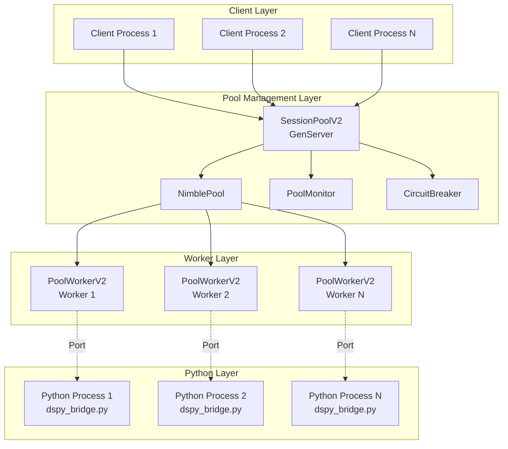

# V2 Pool Technical Design Series: Document 1 - Overview and Architecture

## Document Series Overview

This is the first in a series of technical design documents that provide a complete, comprehensive plan to achieve 100% stable completion of a robust pooler for the DSPy Python bridge. The series consists of:

1. **Overview and Architecture** (this document)
2. **Immediate Fixes Implementation Guide**
3. **Worker Lifecycle Management Design**
4. **Error Handling and Recovery Strategy**
5. **Test Infrastructure Overhaul**
6. **Performance Optimization and Monitoring**
7. **Migration and Deployment Plan**

## Executive Summary

Based on extensive analysis of test failures, Gemini's architectural guidance, and current implementation gaps, this design presents a phased approach to create a production-ready Python process pool. The design addresses critical issues in worker lifecycle management, error handling, and test infrastructure while maintaining backward compatibility.

**Key Objectives:**
- Fix immediate NimblePool contract violations causing test failures
- Implement robust worker state management with proper error boundaries
- Create comprehensive error handling with retry and circuit breaker patterns
- Overhaul test infrastructure for reliable concurrent testing
- Optimize performance for production workloads

## Current State Analysis

### Critical Issues Identified

1. **NimblePool Contract Violations**
   - `handle_checkout` returns `{:error, reason}` instead of valid tuples
   - Missing `Port.info()` validation before `Port.connect()`
   - Race conditions between process validity checks and port operations

2. **Worker Lifecycle Gaps**
   - No health check infrastructure
   - Insufficient port state validation
   - Missing recovery mechanisms for worker failures

3. **Error Handling Deficiencies**
   - Errors not wrapped with `ErrorHandler` context
   - No retry logic for transient failures
   - Missing circuit breaker pattern for cascading failures

4. **Test Infrastructure Problems**
   - Global configuration conflicts
   - Lack of test isolation
   - Race conditions during service startup

### Architecture Overview

## Design Principles

### 1. Strict Contract Adherence
- All NimblePool callbacks return only valid tuples
- Worker state transitions are explicit and documented
- Error cases are mapped to appropriate return values

### 2. Defensive Programming
- Validate all external resources before use
- Handle all error cases explicitly
- Fail fast with clear error messages

### 3. Observable System
- Comprehensive logging at key decision points
- Telemetry events for monitoring
- Health metrics exposed for operations

### 4. Test Isolation
- Each test gets its own supervision tree
- No shared global state
- Deterministic test execution

### 5. Graceful Degradation
- Circuit breakers prevent cascade failures
- Fallback mechanisms for critical operations
- Progressive retry with backoff

## Phased Implementation Plan

### Phase 1: Immediate Fixes (Week 1)
**Goal:** Resolve test failures and stabilize current implementation

1. Fix NimblePool return values
2. Add Port.info validation
3. Implement proper error wrapping
4. Update test assertions
5. Add basic health checks

**Success Criteria:** All 16 test failures resolved

### Phase 2: Worker Lifecycle Enhancement (Week 2)
**Goal:** Robust worker management with proper state tracking

1. Implement worker state machine
2. Add comprehensive health monitoring
3. Create worker recovery mechanisms
4. Implement session affinity
5. Add worker statistics tracking

**Success Criteria:** Zero worker-related failures under load

### Phase 3: Error Handling Overhaul (Week 3)
**Goal:** Production-ready error handling and recovery

1. Integrate ErrorHandler throughout
2. Implement retry logic with backoff
3. Add circuit breaker pattern
4. Create fallback strategies
5. Add error telemetry

**Success Criteria:** 99.9% availability under failure scenarios

### Phase 4: Test Infrastructure (Week 4)
**Goal:** Reliable, isolated test execution

1. Create test supervision helpers
2. Implement per-test isolation
3. Add deterministic startup sequences
4. Create comprehensive test scenarios
5. Add performance benchmarks

**Success Criteria:** 100% test reliability in CI/CD

### Phase 5: Performance & Monitoring (Week 5)
**Goal:** Production-ready performance and observability

1. Optimize pool configuration
2. Implement pre-warming strategies
3. Add comprehensive metrics
4. Create operational dashboards
5. Performance tuning

**Success Criteria:** <100ms p99 latency for operations

## Technical Requirements

### Minimum Viable Feature Set

1. **Pool Management**
   - Dynamic worker scaling (min/max bounds)
   - Session-based worker affinity
   - Graceful shutdown with timeout
   - Worker health monitoring

2. **Error Recovery**
   - Automatic worker restart on failure
   - Circuit breaker for Python bridge
   - Exponential backoff retry
   - Timeout handling for all operations

3. **Observability**
   - Worker state tracking
   - Operation latency metrics
   - Error rate monitoring
   - Pool utilization metrics

4. **API Compatibility**
   - Maintain existing adapter interface
   - Support both pooled and single-bridge modes
   - Backward compatible error formats
   - Configuration compatibility

## Risk Mitigation

### Technical Risks

1. **Port Communication Failures**
   - Mitigation: Implement message framing protocol
   - Fallback: Emergency worker creation

2. **Python Process Crashes**
   - Mitigation: Process monitoring with auto-restart
   - Fallback: Circuit breaker activation

3. **Resource Exhaustion**
   - Mitigation: Bounded pool with overflow
   - Fallback: Request queuing with timeout

### Operational Risks

1. **Performance Regression**
   - Mitigation: Comprehensive benchmarking
   - Fallback: Feature flags for rollback

2. **Migration Complexity**
   - Mitigation: Parallel run capability
   - Fallback: Staged rollout plan

## Success Metrics

### Immediate (Phase 1)
- Test failure rate: 0%
- Worker initialization success: 100%
- Checkout success rate: >99%

### Short-term (Phases 2-3)
- Worker availability: 99.9%
- Error recovery time: <500ms
- Circuit breaker effectiveness: 100%

### Long-term (Phases 4-5)
- Operation latency p99: <100ms
- Pool utilization: 60-80%
- Zero downtime deployments

## Next Steps

Proceed to Document 2: "Immediate Fixes Implementation Guide" for detailed code changes and implementation steps for Phase 1.

## Appendix: Key Code Locations

- Pool Implementation: `lib/dspex/python_bridge/`
  - `session_pool_v2.ex`
  - `pool_worker_v2.ex`
  - `pool_monitor.ex`
- Error Handling: `lib/dspex/adapters/error_handler.ex`
- Tests: `test/pool_v2_*.exs`
- Python Bridge: `priv/python/dspy_bridge.py`