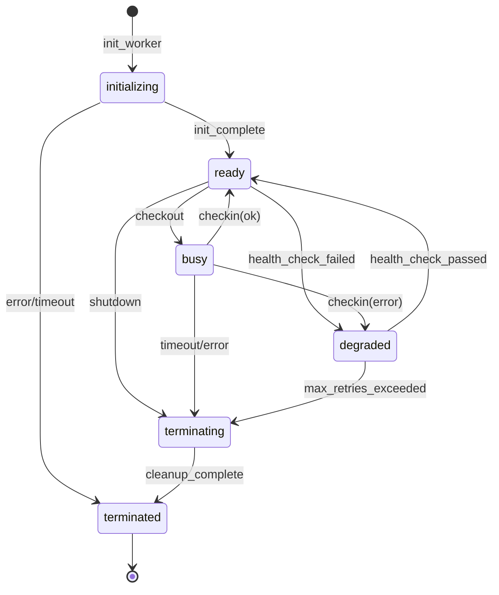
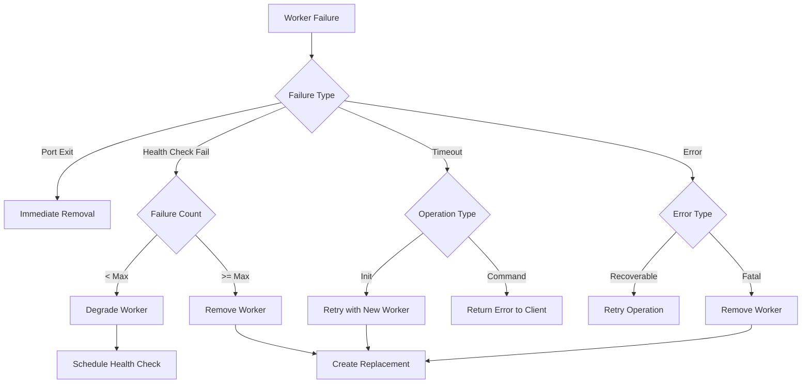

# V2 Pool Technical Design Series: Document 3 - Worker Lifecycle Management Design

## Overview

This document details the comprehensive worker lifecycle management system for Phase 2. It introduces a formal state machine for workers, health monitoring, session management, and recovery mechanisms to ensure robust pool operation under all conditions.

## Worker State Machine

### State Definitions

```elixir
@type worker_state :: :initializing | :ready | :busy | :degraded | :terminating | :terminated

@type worker_health :: :healthy | :unhealthy | :unknown

@type transition_reason :: 
  :init_complete | :checkout | :checkin | :health_check_failed | 
  :health_check_passed | :shutdown | :error | :timeout
```

### State Transition Diagram



### Implementation

**File:** `lib/dspex/python_bridge/worker_state_machine.ex` (new file)

```elixir
defmodule DSPex.PythonBridge.WorkerStateMachine do
  @moduledoc """
  Implements a state machine for pool worker lifecycle management.
  """
  
  require Logger
  
  @type state :: :initializing | :ready | :busy | :degraded | :terminating | :terminated
  @type health :: :healthy | :unhealthy | :unknown
  
  @type t :: %__MODULE__{
    state: state(),
    health: health(),
    worker_id: String.t(),
    metadata: map(),
    transition_history: list(),
    entered_state_at: integer()
  }
  
  defstruct [
    :state,
    :health,
    :worker_id,
    :metadata,
    :transition_history,
    :entered_state_at
  ]
  
  @valid_transitions %{
    initializing: [:ready, :terminated],
    ready: [:busy, :degraded, :terminating],
    busy: [:ready, :degraded, :terminating],
    degraded: [:ready, :terminating],
    terminating: [:terminated],
    terminated: []
  }
  
  @doc "Creates a new state machine for a worker"
  def new(worker_id) do
    %__MODULE__{
      state: :initializing,
      health: :unknown,
      worker_id: worker_id,
      metadata: %{},
      transition_history: [],
      entered_state_at: System.monotonic_time(:millisecond)
    }
  end
  
  @doc "Attempts to transition to a new state"
  def transition(%__MODULE__{state: current} = machine, new_state, reason, metadata \\ %{}) do
    valid_transitions = Map.get(@valid_transitions, current, [])
    
    if new_state in valid_transitions do
      {:ok, do_transition(machine, new_state, reason, metadata)}
    else
      {:error, {:invalid_transition, current, new_state}}
    end
  end
  
  defp do_transition(machine, new_state, reason, metadata) do
    now = System.monotonic_time(:millisecond)
    duration = now - machine.entered_state_at
    
    history_entry = %{
      from: machine.state,
      to: new_state,
      reason: reason,
      duration_ms: duration,
      timestamp: System.os_time(:millisecond),
      metadata: metadata
    }
    
    Logger.info("Worker #{machine.worker_id} transitioning #{machine.state} -> #{new_state} (reason: #{reason})")
    
    %{machine |
      state: new_state,
      entered_state_at: now,
      transition_history: [history_entry | machine.transition_history],
      metadata: Map.merge(machine.metadata, metadata)
    }
  end
  
  @doc "Checks if worker can accept work"
  def can_accept_work?(%__MODULE__{state: :ready, health: :healthy}), do: true
  def can_accept_work?(_), do: false
  
  @doc "Checks if worker should be removed from pool"
  def should_remove?(%__MODULE__{state: state}) when state in [:terminating, :terminated], do: true
  def should_remove?(_), do: false
  
  @doc "Updates health status"
  def update_health(%__MODULE__{} = machine, health) when health in [:healthy, :unhealthy, :unknown] do
    %{machine | health: health}
  end
end
```

## Enhanced Worker Module

**File:** `lib/dspex/python_bridge/pool_worker_v2_enhanced.ex`

```elixir
defmodule DSPex.PythonBridge.PoolWorkerV2Enhanced do
  @moduledoc """
  Enhanced worker implementation with state machine and health monitoring.
  """
  
  alias DSPex.PythonBridge.WorkerStateMachine
  require Logger
  
  @behaviour NimblePool
  
  # Worker record with state machine
  defstruct [
    :port,
    :worker_id,
    :current_session,
    :state_machine,
    :health_check_failures,
    :last_health_check,
    :config
  ]
  
  @health_check_interval 30_000  # 30 seconds
  @max_health_failures 3
  
  # NimblePool callbacks
  
  @impl true
  def init_worker(pool_state) do
    worker_id = generate_worker_id()
    state_machine = WorkerStateMachine.new(worker_id)
    
    case start_python_process(worker_id) do
      {:ok, port} ->
        worker = %__MODULE__{
          port: port,
          worker_id: worker_id,
          state_machine: state_machine,
          health_check_failures: 0,
          last_health_check: System.monotonic_time(:millisecond),
          config: pool_state
        }
        
        case perform_initialization(worker) do
          {:ok, initialized_worker} ->
            {:ok, transition_to_ready(initialized_worker), pool_state}
            
          {:error, reason} ->
            Port.close(port)
            raise "Worker initialization failed: #{inspect(reason)}"
        end
        
      {:error, reason} ->
        raise "Failed to start Python process: #{inspect(reason)}"
    end
  end
  
  @impl true
  def handle_checkout(checkout_type, {pid, _ref}, worker, pool_state) do
    case WorkerStateMachine.can_accept_work?(worker.state_machine) do
      true ->
        perform_checkout(checkout_type, pid, worker, pool_state)
        
      false ->
        # Worker not ready, remove it
        {:remove, {:worker_not_ready, worker.state_machine.state}, pool_state}
    end
  end
  
  defp perform_checkout({:session, session_id}, pid, worker, pool_state) do
    case safe_port_connect(worker.port, pid, worker.worker_id) do
      :ok ->
        {:ok, new_state_machine} = WorkerStateMachine.transition(
          worker.state_machine, 
          :busy, 
          :checkout,
          %{session_id: session_id, client_pid: pid}
        )
        
        updated_worker = %{worker | 
          current_session: session_id,
          state_machine: new_state_machine
        }
        
        {:ok, :session, updated_worker, pool_state}
        
      {:error, reason} ->
        {:remove, {:checkout_failed, reason}, pool_state}
    end
  end
  
  @impl true
  def handle_checkin(checkin_type, _from, worker, pool_state) do
    # Check if health check is needed
    worker = maybe_perform_health_check(worker)
    
    case checkin_type do
      :ok ->
        handle_successful_checkin(worker, pool_state)
        
      {:error, reason} ->
        handle_error_checkin(worker, reason, pool_state)
        
      :close ->
        handle_close_checkin(worker, pool_state)
    end
  end
  
  defp handle_successful_checkin(worker, pool_state) do
    {:ok, new_state_machine} = WorkerStateMachine.transition(
      worker.state_machine,
      :ready,
      :checkin_success
    )
    
    updated_worker = %{worker |
      current_session: nil,
      state_machine: new_state_machine,
      health_check_failures: 0  # Reset on success
    }
    
    {:ok, updated_worker, pool_state}
  end
  
  defp handle_error_checkin(worker, reason, pool_state) do
    failures = worker.health_check_failures + 1
    
    if failures >= @max_health_failures do
      # Too many failures, remove worker
      {:remove, {:max_failures_exceeded, reason}, pool_state}
    else
      # Degrade worker but keep it
      {:ok, new_state_machine} = WorkerStateMachine.transition(
        worker.state_machine,
        :degraded,
        :checkin_error,
        %{error: reason, failure_count: failures}
      )
      
      updated_worker = %{worker |
        current_session: nil,
        state_machine: new_state_machine,
        health_check_failures: failures
      }
      
      {:ok, updated_worker, pool_state}
    end
  end
  
  defp handle_close_checkin(worker, pool_state) do
    {:remove, :closed_by_client, pool_state}
  end
  
  @impl true
  def handle_info(message, worker) do
    case message do
      {port, {:exit_status, status}} when port == worker.port ->
        Logger.error("Worker #{worker.worker_id} port exited with status: #{status}")
        {:remove, {:port_exited, status}}
        
      :perform_health_check ->
        perform_async_health_check(worker)
        
      _ ->
        {:ok, worker}
    end
  end
  
  @impl true
  def terminate_worker(reason, worker, pool_state) do
    {:ok, new_state_machine} = WorkerStateMachine.transition(
      worker.state_machine,
      :terminating,
      :terminate,
      %{reason: reason}
    )
    
    worker = %{worker | state_machine: new_state_machine}
    
    # Graceful shutdown
    try do
      send_shutdown_command(worker)
      
      receive do
        {port, {:exit_status, _}} when port == worker.port ->
          :ok
      after
        1_000 ->
          Port.close(worker.port)
      end
    catch
      :error, _ -> :ok
    end
    
    {:ok, pool_state}
  end
  
  # Health monitoring
  
  defp maybe_perform_health_check(worker) do
    now = System.monotonic_time(:millisecond)
    
    if now - worker.last_health_check >= @health_check_interval do
      perform_health_check(worker)
    else
      worker
    end
  end
  
  defp perform_health_check(worker) do
    case execute_health_check(worker) do
      {:ok, response} ->
        handle_health_check_success(worker, response)
        
      {:error, reason} ->
        handle_health_check_failure(worker, reason)
    end
  end
  
  defp execute_health_check(worker) do
    # Send health check command to Python process
    request = Jason.encode!(%{command: "health_check", args: %{}})
    
    try do
      Port.command(worker.port, request)
      
      receive do
        {port, {:data, response}} when port == worker.port ->
          Jason.decode(response)
      after
        5_000 ->
          {:error, :health_check_timeout}
      end
    catch
      :error, reason ->
        {:error, {:health_check_failed, reason}}
    end
  end
  
  defp handle_health_check_success(worker, _response) do
    new_state_machine = 
      if worker.state_machine.state == :degraded do
        case WorkerStateMachine.transition(worker.state_machine, :ready, :health_restored) do
          {:ok, sm} -> sm
          _ -> worker.state_machine
        end
      else
        WorkerStateMachine.update_health(worker.state_machine, :healthy)
      end
    
    %{worker |
      state_machine: new_state_machine,
      health_check_failures: 0,
      last_health_check: System.monotonic_time(:millisecond)
    }
  end
  
  defp handle_health_check_failure(worker, reason) do
    Logger.warn("Worker #{worker.worker_id} health check failed: #{inspect(reason)}")
    
    failures = worker.health_check_failures + 1
    
    new_state_machine = 
      if failures >= @max_health_failures do
        case WorkerStateMachine.transition(worker.state_machine, :terminating, :health_check_failed) do
          {:ok, sm} -> sm
          _ -> worker.state_machine
        end
      else
        WorkerStateMachine.update_health(worker.state_machine, :unhealthy)
      end
    
    %{worker |
      state_machine: new_state_machine,
      health_check_failures: failures,
      last_health_check: System.monotonic_time(:millisecond)
    }
  end
  
  # Session management
  
  defp generate_worker_id do
    "worker_#{:erlang.unique_integer([:positive])}_#{System.os_time(:nanosecond)}"
  end
  
  defp transition_to_ready(worker) do
    {:ok, state_machine} = WorkerStateMachine.transition(
      worker.state_machine,
      :ready,
      :init_complete
    )
    
    %{worker | 
      state_machine: WorkerStateMachine.update_health(state_machine, :healthy)
    }
  end
  
  # Async health check scheduling
  
  defp perform_async_health_check(worker) do
    Task.start(fn ->
      updated_worker = perform_health_check(worker)
      
      # Send result back to pool
      send(self(), {:health_check_complete, worker.worker_id, updated_worker})
    end)
    
    {:ok, worker}
  end
end
```

## Session Affinity Manager

**File:** `lib/dspex/python_bridge/session_affinity.ex` (new file)

```elixir
defmodule DSPex.PythonBridge.SessionAffinity do
  @moduledoc """
  Manages session-to-worker affinity for consistent routing.
  """
  
  use GenServer
  require Logger
  
  @table_name :session_affinity
  @cleanup_interval 60_000  # 1 minute
  @session_timeout 300_000  # 5 minutes
  
  def start_link(opts) do
    GenServer.start_link(__MODULE__, opts, name: __MODULE__)
  end
  
  def init(_opts) do
    :ets.new(@table_name, [:named_table, :public, :set, {:read_concurrency, true}])
    schedule_cleanup()
    {:ok, %{}}
  end
  
  @doc "Records a session-worker binding"
  def bind_session(session_id, worker_id) do
    :ets.insert(@table_name, {session_id, worker_id, System.monotonic_time(:millisecond)})
    :ok
  end
  
  @doc "Retrieves the worker for a session"
  def get_worker(session_id) do
    case :ets.lookup(@table_name, session_id) do
      [{^session_id, worker_id, timestamp}] ->
        if System.monotonic_time(:millisecond) - timestamp < @session_timeout do
          {:ok, worker_id}
        else
          :ets.delete(@table_name, session_id)
          {:error, :session_expired}
        end
        
      [] ->
        {:error, :no_affinity}
    end
  end
  
  @doc "Removes a session binding"
  def unbind_session(session_id) do
    :ets.delete(@table_name, session_id)
    :ok
  end
  
  @doc "Removes all bindings for a worker"
  def remove_worker_sessions(worker_id) do
    :ets.match_delete(@table_name, {:_, worker_id, :_})
    :ok
  end
  
  # Cleanup old sessions
  def handle_info(:cleanup, state) do
    cleanup_expired_sessions()
    schedule_cleanup()
    {:noreply, state}
  end
  
  defp cleanup_expired_sessions do
    now = System.monotonic_time(:millisecond)
    expired_threshold = now - @session_timeout
    
    expired = :ets.select(@table_name, [
      {{:"$1", :"$2", :"$3"}, 
       [{:<, :"$3", expired_threshold}],
       [:"$1"]}
    ])
    
    Enum.each(expired, &:ets.delete(@table_name, &1))
    
    if length(expired) > 0 do
      Logger.info("Cleaned up #{length(expired)} expired sessions")
    end
  end
  
  defp schedule_cleanup do
    Process.send_after(self(), :cleanup, @cleanup_interval)
  end
end
```

## Worker Recovery Strategies

### Recovery Decision Tree



### Implementation

**File:** `lib/dspex/python_bridge/worker_recovery.ex` (new file)

```elixir
defmodule DSPex.PythonBridge.WorkerRecovery do
  @moduledoc """
  Implements recovery strategies for failed workers.
  """
  
  alias DSPex.Adapters.ErrorHandler
  require Logger
  
  @type recovery_action :: :retry | :degrade | :remove | :replace
  @type recovery_strategy :: %{
    action: recovery_action(),
    delay: non_neg_integer(),
    metadata: map()
  }
  
  @doc "Determines recovery strategy based on failure context"
  def determine_strategy(failure_reason, worker_state, context \\ %{}) do
    wrapped_error = ErrorHandler.wrap_error(
      {:error, failure_reason},
      Map.merge(context, %{
        worker_id: worker_state.worker_id,
        worker_state: worker_state.state_machine.state
      })
    )
    
    cond do
      # Port-related failures - immediate removal
      match?({:port_exited, _}, failure_reason) ->
        %{action: :remove, delay: 0, metadata: %{reason: :port_failure}}
        
      # Health check failures - progressive degradation
      match?({:health_check_failed, _}, failure_reason) ->
        if worker_state.health_check_failures >= 3 do
          %{action: :remove, delay: 0, metadata: %{reason: :health_check_limit}}
        else
          %{action: :degrade, delay: 5_000, metadata: %{reason: :health_degraded}}
        end
        
      # Timeout during operations
      match?({:timeout, _}, failure_reason) ->
        if ErrorHandler.should_retry?(wrapped_error) do
          %{action: :retry, delay: ErrorHandler.get_retry_delay(wrapped_error), metadata: %{}}
        else
          %{action: :remove, delay: 0, metadata: %{reason: :timeout_limit}}
        end
        
      # Recoverable errors
      ErrorHandler.is_recoverable?(wrapped_error) ->
        %{action: :retry, delay: ErrorHandler.get_retry_delay(wrapped_error), metadata: %{}}
        
      # Non-recoverable errors
      true ->
        %{action: :remove, delay: 0, metadata: %{reason: :non_recoverable}}
    end
  end
  
  @doc "Executes recovery action"
  def execute_recovery(strategy, worker_state, pool_state) do
    case strategy.action do
      :retry ->
        {:retry, strategy.delay}
        
      :degrade ->
        degrade_worker(worker_state, strategy.metadata)
        
      :remove ->
        remove_worker(worker_state, pool_state, strategy.metadata)
        
      :replace ->
        replace_worker(worker_state, pool_state)
    end
  end
  
  defp degrade_worker(worker_state, metadata) do
    Logger.warn("Degrading worker #{worker_state.worker_id}: #{inspect(metadata)}")
    
    {:ok, state_machine} = WorkerStateMachine.transition(
      worker_state.state_machine,
      :degraded,
      :recovery_degrade,
      metadata
    )
    
    {:ok, %{worker_state | state_machine: state_machine}}
  end
  
  defp remove_worker(worker_state, pool_state, metadata) do
    Logger.info("Removing worker #{worker_state.worker_id}: #{inspect(metadata)}")
    
    # Clean up session affinity
    SessionAffinity.remove_worker_sessions(worker_state.worker_id)
    
    {:remove, {:recovery_removal, metadata}, pool_state}
  end
  
  defp replace_worker(worker_state, pool_state) do
    Logger.info("Replacing worker #{worker_state.worker_id}")
    
    # Signal pool to create replacement
    send(pool_state.pool_pid, {:replace_worker, worker_state.worker_id})
    
    {:remove, :replaced, pool_state}
  end
end
```

## Integration with SessionPoolV2

Update `lib/dspex/python_bridge/session_pool_v2.ex` to use enhanced workers:

```elixir
defmodule DSPex.PythonBridge.SessionPoolV2 do
  # ... existing code ...
  
  def init(opts) do
    # Start session affinity manager
    {:ok, _} = SessionAffinity.start_link([])
    
    # ... rest of init
  end
  
  def execute_in_session(session_id, command, args, opts \\ []) do
    # Check session affinity first
    worker_constraint = case SessionAffinity.get_worker(session_id) do
      {:ok, worker_id} -> {:prefer_worker, worker_id}
      _ -> :any_worker
    end
    
    pool_name = Keyword.get(opts, :pool_name, @default_pool)
    timeout = Keyword.get(opts, :timeout, 60_000)
    
    try do
      NimblePool.checkout!(
        pool_name,
        {:session, session_id},
        fn _from, worker ->
          # Record affinity
          SessionAffinity.bind_session(session_id, worker.worker_id)
          
          # Execute command
          result = execute_command(worker, command, args, timeout)
          
          # Determine checkin type based on result
          checkin_type = case result do
            {:ok, _} -> :ok
            {:error, _} -> {:error, :command_failed}
            _ -> :ok
          end
          
          {result, checkin_type}
        end,
        pool_timeout: timeout + 5_000  # Add buffer
      )
    catch
      :exit, {:timeout, _} ->
        {:error, ErrorHandler.timeout_error("Session operation timeout", %{
          session_id: session_id,
          command: command
        })}
    end
  end
  
  # Handle worker replacement requests
  def handle_info({:replace_worker, worker_id}, state) do
    Logger.info("Received request to replace worker #{worker_id}")
    
    # NimblePool handles worker creation automatically
    # We just need to track metrics
    
    {:noreply, update_metrics(state, :worker_replaced)}
  end
end
```

## Metrics and Monitoring

Add comprehensive worker metrics:

```elixir
defmodule DSPex.PythonBridge.WorkerMetrics do
  @moduledoc """
  Tracks worker lifecycle metrics.
  """
  
  def record_transition(worker_id, from_state, to_state, duration_ms) do
    :telemetry.execute(
      [:dspex, :pool, :worker, :transition],
      %{duration: duration_ms},
      %{
        worker_id: worker_id,
        from_state: from_state,
        to_state: to_state
      }
    )
  end
  
  def record_health_check(worker_id, result, duration_ms) do
    :telemetry.execute(
      [:dspex, :pool, :worker, :health_check],
      %{duration: duration_ms},
      %{
        worker_id: worker_id,
        result: result
      }
    )
  end
  
  def record_session_affinity(session_id, worker_id, hit_or_miss) do
    :telemetry.execute(
      [:dspex, :pool, :session, :affinity],
      %{count: 1},
      %{
        session_id: session_id,
        worker_id: worker_id,
        result: hit_or_miss
      }
    )
  end
end
```

## Testing Strategy

### Unit Tests

```elixir
defmodule DSPex.PythonBridge.WorkerStateMachineTest do
  use ExUnit.Case
  
  alias DSPex.PythonBridge.WorkerStateMachine
  
  test "valid state transitions" do
    sm = WorkerStateMachine.new("test_worker")
    
    assert sm.state == :initializing
    
    {:ok, sm} = WorkerStateMachine.transition(sm, :ready, :init_complete)
    assert sm.state == :ready
    
    {:ok, sm} = WorkerStateMachine.transition(sm, :busy, :checkout)
    assert sm.state == :busy
  end
  
  test "invalid state transitions" do
    sm = WorkerStateMachine.new("test_worker")
    
    {:error, {:invalid_transition, :initializing, :busy}} = 
      WorkerStateMachine.transition(sm, :busy, :invalid)
  end
  
  test "health status updates" do
    sm = WorkerStateMachine.new("test_worker")
    sm = WorkerStateMachine.update_health(sm, :healthy)
    
    assert sm.health == :healthy
    assert WorkerStateMachine.can_accept_work?(%{sm | state: :ready})
  end
end
```

### Integration Tests

```elixir
defmodule DSPex.PythonBridge.WorkerLifecycleIntegrationTest do
  use ExUnit.Case
  
  setup do
    # Start isolated pool with enhanced workers
    {:ok, pool} = start_test_pool(
      worker_module: DSPex.PythonBridge.PoolWorkerV2Enhanced,
      pool_size: 2
    )
    
    {:ok, pool: pool}
  end
  
  test "worker health check recovery", %{pool: pool} do
    # Simulate health check failure
    worker_id = get_worker_id(pool, 0)
    simulate_health_failure(worker_id)
    
    # Verify degradation
    assert_worker_state(worker_id, :degraded)
    
    # Simulate recovery
    simulate_health_success(worker_id)
    
    # Verify restoration
    assert_worker_state(worker_id, :ready)
  end
  
  test "session affinity maintained across operations", %{pool: pool} do
    session_id = "test_session_#{System.unique_integer()}"
    
    # First operation
    {:ok, result1} = execute_in_session(session_id, :test_command, %{})
    worker1 = result1.worker_id
    
    # Second operation should use same worker
    {:ok, result2} = execute_in_session(session_id, :test_command, %{})
    assert result2.worker_id == worker1
  end
end
```

## Migration Guide

1. **Update pool configuration** to use enhanced worker:
   ```elixir
   config :dspex, DSPex.PythonBridge.SessionPoolV2,
     worker_module: DSPex.PythonBridge.PoolWorkerV2Enhanced
   ```

2. **Enable session affinity** in application supervision tree

3. **Configure health check intervals** based on workload

4. **Set up monitoring** for worker state transitions

## Next Steps

Proceed to Document 4: "Error Handling and Recovery Strategy" for comprehensive error management design.