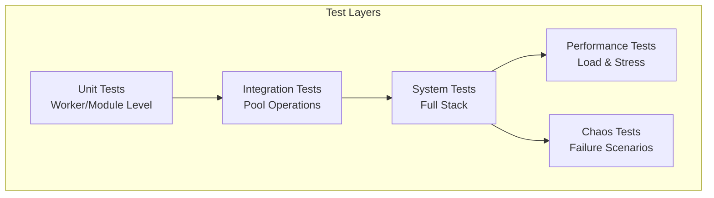

# V2 Pool Technical Design Series: Document 5 - Test Infrastructure Overhaul

## Overview

This document details the comprehensive test infrastructure overhaul for Phase 4. It addresses test isolation, deterministic execution, performance benchmarking, and provides patterns for reliable concurrent testing of the pool system.

## Test Architecture Principles

### Core Principles

1. **Complete Isolation** - Each test runs in its own supervision tree
2. **Deterministic Execution** - Predictable timing and ordering
3. **Resource Management** - Proper cleanup and resource limits
4. **Observability** - Comprehensive logging and metrics
5. **Performance Tracking** - Benchmark regression detection

### Test Layers



## Test Isolation Framework

**File:** `test/support/test_isolation.ex` (new file)

```elixir
defmodule DSPex.Test.TestIsolation do
  @moduledoc """
  Provides complete test isolation with dedicated supervision trees.
  """
  
  import ExUnit.Callbacks
  require Logger
  
  @doc """
  Starts an isolated test environment with its own supervision tree.
  """
  defmacro isolated_test(name, opts \\ [], do: block) do
    quote do
      test unquote(name), context do
        test_id = "test_#{System.unique_integer([:positive])}"
        
        # Start isolated supervision tree
        {:ok, supervisor} = DSPex.Test.TestIsolation.start_isolated_supervisor(
          test_id,
          unquote(opts)
        )
        
        # Ensure cleanup on exit
        on_exit(fn ->
          DSPex.Test.TestIsolation.cleanup_test_environment(test_id, supervisor)
        end)
        
        # Add test environment to context
        context = Map.merge(context, %{
          test_id: test_id,
          supervisor: supervisor,
          test_env: DSPex.Test.TestIsolation.build_test_env(test_id, unquote(opts))
        })
        
        # Execute test block
        unquote(block)
      end
    end
  end
  
  @doc """
  Starts an isolated supervisor for a test.
  """
  def start_isolated_supervisor(test_id, opts) do
    children = build_supervision_tree(test_id, opts)
    
    Supervisor.start_link(
      children,
      strategy: :one_for_one,
      name: :"test_supervisor_#{test_id}"
    )
  end
  
  @doc """
  Builds test environment configuration.
  """
  def build_test_env(test_id, opts) do
    layer = Keyword.get(opts, :layer, :layer_1)
    pool_config = Keyword.get(opts, :pool_config, %{})
    
    %{
      test_id: test_id,
      layer: layer,
      pool_name: :"test_pool_#{test_id}",
      registry_name: :"test_registry_#{test_id}",
      pool_config: Map.merge(default_pool_config(layer), pool_config),
      adapters: configure_adapters(layer, test_id)
    }
  end
  
  @doc """
  Cleans up test environment.
  """
  def cleanup_test_environment(test_id, supervisor) do
    # Stop supervisor gracefully
    Supervisor.stop(supervisor, :shutdown)
    
    # Clean up any remaining processes
    cleanup_orphaned_processes(test_id)
    
    # Clean up ETS tables
    cleanup_ets_tables(test_id)
    
    # Clean up files
    cleanup_test_files(test_id)
    
    Logger.debug("Test environment #{test_id} cleaned up")
  end
  
  defp build_supervision_tree(test_id, opts) do
    layer = Keyword.get(opts, :layer, :layer_1)
    
    base_children = [
      # Test-specific registry
      {Registry, keys: :unique, name: :"test_registry_#{test_id}"},
      
      # Error recovery orchestrator
      {DSPex.PythonBridge.ErrorRecoveryOrchestrator, name: :"error_orchestrator_#{test_id}"},
      
      # Circuit breaker
      {DSPex.PythonBridge.CircuitBreaker, name: :"circuit_breaker_#{test_id}"}
    ]
    
    # Add layer-specific children
    layer_children = case layer do
      :layer_1 ->
        # Mock only
        []
        
      :layer_2 ->
        # Bridge mock
        [
          {DSPex.Test.BridgeMock, name: :"bridge_mock_#{test_id}"}
        ]
        
      :layer_3 ->
        # Full integration
        pool_config = Keyword.get(opts, :pool_config, %{})
        [
          {DSPex.PythonBridge.SessionPoolV2, 
           Keyword.merge([
             name: :"pool_genserver_#{test_id}",
             pool_name: :"test_pool_#{test_id}",
             lazy: false,  # Eager init for tests
             pool_size: 2,
             max_overflow: 0
           ], pool_config)}
        ]
    end
    
    base_children ++ layer_children
  end
  
  defp default_pool_config(:layer_1), do: %{timeout: 1_000}
  defp default_pool_config(:layer_2), do: %{timeout: 5_000}
  defp default_pool_config(:layer_3), do: %{timeout: 10_000, init_timeout: 15_000}
  
  defp configure_adapters(layer, test_id) do
    case layer do
      :layer_1 ->
        %{primary: DSPex.Adapters.Mock}
        
      :layer_2 ->
        %{primary: DSPex.Adapters.BridgeMock}
        
      :layer_3 ->
        %{primary: DSPex.Adapters.PythonPoolV2}
    end
  end
  
  defp cleanup_orphaned_processes(test_id) do
    # Find all processes with test_id in their name
    Process.list()
    |> Enum.filter(fn pid ->
      case Process.info(pid, :registered_name) do
        {:registered_name, name} when is_atom(name) ->
          String.contains?(Atom.to_string(name), test_id)
        _ ->
          false
      end
    end)
    |> Enum.each(&Process.exit(&1, :kill))
  end
  
  defp cleanup_ets_tables(test_id) do
    :ets.all()
    |> Enum.filter(fn table ->
      case :ets.info(table, :name) do
        name when is_atom(name) ->
          String.contains?(Atom.to_string(name), test_id)
        _ ->
          false
      end
    end)
    |> Enum.each(&:ets.delete/1)
  end
  
  defp cleanup_test_files(test_id) do
    # Clean up any temporary files created during test
    test_dir = Path.join(System.tmp_dir!(), "dspex_test_#{test_id}")
    File.rm_rf(test_dir)
  end
end
```

## Deterministic Test Helpers

**File:** `test/support/deterministic_helpers.ex` (new file)

```elixir
defmodule DSPex.Test.DeterministicHelpers do
  @moduledoc """
  Helpers for deterministic test execution.
  """
  
  @doc """
  Waits for a condition with timeout and polling.
  """
  def wait_for(condition_fn, timeout \\ 5_000, poll_interval \\ 50) do
    deadline = System.monotonic_time(:millisecond) + timeout
    
    wait_loop(condition_fn, deadline, poll_interval)
  end
  
  defp wait_loop(condition_fn, deadline, poll_interval) do
    if condition_fn.() do
      :ok
    else
      now = System.monotonic_time(:millisecond)
      
      if now < deadline do
        Process.sleep(poll_interval)
        wait_loop(condition_fn, deadline, poll_interval)
      else
        {:error, :timeout}
      end
    end
  end
  
  @doc """
  Synchronizes multiple concurrent operations.
  """
  def synchronize(operations) when is_list(operations) do
    parent = self()
    ref = make_ref()
    
    # Start all operations
    pids = Enum.map(operations, fn {name, fun} ->
      spawn_link(fn ->
        # Wait for go signal
        receive do
          {:go, ^ref} ->
            result = fun.()
            send(parent, {:result, ref, name, result})
        end
      end)
    end)
    
    # Give all processes time to reach receive
    Process.sleep(10)
    
    # Send go signal to all
    Enum.each(pids, &send(&1, {:go, ref}))
    
    # Collect results
    results = for _ <- operations do
      receive do
        {:result, ^ref, name, result} -> {name, result}
      after
        5_000 -> {:error, :timeout}
      end
    end
    
    Enum.into(results, %{})
  end
  
  @doc """
  Ensures pool has minimum workers ready.
  """
  def ensure_pool_ready(pool_name, min_workers \\ 1, timeout \\ 10_000) do
    wait_for(
      fn ->
        case get_pool_stats(pool_name) do
          {:ok, stats} ->
            stats.ready_workers >= min_workers
          _ ->
            false
        end
      end,
      timeout
    )
  end
  
  @doc """
  Simulates controlled failures.
  """
  def inject_failure(type, target, opts \\ []) do
    case type do
      :port_crash ->
        simulate_port_crash(target)
        
      :timeout ->
        simulate_timeout(target, Keyword.get(opts, :duration, 5_000))
        
      :network_partition ->
        simulate_network_partition(target, Keyword.get(opts, :duration, 1_000))
        
      :resource_exhaustion ->
        simulate_resource_exhaustion(target)
    end
  end
  
  defp simulate_port_crash(worker_id) do
    # Find worker process and kill its port
    case find_worker_process(worker_id) do
      {:ok, pid} ->
        send(pid, {:port_crash, :simulated})
        :ok
      _ ->
        {:error, :worker_not_found}
    end
  end
  
  defp simulate_timeout(target, duration) do
    # Block target process
    spawn(fn ->
      Process.sleep(duration)
      send(target, {:unblock, :timeout_simulation})
    end)
    
    send(target, {:block, :timeout_simulation, duration})
  end
  
  defp simulate_network_partition(target, duration) do
    # Temporarily break communication
    :ok
  end
  
  defp simulate_resource_exhaustion(target) do
    # Consume resources
    :ok
  end
  
  defp find_worker_process(worker_id) do
    # Implementation specific to pool
    {:ok, self()}  # Placeholder
  end
  
  defp get_pool_stats(pool_name) do
    # Implementation specific to pool monitoring
    {:ok, %{ready_workers: 2}}  # Placeholder
  end
end
```

## Pool-Specific Test Helpers

**File:** `test/support/pool_test_helpers.ex` (update existing)

```elixir
defmodule DSPex.Test.PoolTestHelpers do
  @moduledoc """
  Enhanced helpers for pool-specific testing.
  """
  
  import DSPex.Test.{TestIsolation, DeterministicHelpers}
  
  @doc """
  Starts a test pool with full isolation and monitoring.
  """
  def start_isolated_pool(opts \\ []) do
    test_id = Keyword.get(opts, :test_id, "pool_test_#{System.unique_integer()}")
    
    pool_opts = Keyword.merge([
      name: :"test_pool_genserver_#{test_id}",
      pool_name: :"test_pool_#{test_id}",
      lazy: false,
      pool_size: 2,
      max_overflow: 0,
      init_timeout: 10_000,
      strategy: :lifo
    ], opts)
    
    # Start with supervisor
    {:ok, supervisor} = start_isolated_supervisor(test_id, layer: :layer_3, pool_config: pool_opts)
    
    # Wait for pool to be ready
    :ok = ensure_pool_ready(pool_opts[:pool_name], pool_opts[:pool_size])
    
    %{
      supervisor: supervisor,
      pool_name: pool_opts[:pool_name],
      genserver_name: pool_opts[:name],
      test_id: test_id,
      pool_opts: pool_opts
    }
  end
  
  @doc """
  Executes operations concurrently on the pool.
  """
  def concurrent_pool_operations(pool_name, operations) do
    operations
    |> Enum.map(fn {name, {session_id, command, args}} ->
      {name, fn ->
        DSPex.PythonBridge.SessionPoolV2.execute_in_session(
          session_id,
          command,
          args,
          pool_name: pool_name
        )
      end}
    end)
    |> synchronize()
  end
  
  @doc """
  Monitors pool health during test execution.
  """
  def with_pool_monitoring(pool_name, fun) do
    # Start monitoring
    monitor_ref = start_pool_monitor(pool_name)
    
    try do
      # Execute test
      result = fun.()
      
      # Get monitoring results
      stats = stop_pool_monitor(monitor_ref)
      
      {result, stats}
    after
      # Ensure cleanup
      stop_pool_monitor(monitor_ref)
    end
  end
  
  @doc """
  Simulates various pool failure scenarios.
  """
  def simulate_pool_failure(pool_name, scenario, opts \\ []) do
    case scenario do
      :worker_cascade_failure ->
        # Kill workers in sequence
        simulate_cascade_failure(pool_name, opts)
        
      :thundering_herd ->
        # Many simultaneous requests
        simulate_thundering_herd(pool_name, opts)
        
      :slow_worker ->
        # Make one worker slow
        simulate_slow_worker(pool_name, opts)
        
      :memory_leak ->
        # Simulate memory growth
        simulate_memory_leak(pool_name, opts)
    end
  end
  
  defp start_pool_monitor(pool_name) do
    parent = self()
    ref = make_ref()
    
    spawn(fn ->
      stats = monitor_loop(pool_name, %{
        checkouts: 0,
        checkins: 0,
        errors: 0,
        max_queue_depth: 0,
        worker_restarts: 0
      })
      
      send(parent, {ref, :stats, stats})
    end)
    
    ref
  end
  
  defp monitor_loop(pool_name, stats) do
    receive do
      :stop ->
        stats
        
      {:pool_event, event, metadata} ->
        updated_stats = update_stats(stats, event, metadata)
        monitor_loop(pool_name, updated_stats)
    after
      100 ->
        # Poll pool state
        monitor_loop(pool_name, stats)
    end
  end
  
  defp stop_pool_monitor(ref) do
    receive do
      {^ref, :stats, stats} -> stats
    after
      1_000 -> %{}
    end
  end
  
  defp update_stats(stats, event, _metadata) do
    case event do
      :checkout -> Map.update!(stats, :checkouts, &(&1 + 1))
      :checkin -> Map.update!(stats, :checkins, &(&1 + 1))
      :error -> Map.update!(stats, :errors, &(&1 + 1))
      _ -> stats
    end
  end
  
  defp simulate_cascade_failure(pool_name, opts) do
    count = Keyword.get(opts, :worker_count, 2)
    delay = Keyword.get(opts, :delay, 100)
    
    for i <- 1..count do
      inject_failure(:port_crash, {:worker_index, i - 1})
      Process.sleep(delay)
    end
  end
  
  defp simulate_thundering_herd(pool_name, opts) do
    request_count = Keyword.get(opts, :requests, 100)
    
    tasks = for i <- 1..request_count do
      Task.async(fn ->
        DSPex.PythonBridge.SessionPoolV2.execute_in_session(
          "herd_session_#{i}",
          :test_command,
          %{index: i},
          pool_name: pool_name
        )
      end)
    end
    
    Task.await_many(tasks, 30_000)
  end
  
  defp simulate_slow_worker(_pool_name, _opts) do
    # Implementation
    :ok
  end
  
  defp simulate_memory_leak(_pool_name, _opts) do
    # Implementation
    :ok
  end
end
```

## Test Scenarios

### Unit Test Example

```elixir
defmodule DSPex.PythonBridge.PoolWorkerV2Test do
  use ExUnit.Case
  import DSPex.Test.TestIsolation
  
  alias DSPex.PythonBridge.PoolWorkerV2Enhanced
  
  describe "worker lifecycle" do
    isolated_test "initializes worker correctly", layer: :layer_1 do
      # Mock port for unit testing
      port = make_ref()
      
      # Test init_worker
      assert {:ok, worker, pool_state} = PoolWorkerV2Enhanced.init_worker(%{})
      assert worker.state_machine.state == :ready
      assert worker.health_check_failures == 0
    end
    
    isolated_test "handles checkout state transitions", layer: :layer_1 do
      worker = build_test_worker()
      
      # Test checkout
      {:ok, client_state, updated_worker, pool_state} = 
        PoolWorkerV2Enhanced.handle_checkout(
          {:session, "test_session"},
          {self(), make_ref()},
          worker,
          %{}
        )
      
      assert updated_worker.state_machine.state == :busy
      assert updated_worker.current_session == "test_session"
    end
  end
  
  defp build_test_worker do
    %PoolWorkerV2Enhanced{
      port: make_ref(),
      worker_id: "test_worker",
      state_machine: DSPex.PythonBridge.WorkerStateMachine.new("test_worker"),
      health_check_failures: 0,
      last_health_check: System.monotonic_time(:millisecond),
      config: %{}
    }
  end
end
```

### Integration Test Example

```elixir
defmodule DSPex.PythonBridge.PoolIntegrationTest do
  use ExUnit.Case
  import DSPex.Test.{TestIsolation, PoolTestHelpers}
  
  describe "pool operations" do
    isolated_test "handles concurrent sessions", layer: :layer_3 do
      pool_info = start_isolated_pool(pool_size: 3)
      
      # Execute concurrent operations
      results = concurrent_pool_operations(
        pool_info.pool_name,
        [
          {:op1, {"session_1", :create_program, %{signature: test_signature()}}},
          {:op2, {"session_2", :create_program, %{signature: test_signature()}}},
          {:op3, {"session_3", :create_program, %{signature: test_signature()}}}
        ]
      )
      
      assert {:ok, _} = results.op1
      assert {:ok, _} = results.op2
      assert {:ok, _} = results.op3
    end
    
    isolated_test "recovers from worker failures", layer: :layer_3 do
      pool_info = start_isolated_pool(pool_size: 2)
      
      # Monitor pool during failure simulation
      {result, stats} = with_pool_monitoring(pool_info.pool_name, fn ->
        # Create initial session
        {:ok, program_id} = DSPex.PythonBridge.SessionPoolV2.execute_in_session(
          "test_session",
          :create_program,
          %{signature: test_signature()},
          pool_name: pool_info.pool_name
        )
        
        # Simulate worker failure
        inject_failure(:port_crash, {:session, "test_session"})
        
        # Try to use session again - should recover
        DSPex.PythonBridge.SessionPoolV2.execute_in_session(
          "test_session",
          :execute,
          %{program_id: program_id, inputs: %{}},
          pool_name: pool_info.pool_name
        )
      end)
      
      assert {:ok, _} = result
      assert stats.worker_restarts > 0
    end
  end
  
  defp test_signature do
    %{
      "inputs" => [%{"name" => "input", "type" => "string"}],
      "outputs" => [%{"name" => "output", "type" => "string"}]
    }
  end
end
```

### Performance Test Example

```elixir
defmodule DSPex.PythonBridge.PoolPerformanceTest do
  use ExUnit.Case
  import DSPex.Test.{TestIsolation, PoolTestHelpers}
  
  @tag :performance
  @tag timeout: 300_000  # 5 minutes
  
  describe "performance benchmarks" do
    isolated_test "throughput under load", layer: :layer_3 do
      pool_info = start_isolated_pool(
        pool_size: 10,
        max_overflow: 5
      )
      
      # Warm up pool
      warmup_pool(pool_info.pool_name, 100)
      
      # Benchmark
      results = benchmark_pool_operations(pool_info.pool_name, %{
        duration: 60_000,  # 1 minute
        concurrent_clients: 50,
        operation_mix: [
          {70, :read_operation},
          {20, :write_operation},
          {10, :complex_operation}
        ]
      })
      
      # Assert performance targets
      assert results.avg_latency < 100  # ms
      assert results.p99_latency < 500  # ms
      assert results.throughput > 1000  # ops/sec
      assert results.error_rate < 0.01  # 1%
    end
    
    isolated_test "latency distribution", layer: :layer_3 do
      pool_info = start_isolated_pool(pool_size: 5)
      
      latencies = measure_latency_distribution(
        pool_info.pool_name,
        1000  # operations
      )
      
      # Calculate percentiles
      percentiles = calculate_percentiles(latencies, [50, 90, 95, 99, 99.9])
      
      assert percentiles[50] < 50   # median
      assert percentiles[90] < 100  # p90
      assert percentiles[95] < 200  # p95
      assert percentiles[99] < 500  # p99
    end
  end
  
  defp warmup_pool(pool_name, operations) do
    tasks = for i <- 1..operations do
      Task.async(fn ->
        DSPex.PythonBridge.SessionPoolV2.execute_in_session(
          "warmup_#{i}",
          :health_check,
          %{},
          pool_name: pool_name
        )
      end)
    end
    
    Task.await_many(tasks, 30_000)
  end
  
  defp benchmark_pool_operations(pool_name, config) do
    start_time = System.monotonic_time(:millisecond)
    deadline = start_time + config.duration
    
    # Start concurrent clients
    clients = for i <- 1..config.concurrent_clients do
      start_benchmark_client(pool_name, i, deadline, config.operation_mix)
    end
    
    # Wait for completion
    results = Task.await_many(clients, config.duration + 10_000)
    
    # Aggregate results
    aggregate_benchmark_results(results)
  end
  
  defp start_benchmark_client(pool_name, client_id, deadline, operation_mix) do
    Task.async(fn ->
      run_client_operations(pool_name, client_id, deadline, operation_mix, %{
        operations: 0,
        errors: 0,
        latencies: []
      })
    end)
  end
  
  defp run_client_operations(pool_name, client_id, deadline, operation_mix, stats) do
    if System.monotonic_time(:millisecond) < deadline do
      # Select operation based on mix
      operation = select_operation(operation_mix)
      
      # Execute and measure
      start = System.monotonic_time(:microsecond)
      result = execute_benchmark_operation(pool_name, client_id, operation)
      latency = System.monotonic_time(:microsecond) - start
      
      # Update stats
      updated_stats = %{
        operations: stats.operations + 1,
        errors: stats.errors + if(match?({:error, _}, result), do: 1, else: 0),
        latencies: [latency | stats.latencies]
      }
      
      run_client_operations(pool_name, client_id, deadline, operation_mix, updated_stats)
    else
      stats
    end
  end
  
  defp select_operation(operation_mix) do
    total_weight = Enum.reduce(operation_mix, 0, fn {weight, _}, sum -> sum + weight end)
    random = :rand.uniform() * total_weight
    
    Enum.reduce_while(operation_mix, random, fn {weight, op}, remaining ->
      if remaining <= weight do
        {:halt, op}
      else
        {:cont, remaining - weight}
      end
    end)
  end
  
  defp execute_benchmark_operation(pool_name, client_id, operation) do
    session_id = "bench_#{client_id}"
    
    case operation do
      :read_operation ->
        DSPex.PythonBridge.SessionPoolV2.execute_in_session(
          session_id,
          :list_programs,
          %{},
          pool_name: pool_name
        )
        
      :write_operation ->
        DSPex.PythonBridge.SessionPoolV2.execute_in_session(
          session_id,
          :create_program,
          %{signature: simple_signature()},
          pool_name: pool_name
        )
        
      :complex_operation ->
        DSPex.PythonBridge.SessionPoolV2.execute_in_session(
          session_id,
          :execute,
          %{program_id: "test", inputs: %{data: generate_data()}},
          pool_name: pool_name
        )
    end
  end
  
  defp aggregate_benchmark_results(client_results) do
    all_latencies = Enum.flat_map(client_results, & &1.latencies)
    total_operations = Enum.sum(Enum.map(client_results, & &1.operations))
    total_errors = Enum.sum(Enum.map(client_results, & &1.errors))
    
    %{
      avg_latency: Enum.sum(all_latencies) / length(all_latencies) / 1000,  # to ms
      p99_latency: calculate_percentile(all_latencies, 99) / 1000,
      throughput: total_operations / 60,  # per second
      error_rate: total_errors / total_operations
    }
  end
  
  defp calculate_percentiles(values, percentiles) do
    sorted = Enum.sort(values)
    count = length(sorted)
    
    Enum.into(percentiles, %{}, fn p ->
      index = round(count * p / 100) - 1
      {p, Enum.at(sorted, max(0, index))}
    end)
  end
  
  defp calculate_percentile(values, percentile) do
    sorted = Enum.sort(values)
    index = round(length(sorted) * percentile / 100) - 1
    Enum.at(sorted, max(0, index))
  end
  
  defp simple_signature do
    %{"inputs" => [], "outputs" => [%{"name" => "result", "type" => "string"}]}
  end
  
  defp generate_data do
    :crypto.strong_rand_bytes(100) |> Base.encode64()
  end
  
  defp measure_latency_distribution(pool_name, operation_count) do
    tasks = for i <- 1..operation_count do
      Task.async(fn ->
        start = System.monotonic_time(:microsecond)
        
        DSPex.PythonBridge.SessionPoolV2.execute_in_session(
          "latency_test_#{i}",
          :health_check,
          %{},
          pool_name: pool_name
        )
        
        System.monotonic_time(:microsecond) - start
      end)
    end
    
    Task.await_many(tasks, 60_000)
  end
end
```

### Chaos Test Example

```elixir
defmodule DSPex.PythonBridge.PoolChaosTest do
  use ExUnit.Case
  import DSPex.Test.{TestIsolation, PoolTestHelpers}
  
  @tag :chaos
  @tag timeout: 120_000
  
  describe "chaos engineering" do
    isolated_test "survives cascading failures", layer: :layer_3 do
      pool_info = start_isolated_pool(
        pool_size: 5,
        max_overflow: 2
      )
      
      # Start background load
      load_task = Task.async(fn ->
        generate_continuous_load(pool_info.pool_name, 60_000)
      end)
      
      # Inject failures
      Process.sleep(5_000)  # Let load stabilize
      
      simulate_pool_failure(pool_info.pool_name, :worker_cascade_failure, 
        worker_count: 3,
        delay: 1_000
      )
      
      # Continue load during recovery
      Process.sleep(10_000)
      
      # Stop load and check results
      results = Task.await(load_task, 70_000)
      
      # Should have recovered
      assert results.success_rate > 0.95  # 95% success despite failures
      assert results.recovered_count > 0   # Some operations recovered
    end
    
    isolated_test "handles resource exhaustion", layer: :layer_3 do
      pool_info = start_isolated_pool(
        pool_size: 3,
        max_overflow: 1
      )
      
      # Exhaust pool
      blocking_tasks = for i <- 1..4 do
        Task.async(fn ->
          DSPex.PythonBridge.SessionPoolV2.execute_in_session(
            "blocking_#{i}",
            :long_running_operation,
            %{duration: 10_000},
            pool_name: pool_info.pool_name
          )
        end)
      end
      
      # Try additional operations - should queue or fail gracefully
      Process.sleep(100)
      
      result = DSPex.PythonBridge.SessionPoolV2.execute_in_session(
        "additional",
        :health_check,
        %{},
        pool_name: pool_info.pool_name,
        timeout: 1_000
      )
      
      assert {:error, _} = result  # Should timeout or queue limit
      
      # Wait for blocking tasks
      Task.await_many(blocking_tasks, 15_000)
    end
  end
  
  defp generate_continuous_load(pool_name, duration) do
    deadline = System.monotonic_time(:millisecond) + duration
    do_generate_load(pool_name, deadline, %{
      total: 0,
      success: 0,
      errors: 0,
      recovered_count: 0
    })
  end
  
  defp do_generate_load(pool_name, deadline, stats) do
    if System.monotonic_time(:millisecond) < deadline do
      result = DSPex.PythonBridge.SessionPoolV2.execute_in_session(
        "load_session_#{:rand.uniform(100)}",
        :test_operation,
        %{data: "test"},
        pool_name: pool_name,
        max_retries: 3
      )
      
      updated_stats = case result do
        {:ok, _} ->
          %{stats | total: stats.total + 1, success: stats.success + 1}
          
        {:error, %{context: %{attempt: attempts}}} when attempts > 1 ->
          %{stats | 
            total: stats.total + 1, 
            success: stats.success + 1,
            recovered_count: stats.recovered_count + 1
          }
          
        {:error, _} ->
          %{stats | total: stats.total + 1, errors: stats.errors + 1}
      end
      
      # Small delay between operations
      Process.sleep(10)
      
      do_generate_load(pool_name, deadline, updated_stats)
    else
      Map.put(stats, :success_rate, stats.success / max(stats.total, 1))
    end
  end
end
```

## Test Configuration

**File:** `config/test.exs` (updates)

```elixir
config :dspex,
  # Test-specific configuration
  test_mode: String.to_atom(System.get_env("TEST_MODE", "mock_adapter")),
  
  # Pool test configuration
  test_pool_config: %{
    layer_1: %{
      pool_size: 1,
      max_overflow: 0,
      timeout: 1_000
    },
    layer_2: %{
      pool_size: 2,
      max_overflow: 1,
      timeout: 5_000
    },
    layer_3: %{
      pool_size: 3,
      max_overflow: 2,
      timeout: 10_000,
      init_timeout: 15_000
    }
  },
  
  # Test isolation
  test_isolation: true,
  cleanup_on_exit: true,
  
  # Performance test thresholds
  performance_thresholds: %{
    avg_latency_ms: 100,
    p99_latency_ms: 500,
    min_throughput_ops: 1000,
    max_error_rate: 0.01
  }

# Logger configuration for tests
config :logger, :console,
  level: :warn,
  metadata: [:test_id, :pool_name, :worker_id]
```

## CI/CD Integration

**File:** `.github/workflows/test.yml` (example)

```yaml
name: Test Suite

on: [push, pull_request]

jobs:
  unit-tests:
    runs-on: ubuntu-latest
    steps:
      - uses: actions/checkout@v2
      - uses: erlef/setup-beam@v1
        with:
          elixir-version: '1.14'
          otp-version: '25'
      
      - name: Install dependencies
        run: mix deps.get
        
      - name: Run unit tests
        run: TEST_MODE=mock_adapter mix test --only unit
        
  integration-tests:
    runs-on: ubuntu-latest
    strategy:
      matrix:
        layer: [layer_1, layer_2, layer_3]
    steps:
      - uses: actions/checkout@v2
      - uses: erlef/setup-beam@v1
      
      - name: Install Python
        uses: actions/setup-python@v2
        with:
          python-version: '3.9'
          
      - name: Install Python dependencies
        run: pip install -r requirements.txt
        
      - name: Run integration tests
        run: TEST_MODE=${{ matrix.layer }} mix test --only integration
        
  performance-tests:
    runs-on: ubuntu-latest
    if: github.event_name == 'pull_request'
    steps:
      - uses: actions/checkout@v2
      - uses: erlef/setup-beam@v1
      
      - name: Run performance tests
        run: TEST_MODE=full_integration mix test --only performance
        
      - name: Upload results
        uses: actions/upload-artifact@v2
        with:
          name: performance-results
          path: test/performance_results/
```

## Test Execution Strategy

### Local Development
```bash
# Run all tests for a layer
TEST_MODE=layer_1 mix test

# Run specific test file
TEST_MODE=layer_3 mix test test/pool_v2_test.exs

# Run with coverage
MIX_ENV=test mix coveralls

# Run performance tests
TEST_MODE=full_integration mix test --only performance
```

### CI Environment
- Parallel execution by test layer
- Performance regression detection
- Automatic cleanup verification
- Resource usage monitoring

## Next Steps

Proceed to Document 6: "Performance Optimization and Monitoring" for production optimization strategies.