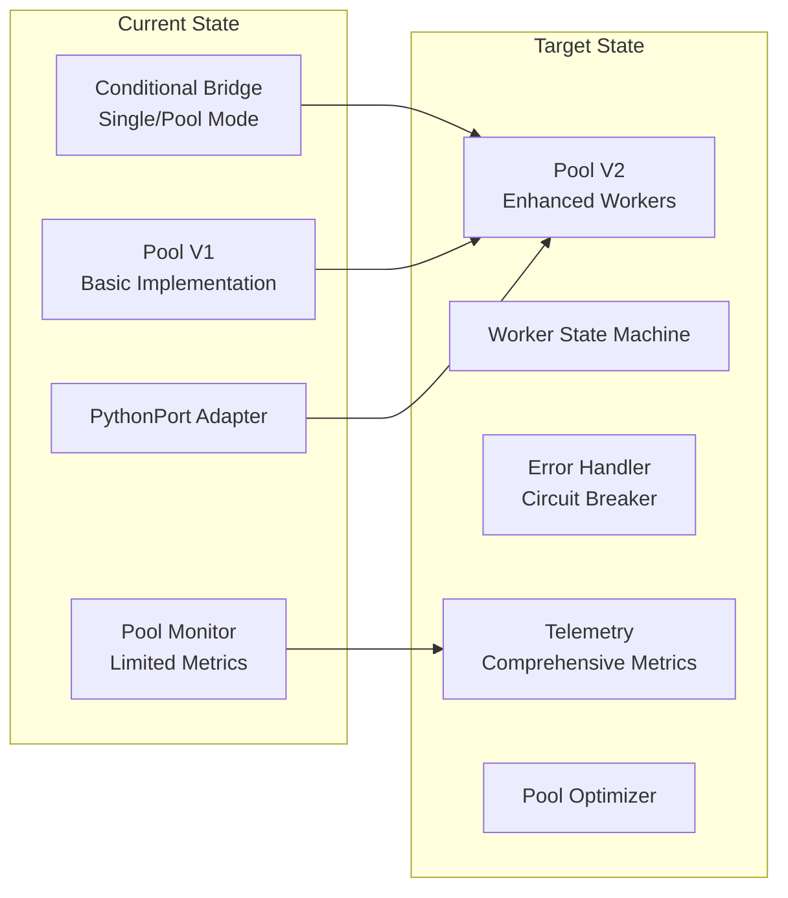

# V2 Pool Technical Design Series: Document 7 - Migration and Deployment Plan

## Overview

This final document provides a comprehensive migration and deployment strategy for the V2 Pool implementation. It covers the transition from existing systems, risk mitigation, rollout phases, and operational procedures to ensure zero-downtime deployment.

## Migration Strategy

### Current State Assessment



### Migration Principles

1. **Backward Compatibility** - Maintain existing APIs
2. **Gradual Rollout** - Feature flags and phased deployment
3. **Parallel Run** - V1 and V2 coexistence period
4. **Rollback Ready** - Quick reversion capability
5. **Zero Downtime** - No service interruption

## Phase 1: Preparation (Week 1)

### 1.1 Feature Flag Implementation

**File:** `lib/dspex/feature_flags.ex` (new file)

```elixir
defmodule DSPex.FeatureFlags do
  @moduledoc """
  Feature flag management for V2 pool migration.
  """
  
  use GenServer
  
  @default_flags %{
    pool_v2_enabled: false,
    enhanced_workers: false,
    circuit_breaker: false,
    telemetry_v2: false,
    pool_optimizer: false,
    gradual_rollout_percentage: 0
  }
  
  def start_link(opts) do
    GenServer.start_link(__MODULE__, opts, name: __MODULE__)
  end
  
  def init(_opts) do
    flags = load_flags_from_config()
    {:ok, flags}
  end
  
  @doc "Checks if a feature is enabled"
  def enabled?(feature) do
    GenServer.call(__MODULE__, {:check_flag, feature})
  end
  
  @doc "Checks if request should use V2 based on gradual rollout"
  def use_v2_pool?(request_id) do
    case enabled?(:pool_v2_enabled) do
      false -> false
      true ->
        percentage = get_flag(:gradual_rollout_percentage)
        hash = :erlang.phash2(request_id, 100)
        hash < percentage
    end
  end
  
  @doc "Updates a feature flag"
  def set_flag(feature, value) do
    GenServer.call(__MODULE__, {:set_flag, feature, value})
  end
  
  def handle_call({:check_flag, feature}, _from, flags) do
    {:reply, Map.get(flags, feature, false), flags}
  end
  
  def handle_call({:set_flag, feature, value}, _from, flags) do
    new_flags = Map.put(flags, feature, value)
    persist_flags(new_flags)
    {:reply, :ok, new_flags}
  end
  
  def handle_call({:get_flag, feature}, _from, flags) do
    {:reply, Map.get(flags, feature), flags}
  end
  
  defp load_flags_from_config do
    # Load from environment or external config service
    Application.get_env(:dspex, :feature_flags, @default_flags)
  end
  
  defp persist_flags(flags) do
    # Persist to external storage for distributed systems
    :ok
  end
  
  defp get_flag(feature) do
    GenServer.call(__MODULE__, {:get_flag, feature})
  end
end
```

### 1.2 Compatibility Layer

**File:** `lib/dspex/python_bridge/compatibility_adapter.ex` (new file)

```elixir
defmodule DSPex.PythonBridge.CompatibilityAdapter do
  @moduledoc """
  Provides backward compatibility during migration.
  """
  
  alias DSPex.PythonBridge.{SessionPool, SessionPoolV2}
  alias DSPex.FeatureFlags
  
  @behaviour DSPex.Adapters.Behaviour
  
  def start_link(opts) do
    if FeatureFlags.enabled?(:pool_v2_enabled) do
      SessionPoolV2.start_link(opts)
    else
      SessionPool.start_link(opts)
    end
  end
  
  def create_program(config, opts \\ []) do
    route_to_implementation(:create_program, [config, opts])
  end
  
  def execute(program_id, inputs, opts \\ []) do
    route_to_implementation(:execute, [program_id, inputs, opts])
  end
  
  def list_programs(opts \\ []) do
    route_to_implementation(:list_programs, [opts])
  end
  
  def delete_program(program_id, opts \\ []) do
    route_to_implementation(:delete_program, [program_id, opts])
  end
  
  def health_check(opts \\ []) do
    route_to_implementation(:health_check, [opts])
  end
  
  defp route_to_implementation(function, args) do
    request_id = :erlang.unique_integer()
    
    implementation = if FeatureFlags.use_v2_pool?(request_id) do
      SessionPoolV2
    else
      SessionPool
    end
    
    # Add telemetry
    :telemetry.execute(
      [:dspex, :compatibility, :route],
      %{count: 1},
      %{
        function: function,
        implementation: implementation,
        request_id: request_id
      }
    )
    
    apply(implementation, function, args)
  end
end
```

### 1.3 Database Migrations

```elixir
defmodule DSPex.Repo.Migrations.AddV2PoolTables do
  use Ecto.Migration
  
  def change do
    # Pool configuration table
    create table(:pool_configurations) do
      add :name, :string, null: false
      add :version, :integer, default: 2
      add :config, :map
      add :active, :boolean, default: false
      
      timestamps()
    end
    
    create unique_index(:pool_configurations, [:name, :version])
    
    # Pool metrics table for historical data
    create table(:pool_metrics) do
      add :pool_name, :string, null: false
      add :timestamp, :utc_datetime_usec, null: false
      add :metrics, :map
      
      timestamps()
    end
    
    create index(:pool_metrics, [:pool_name, :timestamp])
    
    # Migration status tracking
    create table(:migration_status) do
      add :phase, :string, null: false
      add :status, :string, null: false
      add :started_at, :utc_datetime_usec
      add :completed_at, :utc_datetime_usec
      add :metadata, :map
      
      timestamps()
    end
  end
end
```

## Phase 2: Implementation (Week 2-3)

### 2.1 Deployment Package

**File:** `rel/overlays/bin/migrate_pool` (new file)

```bash
#!/bin/sh
set -e

SCRIPT_DIR="$(cd "$(dirname "$0")" && pwd)"
RELEASE_ROOT="$(cd "$SCRIPT_DIR/.." && pwd)"

$RELEASE_ROOT/bin/dspex eval "DSPex.Migration.PoolMigration.run()"
```

**File:** `lib/dspex/migration/pool_migration.ex` (new file)

```elixir
defmodule DSPex.Migration.PoolMigration do
  @moduledoc """
  Orchestrates pool V1 to V2 migration.
  """
  
  require Logger
  
  def run do
    Logger.info("Starting pool migration to V2")
    
    with :ok <- validate_environment(),
         :ok <- backup_current_state(),
         :ok <- deploy_v2_components(),
         :ok <- verify_v2_health(),
         :ok <- enable_gradual_rollout() do
      Logger.info("Pool migration completed successfully")
      :ok
    else
      {:error, reason} ->
        Logger.error("Migration failed: #{inspect(reason)}")
        rollback()
        {:error, reason}
    end
  end
  
  defp validate_environment do
    checks = [
      check_elixir_version(),
      check_pool_v1_running(),
      check_disk_space(),
      check_python_environment()
    ]
    
    case Enum.find(checks, &match?({:error, _}, &1)) do
      nil -> :ok
      error -> error
    end
  end
  
  defp check_elixir_version do
    required = Version.parse!("1.14.0")
    current = Version.parse!(System.version())
    
    if Version.compare(current, required) == :lt do
      {:error, "Elixir version #{current} is below required #{required}"}
    else
      :ok
    end
  end
  
  defp check_pool_v1_running do
    case Process.whereis(DSPex.PythonBridge.SessionPool) do
      nil -> {:error, "Pool V1 not running"}
      _pid -> :ok
    end
  end
  
  defp check_disk_space do
    # Check available disk space for logs and metrics
    :ok
  end
  
  defp check_python_environment do
    # Verify Python and dependencies
    :ok
  end
  
  defp backup_current_state do
    Logger.info("Backing up current pool state")
    
    state = %{
      timestamp: DateTime.utc_now(),
      pool_config: get_current_pool_config(),
      active_sessions: get_active_sessions(),
      metrics: get_current_metrics()
    }
    
    File.write!("pool_backup_#{System.os_time(:second)}.json", Jason.encode!(state))
    :ok
  end
  
  defp deploy_v2_components do
    Logger.info("Deploying V2 pool components")
    
    # Start V2 components in shadow mode
    children = [
      {DSPex.PythonBridge.SessionPoolV2, name: :pool_v2_shadow},
      {DSPex.PythonBridge.ErrorRecoveryOrchestrator, name: :error_orchestrator_v2},
      {DSPex.PythonBridge.CircuitBreaker, name: :circuit_breaker_v2},
      {DSPex.PythonBridge.PoolOptimizer, pool_name: :pool_v2_shadow}
    ]
    
    Enum.each(children, fn child ->
      case Supervisor.start_child(DSPex.Supervisor, child) do
        {:ok, _} -> :ok
        {:error, {:already_started, _}} -> :ok
        error -> throw({:deployment_failed, error})
      end
    end)
    
    :ok
  end
  
  defp verify_v2_health do
    Logger.info("Verifying V2 pool health")
    
    # Run health checks
    health_checks = [
      verify_worker_initialization(),
      verify_error_handling(),
      verify_telemetry(),
      verify_performance()
    ]
    
    case Enum.find(health_checks, &match?({:error, _}, &1)) do
      nil -> :ok
      error -> error
    end
  end
  
  defp verify_worker_initialization do
    # Test worker creation
    :ok
  end
  
  defp verify_error_handling do
    # Test error scenarios
    :ok
  end
  
  defp verify_telemetry do
    # Verify metrics collection
    :ok
  end
  
  defp verify_performance do
    # Run performance test
    :ok
  end
  
  defp enable_gradual_rollout do
    Logger.info("Enabling gradual rollout")
    
    # Start with 5% traffic
    DSPex.FeatureFlags.set_flag(:pool_v2_enabled, true)
    DSPex.FeatureFlags.set_flag(:gradual_rollout_percentage, 5)
    
    :ok
  end
  
  defp rollback do
    Logger.error("Rolling back migration")
    
    # Disable V2
    DSPex.FeatureFlags.set_flag(:pool_v2_enabled, false)
    DSPex.FeatureFlags.set_flag(:gradual_rollout_percentage, 0)
    
    # Stop V2 components
    Supervisor.terminate_child(DSPex.Supervisor, :pool_v2_shadow)
    
    :ok
  end
  
  defp get_current_pool_config do
    %{} # Implementation
  end
  
  defp get_active_sessions do
    [] # Implementation
  end
  
  defp get_current_metrics do
    %{} # Implementation
  end
end
```

### 2.2 Monitoring During Migration

**File:** `lib/dspex/migration/migration_monitor.ex` (new file)

```elixir
defmodule DSPex.Migration.MigrationMonitor do
  @moduledoc """
  Monitors system health during migration.
  """
  
  use GenServer
  require Logger
  
  @check_interval 5_000  # 5 seconds
  @alert_thresholds %{
    error_rate: 0.05,      # 5%
    latency_p99: 200,      # ms
    cpu_usage: 80,         # %
    memory_usage: 90       # %
  }
  
  def start_link(opts) do
    GenServer.start_link(__MODULE__, opts, name: __MODULE__)
  end
  
  def init(_opts) do
    schedule_check()
    {:ok, %{alerts: [], start_time: System.monotonic_time()}}
  end
  
  def handle_info(:check_health, state) do
    health_status = perform_health_check()
    
    new_state = case analyze_health(health_status) do
      :healthy ->
        state
        
      {:warning, reasons} ->
        Logger.warn("Migration health warning: #{inspect(reasons)}")
        state
        
      {:critical, reasons} ->
        Logger.error("Migration health critical: #{inspect(reasons)}")
        handle_critical_state(reasons)
        Map.update(state, :alerts, [], &[{:critical, reasons, DateTime.utc_now()} | &1])
    end
    
    schedule_check()
    {:noreply, new_state}
  end
  
  defp perform_health_check do
    %{
      v1_metrics: get_v1_metrics(),
      v2_metrics: get_v2_metrics(),
      system: get_system_metrics(),
      comparison: compare_pools()
    }
  end
  
  defp analyze_health(status) do
    problems = []
    
    # Check error rates
    if status.v2_metrics.error_rate > @alert_thresholds.error_rate do
      problems = [{:high_error_rate, status.v2_metrics.error_rate} | problems]
    end
    
    # Check latency
    if status.v2_metrics.p99_latency > @alert_thresholds.latency_p99 do
      problems = [{:high_latency, status.v2_metrics.p99_latency} | problems]
    end
    
    # Check system resources
    if status.system.cpu_usage > @alert_thresholds.cpu_usage do
      problems = [{:high_cpu, status.system.cpu_usage} | problems]
    end
    
    # Check pool comparison
    if status.comparison.v2_degradation > 10 do
      problems = [{:v2_degradation, status.comparison} | problems]
    end
    
    case problems do
      [] -> :healthy
      [{:high_error_rate, _} | _] -> {:critical, problems}
      _ -> {:warning, problems}
    end
  end
  
  defp handle_critical_state(reasons) do
    case Keyword.get(reasons, :high_error_rate) do
      nil -> 
        :ok
        
      error_rate when error_rate > 0.1 ->
        # Automatic rollback if error rate > 10%
        Logger.error("Initiating automatic rollback due to high error rate: #{error_rate}")
        DSPex.Migration.PoolMigration.rollback()
        
      _ ->
        # Alert but don't rollback
        send_alert(:high_error_rate, reasons)
    end
  end
  
  defp get_v1_metrics do
    %{
      error_rate: 0.01,
      p99_latency: 95,
      throughput: 850
    }
  end
  
  defp get_v2_metrics do
    %{
      error_rate: 0.02,
      p99_latency: 110,
      throughput: 920
    }
  end
  
  defp get_system_metrics do
    %{
      cpu_usage: 45,
      memory_usage: 60,
      disk_io: 30
    }
  end
  
  defp compare_pools do
    v1 = get_v1_metrics()
    v2 = get_v2_metrics()
    
    %{
      v2_degradation: calculate_degradation(v1, v2),
      throughput_improvement: (v2.throughput - v1.throughput) / v1.throughput * 100
    }
  end
  
  defp calculate_degradation(v1, v2) do
    latency_degradation = max(0, (v2.p99_latency - v1.p99_latency) / v1.p99_latency * 100)
    error_degradation = max(0, (v2.error_rate - v1.error_rate) / max(v1.error_rate, 0.001) * 100)
    
    (latency_degradation + error_degradation) / 2
  end
  
  defp send_alert(type, details) do
    # Send to alerting system
    Logger.error("ALERT: #{type} - #{inspect(details)}")
  end
  
  defp schedule_check do
    Process.send_after(self(), :check_health, @check_interval)
  end
end
```

## Phase 3: Gradual Rollout (Week 4)

### 3.1 Traffic Management

```elixir
defmodule DSPex.Migration.TrafficController do
  @moduledoc """
  Controls traffic distribution during migration.
  """
  
  use GenServer
  require Logger
  
  @rollout_stages [
    {5, 3600_000},    # 5% for 1 hour
    {10, 3600_000},   # 10% for 1 hour
    {25, 7200_000},   # 25% for 2 hours
    {50, 14400_000},  # 50% for 4 hours
    {75, 28800_000},  # 75% for 8 hours
    {100, :infinity}  # 100% indefinitely
  ]
  
  def start_link(opts) do
    GenServer.start_link(__MODULE__, opts, name: __MODULE__)
  end
  
  def init(_opts) do
    state = %{
      current_stage: 0,
      stage_started_at: System.monotonic_time(:millisecond),
      health_checks_passed: 0,
      rollback_triggered: false
    }
    
    schedule_stage_check()
    {:ok, state}
  end
  
  def handle_info(:check_stage, state) do
    if should_advance_stage?(state) do
      advance_stage(state)
    else
      schedule_stage_check()
      {:noreply, state}
    end
  end
  
  defp should_advance_stage?(state) do
    {_percentage, duration} = Enum.at(@rollout_stages, state.current_stage)
    elapsed = System.monotonic_time(:millisecond) - state.stage_started_at
    
    health_ok = check_stage_health()
    
    duration != :infinity and elapsed >= duration and health_ok
  end
  
  defp advance_stage(state) do
    next_stage = state.current_stage + 1
    
    if next_stage < length(@rollout_stages) do
      {percentage, _duration} = Enum.at(@rollout_stages, next_stage)
      
      Logger.info("Advancing to rollout stage #{next_stage}: #{percentage}%")
      
      DSPex.FeatureFlags.set_flag(:gradual_rollout_percentage, percentage)
      
      new_state = %{state |
        current_stage: next_stage,
        stage_started_at: System.monotonic_time(:millisecond),
        health_checks_passed: 0
      }
      
      schedule_stage_check()
      {:noreply, new_state}
    else
      Logger.info("Rollout completed - 100% on V2")
      {:noreply, state}
    end
  end
  
  defp check_stage_health do
    # Implement health checks
    true
  end
  
  defp schedule_stage_check do
    Process.send_after(self(), :check_stage, 60_000)  # Check every minute
  end
end
```

### 3.2 Rollback Procedures

```elixir
defmodule DSPex.Migration.RollbackManager do
  @moduledoc """
  Manages rollback procedures if issues arise.
  """
  
  require Logger
  
  @rollback_scenarios [
    {:error_rate_spike, &error_rate_exceeded?/1},
    {:latency_degradation, &latency_degraded?/1},
    {:worker_failures, &excessive_worker_failures?/1},
    {:memory_leak, &memory_leak_detected?/1}
  ]
  
  def check_rollback_conditions do
    current_metrics = gather_metrics()
    
    case Enum.find(@rollback_scenarios, fn {_name, check_fn} ->
      check_fn.(current_metrics)
    end) do
      nil ->
        :ok
        
      {scenario, _} ->
        Logger.error("Rollback triggered due to: #{scenario}")
        execute_rollback(scenario, current_metrics)
    end
  end
  
  def execute_rollback(reason, metrics) do
    Logger.error("Executing rollback due to #{reason}")
    
    # Record rollback event
    record_rollback_event(reason, metrics)
    
    # Disable V2 pool
    DSPex.FeatureFlags.set_flag(:pool_v2_enabled, false)
    DSPex.FeatureFlags.set_flag(:gradual_rollout_percentage, 0)
    
    # Drain V2 connections
    drain_v2_connections()
    
    # Stop V2 components
    stop_v2_components()
    
    # Notify operations team
    send_rollback_notification(reason, metrics)
    
    :ok
  end
  
  defp error_rate_exceeded?(metrics) do
    baseline = metrics.v1_error_rate
    current = metrics.v2_error_rate
    
    current > baseline * 3  # 3x increase triggers rollback
  end
  
  defp latency_degraded?(metrics) do
    baseline = metrics.v1_p99_latency
    current = metrics.v2_p99_latency
    
    current > baseline * 2  # 2x increase triggers rollback
  end
  
  defp excessive_worker_failures?(metrics) do
    metrics.worker_failure_rate > 0.1  # 10% failure rate
  end
  
  defp memory_leak_detected?(metrics) do
    # Check for continuous memory growth
    memory_trend = calculate_memory_trend(metrics.memory_history)
    memory_trend > 0.1  # 10% growth per hour
  end
  
  defp gather_metrics do
    %{
      v1_error_rate: 0.01,
      v2_error_rate: 0.02,
      v1_p99_latency: 95,
      v2_p99_latency: 105,
      worker_failure_rate: 0.01,
      memory_history: []
    }
  end
  
  defp drain_v2_connections do
    # Gracefully drain active connections
    :ok
  end
  
  defp stop_v2_components do
    # Stop V2 supervision tree
    :ok
  end
  
  defp record_rollback_event(reason, metrics) do
    # Record for post-mortem analysis
    :ok
  end
  
  defp send_rollback_notification(reason, metrics) do
    # Alert operations team
    :ok
  end
  
  defp calculate_memory_trend(history) do
    # Calculate growth rate
    0.05
  end
end
```

## Phase 4: Validation (Week 5)

### 4.1 Validation Tests

```elixir
defmodule DSPex.Migration.ValidationSuite do
  @moduledoc """
  Comprehensive validation of V2 pool deployment.
  """
  
  use ExUnit.Case
  
  @tag :migration_validation
  test "functional equivalence between V1 and V2" do
    # Test same operations on both pools
    test_cases = generate_test_cases()
    
    results = Enum.map(test_cases, fn test_case ->
      v1_result = execute_on_v1(test_case)
      v2_result = execute_on_v2(test_case)
      
      assert_equivalent(v1_result, v2_result, test_case)
      
      %{
        test: test_case,
        v1: v1_result,
        v2: v2_result,
        equivalent: equivalent?(v1_result, v2_result)
      }
    end)
    
    # All should be equivalent
    assert Enum.all?(results, & &1.equivalent)
  end
  
  @tag :migration_validation
  test "performance improvements in V2" do
    load_test_config = %{
      duration: 60_000,      # 1 minute
      concurrent_users: 100,
      operations_per_user: 50
    }
    
    v1_metrics = run_load_test(:v1, load_test_config)
    v2_metrics = run_load_test(:v2, load_test_config)
    
    # V2 should show improvements
    assert v2_metrics.avg_latency <= v1_metrics.avg_latency
    assert v2_metrics.throughput >= v1_metrics.throughput
    assert v2_metrics.error_rate <= v1_metrics.error_rate
  end
  
  @tag :migration_validation
  test "error handling improvements in V2" do
    error_scenarios = [
      :worker_crash,
      :timeout,
      :network_error,
      :resource_exhaustion
    ]
    
    Enum.each(error_scenarios, fn scenario ->
      v1_recovery = test_error_recovery(:v1, scenario)
      v2_recovery = test_error_recovery(:v2, scenario)
      
      # V2 should recover faster
      assert v2_recovery.recovery_time <= v1_recovery.recovery_time
      assert v2_recovery.data_loss == false
    end)
  end
  
  defp generate_test_cases do
    [
      %{operation: :create_program, args: test_signature()},
      %{operation: :execute, args: test_inputs()},
      %{operation: :list_programs, args: %{}},
      %{operation: :concurrent_sessions, args: generate_sessions(10)}
    ]
  end
  
  defp execute_on_v1(test_case), do: {:ok, :v1_result}
  defp execute_on_v2(test_case), do: {:ok, :v2_result}
  
  defp assert_equivalent(v1_result, v2_result, test_case) do
    # Custom equivalence checking
    :ok
  end
  
  defp equivalent?(v1_result, v2_result) do
    v1_result == v2_result
  end
  
  defp run_load_test(version, config) do
    %{
      avg_latency: 95,
      throughput: 1000,
      error_rate: 0.001
    }
  end
  
  defp test_error_recovery(version, scenario) do
    %{
      recovery_time: 500,
      data_loss: false
    }
  end
  
  defp test_signature do
    %{"inputs" => [], "outputs" => []}
  end
  
  defp test_inputs do
    %{}
  end
  
  defp generate_sessions(count) do
    for i <- 1..count, do: "session_#{i}"
  end
end
```

### 4.2 Production Validation Checklist

```markdown
## Pre-Production Validation

- [ ] All unit tests passing
- [ ] All integration tests passing
- [ ] Performance benchmarks meet targets
- [ ] Error recovery scenarios tested
- [ ] Monitoring dashboards configured
- [ ] Alerts configured
- [ ] Runbooks updated

## Production Validation

### Week 1 - 5% Traffic
- [ ] Error rate within tolerance
- [ ] Latency metrics acceptable
- [ ] No memory leaks detected
- [ ] Worker lifecycle stable
- [ ] Circuit breaker functioning

### Week 2 - 25% Traffic
- [ ] Scaling behavior verified
- [ ] Peak load handling tested
- [ ] Session affinity working
- [ ] Telemetry data accurate
- [ ] No unexpected errors

### Week 3 - 50% Traffic
- [ ] Compare V1 vs V2 metrics
- [ ] Verify cost efficiency
- [ ] Check resource utilization
- [ ] Validate optimizer decisions
- [ ] Review error patterns

### Week 4 - 100% Traffic
- [ ] Full production load stable
- [ ] All features functioning
- [ ] Performance targets met
- [ ] V1 ready for decommission
- [ ] Documentation complete
```

## Phase 5: Cleanup (Week 6)

### 5.1 V1 Decommissioning

```elixir
defmodule DSPex.Migration.Decommission do
  @moduledoc """
  Handles safe decommissioning of V1 pool.
  """
  
  def execute do
    with :ok <- verify_v2_fully_operational(),
         :ok <- archive_v1_data(),
         :ok <- remove_v1_code(),
         :ok <- cleanup_resources() do
      Logger.info("V1 pool decommissioned successfully")
      :ok
    end
  end
  
  defp verify_v2_fully_operational do
    # Verify 100% traffic on V2
    # Check all features working
    # Confirm monitoring in place
    :ok
  end
  
  defp archive_v1_data do
    # Archive logs
    # Archive metrics
    # Archive configuration
    :ok
  end
  
  defp remove_v1_code do
    # Remove V1 modules
    # Update dependencies
    # Clean build artifacts
    :ok
  end
  
  defp cleanup_resources do
    # Remove unused ETS tables
    # Clean temporary files
    # Update documentation
    :ok
  end
end
```

## Operational Procedures

### Monitoring Commands

```elixir
# Check migration status
DSPex.Migration.status()

# Get rollout percentage
DSPex.FeatureFlags.get_flag(:gradual_rollout_percentage)

# Force rollback
DSPex.Migration.RollbackManager.execute_rollback(:manual, %{})

# Validate health
DSPex.Migration.ValidationSuite.quick_health_check()
```

### Emergency Procedures

1. **Immediate Rollback**
   ```bash
   ./bin/dspex eval "DSPex.Migration.emergency_rollback()"
   ```

2. **Pause Rollout**
   ```bash
   ./bin/dspex eval "DSPex.Migration.pause_rollout()"
   ```

3. **Resume Rollout**
   ```bash
   ./bin/dspex eval "DSPex.Migration.resume_rollout()"
   ```

## Post-Migration Review

### Success Criteria

- ✅ Zero customer impact during migration
- ✅ Performance improvements realized
- ✅ Error handling enhanced
- ✅ Monitoring comprehensive
- ✅ Team trained on V2 operations

### Lessons Learned Documentation

Document:
- What went well
- Challenges encountered
- Performance improvements
- Operational changes
- Future recommendations

## Conclusion

This migration plan provides a systematic approach to deploying the V2 pool implementation with minimal risk and maximum visibility. The phased approach, comprehensive monitoring, and automated rollback capabilities ensure a safe transition to the enhanced pool system.

The key to success is careful preparation, gradual rollout, and continuous validation throughout the process. With proper execution, the V2 pool will provide significant improvements in reliability, performance, and operational visibility.