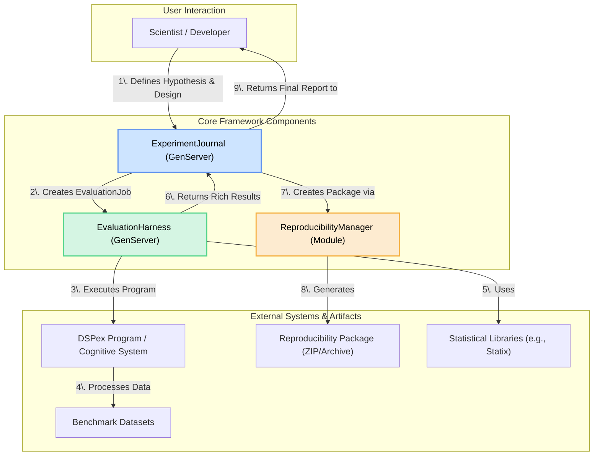
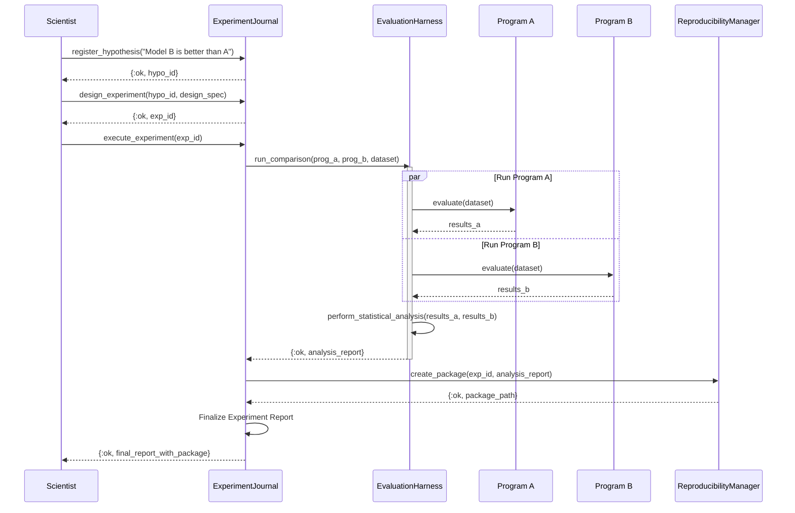

### **Document Set for the DSPex Scientific Evaluation Framework**

*   **`00_VISION_AND_PRINCIPLES.md`**: The high-level charter defining the purpose, goals, and guiding principles of the framework.
*   **`01_ARCHITECTURAL_OVERVIEW.md`**: A visual and descriptive overview of the system's components and their interactions.
*   **`02_COMPONENT_SPEC_EXPERIMENT_JOURNAL.md`**: Detailed specification for the `ExperimentJournal`, the core of the scientific workflow.
*   **`03_COMPONENT_SPEC_EVALUATION_HARNESS.md`**: Detailed specification for the `EvaluationHarness`, the execution engine for tests.
*   **`04_COMPONENT_SPEC_REPRODUCIBILITY_MANAGER.md`**: Detailed specification for the `ReproducibilityManager`, ensuring verifiable science.
*   **`05_DATA_MODELS.md`**: Canonical definitions of the data structures used throughout the framework.
*   **`06_IMPLEMENTATION_ROADMAP.md`**: A phased, actionable plan for building the framework.

---
### **`00_VISION_AND_PRINCIPLES.md`**
---
# Vision and Principles: DSPex Scientific Evaluation Framework

## 1. Vision Statement

To transform AI system development from an art of ad-hoc experimentation into a rigorous, systematic science. We will build a platform that empowers researchers and engineers to design, execute, and reproduce experiments with statistical confidence, thereby accelerating the pace of discovery and building more robust, reliable, and well-understood AI systems.

## 2. Guiding Principles

These principles will guide all architectural and implementation decisions for the framework.

1.  **Rigor over Simplicity**: Where a trade-off exists, we will prefer the path that leads to more statistically sound and rigorous results, even if it requires a more complex implementation. We will not sacrifice scientific validity for convenience.
2.  **Reproducibility by Default**: Every experiment executed through the framework must be reproducible. The system will be designed to capture all necessary artifacts (code, data, configuration, environment) to guarantee this.
3.  **Insight over Scores**: The ultimate goal is not to produce a single score, but to generate deep, actionable insights. The framework will prioritize multi-faceted metrics, statistical analysis, and visualizations that explain *why* a system behaves the way it does.
4.  **Extensibility for the Unknown**: We cannot predict all future evaluation needs. The architecture must be modular and extensible, allowing the community to easily add new metrics, evaluation protocols, and statistical tests.
5.  **Scientist-First Ergonomics**: The APIs and workflows should feel natural to a researcher. Concepts like "Hypothesis," "Experiment," and "Reproducibility Package" will be first-class citizens of the API.

## 3. Target Audience

This framework is designed for:
*   **ML/AI Researchers**: Who need to test hypotheses and publish credible, reproducible results.
*   **Data Scientists & ML Engineers**: Who need to compare models, tune systems, and understand the trade-offs of their decisions with statistical confidence.
*   **AI System Architects**: Who need to evaluate the performance, robustness, and cost of complex, multi-agent, and adaptive systems.

## 4. Core Capabilities

The framework will provide the following core capabilities:
*   **Experiment Management**: A full lifecycle for defining, running, and archiving scientific experiments.
*   **Comprehensive Evaluation**: A powerful harness for executing tests and collecting a wide array of metrics.
*   **Statistical Analysis**: Integrated statistical tests to determine the significance of results.
*   **Reproducibility**: Automated packaging of all experimental artifacts.
*   **Advanced Protocols**: Specialized evaluation for reasoning, multi-agent systems, and adaptive capabilities.

---
### **`01_ARCHITECTURAL_OVERVIEW.md`**
---
# Architectural Overview

## 1. Component Diagram

The Scientific Evaluation Framework is composed of three primary, stateful components that work in concert. The `ExperimentJournal` provides the high-level workflow, orchestrating the `EvaluationHarness` to perform the actual measurements, and a `ReproducibilityManager` to archive the results.



## 2. Component Responsibilities

*   **`ExperimentJournal`**:
    *   **Role**: The "Principal Investigator" or "Lab Notebook".
    *   **Responsibilities**: Manages the scientific workflow. It stores hypotheses, experimental designs, and orchestrates the other components to produce a final, analyzed result. It is the user's primary entry point.

*   **`EvaluationHarness`**:
    *   **Role**: The "Lab Equipment".
    *   **Responsibilities**: Performs the actual measurements. It takes an `EvaluationJob` (a program, a dataset, and a set of metrics), runs the evaluation in a controlled manner, and collects a wide range of raw and statistical data. It is responsible for parallelism, cost tracking, and adaptive testing.

*   **`ReproducibilityManager`**:
    *   **Role**: The "Archivist" or "Publisher".
    *   **Responsibilities**: A stateless module responsible for gathering all artifacts of a completed experiment (code state, data checksums, configuration, environment details) and bundling them into a single, verifiable package.

## 3. Standard Workflow (Sequence Diagram)

This diagram shows a typical interaction flow for a scientist comparing two models.



---
### **`02_COMPONENT_SPEC_EXPERIMENT_JOURNAL.md`**
---
# Component Specification: ExperimentJournal

## 1. Purpose

The `ExperimentJournal` is a stateful `GenServer` that acts as the primary user-facing component for the scientific evaluation workflow. It manages the lifecycle of experiments, from hypothesis registration to the final report, ensuring that every step is tracked, validated, and reproducible.

## 2. Core Abstractions

*   **Hypothesis**: A formal statement of a research question and a predicted outcome.
*   **ExperimentalDesign**: A specification of the methodology to test a hypothesis, including controlled variables, sample sizes, and statistical methods.
*   **Experiment**: An instance of an executed `ExperimentalDesign` for a given `Hypothesis`, containing the results, analysis, and a link to its reproducibility package.

## 3. State (`defstruct`)

```elixir
defstruct [
  :journal_id,
  :hypothesis_registry,  # map of %{hypothesis_id => %Hypothesis{}}
  :experiment_designs,   # map of %{hypothesis_id => %ExperimentalDesign{}}
  :active_experiments,   # map of %{experiment_id => pid_of_harness_job}
  :experiment_history,   # list of completed %Experiment{} structs
  :harness_pool          # Pool of EvaluationHarness workers
]
```

## 4. Public API (`@spec`)

```elixir
# --- Lifecycle ---
@spec start_link(opts :: keyword()) :: GenServer.on_start()
def start_link(opts \\ [])

# --- Hypothesis Management ---
@spec register_hypothesis(pid(), map()) :: {:ok, String.t()} | {:error, term()}
def register_hypothesis(journal_pid, hypothesis_spec)

@spec get_hypothesis(pid(), String.t()) :: {:ok, map()} | {:error, :not_found}
def get_hypothesis(journal_pid, hypothesis_id)

# --- Experimental Design ---
@spec design_experiment(pid(), String.t(), map()) :: {:ok, String.t()} | {:error, term()}
def design_experiment(journal_pid, hypothesis_id, design_spec)

# --- Execution ---
@spec execute_experiment(pid(), String.t()) :: {:ok, map()} | {:error, term()}
def execute_experiment(journal_pid, experiment_id)

# --- Results & History ---
@spec get_experiment_results(pid(), String.t()) :: {:ok, map()} | {:error, :not_found}
def get_experiment_results(journal_pid, experiment_id)

@spec list_experiments(pid(), map()) :: {:ok, list(map())}
def list_experiments(journal_pid, filters \\ %{})
```

## 5. Internal Logic (`handle_call` sketches)

*   **`handle_call({:register_hypothesis, spec}, ...)`**:
    1.  Validates the `hypothesis_spec` against the `Hypothesis` data model.
    2.  Generates a unique `hypothesis_id`.
    3.  Stores the validated `Hypothesis` struct in the `:hypothesis_registry`.
    4.  Replies with `{:ok, hypothesis_id}`.

*   **`handle_call({:design_experiment, hypo_id, design_spec}, ...)`**:
    1.  Retrieves the `Hypothesis` from the registry.
    2.  Validates the `design_spec` against the `ExperimentalDesign` model and ensures it's compatible with the hypothesis.
    3.  Performs a statistical power analysis to estimate if the `sample_size` is sufficient.
    4.  Generates a unique `experiment_id`.
    5.  Stores the validated `ExperimentalDesign` struct in `:experiment_designs`.
    6.  Replies with `{:ok, experiment_id}`.

*   **`handle_call({:execute_experiment, exp_id}, ...)`**:
    1.  Retrieves the `ExperimentalDesign`.
    2.  Checks out an `EvaluationHarness` worker from the pool.
    3.  Creates an `EvaluationJob` based on the design.
    4.  Asynchronously calls `Harness.run_evaluation(harness_pid, job)`.
    5.  Stores the async task reference in `:active_experiments`.
    6.  The result is handled in `handle_info` upon task completion. The handler will then perform statistical analysis, trigger the `ReproducibilityManager`, and store the final `Experiment` struct in `:experiment_history`.

## 6. Data Persistence

*   **Active State**: Held in the GenServer's state and ETS for performance.
*   **Long-term Storage**: Completed experiments and reproducibility packages should be serialized and stored in a durable location (e.g., a database, object storage) to ensure long-term preservation of scientific record.

---
### **`03_COMPONENT_SPEC_EVALUATION_HARNESS.md`**
---
# Component Specification: EvaluationHarness

## 1. Purpose

The `EvaluationHarness` is a stateful `GenServer` that acts as the high-performance execution engine for evaluation tasks. It is designed to run evaluations in a controlled, instrumented, and parallelized environment, collecting a rich set of metrics beyond simple correctness.

## 2. Core Features

*   **Multi-Modal Evaluation:** Natively supports protocols for text, code, reasoning, and multi-agent systems.
*   **Comprehensive Metrics:** Calculates statistical summaries, cost, latency, throughput, and specialized quality scores.
*   **Statistical Rigor:** Implements cross-validation, bootstrapping, and various statistical tests.
*   **Adaptive Testing:** Intelligently finds a model's "capability boundary" by adjusting test difficulty.
*   **Parallel Execution:** Leverages Elixir's concurrency to run evaluations in parallel for speed.

## 3. State (`defstruct`)

```elixir
defstruct [
  :harness_id,
  :benchmark_suite,      # Pre-loaded benchmark datasets
  :model_configurations, # Configurations for known models
  :cost_tracker,         # Module for tracking token/API costs
  :stats_engine,         # Module for statistical calculations
  :adaptive_engine       # Module for adaptive testing logic
]```

## 4. Public API (`@spec`)

```elixir
# --- Lifecycle ---
@spec start_link(opts :: keyword()) :: GenServer.on_start()
def start_link(opts \\ [])

# --- Primary Evaluation Endpoints ---
@spec run_evaluation(pid(), map()) :: {:ok, map()} | {:error, term()}
def run_evaluation(harness_pid, evaluation_job)

@spec compare_models(pid(), map()) :: {:ok, map()} | {:error, term()}
def compare_models(harness_pid, comparison_job)

@spec find_capability_boundary(pid(), map()) :: {:ok, map()} | {:error, term()}
def find_capability_boundary(harness_pid, adaptive_job)
```

## 5. Internal Logic (Workflow Sketch)

The `run_evaluation` logic is the core of the harness.

1.  **Input**: An `EvaluationJob` struct containing `%{program: prog, dataset: data, metrics: [:accuracy, :f1]}`.
2.  **Parallel Execution**:
    *   The `dataset` is split into chunks.
    *   `Task.async_stream` is used to process each data point in parallel.
    *   For each data point, a worker function is called: `execute_single_trial(program, data_point)`.
3.  **Trial Execution (`execute_single_trial/2`)**:
    *   Starts a timer.
    *   Executes `DSPex.Program.run(program, data_point.inputs)`.
    *   Stops the timer to get latency.
    *   Tracks token usage from the LM's metadata for cost calculation.
    *   Calculates each requested metric (e.g., `Metrics.accuracy(prediction, data_point.expected)`).
    *   Returns a detailed `TrialResult` struct.
4.  **Aggregation**:
    *   All `TrialResult` structs from the stream are collected.
    *   The `StatsEngine` is used to compute aggregate statistics for each metric (mean, stddev, confidence intervals, distribution histograms).
    *   The `CostTracker` aggregates token and financial costs.
5.  **Output**: Returns a comprehensive `EvaluationResult` struct containing both raw trial-level data and aggregated statistics.

### Specialized Evaluation Protocols

*   **`ReasoningEvaluation`**: Will parse the `trace` from a `ChainOfThought` execution, classify reasoning steps (e.g., deduction, abduction), and check for logical fallacies or inconsistencies.
*   **`MultiAgentEvaluation`**: Will ingest a coordination log from a MABEAM execution, analyzing communication patterns, coordination effectiveness (e.g., time spent waiting at a barrier), and individual agent contributions to the final outcome.

---
### **`04_COMPONENT_SPEC_REPRODUCIBILITY_MANAGER.md`**
---
# Component Specification: ReproducibilityManager

## 1. Purpose

The `ReproducibilityManager` is a stateless module that provides the critical function of creating verifiable, self-contained packages for experiments. It ensures that any experiment run through the framework can be fully reproduced by another researcher, a core tenet of the scientific method.

## 2. Core Abstraction: The Reproducibility Package

A "Reproducibility Package" is a compressed archive (e.g., `.zip`) containing everything needed to rerun an experiment and verify its results. Its contents include:

*   **`code/`**: A snapshot of the exact Elixir source code and Python scripts used.
*   **`data/`**: A manifest (`data_manifest.json`) with checksums of the datasets, and optionally, the datasets themselves if permissible.
*   **`config/`**: The complete `dspex` configuration, including all Cognitive Variable settings.
*   **`environment/`**: A manifest (`environment.lock`) detailing all library and system dependencies (e.g., from `mix.lock`, `requirements.txt`, OS version).
*   **`results/`**: The original raw and analyzed results from the experiment.
*   **`README.md`**: Auto-generated instructions on how to set up the environment and rerun the experiment.

## 3. Public API (`@spec`)

```elixir
@spec create_package(Experiment.t()) :: {:ok, path_to_package :: String.t()} | {:error, term()}
def create_package(experiment)

@spec verify_package(path_to_package :: String.t()) :: :ok | {:error, {:checksum_mismatch, file :: String.t()}}
def verify_package(package_path)
```

## 4. Internal Logic (`create_package/1` sketch)

1.  **Input**: A completed `Experiment` struct.
2.  **Create Temporary Directory**: A unique temporary directory is created to stage the package contents.
3.  **Capture Code State**:
    *   Identifies the relevant Elixir application(s).
    *   Copies the source code (`lib/`, `test/`, `mix.exs`, `config/`) to the `code/` subdirectory.
    *   Copies the relevant Python bridge scripts.
4.  **Generate Data Manifest**:
    *   For each dataset used, it calculates a SHA256 checksum.
    *   Writes a `data_manifest.json` file with dataset names, versions, and checksums.
5.  **Capture Configuration**:
    *   Serializes the `ExperimentalDesign` and any relevant `CognitiveConfiguration` spaces to JSON files in the `config/` directory.
6.  **Capture Environment**:
    *   Copies `mix.lock`.
    *   Executes `pip freeze` in the Python environment to get `requirements.txt`.
    *   Captures Elixir, Erlang, and OS version information.
    *   Writes all this to `environment.lock`.
7.  **Archive Results**:
    *   Serializes the `EvaluationResult` to a JSON file in the `results/` directory.
8.  **Generate README**:
    *   Creates a `README.md` with a summary of the experiment and step-by-step instructions for reproduction.
9.  **Package and Checksum**:
    *   Compresses the temporary directory into a `.zip` archive.
    *   Calculates a final SHA256 checksum for the entire package to ensure its integrity.

---
### **`05_DATA_MODELS.md`**
---
# Data Models

This document defines the canonical Elixir structs used by the Scientific Evaluation Framework.

```elixir
# --- Core Scientific Workflow ---

defmodule DSPex.Evaluation.Hypothesis do
  @enforce_keys [:research_question, :prediction]
  defstruct [
    :id,
    :research_question,      # string: "Does X improve Y?"
    :independent_variables,  # list(atom): [:X]
    :dependent_variables,    # list(atom): [:Y]
    :prediction,             # string: "We predict a positive correlation..."
    :type,                   # :comparative, :exploratory, etc.
    :status,                 # :proposed, :active, :validated, :rejected
    :metadata                # map()
  ]
end

defmodule DSPex.Evaluation.ExperimentalDesign do
  @enforce_keys [:controlled_variables, :sample_size, :statistical_tests]
  defstruct [
    :controlled_variables,   # list(atom): Variables held constant
    :randomization_strategy, # :stratified_sampling, :bootstrap, etc.
    :sample_size,            # integer()
    :measurement_protocol,   # map describing how dependent variables are measured
    :statistical_tests,      # list(atom): [:paired_t_test, :cohens_d]
    :power_analysis          # map with results of power analysis
  ]
end

defmodule DSPex.Evaluation.Experiment do
  @enforce_keys [:id, :hypothesis, :design, :status]
  defstruct [
    :id,
    :hypothesis,             # %Hypothesis{}
    :design,                 # %ExperimentalDesign{}
    :status,                 # :designed, :running, :completed, :failed
    :results,                # %EvaluationResult{}
    :statistical_analysis,   # %StatisticalAnalysis{}
    :research_insights,      # string with auto-generated summary
    :reproducibility_package_path, # path to the archive
    :timestamps              # map of %{created: dt, started: dt, completed: dt}
  ]
end

# --- Harness Execution ---

defmodule DSPex.Evaluation.EvaluationJob do
  @enforce_keys [:program, :dataset, :metrics]
  defstruct [
    :program,                # The DSPex program to evaluate
    :dataset,                # list(%DSPex.Example{})
    :metrics,                # list of metric atoms or {module, function, args} tuples
    :evaluation_type         # :standard, :comparison, :adaptive
    # ... other job-specific params
  ]
end

defmodule DSPex.Evaluation.TrialResult do
  @enforce_keys [:data_point, :prediction, :metrics]
  defstruct [
    :data_point,             # The input %DSPex.Example{}
    :prediction,             # The program's output
    :metrics,                # map of %{metric_name => score}
    :trace,                  # The full execution trace
    :latency_ms,             # float()
    :cost                    # map of %{tokens: i, financial: f}
  ]
end

defmodule DSPex.Evaluation.EvaluationResult do
  @enforce_keys [:job, :summary_statistics, :raw_results]
  defstruct [
    :job,                    # The EvaluationJob that was run
    :summary_statistics,     # map of %{metric => %StatisticalSummary{}}
    :cost_summary,           # map with total and average costs
    :latency_summary,        # map with p50, p95, p99 latencies
    :raw_results             # list(%TrialResult{})
  ]
end

# --- Analysis & Reproducibility ---

defmodule DSPex.Evaluation.StatisticalSummary do
  defstruct [
    :mean,
    :std_dev,
    :variance,
    :min,
    :max,
    :median,
    :confidence_interval_95,
    :distribution            # Histogram data for visualization
  ]
end

defmodule DSPex.Evaluation.StatisticalAnalysis do
  @enforce_keys [:hypothesis_support, :test_results]
  defstruct [
    :hypothesis_support,     # :confirmed, :rejected, :inconclusive
    :test_results,           # map of %{test_name => %TestResult{}}
    :effect_sizes,           # map of %{metric => %EffectSize{}}
    :recommendations         # string with auto-generated recommendations
  ]
end

defmodule DSPex.Evaluation.ReproducibilityPackage do
  @enforce_keys [:id, :experiment_id, :checksum]
  defstruct [
    :id,
    :experiment_id,
    :checksum,               # SHA256 of the package archive
    :path,                   # Path to the archive file
    :created_at,
    :contents                # map listing the files in the package
  ]
end
```

---
### **`06_IMPLEMENTATION_ROADMAP.md`**
---
# Implementation Roadmap

This roadmap outlines a phased approach to building the Scientific Evaluation Framework, delivering incremental value and managing complexity.

### **Phase 1: The Statistically Rigorous Harness (Months 1-2)**

**Goal:** Replace the functionality of `dspy.Evaluate` with a more powerful, statistically rigorous, and parallelized Elixir-native engine. Provide immediate value to developers.

*   **Week 1-2: Core Harness & Metrics**
    *   [ ] Implement the `EvaluationHarness` `GenServer`.
    *   [ ] Implement the core `run_evaluation` loop using `Task.async_stream`.
    *   [ ] Create the `DSPex.Evaluation.Metrics` module with foundational metrics (accuracy, F1, etc.).
    *   [ ] Integrate a statistical library (e.g., `Statix`) for basic summary statistics (mean, stddev).
*   **Week 3-4: Statistical Deep Dive**
    *   [ ] Implement confidence interval calculations in the `StatsEngine`.
    *   [ ] Add `compare_models` API with paired t-tests for A/B comparison.
    *   [ ] Implement cost and latency tracking within the harness.
*   **Week 5-6: Benchmarking & Finalization**
    *   [ ] Create a `Benchmark` module to run against standard datasets (e.g., GSM8K).
    *   [ ] Implement basic result reporting and visualization hooks.
    *   [ ] Write comprehensive unit and integration tests for all Phase 1 components.

**Success Criteria for Phase 1:**
*   A developer can evaluate a `dspex` program and get back not just a score, but a full statistical summary.
*   A developer can compare two programs and receive a report on whether the performance difference is statistically significant.

### **Phase 2: The Scientific Workflow (Months 3-4)**

**Goal:** Build the high-level scientific workflow layer on top of the harness, enabling researchers to conduct formal, reproducible experiments.

*   **Week 7-8: Experiment Journal Foundation**
    *   [ ] Implement the `ExperimentJournal` `GenServer`.
    *   [ ] Define the `Hypothesis` and `ExperimentalDesign` data models.
    *   [ ] Implement `register_hypothesis` and `design_experiment` APIs with full validation.
*   **Week 9-10: Experiment Execution & Reproducibility**
    *   [ ] Implement the `execute_experiment` flow, which orchestrates the `EvaluationHarness`.
    *   [ ] Implement the `ReproducibilityManager` and the `create_package` function.
    *   [ ] Ensure the `Experiment` struct is correctly populated and archived.
*   **Week 11-12: Reporting & Integration**
    *   [ ] Build automated reporting to summarize experiment outcomes and statistical significance.
    *   [ ] Create an end-to-end integration test that runs a full experiment from hypothesis to reproducibility package.
    *   [ ] Document the scientific workflow for users.

**Success Criteria for Phase 2:**
*   A researcher can define a hypothesis, design an experiment, execute it, and receive a reproducible package.
*   The entire workflow is automated and tracked within the `ExperimentJournal`.

### **Phase 3: Advanced Cognitive Evaluation (Months 5-6)**

**Goal:** Implement specialized evaluation protocols for the unique capabilities of `dspex`, such as complex reasoning and multi-agent systems.

*   **Week 13-16: Advanced Protocols**
    *   [ ] Implement `ReasoningEvaluation` protocol to analyze `ChainOfThought` traces for logical consistency.
    *   [ ] Implement `MultiAgentEvaluation` protocol to analyze MABEAM coordination logs.
    *   [ ] Integrate these protocols into the `EvaluationHarness` as selectable metric suites.
*   **Week 17-20: Adaptive Testing & Final Polish**
    *   [ ] Implement the `AdaptiveEvaluation` engine to find model capability boundaries.
    *   [ ] Integrate the evaluation framework with the `CognitiveVariable` system, so experiments can test the impact of variable changes.
    *   [ ] Refine all APIs and documentation based on internal dogfooding.
    *   [ ] Create a comprehensive set of examples and tutorials.

**Success Criteria for Phase 3:**
*   The framework can produce deep insights into the internal reasoning quality of a program.
*   The performance of a multi-agent MABEAM team can be evaluated.
*   The system can automatically determine the limits of a model's capabilities on a given task.
