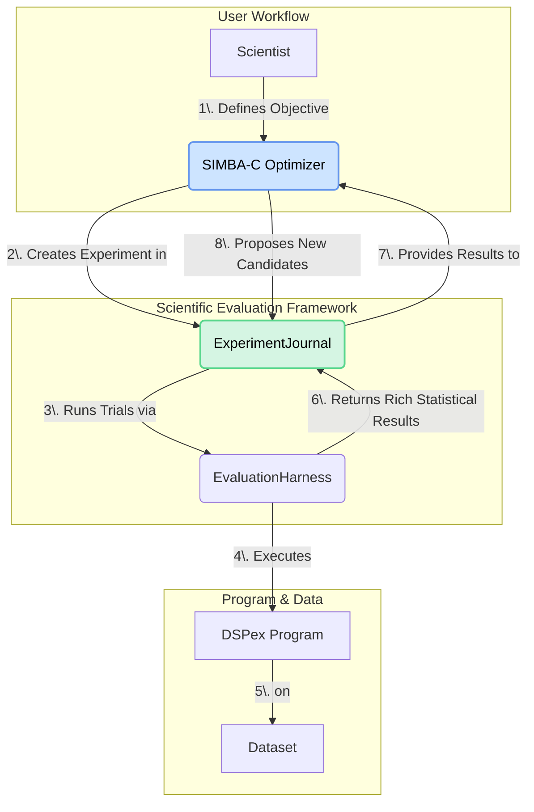

Of course. Having synthesized the state-of-the-art `SIMBA-C` optimizer vision and the comprehensive Scientific Evaluation Framework, I will now devise the novel integrations between them, presenting a complete system that elevates AI optimization from a brute-force search into a process of automated scientific discovery.

This document outlines the architecture and implementation of the `SIMBA-C` teleprompter as a native, first-class citizen of the `dspex` Scientific Evaluation Framework.

---

### **`07_INTEGRATION_SPEC_SIMBA_C_AND_SCIENTIFIC_EVALUATION.md`**

# Integration Specification: SIMBA-C as an Automated Scientific Process

## 1. Vision: From Optimizer to Automated Scientist

The integration of `SIMBA-C` (Composition-Aware Iterative Behavioral Alignment) with the Scientific Evaluation Framework represents a paradigm shift. We are not merely "plugging in" an optimizer to an evaluator. We are reframing the act of optimization itself as a rigorous, automated scientific experiment.

-   **`dspy`'s `SIMBA`** is an *algorithm* that finds a better program.
-   **`dspex`'s `SIMBA-C`** is an *automated scientist* that uses the `ExperimentJournal` to form a hypothesis, conduct a series of trials (candidate evaluations), analyze the results with statistical rigor, and produce a final, reproducible "paper" (the optimized program with its complete experimental validation).

This closed-loop system, where a powerful optimizer is guided by a statistically robust evaluation harness, is designed to autonomously discover and validate state-of-the-art cognitive architectures.

## 2. Architectural Integration

`SIMBA-C` will be implemented as a high-level orchestration strategy that runs within the `ExperimentJournal`. It uses the `EvaluationHarness` as its objective function, leveraging the harness's rich, statistical outputs to make far more intelligent decisions than a simple score-based optimizer.



## 3. Key Novel Integrations

This integration goes far beyond a simple `optimizer.compile(evaluator)` call. It creates a synergistic loop where each component's advanced features are leveraged by the other.

### Integration 1: Hypothesis-Driven Optimization

An optimization run is no longer an amorphous task. It is a formal experiment within the `ExperimentJournal`.

*   **How it Works:** The `SIMBA-C.compile/3` function will begin by programmatically registering a hypothesis in the `ExperimentJournal`:
    *   **Hypothesis:** "The SIMBA-C process can discover a program configuration that is statistically superior to the initial student program on the primary metric."
    *   **Experimental Design:** The design will specify the optimization parameters (e.g., `num_candidates`, `max_steps`), the dataset, and the statistical tests to be used for the final validation.
*   **Benefit:** Every optimization run is now a self-documenting, reproducible scientific experiment, archived for future analysis.

### Integration 2: Rich, Multi-Objective Functions

`SIMBA-C`'s objective function is not a single float score; it's the entire `EvaluationResult` struct from the harness.

*   **How it Works:** The `EvaluationHarness` returns a rich summary for each candidate, including mean scores, confidence intervals, latency distributions, and cost analysis. `SIMBA-C` is configured to optimize for a multi-faceted objective.
*   **Benefit:** This enables far more sophisticated optimization goals, such as:
    *   "Maximize accuracy while keeping p99 latency below 500ms."
    *   "Find the program with the highest F1 score, and use logical consistency as a tie-breaker."
    *   "Minimize financial cost, subject to a minimum accuracy of 85%."

### Integration 3: Statistical Significance as a Termination Condition

`SIMBA-C` can use statistical rigor to stop optimizing when further improvements are likely due to chance.

*   **How it Works:** After each step, `SIMBA-C` uses the `EvaluationHarness.compare_models` function to perform a statistical test (e.g., a paired t-test) between the current best candidate and the previous best. If the improvement is not statistically significant for a set number of steps, the optimization can terminate early.
*   **Benefit:** Prevents wasting computational resources chasing statistically insignificant gains and reduces the risk of overfitting to the validation set.

### Integration 4: Cognitive Metric Feedback for Rule Generation

The `append_a_rule` strategy in `SIMBA-C` becomes vastly more powerful by using the `ReasoningEvaluation` protocol.

*   **How it Works:** When comparing "good" and "bad" trajectories to generate a new rule, the comparison is not just based on the final answer's correctness. The `EvaluationHarness` provides a detailed analysis of the reasoning chains, identifying specific logical fallacies, inconsistencies, or shallow reasoning in the "bad" trajectory. This detailed critique is fed into the `OfferFeedback` LLM call.
*   **Benefit:** The generated rules are not just generic advice but are targeted at fixing specific, identified cognitive flaws (e.g., "Rule: When synthesizing, ensure all claims in the answer are directly supported by evidence in the provided context to avoid hallucination.").

### Integration 5: Adaptive Evaluation for Efficient Optimization

The optimizer can intelligently manage the evaluation budget.

*   **How it Works:** `SIMBA-C` uses a two-tiered evaluation strategy:
    1.  **Screening:** A large number of new candidates are evaluated on a small, random minibatch of the dataset. This is fast and cheap, and serves to quickly discard unpromising candidates.
    2.  **Full Evaluation:** The top-performing candidates from the screening phase are then subjected to a full, rigorous evaluation by the `EvaluationHarness` with cross-validation or bootstrapping to get a high-confidence estimate of their true performance.
*   **Benefit:** Dramatically improves the efficiency of the optimization process, allowing a much larger configuration space to be explored with the same computational budget.

### Integration 6: The Ultimate Deliverable: A Reproducibility Package

The output of a `SIMBA-C` run is not just an optimized program; it's a complete, verifiable `ReproducibilityPackage`.

*   **How it Works:** Upon completion, `SIMBA-C` instructs the `ExperimentJournal` to finalize the experiment. The `ReproducibilityManager` then archives:
    *   The initial student program.
    *   The final, optimized program.
    *   The complete history of all candidate programs evaluated and their statistical performance.
    *   The dataset manifest and environment configuration.
*   **Benefit:** This provides an unparalleled level of transparency and trust. A researcher can not only use the final program but can also inspect the entire optimization trajectory to understand *how* the system arrived at its solution.

## 4. API and Workflow Design

This is what the new, integrated workflow will look like for a scientist using `dspex`.

```elixir
defmodule MyResearchProject do
  alias DSPex.Optimizers.SIMBA_C
  alias DSPex.Evaluation.{ExperimentJournal, Metrics}

  def run_optimization() do
    # 1. Start the ExperimentJournal
    {:ok, journal} = ExperimentJournal.start_link()

    # 2. Define the program to be optimized
    student_program = MyDSPexProgram

    # 3. Define the optimization objective
    # This is a high-level, multi-faceted goal, not just a simple metric.
    objective = %{
      primary_metric: {Metrics, :accuracy, []},
      goal: :maximize,
      constraints: [
        # A "guardrail" metric
        %{metric: {Metrics, :p99_latency_ms, []}, threshold: 1000, goal: :less_than},
        %{metric: {Metrics, :financial_cost, []}, threshold: 0.05, goal: :less_than_per_example}
      ],
      termination_criteria: [
        # Stop after 10 steps or if improvement is not significant for 3 steps
        {:max_steps, 10},
        {:statistical_significance, %{p_value: 0.05, consecutive_steps: 3}}
      ]
    }

    # 4. Launch the optimization
    # SIMBA-C is now a strategy *within* the scientific framework
    optimization_spec = %{
      optimizer: SIMBA_C,
      program: student_program,
      trainset: load_training_data(),
      valset: load_validation_data(),
      objective: objective,
      optimizer_config: %{
        num_candidates: 10,
        max_demos: 4
      }
    }

    # This call is asynchronous and returns immediately
    {:ok, experiment_id} = ExperimentJournal.start_optimization_experiment(journal, optimization_spec)

    IO.puts("Optimization started with experiment ID: #{experiment_id}")

    # 5. Monitor the experiment (optional)
    # The journal can be queried for real-time progress
    Process.sleep(60_000) # Wait a minute
    {:ok, status} = ExperimentJournal.get_experiment_status(journal, experiment_id)

    IO.inspect(status, label: "Current Optimization Status")

    # 6. Retrieve the final, validated result
    # This call will block until the experiment is complete.
    {:ok, final_report} = ExperimentJournal.await_experiment_completion(journal, experiment_id)

    # The final report contains the best program, its validated score,
    # and the path to its reproducibility package.
    IO.inspect(final_report.best_program)
    IO.inspect(final_report.statistical_analysis)
    IO.inspect(final_report.reproducibility_package_path)
  end
end
```

## 5. Conclusion

By synthesizing the `SIMBA-C` optimizer with the Scientific Evaluation Framework, we create a system that is far greater than the sum of its parts. This integration directly addresses the core vision of `dspex`: to provide a platform for rigorous, scientific development of advanced AI systems.

The novel integrations—hypothesis-driven optimization, rich statistical objective functions, significance-based termination, cognitive metric feedback, adaptive evaluation, and reproducible outputs—will provide `dspex` users with an unparalleled toolset for building, understanding, and validating the next generation of cognitive architectures. This is the implementation path to turning the promise of "AI Composition" and "Cognitive Control Planes" into a practical, powerful reality.
