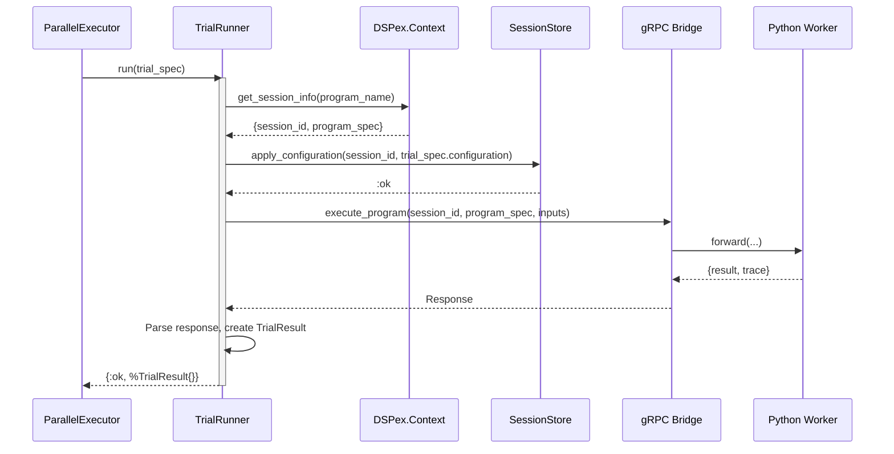

Of course. Here are the detailed technical specifications for the second of the five essential missing component layers: the **Orchestration & Execution Layer**.

This document provides the complete design for the components responsible for managing the parallel, fault-tolerant execution of evaluation and optimization trials. It is the engine that drives the `EvaluationHarness` and `SIMBA-C`, connecting the high-level API to the low-level `snakepit` gRPC bridge.

---

### **`09_SPEC_ORCHESTRATION_AND_EXECUTION_LAYER.md`**

# Technical Specification: Orchestration & Execution Layer

## 1. Vision and Guiding Principles

The Orchestration & Execution Layer is the robust, high-performance engine of `dspex`. It is responsible for taking large volumes of evaluation or optimization "trials" and executing them reliably across a distributed pool of Python workers.

*   **Massive Parallelism:** The layer must be designed from the ground up to leverage the BEAM's concurrency model to execute thousands of trials in parallel, maximizing the utilization of the `snakepit` worker pool.
*   **Extreme Fault Tolerance:** Individual trial failures—due to Python exceptions, worker crashes, network timeouts, or malformed LLM outputs—must be treated as *data points*, not system-level errors. The orchestrator must be able to withstand a high failure rate without crashing, logging each failure meticulously.
*   **Stateful Orchestration:** Each trial is not a simple, stateless function call. It requires ensuring the target Python worker is in the correct state (i.e., has the correct values for all relevant Cognitive Variables) *before* execution.
*   **Abstraction and Decoupling:** The execution logic should be decoupled from the scientific workflow logic. The `EvaluationHarness` should not need to know about `gRPC` or `snakepit`; it should simply submit a batch of trials and receive a batch of results.

## 2. Core Components

This layer consists of two primary components that work together:

1.  **`DSPex.Orchestration.ParallelExecutor`**: A generic, highly concurrent task runner that manages the distribution of work and collection of results.
2.  **`DSPex.Orchestration.TrialRunner`**: A specialized module that encapsulates the logic for executing a single trial, including state setup, gRPC communication, and result parsing.

---

## 3. `DSPex.Orchestration.ParallelExecutor`: The Concurrent Task Runner

This is a stateful `GenServer` that provides a managed, parallel execution service for the `EvaluationHarness` and `SIMBA-C` optimizer.

### 3.1. Purpose

*   To provide a simple API for running a large number of tasks (`trials`) in parallel.
*   To manage concurrency, backpressure, and fault tolerance for large-scale evaluations.
*   To provide real-time progress updates and aggregate results.

### 3.2. State (`defstruct`)

```elixir
defmodule DSPex.Orchestration.ParallelExecutor do
  use GenServer

  defstruct [
    :job_id,              # Unique ID for this execution run
    :task_supervisor,     # The dynamic supervisor for running trial tasks
    :total_tasks,         # The total number of tasks to execute
    :completed_tasks,     # A counter for completed tasks (success or fail)
    :results,             # A list to accumulate results
    :caller,              # The PID of the process that started the job
    :max_concurrency,     # The maximum number of trials to run in parallel
    :timeout_per_trial    # The maximum time allowed for a single trial
  ]
end
```

### 3.3. Public API (`@spec`)

```elixir
@doc """
Starts a new ParallelExecutor for a single job.
"""
@spec start_link(opts :: keyword()) :: GenServer.on_start()
def start_link(opts \\ [])

@doc """
Asynchronously executes a list of trials.

The `runner_fun` is a function that will be called for each item in `tasks`.
This function should encapsulate the logic for a single trial (this will be `TrialRunner.run/1`).

The function returns immediately with `{:ok, job_id}`. The caller will receive
a `{:dspex_job_complete, job_id, results}` message when the entire job is finished.
"""
@spec run_async(pid(), list(any()), function(), keyword()) :: {:ok, String.t()}
def run_async(executor_pid, tasks, runner_fun, opts \\ [])

@doc "Retrieves the current progress of a job."
@spec get_progress(pid()) :: {:ok, map()}
def get_progress(executor_pid)
```

### 3.4. Internal Logic and Workflow

1.  **`run_async/4` is called:**
    *   The `executor_pid` receives the list of `tasks` (e.g., `EvaluationJob` structs) and the `runner_fun`.
    *   It stores the caller's PID, total task count, and other job metadata in its state.
    *   It uses `Task.Supervisor.async_stream_nolink` with the configured `:max_concurrency` to start processing the tasks. Each task in the stream will call `runner_fun.(task)`.
2.  **Task Execution:**
    *   The `runner_fun` (which will be `TrialRunner.run/1`) is executed in a separate, supervised process for each task. This provides isolation.
3.  **Result Handling:**
    *   The `ParallelExecutor` consumes the results from the `async_stream`.
    *   For each result (`{:ok, result}` or `{:exit, reason}`), it increments the `:completed_tasks` counter and appends the result to its `:results` list.
    *   It can optionally send progress update messages to the caller.
4.  **Job Completion:**
    *   When all tasks are completed, the `ParallelExecutor` sends a single `{:dspex_job_complete, job_id, results}` message to the original caller.
    *   It then terminates itself.

---

## 4. `DSPex.Orchestration.TrialRunner`: The Single Trial Executor

This is a stateless module that contains the complex logic for executing a single evaluation or optimization trial. It is the bridge between the abstract concept of a "trial" and the concrete gRPC calls to the Python worker.

### 4.1. Purpose

*   To encapsulate the multi-step process of running one trial.
*   To manage the state synchronization required for each trial.
*   To provide robust error handling and parsing for the results from the Python side.

### 4.2. Public API (`@spec`)

```elixir
@doc """
Runs a single trial and returns a standardized result struct.

This function is designed to be the `runner_fun` for the `ParallelExecutor`.
It is a blocking function that performs the full end-to-end logic for one trial.
"""
@spec run(map()) :: {:ok, DSPex.Evaluation.TrialResult.t()} | {:error, map()}
def run(trial_spec)
```

### 4.3. `TrialSpec` Input Struct

The `run/1` function takes a `TrialSpec` map, which contains all necessary information:
```elixir
%{
  context_pid: pid(),
  program_name: :my_rag_pipeline,
  data_point: %DSPex.Example{},
  configuration: %{ # The specific variable values for this trial
    "temperature" => 0.9,
    "max_demos" => 5
  }
}
```

### 4.4. Internal Logic and Workflow

The `run/1` function executes the following critical steps in sequence:

1.  **Get Context Info:**
    *   It queries the `DSPex.Context` to get the `session_id` and the full `DSPex.Program` specification for the given `program_name`. This is essential to know which Python class to call.

2.  **State Synchronization (The "Write" Step):**
    *   This is the most critical step for ensuring the trial runs in the correct state.
    *   It calls `DSPex.CognitiveConfiguration.apply(config_space, trial_spec.configuration)`.
    *   This function performs a **single, atomic, batch update** via the gRPC bridge, setting all the variables for this trial in the `SessionStore`. This guarantees that the Python worker will have the correct state when it executes.

3.  **Execute Program (The "Run" Step):**
    *   It makes a gRPC call to the `snakepit` bridge's `execute_program` endpoint.
    *   The request payload includes:
        *   `session_id`: To ensure the call is routed to a worker with the correct session context.
        *   `program_spec`: The declarative blueprint of the program to run.
        *   `inputs`: The inputs from the `trial_spec.data_point`.

4.  **Python-Side Execution:**
    *   The `snakepit_bridge` `ProgramExecutor` on the Python side receives this request.
    *   It **does not need to be passed the variable configuration again**. Because of the state synchronization in step 2, it simply reads the latest variable values from its `SessionContext` cache (which is kept up-to-date by the gRPC stream).
    *   It instantiates and executes the program.
    *   It returns the result, trace, and any exceptions.

5.  **Result Parsing and Error Handling (The "Read" Step):**
    *   The `TrialRunner` receives the gRPC response.
    *   **On Success:** It deserializes the Python `Prediction` and `trace` into Elixir structs, creating a `DSPex.Evaluation.TrialResult`.
    *   **On Failure:** It catches any errors (gRPC timeouts, Python exceptions, serialization errors, etc.) and normalizes them into a standardized `TrialError` struct, e.g., `%{type: :python_exception, message: "...", traceback: "..."}`. This ensures that failures are treated as valid, analyzable results.

6.  **Return Value:**
    *   The function returns `{:ok, %TrialResult{}}` or `{:error, %TrialError{}}`, which is then collected by the `ParallelExecutor`.

## 5. Sequence Diagram of a Single Trial



## 6. Conclusion

The Orchestration & Execution Layer is the workhorse of the `dspex` platform. By implementing a robust `ParallelExecutor` and a state-aware `TrialRunner`, we create a system that can reliably execute the massive number of computations required by `SIMBA-C` and the Scientific Evaluation Framework.

This architecture successfully decouples the "what" (the scientific workflow defined in the `ExperimentJournal`) from the "how" (the parallel, fault-tolerant execution managed by this layer). This separation of concerns is critical for building a system that is both powerful and maintainable.
