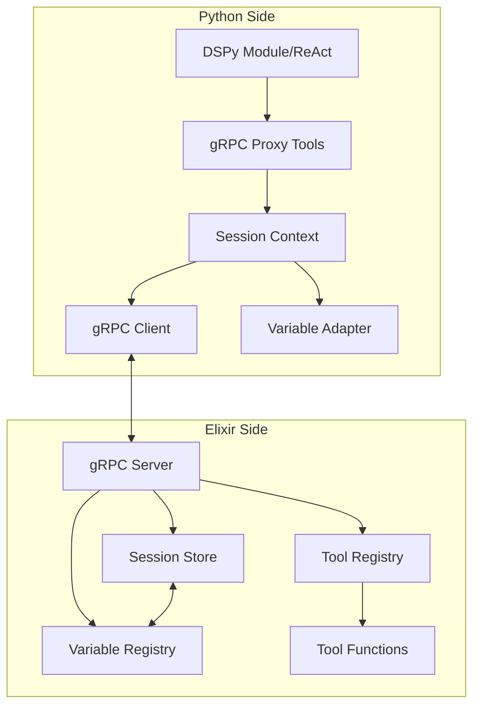

# gRPC-Based Tool Bridge Technical Specification

## Table of Contents

1. [Executive Summary](#executive-summary)
2. [Architecture Overview](#architecture-overview)
3. [Core Components](#core-components)
4. [Communication Protocol](#communication-protocol)
5. [State Management](#state-management)
6. [Variable Integration](#variable-integration)
7. [Implementation Design](#implementation-design)
8. [Security & Resource Management](#security--resource-management)
9. [Performance Considerations](#performance-considerations)
10. [Developer Experience](#developer-experience)

## Executive Summary

This specification defines a gRPC-based tool bridge that enables DSPy modules to seamlessly execute Elixir-implemented tools while maintaining type safety, session isolation, and high performance. The design leverages our existing gRPC infrastructure, provides stateless Python workers, and integrates with the variable bridge for shared state management.

### Key Features

- **Async/Await Pattern**: Non-blocking tool execution with proper concurrency
- **Mid-Stream Tool Calls**: Execute tools during active streaming operations
- **Session State Management**: Centralized state in Elixir with stateless Python workers
- **Variable Bridge Integration**: Shared "innovative variables" between languages
- **Rich Developer Experience**: Type hints, auto-completion, and introspection

## Architecture Overview



### Core Design Principles

1. **gRPC-First**: All communication via gRPC, no legacy protocols
2. **Stateless Workers**: Python processes hold no session state
3. **Async by Default**: Tools are async functions returning awaitables
4. **Unified State**: Single source of truth in Elixir SessionStore
5. **Type Safety**: Full type information flows from Elixir to Python

## Core Components

### 1. AsyncGRPCProxyTool

```python
class AsyncGRPCProxyTool:
    """Async proxy that executes tools via gRPC."""
    
    def __init__(self, tool_spec: ToolSpec, session_context: SessionContext):
        self.tool_id = tool_spec.tool_id
        self.name = tool_spec.name
        self.session_context = session_context
        self._signature = self._build_signature(tool_spec)
        self.__doc__ = tool_spec.description
        
    async def __call__(self, *args, **kwargs) -> Any:
        """Execute tool asynchronously via gRPC."""
        request = ToolCallRequest(
            session_id=self.session_context.session_id,
            tool_id=self.tool_id,
            args=serialize_args(args),
            kwargs=serialize_kwargs(kwargs)
        )
        
        try:
            response = await self.session_context.stub.ExecuteTool(request)
            if response.success:
                return deserialize_result(response.result)
            else:
                raise ToolExecutionError(
                    tool_name=self.name,
                    error_type=response.error.type,
                    message=response.error.message,
                    details=response.error.details
                )
        except grpc.RpcError as e:
            raise ToolCommunicationError(self.name, e.code(), e.details())
```

### 2. StreamingGRPCProxyTool

```python
class StreamingGRPCProxyTool(AsyncGRPCProxyTool):
    """Streaming variant that yields results progressively.
    
    Note: Error propagation in async generators is handled idiomatically
    by raising exceptions. The gRPC servicer implementation must catch
    these and properly close the stream with an error response.
    """
    
    async def __call__(self, *args, **kwargs) -> AsyncIterator[Any]:
        """Execute tool and yield streaming results."""
        request = ToolStreamRequest(
            session_id=self.session_context.session_id,
            tool_id=self.tool_id,
            args=serialize_args(args),
            kwargs=serialize_kwargs(kwargs)
        )
        
        try:
            async for chunk in self.session_context.stub.StreamTool(request):
                if chunk.HasField("data"):
                    yield deserialize_chunk(chunk.data)
                elif chunk.HasField("complete"):
                    return
                elif chunk.HasField("error"):
                    raise ToolExecutionError(
                        tool_name=self.name,
                        error_type=chunk.error.type,
                        message=chunk.error.message
                    )
        except grpc.RpcError as e:
            # Convert gRPC errors to tool errors
            raise ToolCommunicationError(self.name, e.code(), e.details())
        finally:
            # Ensure clean stream termination
            pass
```

### 3. SessionContext

```python
class SessionContext:
    """Manages session state and gRPC communication."""
    
    def __init__(self, session_id: str, channel: grpc.aio.Channel):
        self.session_id = session_id
        self.channel = channel
        self.stub = SnakepitBridgeStub(channel)
        self._tools: Dict[str, AsyncGRPCProxyTool] = {}
        self._variables: Dict[str, Any] = {}
        
    async def initialize_tools(self) -> Dict[str, dspy.Tool]:
        """Fetch tool specifications and create proxy tools."""
        request = GetSessionToolsRequest(session_id=self.session_id)
        response = await self.stub.GetSessionTools(request)
        
        dspy_tools = {}
        for spec in response.tools:
            proxy = self._create_proxy_tool(spec)
            self._tools[spec.name] = proxy
            
            # Wrap in DSPy Tool if available
            if HAS_DSPY:
                dspy_tools[spec.name] = dspy.Tool(
                    func=proxy,
                    name=spec.name,
                    desc=spec.description
                )
            else:
                dspy_tools[spec.name] = proxy
                
        return dspy_tools
    
    async def get_variable(self, name: str) -> Any:
        """Get a session variable value."""
        request = GetVariableRequest(
            session_id=self.session_id,
            variable_name=name
        )
        response = await self.stub.GetSessionVariable(request)
        return deserialize_value(response.value)
    
    async def set_variable(self, name: str, value: Any) -> None:
        """Set a session variable value."""
        request = SetVariableRequest(
            session_id=self.session_id,
            variable_name=name,
            value=serialize_value(value)
        )
        await self.stub.SetSessionVariable(request)
```

### 4. EnhancedGRPCServicer (Python Side)

```python
class ChannelPool:
    """Connection pool for gRPC channels."""
    
    def __init__(self):
        self._channels: Dict[str, List[grpc.aio.Channel]] = {}
        self._lock = asyncio.Lock()
        
    async def get_channel(self, address: str) -> grpc.aio.Channel:
        """Get or create a channel for the given address."""
        async with self._lock:
            if address not in self._channels:
                self._channels[address] = []
            
            # Reuse existing channel if available
            if self._channels[address]:
                return self._channels[address][0]
            
            # Create new channel
            channel = grpc.aio.insecure_channel(address)
            self._channels[address].append(channel)
            return channel

class EnhancedGRPCServicer(SnakepitBridgeServicer):
    """Extended gRPC servicer with tool bridge support.
    
    Note: For V1, we create one channel per session. For production,
    consider using a channel pool to reduce connection overhead when
    multiple sessions connect to the same Elixir node.
    """
    
    def __init__(self, command_handler):
        self.command_handler = command_handler
        self.session_contexts: Dict[str, SessionContext] = {}
        self.channel_pool = ChannelPool()
        
    async def InitializeSession(self, request, context):
        """Initialize a new session with tools."""
        session_id = request.session_id
        
        # Get channel from pool (V2) or create new (V1)
        # For V1: channel = grpc.aio.insecure_channel(request.callback_address)
        channel = await self.channel_pool.get_channel(request.callback_address)
        session_context = SessionContext(session_id, channel)
        
        # Store for later use
        self.session_contexts[session_id] = session_context
        
        # Initialize tools
        tools = await session_context.initialize_tools()
        
        # Store in command handler for DSPy access
        self.command_handler.register_session_tools(session_id, tools)
        
        return InitializeSessionResponse(
            success=True,
            tool_count=len(tools)
        )
    
    async def CreateReActAgent(self, request, context):
        """Create a ReAct agent with session tools."""
        session_id = request.session_id
        tools = self.command_handler.get_session_tools(session_id)
        
        # Create ReAct agent
        agent = dspy.ReAct(
            signature=request.signature,
            tools=list(tools.values()),
            max_iters=request.max_iters
        )
        
        # Store agent
        agent_id = f"react_{session_id}_{uuid.uuid4().hex[:8]}"
        self.command_handler.store_object(agent_id, agent)
        
        return CreateReActAgentResponse(
            agent_id=agent_id,
            tool_count=len(tools)
        )
```

## Communication Protocol

### gRPC Service Definition

```protobuf
syntax = "proto3";

package dspex.bridge;

service SnakepitBridge {
    // Session management
    rpc InitializeSession(InitializeSessionRequest) returns (InitializeSessionResponse);
    rpc CleanupSession(CleanupSessionRequest) returns (StatusResponse);
    
    // Tool operations
    rpc GetSessionTools(GetSessionToolsRequest) returns (GetSessionToolsResponse);
    rpc ExecuteTool(ToolCallRequest) returns (ToolCallResponse);
    rpc StreamTool(ToolStreamRequest) returns (stream ToolStreamChunk);
    rpc BatchExecuteTools(BatchToolCallRequest) returns (BatchToolCallResponse);
    
    // Variable operations
    rpc GetSessionVariable(GetVariableRequest) returns (VariableResponse);
    rpc SetSessionVariable(SetVariableRequest) returns (StatusResponse);
    rpc WatchSessionVariables(WatchVariablesRequest) returns (stream VariableUpdate);
    
    // Agent operations
    rpc CreateReActAgent(CreateReActAgentRequest) returns (CreateReActAgentResponse);
    rpc ExecuteAgent(ExecuteAgentRequest) returns (stream AgentExecutionChunk);
}

// Tool-related messages
message ToolSpec {
    string tool_id = 1;
    string name = 2;
    string description = 3;
    ToolType type = 4;
    repeated ArgumentSpec arguments = 5;
    map<string, string> metadata = 6;
}

message ArgumentSpec {
    string name = 1;
    string type = 2;
    bool required = 3;
    string description = 4;
    google.protobuf.Any default_value = 5;
}

message ToolCallRequest {
    string session_id = 1;
    string tool_id = 2;
    repeated google.protobuf.Any args = 3;
    map<string, google.protobuf.Any> kwargs = 4;
}

message ToolCallResponse {
    bool success = 1;
    google.protobuf.Any result = 2;
    ErrorInfo error = 3;
}

message ToolStreamChunk {
    oneof content {
        google.protobuf.Any data = 1;
        CompleteSignal complete = 2;
        ErrorInfo error = 3;
    }
}
```

## State Management

### Centralized Session Store (Elixir)

```elixir
defmodule DSPex.Bridge.SessionStore do
  @moduledoc """
  Centralized session state management.
  """
  
  use GenServer
  
  defstruct [:sessions, :monitors]
  
  def register_tools(session_id, tools) do
    GenServer.call(__MODULE__, {:register_tools, session_id, tools})
  end
  
  def get_tool(session_id, tool_id) do
    GenServer.call(__MODULE__, {:get_tool, session_id, tool_id})
  end
  
  def set_variable(session_id, name, value) do
    GenServer.call(__MODULE__, {:set_variable, session_id, name, value})
  end
  
  def get_variable(session_id, name) do
    GenServer.call(__MODULE__, {:get_variable, session_id, name})
  end
  
  # Implementation details...
end
```

### Stateless Python Workers

Python workers maintain no session state. All state queries go through gRPC:

```python
# Instead of storing tools locally:
# self.stored_objects[f"_tools_{session_id}"] = tools  # DON'T DO THIS

# Query from Elixir when needed:
async def get_session_tools(self, session_id: str) -> Dict[str, Tool]:
    """Fetch tools from Elixir session store."""
    context = self.session_contexts.get(session_id)
    if not context:
        raise SessionNotFoundError(session_id)
    return await context.get_tools()
```

## Variable Integration

### Shared State Between Languages

The tool bridge integrates seamlessly with the variable bridge:

```python
class VariableAwareProxyTool(AsyncGRPCProxyTool):
    """Tool proxy that can access session variables."""
    
    async def __call__(self, *args, **kwargs):
        # Tools can read variables
        threshold = await self.session_context.get_variable("quality_threshold")
        
        # Modify behavior based on variables
        if threshold > 0.9:
            kwargs["high_quality"] = True
            
        result = await super().__call__(*args, **kwargs)
        
        # Tools can write variables
        await self.session_context.set_variable("last_tool_result", result)
        
        return result
```

### Variable Change Notifications

```python
async def watch_variables(session_context: SessionContext, variables: List[str]):
    """Watch for variable changes and update local cache."""
    request = WatchVariablesRequest(
        session_id=session_context.session_id,
        variable_names=variables
    )
    
    async for update in session_context.stub.WatchSessionVariables(request):
        session_context._variables[update.name] = deserialize_value(update.value)
        # Notify any observers
        await session_context._notify_variable_change(update.name, update.value)
```

## Implementation Design

### Phase 1: Core Infrastructure (Week 1)

1. Extend gRPC service definitions
2. Implement `AsyncGRPCProxyTool`
3. Create `SessionContext` class
4. Integrate with existing `EnhancedGRPCServicer`

### Phase 2: State Management (Week 2)

1. Implement Elixir `SessionStore`
2. Add variable get/set operations
3. Create cleanup mechanisms
4. Add session monitoring

### Phase 3: Advanced Features (Week 3)

1. Implement streaming tools
2. Add batch operations
3. Create variable watchers
4. Implement tool composition

### Phase 4: Testing & Polish (Week 4)

1. Comprehensive test suite
2. Performance benchmarks
3. Documentation
4. Example applications

## Security & Resource Management

### Schema-Based Validation

```python
class ValidatedProxyTool(AsyncGRPCProxyTool):
    """Proxy with client-side validation."""
    
    def __init__(self, tool_spec: ToolSpec, session_context: SessionContext):
        super().__init__(tool_spec, session_context)
        self._validator = self._build_validator(tool_spec)
        
    async def __call__(self, *args, **kwargs):
        # Validate before sending
        validation_result = self._validator.validate(args, kwargs)
        if not validation_result.valid:
            raise ToolValidationError(
                tool_name=self.name,
                errors=validation_result.errors
            )
        return await super().__call__(*args, **kwargs)
```

### Resource Limits

```yaml
# Configuration
grpc:
  max_message_size: 10MB
  max_stream_chunks: 1000
  max_chunk_size: 1MB
  stream_timeout: 300s
  
tools:
  max_concurrent_calls: 100
  default_timeout: 30s
  max_batch_size: 50
```

### Timeout Protection

```python
async def execute_with_timeout(coro, timeout: float):
    """Execute coroutine with timeout."""
    try:
        return await asyncio.wait_for(coro, timeout=timeout)
    except asyncio.TimeoutError:
        raise ToolTimeoutError(f"Tool execution exceeded {timeout}s")
```

## Performance Considerations

### Connection Pooling

```python
class GRPCConnectionPool:
    """Reusable gRPC connections."""
    
    def __init__(self, target: str, size: int = 10):
        self.channels = [
            grpc.aio.insecure_channel(target)
            for _ in range(size)
        ]
        self.current = 0
        
    def get_channel(self) -> grpc.aio.Channel:
        """Get next available channel (round-robin)."""
        channel = self.channels[self.current]
        self.current = (self.current + 1) % len(self.channels)
        return channel
```

### Caching

```python
class CachedProxyTool(AsyncGRPCProxyTool):
    """Tool proxy with result caching."""
    
    def __init__(self, *args, cache_ttl: float = 300, **kwargs):
        super().__init__(*args, **kwargs)
        self._cache = TTLCache(maxsize=100, ttl=cache_ttl)
        
    async def __call__(self, *args, **kwargs):
        cache_key = self._compute_cache_key(args, kwargs)
        
        if cache_key in self._cache:
            return self._cache[cache_key]
            
        result = await super().__call__(*args, **kwargs)
        self._cache[cache_key] = result
        return result
```

### Batch Operations

```python
async def execute_batch(tools: List[AsyncGRPCProxyTool], calls: List[ToolCall]):
    """Execute multiple tools concurrently."""
    tasks = [
        tool(*call.args, **call.kwargs)
        for tool, call in zip(tools, calls)
    ]
    return await asyncio.gather(*tasks, return_exceptions=True)
```

## Developer Experience

### Type Hints and Signatures

```python
def _build_signature(self, tool_spec: ToolSpec) -> inspect.Signature:
    """Build Python signature from tool specification."""
    params = []
    
    for arg in tool_spec.arguments:
        param = inspect.Parameter(
            name=arg.name,
            kind=inspect.Parameter.POSITIONAL_OR_KEYWORD,
            annotation=self._get_python_type(arg.type),
            default=self._deserialize_default(arg.default_value)
            if arg.default_value else inspect.Parameter.empty
        )
        params.append(param)
        
    return inspect.Signature(params)
```

### Rich Error Messages

```python
class ToolExecutionError(Exception):
    """Structured tool execution error."""
    
    def __init__(self, tool_name: str, error_type: str, 
                 message: str, details: Dict[str, Any] = None):
        self.tool_name = tool_name
        self.error_type = error_type
        self.details = details or {}
        
        # Build rich error message
        error_msg = f"Tool '{tool_name}' failed: {message}"
        if "stacktrace" in self.details:
            error_msg += f"\n\nElixir stacktrace:\n{self.details['stacktrace']}"
        if "context" in self.details:
            error_msg += f"\n\nContext: {self.details['context']}"
            
        super().__init__(error_msg)
```

### IDE Integration

```python
class IntrospectableProxyTool(AsyncGRPCProxyTool):
    """Enhanced proxy with full introspection support."""
    
    def __repr__(self):
        return f"<ElixirTool '{self.name}' via gRPC>"
        
    def __dir__(self):
        # Include all tool methods for auto-completion
        return list(super().__dir__()) + ["session_context", "tool_id"]
        
    @property
    def __annotations__(self):
        # Provide type hints for IDE
        return self._extract_annotations()
```

## Summary

This gRPC-based tool bridge provides:

1. **True async/await** support for concurrent tool execution
2. **Stateless workers** with centralized session management
3. **Mid-stream tool calls** during active streaming operations
4. **Variable bridge integration** for shared state management
5. **Rich developer experience** with type hints and introspection
6. **Production-ready** error handling and resource management

The design aligns with our gRPC-first strategy, eliminates technical debt from parallel protocols, and provides a foundation for advanced features like cognitive orchestration.