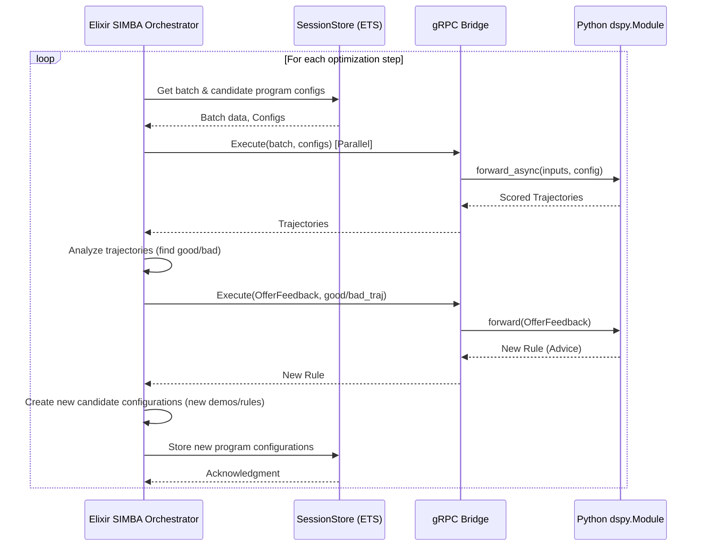

Here is a high-level technical plan for adapting the `SIMBA` teleprompter to the `dspex` environment, leveraging its innovative variables feature.

### **1. Executive Summary**

This plan outlines the reimplementation of `dspy`'s `SIMBA` (Stochastic Introspective Mini-Batch Ascent) optimizer within the Elixir-centric `dspex` framework. The original `SIMBA` is a Python-native, in-memory algorithm that evolves a population of `dspy.Module` programs by introspecting their performance and generating new few-shot examples and natural language rules.

The adaptation will transform `SIMBA` into a distributed, persistent, and language-agnostic optimization process orchestrated by Elixir. This is made possible by `dspex`'s core innovation: a cross-language state management system built on a unified gRPC bridge, referred to as the **"variables" feature**. Instead of directly manipulating Python objects in memory, the new `SIMBA` orchestrator, written in Elixir, will manage the optimizable parameters of a `dspy.Module` (its instructions and few-shot demos) as variables within the `dspex` `SessionStore`. The Python `dspy` module becomes a stateless execution engine that dynamically reconfigures itself based on these variables, which are updated by the Elixir optimization loop.

### **2. Core Architectural Shift: From In-Memory to State-Driven**

The fundamental change is moving the optimization "brain" from Python to Elixir and representing the program's state declaratively.

*   **Original `dspy` `SIMBA`:**
    *   **Orchestration:** A Python loop within a single process.
    *   **State Management:** A list of `dspy.Module` objects held in memory.
    *   **Manipulation:** Directly modifies Python objects (e.g., `predictor.demos.append(...)`, `predictor.signature.instructions += ...`).
    *   **Lifecycle:** The optimization state is ephemeral and lost when the process ends.

*   **Adapted `dspex` `SIMBA`:**
    *   **Orchestration:** An Elixir `GenServer` process (`DSPex.Optimizers.SIMBA`) that manages the optimization loop.
    *   **State Management:** The set of candidate programs is stored as versioned "Configuration Spaces" within the `Snakepit.Bridge.SessionStore`. A program's instructions and demos are treated as distinct, remotely-managed variables.
    *   **Manipulation:** The Elixir orchestrator proposes new values for the `instructions` and `demos` variables. It applies these changes atomically via the `DSPex.CognitiveConfiguration.apply/2` function, which triggers updates through the gRPC bridge.
    *   **Lifecycle:** The optimization state is persistent, fault-tolerant, and can be inspected or resumed at any time.

This new architecture leverages the strengths of each environment: Elixir's BEAM for robust, concurrent orchestration, and Python's `dspy` for high-quality LLM interaction and execution.

### **3. Component Breakdown**

The implementation will be split between Elixir (orchestration) and Python (execution), communicating via the existing gRPC bridge.

#### **3.1. Elixir Components (`dspex` & `snakepit`)**

1.  **`DSPex.Optimizers.SIMBA` Module:**
    *   The primary orchestrator, implemented as a `GenServer`.
    *   It will contain the main `compile/3` function, which executes the optimization loop over multiple steps.
    *   Manages the pool of candidate programs by interacting with the `DSPex.CognitiveConfiguration` layer.

2.  **`DSPex.CognitiveConfiguration` for DSPy Modules:**
    *   A high-level Elixir struct representing the optimizable state of a `dspy.Module`.
    *   It will define two primary variables for each predictor in the student program:
        *   `instructions`: A `:string` type variable.
        *   `demos`: A `:list` of `DSPex.Example` structs.
    *   This configuration will be registered in the `SessionStore` for each candidate program.

3.  **Elixir-based Strategy Implementations:**
    *   The `append_a_demo` and `append_a_rule` strategies from `simba_utils.py` will be re-implemented in Elixir.
    *   **`append_a_demo`:** Takes a successful trajectory (received as a map from Python) and constructs a new `DSPex.Example`. It then proposes a new configuration by appending this example to the `demos` variable.
    *   **`append_a_rule`:** This requires an LLM call. The Elixir orchestrator will use the bridge to execute a `dspy.Predict` module on the Python side using the `OfferFeedback` signature. It will pass the good/bad trajectories as arguments and receive the generated "advice" string back. This string is then appended to the `instructions` variable to form a new candidate configuration.

#### **3.2. Python Components (`snakepit_bridge`)**

1.  **`VariableAwareMixin` for `dspy.Module`:**
    *   The student `dspy.Module` being optimized must be enhanced with this mixin, which is a core part of the `dspex` bridge design.
    *   This mixin connects the module to the `SessionContext`, allowing it to read variables managed by Elixir.

2.  **`sync_variables()` Hook:**
    *   Before each `forward()` call, the `VariableAware` module will call `sync_variables()`.
    *   This method fetches the latest values for `instructions` and `demos` from the `SessionContext` cache (which is kept up-to-date by the gRPC stream).
    *   It then dynamically updates the module's internal state (e.g., `self.predictor.signature.instructions = ...`, `self.predictor.demos = ...`) before execution. The Python module is thus a "dumb" executor, remotely configured by Elixir on each call.

### **4. The Adapted SIMBA Optimization Loop (in Elixir)**

The main loop in `DSPex.Optimizers.SIMBA.compile/3` will proceed as follows for each step:

1.  **Get Batch:** A mini-batch is sampled from the `trainset`.
2.  **Sample Trajectories (The "Read" Phase):**
    *   The orchestrator selects a set of candidate programs (configurations) from the `SessionStore`.
    *   It uses the `dspex` parallel execution utilities to run the Python `dspy.Module` for each example in the batch against each selected program configuration. This involves passing both the example inputs and the configuration (instructions/demos) to the Python side.
    *   The Python module executes and returns a scored trajectory (`prediction`, `trace`, `score`). These results are collected in Elixir.
3.  **Introspection (The "Analyze" Phase):**
    *   The Elixir orchestrator receives the "buckets" of scored trajectories.
    *   It implements the same logic as the original `SIMBA` to sort buckets by score gap (max-min, max-avg) to identify the most informative training instances.
4.  **Propose New Candidates (The "Write" Phase):**
    *   The orchestrator selects a high-performing program configuration as a "source" for evolution.
    *   It randomly chooses a strategy (`append_a_demo` or `append_a_rule`).
    *   It executes the chosen strategy (as described in 3.1) to generate a *new proposed configuration* (a map of `{instructions: "...", demos: [...]}`).
    *   This is repeated to generate `num_candidates` new program configurations.
5.  **Evaluate & Evolve:**
    *   The new candidate configurations are evaluated on the same mini-batch.
    *   The best-performing configurations are registered in the `SessionStore` and added to the pool of programs for the next iteration.

This flow is illustrated below:

### **5. Benefits of the `dspex` Adaptation**

*   **Persistence & Fault Tolerance:** The optimization state is managed by `SessionStore` (backed by ETS), making the process resilient to crashes and resumable.
*   **Scalability:** The most expensive step—trajectory sampling—is highly parallel and can leverage the full power of the BEAM across multiple cores and nodes.
*   **Introspection & Control:** The entire optimization process is visible and controllable from the Elixir side, enabling better monitoring, debugging, and integration with other Elixir-native tools.
*   **Language Agnostic Orchestration:** While the student is a `dspy.Module`, the Elixir orchestrator could theoretically optimize a module written in any language that implements the `dspex` bridge protocol.
*   **Decoupling:** The optimization logic is cleanly separated from the execution logic, adhering to `dspex`'s architectural principles.
