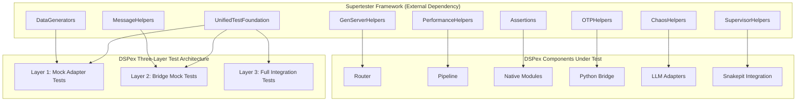

# Design Document

## Overview

This design outlines the comprehensive test infrastructure overhaul for DSPex using the Supertester framework (github.com/nshkrdotcom/supertester), following the established OTP testing standards documented in docs/code-standards/comprehensive-otp-testing-standards.md.

DSPex's current test suite has unique challenges:
- **Three-layer testing architecture** (mock_adapter, bridge_mock, full_integration)
- **Python bridge integration** via Snakepit
- **Multiple LLM adapters** (InstructorLite, HTTP, Mock, Python)
- **Complex routing logic** between native and Python implementations
- **No Supertester integration** leading to potential Process.sleep usage

The solution involves integrating DSPex with Supertester while preserving the three-layer architecture, implementing all tests using Supertester's OTP helpers, and ensuring proper testing of DSPex's unique Python bridge and routing capabilities.

## Architecture

### High-Level Architecture



### Three-Layer Testing Integration with Supertester

#### Layer 1: Mock Adapter Tests (~70ms)
- Uses Supertester.MockHelpers for fast unit testing
- Tests DSPex logic without Python or external dependencies
- Focuses on router decisions, pipeline orchestration, native modules

#### Layer 2: Bridge Mock Tests
- Uses Supertester.MessageHelpers for protocol testing
- Validates serialization/deserialization with Snakepit
- Tests bridge communication patterns without full Python

#### Layer 3: Full Integration Tests
- Uses full Supertester suite for end-to-end testing
- Tests actual Python DSPy module execution
- Validates complete workflows with real LLM adapters

### Test Organization Following Code Standards

```
test/
├── support/
│   ├── dspex_test_helpers.ex      # DSPex-specific helpers using Supertester
│   ├── mock_python_bridge.ex       # Layer 2 bridge mock implementation
│   ├── test_mode_config.ex         # Three-layer test mode configuration
│   └── test_schemas.ex             # Test data schemas
├── unit/
│   ├── router_test.exs             # Using Supertester.GenServerHelpers
│   ├── pipeline_test.exs           # Using Supertester orchestration
│   ├── native/
│   │   ├── signature_test.exs      # Using Supertester.Assertions
│   │   ├── template_test.exs       # Using Supertester patterns
│   │   └── validator_test.exs      # Using Supertester validation
│   └── llm/
│       ├── adapter_test.exs        # Using Supertester adapter patterns
│       ├── client_test.exs         # Using Supertester.OTPHelpers
│       └── adapters/
│           ├── instructor_lite_test.exs
│           ├── http_test.exs
│           └── mock_test.exs
├── integration/
│   ├── python_bridge_test.exs      # Using Supertester.SupervisorHelpers
│   ├── snakepit_integration_test.exs # Using Supertester pool patterns
│   ├── router_integration_test.exs  # Using Supertester routing helpers
│   └── pipeline_integration_test.exs # End-to-end with Supertester
├── performance/
│   ├── router_benchmark_test.exs    # Using Supertester.PerformanceHelpers
│   ├── pipeline_benchmark_test.exs  # Using workload patterns
│   └── python_bridge_benchmark_test.exs # Throughput testing
└── chaos/
    ├── python_failure_test.exs      # Using Supertester.ChaosHelpers
    ├── adapter_chaos_test.exs       # LLM adapter failure scenarios
    └── pipeline_chaos_test.exs      # Complex failure cascades
```

## Components and Interfaces

### 1. Test Support Integration with Supertester

#### DSPex.TestHelpers
**Purpose**: DSPex-specific test utilities built on top of Supertester.

```elixir
defmodule DSPex.TestHelpers do
  @moduledoc """
  DSPex-specific test helpers built on Supertester framework.
  Supports three-layer testing architecture while following OTP standards.
  """
  
  import Supertester.OTPHelpers
  import Supertester.GenServerHelpers
  import Supertester.DataGenerators
  
  @doc """
  Sets up DSPex router with appropriate test mode.
  No Process.sleep, proper OTP synchronization.
  """
  def with_test_router(test_mode, opts \\ [], fun) do
    # Configure based on test layer
    router_config = case test_mode do
      :mock_adapter -> [adapters: [:mock], python_bridge: false]
      :bridge_mock -> [adapters: [:mock, :bridge_mock], python_bridge: :mock]
      :full_integration -> [adapters: :all, python_bridge: true]
    end
    
    router_name = unique_process_name("dspex_router")
    
    {:ok, router} = setup_isolated_genserver(
      DSPex.Router, 
      "router_test",
      Keyword.merge(router_config, opts ++ [name: router_name])
    )
    
    # Wait for router initialization without sleep
    wait_for_genserver_sync(router)
    
    try do
      fun.(router)
    after
      cleanup_on_exit(fn -> GenServer.stop(router) end)
    end
  end
  
  @doc """
  Creates isolated Python bridge for testing.
  Uses Supertester patterns for Snakepit integration.
  """
  def with_python_bridge(mode, fun) do
    case mode do
      :mock ->
        # Layer 1: No Python bridge
        fun.(:no_bridge)
        
      :bridge_mock ->
        # Layer 2: Mock bridge with protocol testing
        bridge_name = unique_process_name("mock_bridge")
        {:ok, bridge} = setup_isolated_genserver(
          DSPex.MockPythonBridge,
          "bridge_test",
          name: bridge_name
        )
        
        try do
          fun.(bridge)
        after
          cleanup_on_exit(fn -> GenServer.stop(bridge) end)
        end
        
      :full ->
        # Layer 3: Real Snakepit integration
        session_id = unique_session_id("dspex_test")
        
        # Use Snakepit with session affinity
        fun.({:snakepit, session_id})
    end
  end
  
  @doc """
  Waits for pipeline completion without timing dependencies.
  """
  def wait_for_pipeline_completion(pipeline, timeout \\ 5000) do
    wait_until(fn ->
      case GenServer.call(pipeline, :get_status) do
        {:completed, _} -> true
        {:running, _} -> false
        {:error, _} -> true  # Stop waiting on error
      end
    end, timeout)
  end
end
```

#### DSPex.MockPythonBridge
**Purpose**: Layer 2 bridge mock for protocol testing.

```elixir
defmodule DSPex.MockPythonBridge do
  @moduledoc """
  Mock Python bridge for Layer 2 protocol testing.
  Implements Snakepit-compatible interface with Supertester patterns.
  """
  
  use GenServer
  import Supertester.OTPHelpers
  import Supertester.MessageHelpers
  
  def start_link(opts) do
    GenServer.start_link(__MODULE__, opts, name: opts[:name])
  end
  
  def init(opts) do
    # Set up message tracing for protocol testing
    trace_table = setup_isolated_trace_table("bridge_mock")
    
    state = %{
      responses: %{},
      message_history: [],
      trace_table: trace_table,
      delay_config: opts[:delays] || %{}
    }
    
    {:ok, state}
  end
  
  def handle_call({:execute, module, method, args}, from, state) do
    # Record for protocol verification
    message = {module, method, args, System.monotonic_time()}
    state = update_in(state.message_history, &[message | &1])
    
    # Simulate processing without Process.sleep
    if delay = state.delay_config[module] do
      # Use OTP timer for delays
      Process.send_after(self(), {:delayed_response, from, module, method}, delay)
      {:noreply, state}
    else
      response = get_mock_response(state, module, method, args)
      {:reply, response, state}
    end
  end
  
  # Protocol testing helpers
  def set_response(bridge, module, method, response) do
    GenServer.call(bridge, {:set_response, module, method, response})
  end
  
  def get_message_history(bridge) do
    GenServer.call(bridge, :get_message_history)
  end
end
```

### 2. Unit Test Specifications Using Supertester

#### Router Tests
```elixir
defmodule DSPex.RouterTest do
  use ExUnit.Case, async: true
  
  import Supertester.OTPHelpers
  import Supertester.GenServerHelpers
  import Supertester.Assertions
  import DSPex.TestHelpers
  
  describe "router initialization" do
    test "starts with configured adapters" do
      with_test_router(:mock_adapter, [adapters: [:mock, :http]], fn router ->
        assert_genserver_state(router, fn state ->
          MapSet.equal?(
            MapSet.new(state.available_adapters),
            MapSet.new([:mock, :http])
          )
        end)
      end)
    end
    
    test "tracks adapter capabilities" do
      with_test_router(:full_integration, [], fn router ->
        # Register capabilities without sleep
        :ok = cast_and_sync(router, {:register_capability, :python, :chain_of_thought})
        :ok = cast_and_sync(router, {:register_capability, :native, :signature})
        
        # Verify routing decisions
        assert {:native, _} = call_with_timeout(router, {:route, :signature, %{}})
        assert {:python, _} = call_with_timeout(router, {:route, :chain_of_thought, %{}})
      end)
    end
  end
  
  describe "smart routing with OTP patterns" do
    setup do
      {:ok, router} = setup_isolated_genserver(DSPex.Router, "routing_test")
      %{router: router}
    end
    
    test "routes based on performance metrics", %{router: router} do
      # Simulate performance data collection
      operations = for i <- 1..10 do
        {:cast, {:record_metric, :native, :template, i * 10}}
      end
      
      {:ok, _} = stress_test_server(router, operations, 1000)
      
      # Verify routing preference
      assert_genserver_state(router, fn state ->
        state.metrics[:native][:template][:avg_latency] < 100
      end)
    end
    
    test "handles concurrent routing requests", %{router: router} do
      # Use Supertester's concurrent testing
      requests = for i <- 1..20 do
        {:call, {:route, :signature, %{id: i}}}
      end
      
      {:ok, results} = concurrent_calls(router, requests, 20)
      
      # All should route successfully
      assert Enum.all?(results, &match?({:ok, {_, _}}, &1))
    end
  end
end
```

#### Pipeline Tests
```elixir
defmodule DSPex.PipelineTest do
  use ExUnit.Case, async: true
  
  import Supertester.OTPHelpers
  import Supertester.GenServerHelpers
  import Supertester.Assertions
  import DSPex.TestHelpers
  
  describe "pipeline execution" do
    test "executes sequential steps" do
      steps = [
        {:native, DSPex.Native.Signature, spec: "input -> output"},
        {:native, DSPex.Native.Template, template: "Result: <%= @output %>"}
      ]
      
      pipeline_name = unique_process_name("pipeline")
      {:ok, pipeline} = setup_isolated_genserver(
        DSPex.Pipeline,
        "sequential_test",
        name: pipeline_name,
        steps: steps
      )
      
      # Execute without timing dependencies
      :ok = cast_and_sync(pipeline, {:execute, %{input: "test"}})
      
      # Wait for completion properly
      wait_for_pipeline_completion(pipeline)
      
      # Verify result
      assert {:ok, result} = call_with_timeout(pipeline, :get_result)
      assert result =~ "Result: "
    end
    
    test "handles parallel execution" do
      steps = [
        {:parallel, [
          {:native, DSPex.Native.Signature, spec: "q -> a"},
          {:mock, "dspy.ChainOfThought", signature: "q -> analysis"}
        ]}
      ]
      
      with_test_router(:bridge_mock, [], fn router ->
        pipeline_name = unique_process_name("parallel_pipeline")
        {:ok, pipeline} = setup_isolated_genserver(
          DSPex.Pipeline,
          "parallel_test",
          name: pipeline_name,
          steps: steps,
          router: router
        )
        
        # Test parallel execution
        task = Task.async(fn ->
          GenServer.call(pipeline, {:execute, %{q: "test query"}})
        end)
        
        # Verify both branches execute
        wait_for_genserver_sync(pipeline)
        
        assert_genserver_state(pipeline, fn state ->
          length(state.active_tasks) == 2
        end)
        
        # Get result
        {:ok, result} = Task.await(task)
        assert Map.has_key?(result, :native_result)
        assert Map.has_key?(result, :python_result)
      end)
    end
  end
end
```

### 3. Integration Tests Using Supertester

```elixir
defmodule DSPex.PythonBridgeIntegrationTest do
  use ExUnit.Case, async: true
  
  import Supertester.SupervisorHelpers
  import Supertester.OTPHelpers
  import Supertester.Assertions
  import DSPex.TestHelpers
  
  @moduletag :integration
  
  describe "Snakepit integration" do
    test "executes Python DSPy modules" do
      with_python_bridge(:full, fn {:snakepit, session_id} ->
        # Execute DSPy module via Snakepit
        result = Snakepit.execute_in_session(
          session_id,
          "dspy_execute",
          %{
            module: "dspy.ChainOfThought",
            signature: "question -> answer",
            inputs: %{question: "What is DSPy?"}
          }
        )
        
        assert {:ok, %{answer: answer}} = result
        assert is_binary(answer)
      end)
    end
    
    test "handles Python process failures gracefully" do
      with_python_bridge(:full, fn {:snakepit, session_id} ->
        # Inject failure
        {:ok, _} = Snakepit.execute_in_session(
          session_id,
          "inject_failure",
          %{type: :process_crash, delay: 100}
        )
        
        # Attempt operation
        result = Snakepit.execute_in_session(
          session_id,
          "dspy_execute",
          %{module: "dspy.Predict", signature: "q -> a", inputs: %{q: "test"}}
        )
        
        # Should handle gracefully
        assert {:error, _} = result
        
        # Verify session recovery
        wait_for_process_restart(:snakepit_worker, session_id)
        
        # Should work after recovery
        result2 = Snakepit.execute_in_session(
          session_id,
          "dspy_execute",
          %{module: "dspy.Predict", signature: "q -> a", inputs: %{q: "test"}}
        )
        
        assert {:ok, _} = result2
      end)
    end
  end
end
```

### 4. Performance Tests Using Supertester

```elixir
defmodule DSPex.RouterBenchmarkTest do
  use ExUnit.Case, async: false
  
  import Supertester.PerformanceHelpers
  import DSPex.TestHelpers
  
  @moduletag :benchmark
  
  describe "routing performance" do
    test "measures routing overhead" do
      with_test_router(:mock_adapter, [], fn router ->
        # Benchmark routing decisions
        result = benchmark_operations([
          {"simple route", fn ->
            GenServer.call(router, {:route, :signature, %{}})
          end},
          {"complex route", fn ->
            GenServer.call(router, {:route, :chain_of_thought, %{
              constraints: [:native_preferred, :low_latency]
            }})
          end}
        ], 1000)
        
        # Routing should be fast
        assert_performance_within_bounds(result, %{
          max_time: 100,  # microseconds
          max_memory: 1000  # bytes
        })
      end)
    end
    
    test "routing under load" do
      with_test_router(:full_integration, [], fn router ->
        # Test different load patterns
        for pattern <- [:steady, :burst, :ramp_up] do
          result = workload_pattern_test(
            fn -> GenServer.call(router, {:route, :predict, %{input: "test"}}) end,
            pattern,
            duration: 5000
          )
          
          # Should maintain performance
          assert result.p95_latency < 10_000  # 10ms
          assert result.error_rate < 0.01     # <1% errors
        end
      end)
    end
  end
end
```

### 5. Chaos Tests Using Supertester

```elixir
defmodule DSPex.AdapterChaosTest do
  use ExUnit.Case, async: true
  
  import Supertester.ChaosHelpers
  import Supertester.Assertions
  import DSPex.TestHelpers
  
  @moduletag :chaos
  
  describe "adapter failure resilience" do
    test "handles LLM adapter failures" do
      with_test_router(:full_integration, [], fn router ->
        # Configure multiple adapters
        adapters = [:instructor_lite, :http, :python]
        
        # Get initial state
        {:ok, initial_state} = GenServer.call(router, :get_state)
        
        # Inject adapter failures
        chaos_scenario = [
          {:adapter_timeout, :instructor_lite, 5000},
          {:adapter_error, :http, :rate_limit},
          {:adapter_crash, :python, 1000}
        ]
        
        {:ok, chaos_result} = chaos_test_orchestrator(
          chaos_scenario,
          :parallel,
          target: router
        )
        
        # Router should adapt
        assert_genserver_responsive(router)
        
        # Should fallback to working adapters
        {:ok, {adapter, _}} = GenServer.call(router, {:route, :predict, %{}})
        assert adapter in [:mock, :http]  # Fallback adapters
        
        # Verify recovery
        {:ok, recovered} = verify_system_recovery(initial_state, timeout: 10_000)
        assert recovered
      end)
    end
    
    test "pipeline resilience to cascading failures" do
      steps = [
        {:native, DSPex.Native.Signature, spec: "input -> parsed"},
        {:python, "dspy.ChainOfThought", signature: "parsed -> analysis"},
        {:native, DSPex.Native.Template, template: "<%= @analysis %>"}
      ]
      
      with_test_router(:full_integration, [], fn router ->
        pipeline_name = unique_process_name("chaos_pipeline")
        {:ok, pipeline} = setup_isolated_genserver(
          DSPex.Pipeline,
          "chaos_test",
          name: pipeline_name,
          steps: steps,
          router: router
        )
        
        # Inject multiple failures
        inject_process_failure([router, pipeline], :random_crash, delay: 100)
        simulate_network_corruption(2000, :packet_loss)
        
        # Attempt execution
        result = GenServer.call(pipeline, {:execute, %{input: "test"}}, 10_000)
        
        # Should degrade gracefully
        case result do
          {:ok, partial_result} ->
            # May have partial results
            assert Map.has_key?(partial_result, :parsed)
            
          {:error, reason} ->
            # Should provide clear error
            assert is_binary(reason) or is_atom(reason)
        end
        
        # System should recover
        assert_resilience_to_chaos(router, chaos_scenario)
      end)
    end
  end
end
```

## Test Execution Strategy

### Three-Layer Testing with Supertester

```elixir
# config/test.exs
config :dspex,
  test_mode: System.get_env("TEST_MODE", "mock_adapter")

# Supertester automatically handles test isolation
config :ex_unit,
  capture_log: true

# Layer-specific configuration
case System.get_env("TEST_MODE") do
  "mock_adapter" ->
    config :dspex, adapters: [:mock]
    config :snakepit, enabled: false
    
  "bridge_mock" ->
    config :dspex, adapters: [:mock, :bridge_mock]
    config :snakepit, enabled: false
    
  "full_integration" ->
    config :dspex, adapters: :all
    config :snakepit, enabled: true
end
```

### CI/CD Integration

```yaml
# .github/workflows/test.yml
test:
  strategy:
    matrix:
      test_layer: [fast, protocol, integration]
  
  steps:
    - name: Run DSPex tests with Supertester
      run: |
        mix deps.get
        mix test.${{ matrix.test_layer }}
        
    - name: Check test quality
      run: |
        mix test.pattern_check   # No Process.sleep
        mix test.isolation_check # Proper Supertester usage
```

### Quality Gates

- All tests must use `async: true` with Supertester isolation
- Zero Process.sleep usage (enforced by pattern check)
- All three layers must pass independently
- Performance benchmarks must not regress >10%
- Chaos tests must demonstrate recovery

## Success Metrics

### Quantitative Metrics
- **Test coverage** >95% across all DSPex modules
- **Layer 1 execution** <100ms total
- **Layer 2 execution** <500ms total
- **Layer 3 execution** <5s total
- **Zero Process.sleep** verified by tooling
- **All tests use Supertester** helpers

### Qualitative Metrics
- **Three-layer architecture** preserved and enhanced
- **Clear layer boundaries** with appropriate testing
- **Consistent with code standards** in comprehensive-otp-testing-standards.md
- **Python bridge testing** properly handles async operations
- **Router testing** validates smart decisions
- **Educational value** for DSPex architecture