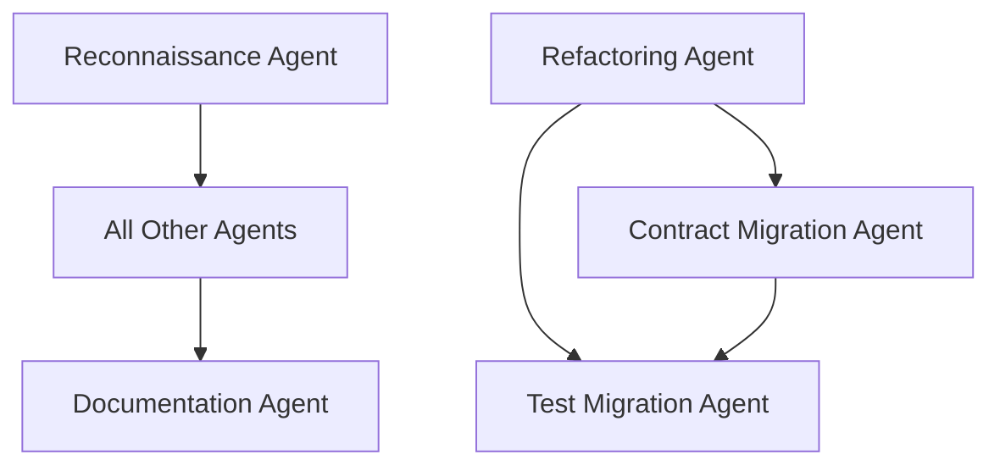

# Stage 0: Multi-Agent Implementation Plan

## Executive Summary

This document outlines a multi-agent framework approach to complete Stage 0 (Architectural Reconciliation) efficiently. The plan uses specialized agents working in parallel to reconcile the codebase with our final architectural vision.

**Current State**: 25-30% complete with significant architectural misalignment
**Target**: 100% alignment with final architecture before starting vertical slices
**Estimated Time**: 4-6 hours with parallel agent execution

## Agent Architecture

### 1. Reconnaissance Agent (RA)
**Purpose**: Continuous analysis and validation
**Skills**: Code analysis, architecture validation, progress tracking
**Runtime**: Continuous throughout Stage 0

### 2. Refactoring Agent (RFA)
**Purpose**: Module renaming and restructuring
**Skills**: Safe refactoring, dependency analysis, module migration
**Runtime**: Tasks 1-3 of Phase 0

### 3. Contract Migration Agent (CMA)
**Purpose**: Schema to contract conversion
**Skills**: Contract generation, type system expertise, validation
**Runtime**: Task 2-3 of Phase 0

### 4. Test Migration Agent (TMA)
**Purpose**: Update tests for new architecture
**Skills**: Test refactoring, coverage analysis, fixture updates
**Runtime**: Parallel with other agents

### 5. Documentation Agent (DA)
**Purpose**: Keep docs in sync with changes
**Skills**: Documentation updates, example migration, README maintenance
**Runtime**: Follows other agents' work

## Implementation Phases

### Phase 0.1: Cognitive → Observable Renaming (1 hour)

**Lead Agent**: RFA
**Supporting Agents**: RA (validation), TMA (test updates)

```yaml
tasks:
  - rename_directories:
      from: lib/snakepit_grpc_bridge/cognitive
      to: lib/snakepit_grpc_bridge/observable
      
  - update_module_names:
      pattern: "Cognitive.*"
      replacement: "Observable.*"
      files: "**/*.ex"
      
  - update_references:
      old_aliases: ["Cognitive", "cognitive"]
      new_aliases: ["Observable", "observable"]
      
  - validate_no_cognitive_remains:
      agent: RA
      grep_patterns: ["Cognitive", "cognitive"]
      expected: 0 matches
```

**Detailed Tasks**:

1. **Directory Structure Update**
   ```bash
   mv lib/snakepit_grpc_bridge/cognitive lib/snakepit_grpc_bridge/observable
   mv lib/snakepit_grpc_bridge/cognitive_test.exs lib/snakepit_grpc_bridge/observable_test.exs
   ```

2. **Module Name Updates**
   - `Cognitive.Scheduler` → `Observable.PerformanceRouter`
   - `Cognitive.Evolution` → `Observable.UsageAnalytics`
   - `Cognitive.Worker` → `Observable.Worker`

3. **Update All References**
   - Aliases in other modules
   - Test file references
   - Configuration references

### Phase 0.2: Remove Schema Discovery (1 hour)

**Lead Agent**: CMA
**Supporting Agents**: RFA (cleanup), DA (document changes)

```yaml
tasks:
  - archive_schema_code:
      from: lib/snakepit_grpc_bridge/schema/
      to: _archived/schema_discovery/
      reason: "Replaced by explicit contracts"
      
  - remove_compile_time_introspection:
      files: ["**/*schema*.ex"]
      patterns: ["discover_schema", "SchemaIntrospector"]
      
  - update_to_contracts:
      old_pattern: "use DSPex.Bridge.SchemaAware"
      new_pattern: "use DSPex.Bridge.ContractBased"
      
  - create_missing_contracts:
      agent: CMA
      for_modules: ["Predict", "ChainOfThought", "ReAct"]
      template: "contract_template.ex.eex"
```

**Contract Template Example**:
```elixir
defmodule DSPex.Contracts.<%= module_name %> do
  use DSPex.Contract
  
  @moduledoc """
  Contract for <%= python_class %>
  Generated: <%= Date.utc_today() %>
  Status: TODO - Review and customize
  """
  
  @python_class "<%= python_class %>"
  @contract_version "0.1.0"
  
  # TODO: Define methods based on actual usage
  defmethod :create, :__init__,
    params: [], # TODO: Add actual params
    returns: :reference
end
```

### Phase 0.3: Refactor Bridge Modules (2 hours)

**Lead Agent**: RFA
**Supporting Agents**: CMA (type definitions), TMA (test coverage)

```yaml
tasks:
  - split_session_store:
      from: lib/snakepit_grpc_bridge/bridge/session_store.ex
      to:
        - lib/snakepit_grpc_bridge/session/manager.ex
        - lib/snakepit_grpc_bridge/session/variable_store.ex
        - lib/snakepit_grpc_bridge/session/persistence.ex
        
  - extract_tool_registry:
      from: lib/snakepit_grpc_bridge/bridge/tool_registry.ex
      to:
        - lib/snakepit_grpc_bridge/tools/registry.ex
        - lib/snakepit_grpc_bridge/tools/executor.ex
        
  - implement_telemetry:
      add_to_all: ["session/*", "tools/*", "observable/*"]
      pattern: "telemetry_template.ex"
```

**Module Splitting Strategy**:

1. **SessionStore → Three Focused Modules**
   ```elixir
   # From monolithic:
   defmodule SnakepitGrpcBridge.Bridge.SessionStore do
     # 500+ lines doing everything
   end
   
   # To focused:
   defmodule SnakepitGrpcBridge.Session.Manager do
     # Session lifecycle only
   end
   
   defmodule SnakepitGrpcBridge.Session.VariableStore do
     # Variable storage only
   end
   
   defmodule SnakepitGrpcBridge.Session.Persistence do
     # Persistence strategy only
   end
   ```

### Phase 0.4: Integration Validation (1 hour)

**Lead Agent**: RA
**Supporting Agents**: All agents for fixes

```yaml
validation_tasks:
  - architecture_compliance:
      check_against: "01_REFACTORED_ARCHITECTURE_OVERVIEW.md"
      validate:
        - no_cognitive_references
        - contracts_not_schemas
        - proper_module_boundaries
        
  - test_coverage:
      minimum: 80%
      focus_areas: ["contracts", "session", "tools"]
      
  - documentation_sync:
      verify_updated:
        - README.md
        - Module @moduledocs
        - Example code
        
  - integration_tests:
      run: "mix test --only integration"
      expected: "all green"
```

## Agent Coordination Protocol

### Communication Channels

```elixir
defmodule Stage0.AgentCoordinator do
  use GenServer
  
  # Agents report progress
  def report_progress(agent_id, task, status) do
    GenServer.cast(__MODULE__, {:progress, agent_id, task, status})
  end
  
  # Agents request validation
  def validate_change(agent_id, change_type, details) do
    GenServer.call(__MODULE__, {:validate, agent_id, change_type, details})
  end
  
  # Coordinate parallel work
  def handle_cast({:progress, agent_id, task, :completed}, state) do
    broadcast_to_dependent_agents(task, :can_proceed)
    {:noreply, update_progress(state, agent_id, task)}
  end
end
```

### Dependency Management



## Success Criteria

### Per-Task Validation

1. **Cognitive → Observable**
   - [ ] Zero references to "Cognitive" remain
   - [ ] All tests pass with new names
   - [ ] Module aliases updated

2. **Schema Removal**
   - [ ] No compile-time Python introspection
   - [ ] All modules use explicit contracts
   - [ ] Mix task for contract generation works

3. **Module Refactoring**
   - [ ] Average module size < 200 lines
   - [ ] Clear separation of concerns
   - [ ] Comprehensive telemetry

4. **Overall Integration**
   - [ ] Full test suite passes
   - [ ] Documentation accurate
   - [ ] Ready for vertical slices

## Implementation Schedule

### Parallel Execution Timeline

```
Hour 1: ├─── RFA: Cognitive → Observable ───┤
        └─── RA: Continuous Validation ────────────────────────┘

Hour 2: ├─── CMA: Remove Schemas ───┤
        ├─── TMA: Update Tests ──────────────┤
        └─── RA: Validation ─────────────────────────────────┘

Hour 3-4: ├─── RFA: Refactor Modules ─────────┤
          ├─── CMA: Create Contracts ───┤
          ├─── TMA: Test Coverage ─────────────┤
          └─── RA: Validation ───────────────────────────────┘

Hour 5: ├─── DA: Documentation Updates ───┤
        ├─── RA: Final Validation ────────┤
        └─── ALL: Integration Testing ────┘
```

## Agent Implementation Details

### Reconnaissance Agent (RA)

```elixir
defmodule Stage0.Agents.Reconnaissance do
  @moduledoc """
  Continuously validates architecture compliance.
  """
  
  def validate_no_cognitive() do
    case System.cmd("grep", ["-r", "Cognitive", "lib/", "--include=*.ex"]) do
      {"", 0} -> :ok
      {output, _} -> {:error, "Found Cognitive references", output}
    end
  end
  
  def validate_contracts() do
    # Ensure all DSPy wrappers use contracts
    modules = find_dspy_modules()
    Enum.all?(modules, &uses_contract?/1)
  end
  
  def generate_progress_report() do
    %{
      cognitive_removed: validate_no_cognitive() == :ok,
      contracts_adopted: validate_contracts(),
      tests_passing: mix_test_status(),
      documentation_synced: docs_up_to_date?()
    }
  end
end
```

### Refactoring Agent (RFA)

```elixir
defmodule Stage0.Agents.Refactoring do
  @moduledoc """
  Handles safe module refactoring and renaming.
  """
  
  def rename_module(old_name, new_name) do
    with :ok <- validate_no_conflicts(new_name),
         :ok <- update_module_definition(old_name, new_name),
         :ok <- update_all_references(old_name, new_name),
         :ok <- rename_test_file(old_name, new_name) do
      {:ok, "Successfully renamed #{old_name} to #{new_name}"}
    end
  end
  
  def split_module(source_module, target_modules) do
    # Analyze dependencies
    # Extract functions to appropriate modules
    # Update references
    # Ensure tests still pass
  end
end
```

### Contract Migration Agent (CMA)

```elixir
defmodule Stage0.Agents.ContractMigration do
  @moduledoc """
  Converts schema-based code to contract-based.
  """
  
  def generate_contract_from_usage(module_name) do
    # Analyze current usage patterns
    usages = analyze_module_usage(module_name)
    
    # Generate contract template
    contract = build_contract_template(module_name, usages)
    
    # Write to file
    write_contract_file(contract)
  end
  
  def migrate_to_contract_based(module_path) do
    # Replace SchemaAware with ContractBased
    # Update method calls to use contract methods
    # Add proper error handling
  end
end
```

## Risk Mitigation

### Automated Rollback

```elixir
defmodule Stage0.Rollback do
  def checkpoint(name) do
    # Git commit current state
    System.cmd("git", ["add", "-A"])
    System.cmd("git", ["commit", "-m", "Stage 0 checkpoint: #{name}"])
  end
  
  def rollback_to(checkpoint_name) do
    # Find commit with checkpoint name
    # Git reset --hard to that commit
  end
end
```

### Continuous Validation

- Run tests after each change
- Validate no compilation errors
- Check architectural compliance
- Monitor performance metrics

## Deliverables

### Stage 0 Completion Checklist

- [ ] All "Cognitive" references replaced with "Observable"
- [ ] Schema discovery completely removed
- [ ] All modules using explicit contracts
- [ ] Bridge modules properly refactored
- [ ] Test coverage > 80%
- [ ] Documentation fully updated
- [ ] Integration tests passing
- [ ] Performance benchmarks recorded
- [ ] Ready for Vertical Slice 1

### Handoff Package

1. **Updated Architecture Diagram** showing current state
2. **Contract Inventory** listing all created contracts
3. **Test Coverage Report** with focus areas highlighted
4. **Performance Baseline** for comparison
5. **Known Issues Log** (if any remain)
6. **Next Steps Guide** pointing to Slice 1 implementation

## Summary

This multi-agent approach enables parallel execution of Stage 0 tasks, reducing the 4-6 hour estimate to potentially 3-4 hours with proper coordination. Each agent has a focused responsibility, clear success criteria, and defined communication protocols.

The key to success is maintaining architectural discipline while making these changes. The Reconnaissance Agent serves as the guardian of our architectural vision, ensuring every change aligns with our final, superior design.

Once Stage 0 is complete, we'll have a codebase that perfectly reflects our architectural documents, setting the stage for smooth vertical slice implementation.