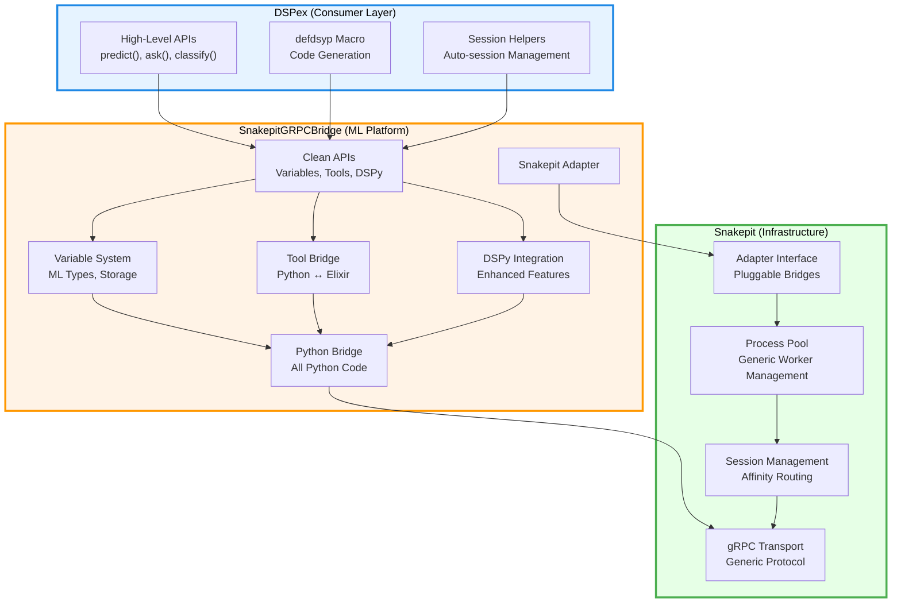

# Three-Layer Architecture Consolidation

## Executive Summary

This document consolidates the **Light Snakepit + Heavy Bridge** architecture, presenting the overall design and implementation status of the three-layer system. The architecture provides clean separation of concerns across infrastructure, platform, and consumer layers, enabling independent evolution and preventing architectural degradation.

## Current State Analysis

Based on examination of the codebase, the three-layer architecture is **partially implemented** with significant deviations from the original design specification:

### Layer 1: Snakepit (Infrastructure)
- **Location**: `./snakepit/`
- **Status**: Contains domain-specific code that should be in the platform layer
- **Key Issues**:
  - Python code exists in `priv/python/` (should be in platform layer)
  - Contains DSPy integration and ML-specific adapters
  - Not purely infrastructure-focused

### Layer 2: SnakepitGRPCBridge (ML Platform)  
- **Location**: `./snakepit_grpc_bridge/`
- **Status**: Exists but missing many specified components
- **Key Issues**:
  - No dedicated API modules (`api/` directory)
  - Missing comprehensive variable system
  - Missing tool system implementation
  - Limited DSPy integration

### Layer 3: DSPex (Consumer)
- **Location**: `./lib/` and root directory
- **Status**: Contains implementation that should be in platform layer
- **Key Issues**:
  - Has Python code in `priv/python/`
  - Contains extensive implementation beyond orchestration
  - Not a thin consumer layer

## Target Architecture

### Architectural Principles

1. **Clear Separation of Concerns**
   - Snakepit: Pure infrastructure (process pooling, gRPC transport)
   - SnakepitGRPCBridge: Complete ML platform (variables, tools, DSPy, Python)
   - DSPex: Thin orchestration layer (macros, convenience APIs)

2. **Single Responsibility**
   - Each layer has ONE clear responsibility
   - No domain logic in infrastructure
   - No implementation in consumer layer

3. **Independent Evolution**
   - Infrastructure changes rarely
   - ML platform evolves rapidly
   - Consumer API adapts to user needs

## Consolidated File Layout

```
# Layer 1: Snakepit (Pure Infrastructure)
snakepit/
├── lib/
│   ├── snakepit.ex                    # Public API
│   └── snakepit/
│       ├── adapter.ex                 # Adapter behavior
│       ├── application.ex             # OTP application
│       ├── pool/
│       │   ├── pool.ex               # Generic process pooling
│       │   ├── registry.ex           # Worker registry
│       │   ├── supervisor.ex         # Pool supervision
│       │   └── worker_supervisor.ex  # Worker supervision
│       ├── session/
│       │   ├── manager.ex            # Session lifecycle
│       │   └── affinity.ex           # Session affinity
│       └── telemetry.ex              # Infrastructure telemetry
├── priv/
│   └── proto/
│       └── snakepit.proto            # Basic gRPC protocol
└── NO PYTHON CODE                    # Pure Elixir infrastructure

# Layer 2: SnakepitGRPCBridge (Complete ML Platform)
snakepit_grpc_bridge/
├── lib/
│   ├── snakepit_grpc_bridge.ex       # Main module
│   └── snakepit_grpc_bridge/
│       ├── adapter.ex                # Snakepit adapter implementation
│       ├── application.ex            # OTP application
│       ├── api/                      # Clean APIs for consumers
│       │   ├── variables.ex          # Variable management API
│       │   ├── tools.ex              # Tool bridge API
│       │   ├── dspy.ex               # DSPy integration API
│       │   └── sessions.ex           # Session management API
│       ├── variables/                # Complete variable system
│       │   ├── manager.ex            # Variable lifecycle
│       │   ├── types.ex              # ML data types
│       │   ├── storage.ex            # Variable storage
│       │   └── ml_types/             # Specialized types
│       │       ├── tensor.ex         # Tensor variables
│       │       ├── embedding.ex      # Embedding variables
│       │       └── model.ex          # Model variables
│       ├── tools/                    # Complete tool bridge
│       │   ├── registry.ex           # Tool registration
│       │   ├── executor.ex           # Tool execution
│       │   ├── bridge.ex             # Python ↔ Elixir bridge
│       │   └── serialization.ex      # Argument serialization
│       ├── dspy/                     # Complete DSPy integration
│       │   ├── integration.ex        # Core DSPy bridge
│       │   ├── workflows.ex          # DSPy workflows
│       │   ├── enhanced.ex           # Enhanced features
│       │   └── schema.ex             # Schema discovery
│       ├── grpc/                     # gRPC infrastructure
│       │   ├── client.ex             # gRPC client
│       │   └── server.ex             # gRPC server
│       ├── python/                   # Python bridge management
│       │   └── process.ex            # Python process management
│       └── telemetry.ex              # Platform telemetry
├── priv/
│   ├── proto/
│   │   └── ml_bridge.proto           # ML-specific gRPC protocol
│   └── python/                       # ALL Python code
│       └── snakepit_bridge/
│           ├── core/                 # Core bridge functionality
│           ├── variables/            # Python variable management
│           ├── tools/                # Python tool execution
│           └── dspy/                 # Python DSPy integration
└── mix.exs                           # Depends on snakepit

# Layer 3: DSPex (Ultra-Thin Consumer)
dspex/
├── lib/
│   ├── dspex.ex                      # Main convenience API
│   └── dspex/
│       ├── bridge.ex                 # defdsyp macro only
│       ├── api.ex                    # High-level convenience
│       ├── sessions.ex               # Session helpers
│       └── config.ex                 # Configuration helpers
├── priv/                             # NO Python code
├── mix.exs                           # Depends on snakepit_grpc_bridge
└── NO IMPLEMENTATION                 # Pure orchestration
```

## Architecture Diagram



## Migration Requirements

### Phase 1: Purify Snakepit
1. **Remove all Python code** from `snakepit/priv/python/`
2. **Remove ML-specific adapters** from snakepit
3. **Create generic adapter behavior** that any bridge can implement
4. **Keep only infrastructure concerns**: pooling, session management, transport

### Phase 2: Build Complete ML Platform
1. **Move all Python code** to `snakepit_grpc_bridge/priv/python/`
2. **Create clean API modules** in `snakepit_grpc_bridge/lib/snakepit_grpc_bridge/api/`
3. **Implement complete variable system** with ML types
4. **Implement complete tool bridge** for bidirectional communication
5. **Consolidate DSPy integration** from both layers

### Phase 3: Simplify DSPex
1. **Remove all Python code** from `dspex/priv/python/`
2. **Remove implementation code** - keep only orchestration
3. **Update to use platform APIs** exclusively
4. **Focus on developer experience** with convenience functions

## Key Design Decisions

### 1. Adapter Pattern
```elixir
# Snakepit defines behavior
defmodule Snakepit.Adapter do
  @callback execute(String.t(), map(), keyword()) :: {:ok, term()} | {:error, term()}
  @callback init(keyword()) :: {:ok, term()} | {:error, term()}
  @callback start_worker(term(), term()) :: {:ok, pid()} | {:error, term()}
end

# Bridge implements for ML
defmodule SnakepitGRPCBridge.Adapter do
  @behaviour Snakepit.Adapter
  
  def execute("call_dspy", args, opts), do: route_to_dspy(args, opts)
  def execute("get_variable", args, opts), do: route_to_variables(args, opts)
  # ... other ML commands
end
```

### 2. Clean APIs for Consumers
```elixir
# Platform provides clean APIs
SnakepitGRPCBridge.API.Variables.create(session_id, "temperature", :float, 0.7)
SnakepitGRPCBridge.API.Tools.register_elixir_function(session_id, "validate", &validate/1)
SnakepitGRPCBridge.API.DSPy.enhanced_predict(session_id, signature, inputs)

# DSPex wraps with convenience
DSPex.predict("question -> answer", %{question: "What is Elixir?"})
```

### 3. Python Consolidation
- **ALL Python code** lives in `snakepit_grpc_bridge/priv/python/`
- **NO Python code** in infrastructure or consumer layers
- **Single source of truth** for ML functionality

## Benefits Achieved

### 1. Architectural Clarity
- Each layer has a single, clear responsibility
- No mixing of concerns across layers
- Easy to understand and maintain

### 2. Independent Evolution
- Infrastructure can optimize performance without affecting ML
- ML platform can add features without breaking consumers
- Consumer API can improve UX without touching implementation

### 3. Future Flexibility
- Other bridges can use snakepit infrastructure
- New ML frameworks can be added to platform
- Alternative consumer layers can be built

### 4. Team Organization
- Infrastructure team: Focus on reliability and performance
- Platform team: Focus on ML capabilities and features
- API team: Focus on developer experience

## Implementation Priority

1. **Critical**: Move all Python code to platform layer
2. **Critical**: Remove ML logic from infrastructure
3. **High**: Create clean API modules in platform
4. **High**: Simplify DSPex to pure orchestration
5. **Medium**: Implement complete variable and tool systems
6. **Medium**: Enhance DSPy integration features

## Success Metrics

- ✅ Snakepit contains **zero** ML-specific code
- ✅ All Python code consolidated in SnakepitGRPCBridge
- ✅ DSPex is pure orchestration with no implementation
- ✅ Clean APIs enable easy consumption
- ✅ Each layer can evolve independently

This architecture transforms the current mixed-concern implementation into a clean, maintainable system that enables rapid ML platform evolution while maintaining infrastructure stability.