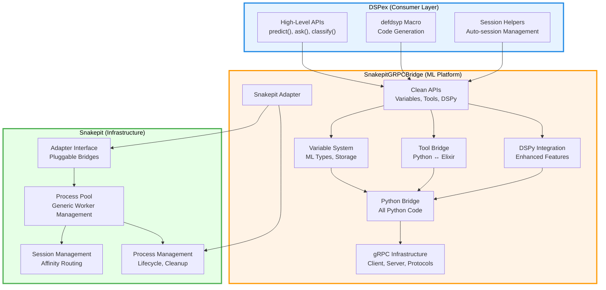

# Three-Layer Architecture Consolidation (Revised)

## Executive Summary

This document consolidates the **Light Snakepit + Heavy Bridge** architecture, presenting the overall design and implementation status of the three-layer system. The architecture provides clean separation of concerns across infrastructure, platform, and consumer layers, enabling independent evolution and preventing architectural degradation.

**Key Revision**: This revision corrects the original design by removing all gRPC references from the infrastructure layer. The `Snakepit.Adapter` behavior provides the perfect decoupling seam, and communication protocols (including gRPC) are implementation details of specific platform adapters.

## Current State Analysis

Based on examination of the codebase, the three-layer architecture is **partially implemented** with significant deviations from the original design specification:

### Layer 1: Snakepit (Infrastructure)
- **Location**: `./snakepit/`
- **Status**: Contains domain-specific code that should be in the platform layer
- **Key Issues**:
  - Python code exists in `priv/python/` (should be in platform layer)
  - Contains DSPy integration and ML-specific adapters
  - Has gRPC protocol definitions (should be in platform layer)
  - Not purely infrastructure-focused

### Layer 2: SnakepitGRPCBridge (ML Platform)  
- **Location**: `./snakepit_grpc_bridge/`
- **Status**: Exists but missing many specified components
- **Key Issues**:
  - No dedicated API modules (`api/` directory)
  - Missing comprehensive variable system
  - Missing tool system implementation
  - Limited DSPy integration
  - Does not own all gRPC communication

### Layer 3: DSPex (Consumer)
- **Location**: `./lib/` and root directory
- **Status**: Contains implementation that should be in platform layer
- **Key Issues**:
  - Has Python code in `priv/python/`
  - Contains extensive implementation beyond orchestration
  - Not a thin consumer layer

## Target Architecture

### Architectural Principles

1. **Clear Separation of Concerns**
   - Snakepit: Pure infrastructure (process lifecycle management)
   - SnakepitGRPCBridge: Complete ML platform (variables, tools, DSPy, Python, **gRPC**)
   - DSPex: Thin orchestration layer (macros, convenience APIs)

2. **Single Responsibility**
   - Snakepit: "I manage the lifecycle of external OS processes via a pluggable adapter"
   - SnakepitGRPCBridge: "I am the complete ML execution platform with gRPC communication"
   - DSPex: "I orchestrate ML workflows"

3. **Independent Evolution**
   - Infrastructure changes rarely
   - ML platform evolves rapidly
   - Consumer API adapts to user needs

## Consolidated File Layout

```
# Layer 1: Snakepit (Pure Infrastructure)
snakepit/
├── lib/
│   ├── snakepit.ex                    # Public API
│   └── snakepit/
│       ├── adapter.ex                 # Adapter behavior
│       ├── application.ex             # OTP application
│       ├── pool/
│       │   ├── pool.ex               # Generic process pooling
│       │   ├── registry.ex           # Worker registry
│       │   ├── process_registry.ex   # OS PID tracking
│       │   ├── worker_starter.ex     # Worker supervision
│       │   ├── worker_supervisor.ex  # Dynamic supervision
│       │   └── application_cleanup.ex # Shutdown guarantees
│       ├── generic_worker.ex         # Worker implementation
│       ├── session_helpers.ex        # Session management
│       └── telemetry.ex              # Infrastructure telemetry
├── priv/                             # NO proto files here
└── NO PYTHON CODE                    # Pure Elixir infrastructure

# Layer 2: SnakepitGRPCBridge (Complete ML Platform)
snakepit_grpc_bridge/
├── lib/
│   ├── snakepit_grpc_bridge.ex       # Main module
│   └── snakepit_grpc_bridge/
│       ├── adapter.ex                # Snakepit adapter implementation
│       ├── application.ex            # OTP application
│       ├── api/                      # Clean APIs for consumers
│       │   ├── variables.ex          # Variable management API
│       │   ├── tools.ex              # Tool bridge API
│       │   ├── dspy.ex               # DSPy integration API
│       │   └── sessions.ex           # Session management API
│       ├── variables/                # Complete variable system
│       │   ├── manager.ex            # Variable lifecycle
│       │   ├── types.ex              # ML data types
│       │   ├── storage.ex            # Variable storage
│       │   └── ml_types/             # Specialized types
│       │       ├── tensor.ex         # Tensor variables
│       │       ├── embedding.ex      # Embedding variables
│       │       └── model.ex          # Model variables
│       ├── tools/                    # Complete tool bridge
│       │   ├── registry.ex           # Tool registration
│       │   ├── executor.ex           # Tool execution
│       │   ├── bridge.ex             # Python ↔ Elixir bridge
│       │   └── serialization.ex      # Argument serialization
│       ├── dspy/                     # Complete DSPy integration
│       │   ├── integration.ex        # Core DSPy bridge
│       │   ├── workflows.ex          # DSPy workflows
│       │   ├── enhanced.ex           # Enhanced features
│       │   └── schema.ex             # Schema discovery
│       ├── grpc/                     # ALL gRPC infrastructure
│       │   ├── client.ex             # gRPC client
│       │   ├── server.ex             # gRPC server
│       │   └── protocols.ex          # Protocol helpers
│       ├── python/                   # Python bridge management
│       │   └── process.ex            # Python process management
│       └── telemetry.ex              # Platform telemetry
├── priv/
│   ├── proto/                        # ALL proto files here
│   │   ├── ml_bridge.proto           # ML-specific gRPC protocol
│   │   └── snakepit_bridge.proto     # Bridge communication protocol
│   └── python/                       # ALL Python code
│       └── snakepit_bridge/
│           ├── core/                 # Core bridge functionality
│           ├── grpc_server.py        # gRPC server implementation
│           ├── variables/            # Python variable management
│           ├── tools/                # Python tool execution
│           └── dspy/                 # Python DSPy integration
└── mix.exs                           # Depends on snakepit

# Layer 3: DSPex (Ultra-Thin Consumer)
dspex/
├── lib/
│   ├── dspex.ex                      # Main convenience API
│   └── dspex/
│       ├── bridge.ex                 # defdsyp macro only
│       ├── api.ex                    # High-level convenience
│       ├── sessions.ex               # Session helpers
│       └── config.ex                 # Configuration helpers
├── priv/                             # NO Python code
├── mix.exs                           # Depends on snakepit_grpc_bridge
└── NO IMPLEMENTATION                 # Pure orchestration
```

## Architecture Diagram



## Key Design Corrections

### 1. Adapter Pattern as the Perfect Seam
```elixir
# Snakepit defines behavior - NO gRPC knowledge
defmodule Snakepit.Adapter do
  @callback execute(String.t(), map(), keyword()) :: {:ok, term()} | {:error, term()}
  @callback init(keyword()) :: {:ok, term()} | {:error, term()}
  @callback start_worker(term(), term()) :: {:ok, pid()} | {:error, term()}
  # Optional callbacks for advanced features
  @callback supports_streaming?() :: boolean()
  @callback execute_stream(String.t(), map(), function(), keyword()) :: :ok | {:error, term()}
end

# Bridge implements with gRPC as implementation detail
defmodule SnakepitGRPCBridge.Adapter do
  @behaviour Snakepit.Adapter
  
  def init(config) do
    # Initialize gRPC server, Python processes, etc.
    # All gRPC logic is HERE, not in snakepit
  end
  
  def start_worker(adapter_state, worker_id) do
    # Start Python process with gRPC server
    # Snakepit doesn't know or care about gRPC
  end
  
  def execute(command, args, opts) do
    # Route through gRPC to Python
    # This is where gRPC protocol is used
  end
end
```

### 2. Process Management Contract
Snakepit provides robust process management that adapters leverage:
- **Process lifecycle**: Start, monitor, restart, cleanup
- **Session affinity**: Route requests to preferred workers
- **Orphan prevention**: Track OS PIDs, cleanup on crash
- **Graceful shutdown**: SIGTERM then SIGKILL
- **No protocol knowledge**: Doesn't know about gRPC, stdio, etc.

### 3. Communication as Platform Concern
- **ALL proto files** belong in `snakepit_grpc_bridge/priv/proto/`
- **ALL gRPC code** belongs in the platform layer
- **Future bridges** can use different protocols (stdio, HTTP, etc.)
- **Snakepit remains pure** process management infrastructure

## Migration Requirements

### Phase 1: Purify Snakepit
1. **Remove all Python code** from `snakepit/priv/python/`
2. **Remove all proto files** from `snakepit/priv/proto/`
3. **Remove ML-specific adapters** from snakepit
4. **Remove any gRPC references** from snakepit code
5. **Keep only infrastructure concerns**: pooling, process management, adapter interface

### Phase 2: Build Complete ML Platform
1. **Move all Python code** to `snakepit_grpc_bridge/priv/python/`
2. **Move all proto files** to `snakepit_grpc_bridge/priv/proto/`
3. **Create gRPC infrastructure** in `snakepit_grpc_bridge/lib/snakepit_grpc_bridge/grpc/`
4. **Create clean API modules** in `snakepit_grpc_bridge/lib/snakepit_grpc_bridge/api/`
5. **Implement complete variable system** with ML types
6. **Implement complete tool bridge** for bidirectional communication
7. **Consolidate DSPy integration** from both layers

### Phase 3: Simplify DSPex
1. **Remove all Python code** from `dspex/priv/python/`
2. **Remove implementation code** - keep only orchestration
3. **Update to use platform APIs** exclusively
4. **Focus on developer experience** with convenience functions

## Benefits of Corrected Architecture

### 1. True Infrastructure Generality
- Snakepit can manage **any** external process
- No hardcoded assumptions about communication protocols
- Future bridges can use HTTP, stdio, named pipes, etc.
- Clean adapter behavior is the only contract

### 2. Platform Owns Its Complexity
- gRPC is an implementation detail of `snakepit_grpc_bridge`
- Proto files live with the code that uses them
- Python bridge owns its communication protocol
- Easy to reason about where code belongs

### 3. Simplified Mental Model
```
DSPex says: "I want to predict"
  ↓
SnakepitGRPCBridge says: "I'll handle that via gRPC to Python"
  ↓
Snakepit says: "I'll manage the process lifecycle"
```

### 4. Future Extensibility
```elixir
# Future: R statistics bridge using stdio
defmodule SnakepitRBridge.Adapter do
  @behaviour Snakepit.Adapter
  
  def start_worker(_, worker_id) do
    # Start R process with stdio communication
    # No gRPC needed!
  end
end

# Future: Node.js bridge using HTTP
defmodule SnakepitNodeBridge.Adapter do
  @behaviour Snakepit.Adapter
  
  def start_worker(_, worker_id) do
    # Start Node.js process with HTTP server
    # Different protocol, same infrastructure!
  end
end
```

## Success Metrics

- ✅ Snakepit contains **zero** ML-specific code
- ✅ Snakepit contains **zero** gRPC-specific code or proto files
- ✅ All Python code consolidated in SnakepitGRPCBridge
- ✅ All gRPC infrastructure consolidated in SnakepitGRPCBridge
- ✅ DSPex is pure orchestration with no implementation
- ✅ Clean APIs enable easy consumption
- ✅ Each layer can evolve independently
- ✅ Adapter pattern provides perfect decoupling

This corrected architecture ensures that Snakepit remains a truly generic process manager, while the platform layer owns all complexity related to its specific communication protocol and domain logic.