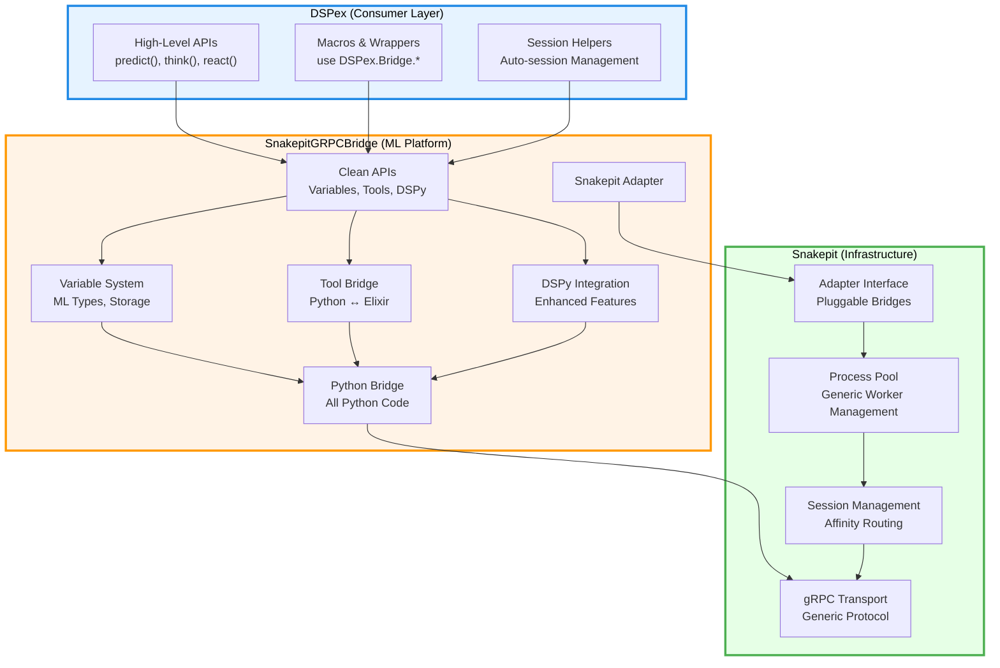

# Three-Layer Architecture Consolidation (_revised_01)

## Executive Summary

This document consolidates the **Light Snakepit + Heavy Bridge** architecture, presenting the overall design and an updated analysis of its implementation status based on the current codebase. The architecture provides a clean separation of concerns across infrastructure, platform, and consumer layers, enabling independent evolution and preventing architectural degradation.

## Current State Analysis

Based on a detailed examination of the provided codebase, the three-layer architecture is **partially and inconsistently implemented**. The boundaries between the layers are significantly blurred, with responsibilities misplaced across all three designated areas. The core principle of a pure infrastructure layer has been violated, and the consumer layer contains substantial platform-level implementation.

### Layer 1: Snakepit (Infrastructure)
- **Location**: `./snakepit/`
- **Status**: **Compromised**. This layer is not purely infrastructure-focused and contains significant platform-level logic and code.
- **Key Issues**:
  - **Violation of "No Python Code" Principle**: The `snakepit` directory contains a `priv/python/snakepit_bridge/` directory. This houses the entire Python-side implementation of the gRPC bridge, including adapters for DSPy (`dspy_integration.py`, `dspy_streaming.py`) and a complex `ShowcaseAdapter`. This is platform-specific code and should not reside in the infrastructure layer.
  - **Domain-Specific Logic**: The infrastructure's gRPC protocol (`snakepit_bridge.proto`) contains highly specific concepts like `Variable`, `ToolSpec`, `ExecuteToolRequest`, and even DSPy-centric concepts like `OptimizationStatus`. This couples the generic transport layer directly to the ML platform's domain.
  - **Over-extended Responsibility**: The Python `grpc_server.py` and its handlers (`dspy_grpc.py`) contain logic for creating and managing DSPy programs, which is a platform-level concern, not an infrastructure one.

### Layer 2: SnakepitGRPCBridge (ML Platform)
- **Location**: Non-existent as a distinct Elixir application. Its responsibilities are currently split between the `snakepit` and `dspex` projects.
- **Status**: **Missing/Scattered**. There is no single, coherent platform layer.
- **Key Issues**:
  - **Elixir Implementation in DSPex**: The Elixir side of the platform (e.g., tool management, contract validation, bridge orchestration) is implemented within the `dspex` consumer layer. Files like `dspex/bridge/tools/executor.ex`, `dspex/bridge/tools/registry.ex`, and `dspex/bridge/wrapper_orchestrator.ex` are platform-level components.
  - **Python Implementation in Snakepit**: As noted above, the Python side of the platform is incorrectly located within the `snakepit` infrastructure layer.
  - **No Clean API Boundary**: Because the platform layer does not exist as a separate entity, there is no clean, well-defined API for the consumer layer (`dspex`) to call. `dspex` instead calls directly into `snakepit` or its own internal modules.

### Layer 3: DSPex (Consumer)
- **Location**: `./lib/`, `./priv/python/`, `./examples/`
- **Status**: **Overloaded**. Far from being a thin orchestration layer, `dspex` contains the bulk of the Elixir-side platform logic and even its own Python code.
- **Key Issues**:
  - **Contains Python Code**: The `dspex` project has its own `priv/python/` directory containing `dspex_adapters`, violating the principle of a pure Elixir consumer layer. This code should be part of the platform layer's Python package.
  - **Heavy Implementation**: `dspex` is not a thin wrapper. It contains complex modules for contract validation (`dspex/contract/validation.ex`), result transformation (`dspex/bridge/result_transform.ex`), observability (`dspex/bridge/observable.ex`), and bidirectional tool management (`dspex/bridge/bidirectional.ex`). This is all platform-level logic.
  - **Direct Bridge Interaction**: Modules like `dspex/bridge.ex` and `dspex/python/bridge.ex` directly manage the interaction with `snakepit`, blurring the lines between consumer and platform. The `defdsyp` macro, while intended for consumers, is deeply tied to the implementation details of the bridge.

## Target Architecture

### Architectural Principles

1.  **Clear Separation of Concerns**
    -   Snakepit: Pure infrastructure (process pooling, gRPC transport)
    -   SnakepitGRPCBridge: Complete ML platform (variables, tools, DSPy, Python)
    -   DSPex: Thin orchestration layer (macros, convenience APIs)

2.  **Single Responsibility**
    -   Each layer has ONE clear responsibility
    -   No domain logic in infrastructure
    -   No implementation in consumer layer

3.  **Independent Evolution**
    -   Infrastructure changes rarely
    -   ML platform evolves rapidly
    -   Consumer API adapts to user needs

## Consolidated File Layout

```
# Layer 1: Snakepit (Pure Infrastructure)
snakepit/
├── lib/
│   ├── snakepit.ex                    # Public API
│   └── snakepit/
│       ├── adapter.ex                 # Adapter behavior
│       ├── application.ex             # OTP application
│       ├── pool/
│       │   ├── pool.ex               # Generic process pooling
│       │   ├── registry.ex           # Worker registry
│       │   ├── worker_supervisor.ex  # Worker supervision
│       │   └── process_registry.ex   # OS PID tracking
│       └── telemetry.ex              # Infrastructure telemetry
├── priv/
│   └── proto/
│       └── snakepit.proto            # Basic gRPC protocol
└── NO PYTHON CODE                    # Pure Elixir infrastructure

# Layer 2: SnakepitGRPCBridge (Complete ML Platform)
snakepit_grpc_bridge/
├── lib/
│   ├── snakepit_grpc_bridge.ex       # Main module
│   └── snakepit_grpc_bridge/
│       ├── adapter.ex                # Snakepit adapter implementation
│       ├── application.ex            # OTP application
│       ├── api/                      # Clean APIs for consumers
│       │   ├── variables.ex          # Variable management API
│       │   ├── tools.ex              # Tool bridge API
│       │   ├── dspy.ex               # DSPy integration API
│       │   └── sessions.ex           # Session management API
│       ├── variables/                # Complete variable system
│       │   ├── manager.ex            # Variable lifecycle
│       │   ├── types.ex              # ML data types
│       │   └── storage.ex            # Variable storage
│       ├── tools/                    # Complete tool bridge
│       │   ├── registry.ex           # Tool registration
│       │   ├── executor.ex           # Tool execution
│       │   └── bridge.ex             # Python ↔ Elixir bridge
│       ├── dspy/                     # Complete DSPy integration
│       │   ├── integration.ex        # Core DSPy bridge
│       │   └── schema.ex             # Schema discovery
│       ├── grpc/                     # gRPC infrastructure
│       │   ├── client.ex             # gRPC client
│       │   └── server.ex             # gRPC server
│       ├── python/                   # Python bridge management
│       │   └── process.ex            # Python process management
│       └── telemetry.ex              # Platform telemetry
├── priv/
│   ├── proto/
│   │   └── ml_bridge.proto           # ML-specific gRPC protocol
│   └── python/                       # ALL Python code
│       └── snakepit_bridge/
│           ├── core/                 # Core bridge functionality
│           ├── variables/            # Python variable management
│           ├── tools/                # Python tool execution
│           └── dspy/                 # Python DSPy integration
└── mix.exs                           # Depends on snakepit

# Layer 3: DSPex (Ultra-Thin Consumer)
dspex/
├── lib/
│   ├── dspex.ex                      # Main convenience API
│   └── dspex/
│       ├── bridge.ex                 # defdsyp macro only
│       ├── api.ex                    # High-level convenience
│       ├── sessions.ex               # Session helpers
│       └── config.ex                 # Configuration helpers
├── priv/                             # NO Python code
├── mix.exs                           # Depends on snakepit_grpc_bridge
└── NO IMPLEMENTATION                 # Pure orchestration
```

## Architecture Diagram


