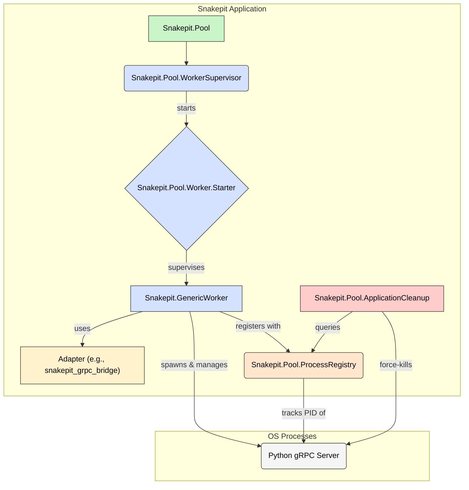

# Snakepit Process Management for the Python Bridge

## 1. Overview

Snakepit provides a robust, generic, and fault-tolerant infrastructure for managing pools of external OS processes. This document details the mechanism as it exists within the `snakepit` application and defines the contract for how the `snakepit_grpc_bridge` (the ML platform layer) integrates with it to manage its pool of Python gRPC servers.

The core design philosophy is a strict separation of concerns:
-   **`snakepit` (Infrastructure)**: Knows *how* to manage processes (start, stop, supervise, restart, clean up orphans) but knows *nothing* about what those processes are (e.g., Python, gRPC).
-   **`snakepit_grpc_bridge` (Platform)**: Knows *what* the processes are (Python scripts running a gRPC server) and *how to communicate* with them, but delegates the lifecycle management to `snakepit`.

This ensures maximal cohesion within each layer and minimal coupling between them.

## 2. Core Components and Responsibilities

The process management system is composed of several coordinated OTP components within `snakepit`.



-   **`Snakepit.Pool`**: The main entry point. It manages a queue of available workers, distributes requests, and handles session affinity. It does not directly supervise workers.

-   **`Snakepit.Pool.WorkerSupervisor`**: A `DynamicSupervisor` responsible for starting and stopping the `Worker.Starter` processes. This is the root of the worker supervision tree.

-   **`Snakepit.Pool.Worker.Starter`**: A "permanent wrapper" supervisor. Its only child is a `Snakepit.GenericWorker`. The starter's job is to be `:permanent` so the `WorkerSupervisor` restarts it if it crashes, and its child (`GenericWorker`) is `:transient` so it doesn't restart during a graceful application shutdown but *is* restarted by the `Starter` if it crashes during normal operation. This pattern provides robust, automatic crash recovery.

-   **`Snakepit.GenericWorker`**: A `GenServer` that represents a single external process. It is responsible for spawning, communicating with, and terminating its assigned Python process via the configured adapter.

-   **`Snakepit.Pool.ProcessRegistry`**: A critical `GenServer` that acts as the single source of truth for OS-level process IDs (PIDs). It uses **DETS** for persistence, allowing it to track processes even across BEAM VM restarts. This is the key to preventing orphaned Python processes.

-   **`Snakepit.Pool.ApplicationCleanup`**: A high-priority `GenServer` that traps application exit signals. On shutdown, it queries the `ProcessRegistry` to ensure every single tracked Python process is terminated, using OS signals (`SIGTERM`, then `SIGKILL`) as a final guarantee.

## 3. The `snakepit` <=> `snakepit_grpc_bridge` Contract

This contract defines the integration points, ensuring `snakepit` remains generic while `snakepit_grpc_bridge` provides the specific implementation details for managing Python processes.

### 3.1 `snakepit`'s Responsibilities (The Generic Provider)

`snakepit` provides the complete process lifecycle management framework. It makes the following guarantees to any adapter:
1.  It will start a configured number of `Snakepit.GenericWorker` processes.
2.  It will use the adapter provided in the configuration to communicate with the external process.
3.  It will automatically restart a worker if it crashes unexpectedly.
4.  It will track the OS PID of every spawned process.
5.  It will ensure all tracked OS processes are terminated when the Elixir application shuts down.

### 3.2 `snakepit_grpc_bridge`'s Responsibilities (The Specific Implementer)

The `snakepit_grpc_bridge` is responsible for implementing the `Snakepit.Adapter` behavior. This is the core of the contract.

**`lib/snakepit_grpc_bridge/adapter.ex`**
```elixir
defmodule SnakepitGRPCBridge.Adapter do
  @behaviour Snakepit.Adapter

  # Called by GenericWorker to start the Python process.
  # This is where the knowledge of "python", "grpc_server.py", ports,
  # and the snakepit-run-id is encapsulated.
  @impl Snakepit.Adapter
  def start_worker(_adapter_state, worker_id) do
    # 1. Select a free TCP port for the gRPC server.
    port = PortManager.get_free_port()

    # 2. Get the unique BEAM run ID for orphan cleanup.
    beam_run_id = Snakepit.Pool.ProcessRegistry.get_beam_run_id()

    # 3. Construct the OS command to start the Python gRPC server.
    #    - `setsid` is crucial for creating a new process group, allowing
    #      us to kill the Python process and all its children reliably.
    cmd = "setsid"
    args = [
      "python",
      "priv/python/grpc_server.py",
      "--port", to_string(port),
      "--elixir-address", "localhost:50051", # Address of the Elixir gRPC server
      "--adapter", "snakepit_bridge.dspy_integration.DSPyAdapter",
      "--snakepit-run-id", beam_run_id # CRITICAL for cleanup
    ]

    # 4. Spawn and manage the Port.
    port_process = Port.open({:spawn_executable, cmd}, [:binary, :stderr_to_stdout, args: args])

    # 5. Extract the OS PID. The PID of `setsid` is the process group ID (PGID).
    os_pid = Port.info(port_process, :os_pid)

    # Return the necessary state for the worker.
    {:ok, %{port: port_process, os_pid: os_pid, grpc_port: port, ...}}
  end

  # Called by GenericWorker to execute a command.
  # This function knows how to serialize the command into a gRPC request
  # and deserialize the response.
  @impl Snakepit.Adapter
  def execute(command, args, opts) do
    worker_state = opts[:worker_state] # Passed by GenericWorker
    grpc_channel = # Get or create channel from worker_state
    
    # 1. Build the appropriate Protobuf request message.
    request = build_grpc_request(command, args)
    
    # 2. Make the gRPC call to the Python worker.
    case GRPC.Stub.rpc_call(grpc_channel, :ExecuteTool, request) do
      {:ok, response} ->
        # 3. Deserialize the Protobuf response.
        {:ok, deserialize_grpc_response(response)}
      {:error, reason} ->
        {:error, reason}
    end
  end

  # ... other callbacks like terminate, etc.
end
```

### 3.3 Configuration (`config.exs`)

The linkage between the layers is defined in configuration. `dspex` (or another consumer) configures `snakepit` to use the `snakepit_grpc_bridge` adapter.

```elixir
# in config/config.exs of the final application
config :snakepit,
  # This is the key linkage point.
  # Snakepit will use this module to manage its workers.
  adapter_module: SnakepitGRPCBridge.Adapter,

  pool_config: %{
    pool_size: 4
  }
```

## 4. Robust Process Cleanup Explained

A critical feature of Snakepit is its guarantee to clean up orphaned Python processes. This is essential for production systems to prevent resource leaks.

1.  **Unique Run ID**: When the `snakepit` application starts, `ProcessRegistry` generates a unique `beam_run_id`. This ID is passed as a command-line argument to every Python process it spawns.

2.  **Persistent Tracking**: When a `GenericWorker` starts a Python process, it registers the worker's unique ID, its own Elixir PID, and the Python process's OS PID with the `ProcessRegistry`. The registry immediately persists this information to a **DETS file** on disk, including the `beam_run_id`.

3.  **Graceful Shutdown**: When the Elixir application is stopped gracefully, the `GenericWorker`'s `terminate/2` callback is triggered. It sends a signal to its managed Python process to shut down cleanly. It also unregisters itself from the `ProcessRegistry`.

4.  **Crash Recovery (Worker)**: If a `GenericWorker` or the Python process crashes, the `Worker.Starter` supervisor restarts it. The new `GenericWorker` instance will re-register with the `ProcessRegistry`, overwriting the old entry.

5.  **Crash Recovery (Application)**: If the entire BEAM VM crashes or is killed (`kill -9`), the Python processes are orphaned.
    -   On the next application start, `ProcessRegistry` loads all entries from its DETS file.
    -   It compares the `beam_run_id` of each entry with its new, current `beam_run_id`.
    -   Any process entry with a *different* `beam_run_id` is identified as an orphan from a previous run.
    -   `ApplicationCleanup` then uses the stored OS PID to forcefully terminate the orphaned Python process using `kill -KILL`. The use of `setsid` ensures the entire process group is killed.

This multi-layered approach provides an extremely robust system for managing the lifecycle of external Python processes, preventing resource leaks even in the face of catastrophic failures.

