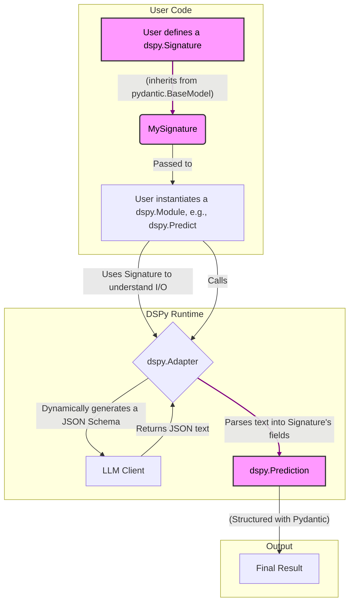
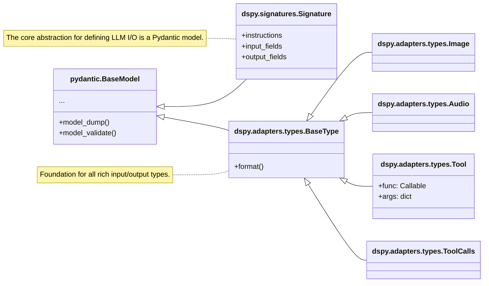

Of course. This is a fascinating request that combines architectural philosophy with concrete code analysis. Let's break down how Pydantic is used in the `dspy` codebase, framed by the debate in the Hacker News thread and the article.

### **Part 1: Setting the Stage - The Core Debate**

First, let's synthesize the context you provided.

*   **The Article's Stance ("Keep Pydantic Out"):** The author advocates for a "Clean Architecture" or "Onion Architecture" approach. The core argument is that your central "domain layer" (which handles pure business logic) should not depend on external libraries like Pydantic. Pydantic is a tool for the "outer layers" (presentation, infrastructure) to handle data validation, serialization, and parsing at the application's boundaries (e.g., parsing an incoming API request or data from a database). This keeps the core logic decoupled, easier to test in isolation, and less fragile to library updates or changes. The article suggests using plain Python `dataclasses` in the domain and mapping Pydantic models to them at the boundary, even introducing another library (`dacite`) to help with this mapping.

*   **The Hacker News Counterarguments:**
    *   **"Ridiculously over-complicated" (IshKebab, photios):** The separation introduces boilerplate and complexity for a questionable gain, especially in Python where developer velocity is often prioritized.
    *   **"Pragmatism over Purity" (Various):** For many applications, the convenience and power of using Pydantic "everywhere" outweighs the academic ideal of a "pure" domain. The distinction between the API model and the internal model may be nonexistent in many cases.
    *   **"It Depends on the Domain" (chausen, halfcat):** The advice is most relevant for large, complex applications where the API models and internal business logic models need to evolve independently, often managed by different teams (Conway's Law). For a library whose *core domain is structured data*, the line blurs.
    *   **Performance is a Red Herring:** The performance argument against Pydantic is often moot in Python, and Pydantic v2 (written in Rust) is very fast anyway.

With this debate in mind, let's analyze the `dspy` codebase to see which philosophy its authors have adopted.

---

### **Part 2: Pydantic's Role in the DSPy Codebase**

A thorough scan of the `dspy` codebase reveals that it does **not** follow the article's advice. Instead, `dspy` embraces Pydantic as a foundational, core dependency that is deeply integrated into its primary abstractions. Pydantic is not just at the boundaries; in many ways, **Pydantic *is* the foundation of the `dspy` domain.**

Here is a table identifying the key integration points, their purpose, and how they relate to the debate.

#### **Table of Pydantic Integration in `dspy`**

| File Path | Pydantic Component Used | Primary Purpose / Role | Analysis & Connection to the Debate |
| :--- | :--- | :--- | :--- |
| `signatures/signature.py` | `pydantic.BaseModel`, `pydantic.Field` | **Core Abstraction.** `dspy.Signature` is the central concept for defining the inputs and outputs of an LLM call. It inherits directly from `BaseModel`. | This is the most significant finding. `dspy`'s "domain" is defining and executing structured prompts. By making `Signature` a Pydantic model, the authors have placed Pydantic at the absolute heart of their library. This is a deliberate choice for pragmatism, leveraging Pydantic's powerful schema definition, validation, and metadata capabilities. |
| `signatures/field.py` | Wrappers around `pydantic.Field` | **DSL Creation.** `dspy.InputField` and `dspy.OutputField` are custom functions that wrap `pydantic.Field`, adding DSPy-specific metadata (`desc`, `prefix`) via the `json_schema_extra` argument. | This shows a deep, thoughtful integration. They aren't just using Pydantic; they're building their own Domain-Specific Language (DSL) for defining LLM interactions *on top of* Pydantic's field system. This provides a clean user interface while reusing Pydantic's robust backend. |
| `adapters/types/base_type.py` | `pydantic.BaseModel`, `pydantic.model_serializer` | **Extensible Custom Types.** The `dspy.BaseType` class, which is the parent for rich types like `Image`, `Audio`, and `Tool`, inherits from `BaseModel`. It uses `model_serializer` to control its JSON representation. | `dspy` allows users to define complex, structured inputs beyond simple strings. Pydantic provides the perfect framework for this, allowing `dspy.Image(url=...)` to be validated and then serialized into the format an LLM API expects. |
| `adapters/types/tool.py` | `pydantic.BaseModel`, `pydantic.create_model` | **Function Calling Schema.** The `dspy.Tool` class uses Pydantic to automatically infer the JSON schema of a Python function, which is then used for LLM tool-calling (function-calling) APIs. | This is a classic "boundary" use case that Pydantic excels at: defining a strict schema for an external system (the LLM). `dspy` uses this to provide a highly ergonomic way for users to make their Python functions available to an LLM. |
| `adapters/json_adapter.py` | `pydantic.create_model` | **Dynamic Schema Generation.** The `_get_structured_outputs_response_format` function dynamically builds a Pydantic model from a `dspy.Signature` on the fly. This model is then used to generate a JSON schema to force structured output from compliant LLMs. | This is an advanced and powerful use of Pydantic. It demonstrates how Pydantic's programmatic nature can be used to enforce runtime contracts with an external system (the LLM), ensuring the `dspy` program gets back the data it expects. This goes far beyond simple validation. |
| `predict/avatar/models.py` | `pydantic.BaseModel`, `pydantic.Field` | **Internal Data Structures.** Defines the `Action` and `ActionOutput` models for the `Avatar` agent. These are structured data objects used to pass information between steps of the agent's reasoning loop. | Here, Pydantic models are used as internal data transfer objects (DTOs). This aligns with the "Pydantic everywhere" convenience argument from Hacker News. It ensures that the data passed between agent components is well-defined and validated. |
| `experimental/synthesizer/config.py` | `pydantic.BaseModel` | **Configuration Management.** The `SynthesizerArguments` class is a Pydantic model used to manage configuration for the experimental `Synthesizer` module. | A very common and ideal use case for Pydantic. It provides type-safe, validated, and easily-serializable configuration objects. |

---

### **Part 3: Visualizing the Integration**

To better understand this deep integration, here are two graphs.

#### **Graph 1: Architectural Flow of Pydantic Objects in `dspy`**

This graph shows how Pydantic-based objects are central to the core workflow of a `dspy` program, contradicting the "keep it at the boundary" philosophy.

*   **Key Takeaway:** The purple nodes (`dspy.Signature`, `dspy.Prediction`) are fundamentally Pydantic models. They aren't temporary objects at the boundary; they are the primary, persistent artifacts that the user creates and the program returns.

#### **Graph 2: Inheritance and Composition of Core `dspy` Types**

This class diagram illustrates how `dspy`'s own type system is built directly on top of Pydantic's foundations.

*   **Key Takeaway:** This shows a clear and deliberate decision to use Pydantic's inheritance (`<|--`) to build `dspy`'s core components. `dspy` is not just *using* Pydantic; it is *extending* it.

---

### **Part 4: Conclusion - A Pragmatic Embrace of Pydantic**

The `dspy` library serves as an excellent case study that favors the pragmatic arguments from the Hacker News thread over the purist architectural principles of the article.

1.  **Domain-Specific Choice:** The article's advice is most salient when the application's core domain is distinct from data validation and serialization (e.g., financial calculations, game logic). However, `dspy`'s core domain *is* the structuring, validation, and manipulation of data for language models. For `dspy`, Pydantic isn't just a tool for the boundary; it's the best-in-class tool for its central task. Keeping it out of the "domain" would mean crippling the domain itself.

2.  **Ergonomics and Power:** By building on Pydantic, `dspy` gives its users a powerful, familiar, and type-safe way to define complex interactions (`Signatures`, `Tools`, `Image` inputs) without reinventing the wheel. The ability to dynamically generate schemas (`JSONAdapter`) is a superpower that would be nearly impossible to replicate cleanly without a programmatic schema library like Pydantic.

3.  **No "Poor Man's Pydantic":** One Hacker News commenter criticized the article's approach as creating a "weird concoction of Pydantic models, 'Poor man's Pydantic models' (dataclasses), and Obscure third party dependencies (Dacite)." `dspy` avoids this entirely by choosing one tool and integrating it deeply, leading to a more consistent and less fragmented internal architecture.

In conclusion, `dspy` has made a clear architectural decision to leverage Pydantic as a foundational pillar. It's a testament to the idea that the "right" architecture is context-dependent, and for a library centered on structured data interaction, the benefits of deeply integrating a powerful data library like Pydantic far outweigh the abstract goal of keeping the core logic "pure" and dependency-free.