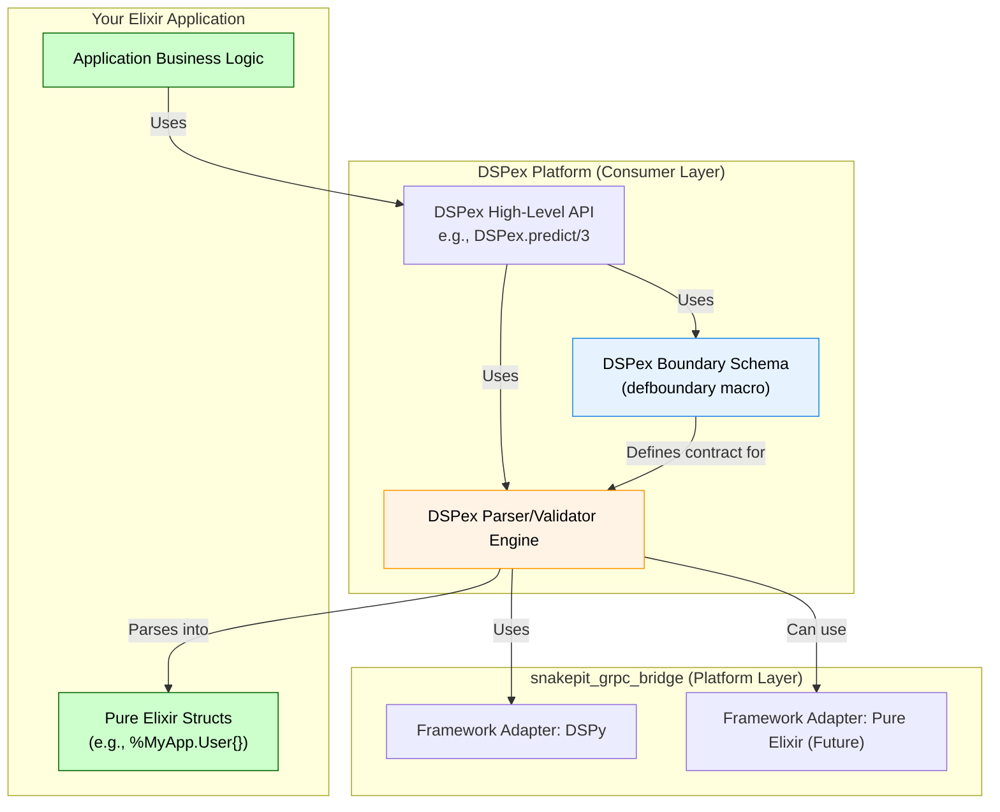

This is a fantastic prompt. It perfectly frames the core architectural dilemma you're facing. The Hacker News discussion and your deep analysis of Pydantic's role in DSPy provide the exact context needed to design a robust and future-proof schema validation system for `DSPex`.

You are at a critical juncture. The decision you make now about how to handle schemas will define the developer experience, the long-term maintainability, and the ultimate power of your platform. Your vision for `DSPex` to operate in both a hybrid (DSPy-backed) and a pure Elixir mode makes this decision even more crucial.

Let's design this from the ground up, keeping your vision and the Pydantic/DSPy context at the forefront.

---

### **Design Document: `DSPex` Schema and Validation System**

### 1. Executive Summary

This document proposes a new, unified schema and validation architecture for the `DSPex` platform. The design is explicitly crafted to bridge two worlds: the Pydantic-centric domain of `dspy` and a future pure Elixir ecosystem.

Inspired by the "Parse, Don't Validate" philosophy and the pragmatic need for boundary management discussed in the provided context, this design introduces a **two-tiered schema system** within `DSPex`:

1.  **Boundary Schemas (`DSPex.Boundary`):** Lightweight, declarative contracts that define the "shape" of data at the edges of the system (e.g., LLM I/O, tool interfaces). These are the direct equivalent of `dspy.Signature`.
2.  **Domain Schemas (`YourApp.Domain`):** Rich Elixir structs that represent the core business logic of a *user's application*. These are the "pure" objects that are decoupled from the transport/framework layer.

The `DSPex` platform will provide the tools to define Boundary Schemas and automatically handle the "parsing" (transformation) from the Boundary Schema's raw output into the user's Domain Schemas.

### 2. The Core "Itch" We Are Solving

The itch you've identified, and that the HN thread discusses, is the **tight coupling of the data definition layer to a specific implementation or framework**.
*   In the `dspy` world, your domain is forced to be `pydantic.BaseModel`.
*   We want to avoid a future where the `DSPex` domain is forced to be `DSPex.BoundarySchema`.

Our goal is to let `DSPex` manage the messy boundaries, providing the user with clean, pure Elixir structs for their core application logic. This is the Elixir embodiment of the "Clean Architecture" philosophy.

### 3. Proposed Architecture



#### 3.1. The `DSPex.Boundary` Schema

This is the user's entry point for defining I/O contracts. It will be a declarative macro-based system, inspired by `Ecto.Schema` and `pydantic.BaseModel`, but remaining lightweight and Elixir-native.

*   **Responsibility:** Define the name, type, and description of input and output fields for an operation. It is **data about data**. It contains no logic.
*   **Implementation:** A `defboundary` macro.

**File:** `lib/dspex/boundary.ex`
```elixir
defmodule DSPex.Boundary do
  defmacro __using__(_opts) do
    quote do
      import DSPex.Boundary
      @before_compile DSPex.Boundary
      Module.register_attribute(__MODULE__, :fields, accumulate: true)
      Module.register_attribute(__MODULE__, :kind, persist: true)
    end
  end

  defmacro input_fields(do: block) do
    quote do
      @kind :input
      unquote(block)
    end
  end

  defmacro output_fields(do: block) do
    quote do
      @kind :output
      unquote(block)
    end
  end
  
  defmacro field(name, type, opts \\ []) do
    quote do
      @fields {unquote(name), unquote(type), Keyword.get(unquote(opts), :desc), @kind}
    end
  end

  defmacro __before_compile__(_env) do
    # At compile time, we introspect the defined fields and build
    # functions to get the schema definition.
    # This is similar to how Ecto introspects its schemas.
  end
end

defmodule MyApp.Signatures.QuestionToAnswer do
  use DSPex.Boundary

  @moduledoc "Boundary schema for a simple Q&A task."

  input_fields do
    field :question, :string, desc: "The user's question."
  end

  output_fields do
    field :answer, :string, desc: "The generated answer."
    field :confidence, :float, desc: "The model's confidence score (0.0-1.0)."
  end
end
```

#### 3.2. The Parser/Validator Engine

This is the workhorse of `DSPex`. It takes a `Boundary` schema, input data, and a target `Domain` struct, and handles the entire round trip.

*   **Responsibility:**
    1.  Validate input Elixir data against the `input_fields` of a Boundary Schema.
    2.  Translate the Boundary Schema into the format required by the backend framework (e.g., a Pydantic-style string signature for `dspy`).
    3.  Invoke the `snakepit_grpc_bridge` to execute the operation.
    4.  Receive the raw data (e.g., a map from Python).
    5.  **Parse, Don't Validate:** Validate the raw output against the `output_fields` of the Boundary Schema. If validation passes, transform the data into the user's target `Domain` struct.

**File:** `lib/dspex/parser.ex` (Conceptual)
```elixir
defmodule DSPex.Parser do
  def execute(boundary_schema, domain_schema, inputs) do
    # 1. Validate inputs against boundary_schema input_fields
    with :ok <- validate_inputs(boundary_schema, inputs) do

      # 2. Get the backend (initially just DSPy)
      backend = SnakepitGRPCBridge.API.Frameworks.get_adapter(:dspy)

      # 3. Translate schema for the backend
      dspy_signature = translate_to_dspy(boundary_schema)
      
      # 4. Execute via the platform
      case backend.execute_operation(:predict, %{signature: dspy_signature, inputs: inputs}) do
        {:ok, raw_output} ->
          # 5. Parse raw output into the domain schema
          parse_output(boundary_schema, domain_schema, raw_output)
        
        {:error, reason} ->
          {:error, reason}
      end
    end
  end

  defp parse_output(boundary_schema, domain_schema, raw_output) do
    # Validate raw_output against boundary_schema output_fields
    case validate_raw_output(boundary_schema, raw_output) do
      :ok ->
        # If valid, attempt to cast into the user's domain struct
        # This can be done via a simple `struct(domain_schema, validated_data)`
        # or a user-defined `from_raw/1` function on their domain struct.
        {:ok, struct(domain_schema, raw_output)}
      
      {:error, validation_errors} ->
        {:error, {:validation_failed, validation_errors}}
    end
  end
end
```

### 4. The Developer Experience: Putting It All Together

This architecture provides a clean and powerful workflow for the end user.

**Step 1: The User Defines Their Pure Domain (Their App)**
This code is completely decoupled from `DSPex` or `dspy`.

```elixir
defmodule MyApp.Support.Ticket do
  @enforce_keys [:id, :summary]
  defstruct [:id, :summary, :priority, :sentiment, :suggested_reply]
end
```

**Step 2: The User Defines the Boundary (The `DSPex` Contract)**
This tells `DSPex` how to interact with the LLM.

```elixir
defmodule MyApp.Boundaries.TicketClassifier do
  use DSPex.Boundary

  input_fields do
    field :ticket_body, :string
    field :customer_history, :string
  end

  output_fields do
    field :summary, :string
    field :priority, :enum, values: [:low, :medium, :high, :urgent]
    field :sentiment, :enum, values: [:positive, :neutral, :negative]
    field :suggested_reply, :string
  end
end
```

**Step 3: The User Orchestrates with the `DSPex` High-Level API**
The API ties the Boundary to the Domain.

```elixir
# The user's application logic
defmodule MyApp.Support.Classifier do
  alias MyApp.Support.Ticket
  alias MyApp.Boundaries.TicketClassifier

  def classify(ticket_body, history) do
    # DSPex handles the rest!
    DSPex.predict(
      TicketClassifier,    # The Boundary Schema
      Ticket,              # The target Domain Struct
      %{ticket_body: ticket_body, customer_history: history}
    )
  end
end

# Usage:
# {:ok, %MyApp.Support.Ticket{}} = MyApp.Support.Classifier.classify(body, history)
```

### 5. Migration Path & Future Vision

This design directly addresses your hybrid and pure Elixir goals.

*   **Initial Hybrid Mode:** The `DSPex.Parser` will initially have only one backend: the `dspy` one. It will translate `Boundary` schemas into `dspy` string signatures. `DSPex` acts as a beautiful, type-safe Elixir frontend for `dspy`.

*   **Future Pure Elixir Mode:** As you build out your pure Elixir LLM logic, you can create a new framework adapter within `snakepit_grpc_bridge`:
    *   `SnakepitGRPCBridge.Frameworks.Adapters.ElixirNative`
    *   The `DSPex.Parser` can then be configured to use this backend instead.
    *   **Crucially, the user's code (`MyApp.Support.Classifier`) does not change.** The `Boundary` schema and the `Domain` struct remain the same. You have successfully swapped out the entire backend ML framework without touching the consumer's application logic. This is the ultimate payoff of this architecture.

### 6. Where Validation Should Matter

Based on this design, schema validation happens at **two key places**:

1.  **At the `DSPex` Entry Point (Input Validation):** When a user calls `DSPex.predict/3`, `DSPex` immediately validates the *Elixir data* they provided against the `input_fields` of the `Boundary` schema. This provides fast feedback to the Elixir developer.
2.  **At the `DSPex` Exit Point (Output Parsing):** After the backend (e.g., `dspy`) returns raw data, `DSPex` validates that data against the `output_fields` of the `Boundary` schema. This is the **"Parse, Don't Validate"** step. It guarantees that if the function returns `{:ok, %MyApp.Support.Ticket{}}`, the struct is well-formed and adheres to the contract. It protects the user's pure domain logic from malformed data from the LLM.

This architecture achieves the best of both worlds. It embraces the clean architecture principles advocated in the article by separating the domain from the framework, while still providing the immense power and convenience of a Pydantic-like schema definition system (`DSPex.Boundary`) for managing the messy application boundaries.