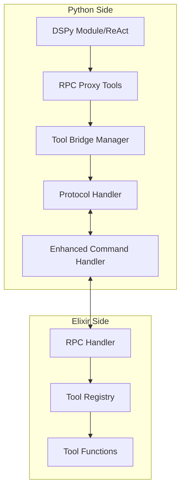
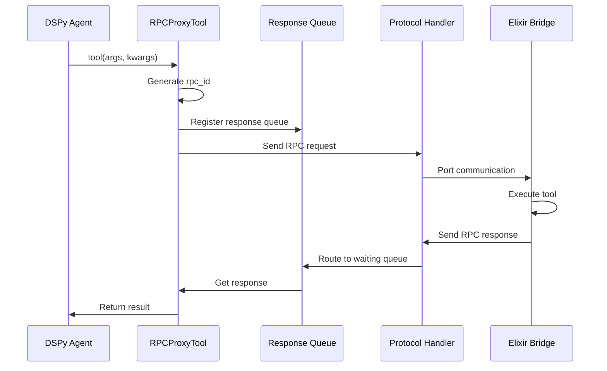

# Python-Side Tool Bridge Integration Technical Specification

## Table of Contents

1. [Executive Summary](#executive-summary)
2. [Architecture Overview](#architecture-overview)
3. [Communication Protocol](#communication-protocol)
4. [Tool Bridge Components](#tool-bridge-components)
5. [Integration Design](#integration-design)
6. [Message Protocol Extensions](#message-protocol-extensions)
7. [Implementation Plan](#implementation-plan)
8. [Security Considerations](#security-considerations)
9. [Performance Considerations](#performance-considerations)
10. [Testing Strategy](#testing-strategy)

## Executive Summary

This specification defines the Python-side implementation for bidirectional tool execution between DSPy (Python) and DSPex (Elixir). The tool bridge enables DSPy modules, particularly ReAct agents, to seamlessly call Elixir-implemented tools while maintaining type safety, session isolation, and performance.

### Key Goals

- Enable DSPy agents to call Elixir tools as if they were native Python functions
- Support both synchronous and streaming tool execution
- Maintain session-based tool isolation
- Minimize cross-language communication overhead
- Provide robust error handling and timeout protection

## Architecture Overview



### Core Components

1. **RPCProxyTool**: Python callable that proxies tool calls to Elixir
2. **ToolBridgeManager**: Manages proxy tool creation and lifecycle
3. **Protocol Handler Extension**: RPC message routing and response handling
4. **Enhanced Command Handler Integration**: Tool initialization and management

## Communication Protocol

### Wire Protocol

The existing Snakepit protocol is extended with RPC message types:

```python
# Wire format remains the same
[4-byte length header][payload]

# Payload can be JSON or MessagePack
```

### Message Flow



## Tool Bridge Components

### 1. RPCProxyTool Class

```python
class RPCProxyTool:
    """Python callable that proxies tool calls to Elixir via RPC."""
    
    def __init__(self, tool_id: str, tool_name: str, protocol_handler):
        self.tool_id = tool_id
        self.tool_name = tool_name
        self.protocol_handler = protocol_handler
        self.response_queue = queue.Queue()
        
    def __call__(self, *args, **kwargs):
        """Execute tool by sending RPC request to Elixir."""
        rpc_id = f"rpc_{uuid.uuid4().hex}"
        
        # Register for response
        self.protocol_handler.register_rpc_waiter(rpc_id, self.response_queue)
        
        try:
            # Send request
            request = {
                "type": "rpc_tool_call",
                "rpc_id": rpc_id,
                "tool_id": self.tool_id,
                "args": list(args),
                "kwargs": kwargs
            }
            self.protocol_handler.write_message(request)
            
            # Wait for response (30s timeout)
            response = self.response_queue.get(timeout=30)
            
            if response.get("status") == "ok":
                return response.get("result")
            else:
                error_info = response.get("error", {})
                raise RuntimeError(f"Tool failed: {error_info.get('message')}")
                
        except queue.Empty:
            raise TimeoutError(f"Tool '{self.tool_name}' timed out")
        finally:
            self.protocol_handler.unregister_rpc_waiter(rpc_id)
```

### 2. StreamingRPCProxyTool Class

```python
class StreamingRPCProxyTool(RPCProxyTool):
    """Streaming variant that yields results progressively."""
    
    def __call__(self, *args, **kwargs):
        """Execute tool and yield streaming results."""
        rpc_id = f"rpc_stream_{uuid.uuid4().hex}"
        stream_queue = queue.Queue()
        
        self.protocol_handler.register_rpc_waiter(rpc_id, stream_queue)
        
        try:
            request = {
                "type": "rpc_tool_stream",
                "rpc_id": rpc_id,
                "tool_id": self.tool_id,
                "args": list(args),
                "kwargs": kwargs
            }
            self.protocol_handler.write_message(request)
            
            # Yield results as they arrive
            while True:
                try:
                    chunk = stream_queue.get(timeout=60)
                    
                    if chunk.get("chunk_type") == "data":
                        yield chunk.get("data")
                    elif chunk.get("chunk_type") == "complete":
                        break
                    elif chunk.get("chunk_type") == "error":
                        raise RuntimeError(f"Stream error: {chunk.get('error')}")
                        
                except queue.Empty:
                    raise TimeoutError("Stream timeout")
                    
        finally:
            self.protocol_handler.unregister_rpc_waiter(rpc_id)
```

### 3. ToolBridgeManager Class

```python
class ToolBridgeManager:
    """Manages creation and lifecycle of RPC proxy tools."""
    
    def __init__(self, protocol_handler):
        self.protocol_handler = protocol_handler
        self.tools = {}
        
    def create_tools_from_specs(self, tool_specs: List[Dict]) -> Dict[str, RPCProxyTool]:
        """Create RPC proxy tools from Elixir specifications."""
        tools = {}
        
        for spec in tool_specs:
            tool_id = spec["tool_id"]
            tool_name = spec["name"]
            tool_type = spec.get("type", "standard")
            
            # Create appropriate proxy type
            if tool_type == "streaming":
                proxy = StreamingRPCProxyTool(tool_id, tool_name, self.protocol_handler)
            else:
                proxy = RPCProxyTool(tool_id, tool_name, self.protocol_handler)
            
            # Wrap in DSPy Tool if available
            if HAS_DSPY:
                tool = dspy.Tool(
                    func=proxy,
                    name=tool_name,
                    desc=spec.get("description", f"Tool: {tool_name}")
                )
                tools[tool_name] = tool
            else:
                tools[tool_name] = proxy
                
            self.tools[tool_id] = proxy
            
        return tools
```

### 4. Protocol Handler Extensions

```python
def add_rpc_support(protocol_handler_class):
    """Add RPC support to existing protocol handler."""
    
    # Add RPC waiter management
    if not hasattr(protocol_handler_class, 'rpc_waiters'):
        protocol_handler_class.rpc_waiters = {}
        protocol_handler_class.rpc_lock = threading.Lock()
    
    def register_rpc_waiter(self, rpc_id, response_queue):
        """Register a queue waiting for RPC response."""
        with self.rpc_lock:
            self.rpc_waiters[rpc_id] = response_queue
    
    def unregister_rpc_waiter(self, rpc_id):
        """Remove RPC waiter."""
        with self.rpc_lock:
            self.rpc_waiters.pop(rpc_id, None)
    
    def handle_rpc_response(self, message):
        """Route RPC responses to waiting tools."""
        rpc_id = message.get("rpc_id")
        if rpc_id:
            with self.rpc_lock:
                waiter = self.rpc_waiters.get(rpc_id)
                if waiter:
                    waiter.put(message)
    
    # Attach methods
    protocol_handler_class.register_rpc_waiter = register_rpc_waiter
    protocol_handler_class.unregister_rpc_waiter = unregister_rpc_waiter
    protocol_handler_class.handle_rpc_response = handle_rpc_response
```

## Integration Design

### 1. Enhanced Command Handler Integration

```python
class EnhancedCommandHandler(BaseCommandHandler):
    """Extended with tool bridge support."""
    
    def __init__(self, protocol_handler):
        super().__init__(protocol_handler)
        self.tool_bridge_manager = None
        self._register_tool_commands()
    
    def _register_tool_commands(self):
        """Register tool-related commands."""
        self.register_command("init_tool_bridge", self.handle_init_tool_bridge)
        self.register_command("create_react_agent", self.handle_create_react_agent)
    
    def handle_init_tool_bridge(self, args):
        """Initialize tool bridge with specifications."""
        tool_specs = args.get("tools", [])
        session_id = args.get("session_id")
        
        # Add RPC support to protocol handler
        from dspex_tool_bridge import ToolBridgeManager, add_rpc_support
        add_rpc_support(self.protocol_handler.__class__)
        
        # Create tool bridge manager
        self.tool_bridge_manager = ToolBridgeManager(self.protocol_handler)
        
        # Create proxy tools
        tools = self.tool_bridge_manager.create_tools_from_specs(tool_specs)
        
        # Store for later use
        self.stored_objects[f"_tools_{session_id}"] = tools
        
        return {
            "session_id": session_id,
            "tool_count": len(tools),
            "tool_names": list(tools.keys())
        }
    
    def handle_create_react_agent(self, args):
        """Create ReAct agent with bridged tools."""
        signature = args.get("signature")
        session_id = args.get("session_id")
        max_iters = args.get("max_iters", 5)
        
        # Get tools for session
        tools = self.stored_objects.get(f"_tools_{session_id}", {})
        tool_list = list(tools.values())
        
        # Create ReAct agent
        import dspy
        agent = dspy.ReAct(signature, tools=tool_list, max_iters=max_iters)
        
        # Store agent
        agent_id = f"react_{session_id}_{uuid.uuid4().hex[:8]}"
        self.stored_objects[agent_id] = agent
        
        return {
            "agent_id": agent_id,
            "tool_count": len(tool_list),
            "max_iters": max_iters
        }
```

### 2. Message Routing in Protocol Handler

```python
class ProtocolHandler:
    """Extended run loop to handle RPC messages."""
    
    def run(self):
        """Main protocol loop with RPC support."""
        while self.running:
            try:
                request = self.read_message()
                if not request:
                    break
                
                # Check for RPC responses
                msg_type = request.get("type")
                if msg_type in ["rpc_tool_response", "rpc_stream_chunk"]:
                    self.handle_rpc_response(request)
                    continue
                
                # Normal command processing
                response = self.command_handler.process_command(request)
                if response:
                    self.write_message(response)
                    
            except Exception as e:
                self.write_error({"error": str(e)})
```

## Message Protocol Extensions

### Tool-Related Messages

#### 1. Tool Initialization Request
```json
{
    "command": "init_tool_bridge",
    "args": {
        "session_id": "session_abc123",
        "tools": [
            {
                "tool_id": "session_abc123_search_web_tool_xyz",
                "name": "search_web",
                "type": "standard",
                "description": "Search the web for information",
                "metadata": {
                    "category": "external",
                    "requires_api_key": true
                }
            }
        ]
    }
}
```

#### 2. RPC Tool Call
```json
{
    "type": "rpc_tool_call",
    "rpc_id": "rpc_1234567890abcdef",
    "tool_id": "session_abc123_search_web_tool_xyz",
    "args": ["DSPy framework"],
    "kwargs": {"max_results": 10}
}
```

#### 3. RPC Tool Response
```json
{
    "type": "rpc_tool_response",
    "rpc_id": "rpc_1234567890abcdef",
    "status": "ok",
    "result": {
        "results": [
            {"title": "DSPy Documentation", "url": "..."},
            {"title": "DSPy Tutorial", "url": "..."}
        ],
        "total": 2
    }
}
```

#### 4. Stream Chunk
```json
{
    "type": "rpc_stream_chunk",
    "rpc_id": "rpc_stream_1234567890abcdef",
    "chunk_type": "data",
    "data": {
        "index": 0,
        "document": {"content": "...", "score": 0.95}
    }
}
```

## Implementation Plan

### Phase 1: Core RPC Infrastructure (Week 1)

1. Implement `RPCProxyTool` class
2. Implement `StreamingRPCProxyTool` class
3. Add RPC support to `ProtocolHandler`
4. Create `ToolBridgeManager`

### Phase 2: Integration (Week 2)

1. Integrate tool bridge into `EnhancedCommandHandler`
2. Add tool initialization commands
3. Implement message routing
4. Add error handling

### Phase 3: DSPy Integration (Week 3)

1. Create DSPy Tool wrappers
2. Implement ReAct agent creation
3. Add batch tool support
4. Test with real DSPy modules

### Phase 4: Testing & Documentation (Week 4)

1. Unit tests for all components
2. Integration tests with Elixir
3. Performance benchmarks
4. Complete documentation

## Security Considerations

### 1. Session Isolation

- Tools are registered per session
- Tool IDs include session identifiers
- Automatic cleanup on session termination

### 2. Input Validation

```python
def validate_tool_call(self, tool_id, args, kwargs):
    """Validate tool call inputs."""
    # Check tool exists
    if tool_id not in self.tools:
        raise ValueError(f"Unknown tool: {tool_id}")
    
    # Validate argument types
    if not isinstance(args, (list, tuple)):
        raise TypeError("Args must be list or tuple")
    
    if not isinstance(kwargs, dict):
        raise TypeError("Kwargs must be dict")
    
    # Size limits
    if len(str(args)) + len(str(kwargs)) > MAX_MESSAGE_SIZE:
        raise ValueError("Arguments too large")
```

### 3. Timeout Protection

- 30-second timeout for synchronous calls
- 60-second timeout for streaming calls
- Configurable per-tool timeouts

### 4. Error Handling

```python
class ToolExecutionError(Exception):
    """Tool execution error with structured information."""
    
    def __init__(self, tool_name, error_type, message, details=None):
        self.tool_name = tool_name
        self.error_type = error_type
        self.details = details or {}
        super().__init__(message)
```

## Performance Considerations

### 1. Connection Pooling

- Reuse protocol handler connections
- Minimize handshake overhead
- Connection health checks

### 2. Batch Operations

```python
class BatchToolProcessor:
    """Process multiple tool calls in one round trip."""
    
    def process_batch(self, requests):
        """Execute multiple tools in parallel."""
        batch_id = f"batch_{uuid.uuid4().hex}"
        batch_request = {
            "type": "rpc_batch_call",
            "batch_id": batch_id,
            "requests": [
                {
                    "index": i,
                    "tool_id": req["tool_id"],
                    "args": req.get("args", []),
                    "kwargs": req.get("kwargs", {})
                }
                for i, req in enumerate(requests)
            ]
        }
        # Send and wait for batch response
```

### 3. Caching

```python
class CachedRPCProxyTool(RPCProxyTool):
    """RPC proxy with result caching."""
    
    def __init__(self, *args, cache_ttl=300, **kwargs):
        super().__init__(*args, **kwargs)
        self.cache = TTLCache(maxsize=100, ttl=cache_ttl)
    
    def __call__(self, *args, **kwargs):
        cache_key = (args, tuple(sorted(kwargs.items())))
        
        if cache_key in self.cache:
            return self.cache[cache_key]
        
        result = super().__call__(*args, **kwargs)
        self.cache[cache_key] = result
        return result
```

### 4. Message Compression

- Use MessagePack for binary efficiency
- Compress large payloads (>10KB)
- Streaming for large results

## Testing Strategy

### 1. Unit Tests

```python
# test_rpc_proxy_tool.py
class TestRPCProxyTool(unittest.TestCase):
    def setUp(self):
        self.mock_handler = MagicMock()
        self.tool = RPCProxyTool("tool123", "test_tool", self.mock_handler)
    
    def test_successful_call(self):
        # Mock response
        self.mock_handler.response_queue.get.return_value = {
            "status": "ok",
            "result": {"answer": 42}
        }
        
        result = self.tool("test", key="value")
        self.assertEqual(result, {"answer": 42})
    
    def test_timeout(self):
        self.mock_handler.response_queue.get.side_effect = queue.Empty()
        
        with self.assertRaises(TimeoutError):
            self.tool("test")
```

### 2. Integration Tests

```python
# test_tool_bridge_integration.py
class TestToolBridgeIntegration(unittest.TestCase):
    def test_end_to_end_tool_call(self):
        # Start mock Elixir bridge
        with MockElixirBridge() as bridge:
            # Initialize tool bridge
            manager = ToolBridgeManager(bridge.protocol_handler)
            tools = manager.create_tools_from_specs([
                {
                    "tool_id": "test123",
                    "name": "add_numbers",
                    "type": "standard"
                }
            ])
            
            # Execute tool
            result = tools["add_numbers"](5, 3)
            self.assertEqual(result, 8)
```

### 3. Performance Benchmarks

```python
# benchmark_tool_bridge.py
def benchmark_tool_calls():
    """Benchmark tool call performance."""
    import timeit
    
    # Setup
    setup = """
    from dspex_tool_bridge import RPCProxyTool
    tool = RPCProxyTool("bench_tool", "benchmark", handler)
    """
    
    # Synchronous calls
    sync_time = timeit.timeit("tool(42)", setup=setup, number=1000)
    print(f"Sync calls: {sync_time/1000:.4f}s per call")
    
    # Batch calls
    batch_time = timeit.timeit(
        "batch_processor.process_batch([{'tool_id': 'bench_tool', 'args': [i]} for i in range(10)])",
        setup=setup + "\nfrom dspex_tool_bridge import BatchToolProcessor\nbatch_processor = BatchToolProcessor()",
        number=100
    )
    print(f"Batch calls: {batch_time/100:.4f}s per batch of 10")
```

## Conclusion

This specification provides a comprehensive design for Python-side tool bridge integration in DSPex. The implementation leverages existing infrastructure while adding minimal complexity. Key benefits include:

- **Seamless Integration**: DSPy agents use tools as native Python functions
- **Performance**: Batch operations and streaming reduce overhead
- **Reliability**: Timeout protection and structured error handling
- **Security**: Session isolation and input validation
- **Extensibility**: Easy to add new tool types and features

The phased implementation plan ensures incremental delivery with testing at each stage. The design maintains backward compatibility while enabling powerful new capabilities for ML/AI workflows that span Python and Elixir.