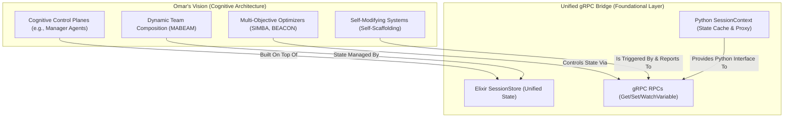

Excellent question. This is a crucial architectural check to ensure that our current, pragmatic implementation plan (the unified gRPC bridge) serves as a robust foundation for the ambitious, long-term vision outlined in the earlier "Omar's Vision" documents.

After a detailed analysis, the answer is:

**Yes, the DSPex variables plan (Unified gRPC Bridge) provides a strong and sufficient foundation to build towards and eventually honor the full scope of Omar's vision, but it is not a direct implementation of that vision. It is the necessary *plumbing* and *nervous system*, not the *brain* itself.**

The gRPC plan correctly focuses on creating a robust, low-level state synchronization and remote execution layer. The visionary concepts (like "Cognitive Control Planes" and "Multi-Agent Coordination") are higher-level architectural patterns that will be built *on top* of this foundation.

Here is a detailed breakdown of how the gRPC plan supports, enables, or provides a path toward the key concepts from the vision documents.

---

### Core Architectural Philosophy Comparison

First, it's important to understand the different levels of abstraction:

*   **Omar's Vision (`docs20250701`, etc.):** This is a **Cognitive Architecture** specification. It's concerned with *how an intelligent system orchestrates its capabilities*. Concepts like `cognitive_variable` are about controlling the *behavior* and *structure* of the entire system dynamically.
*   **Unified gRPC Bridge Plan:** This is a **State Synchronization & Communication Protocol** specification. It's concerned with *how two separate processes (Elixir and Python) share state and execute remote functions*.

The gRPC plan is not a lesser version of the vision; it's a different, lower-level layer of the stack that is required to make the vision possible in a hybrid Elixir/Python environment.

---

### Feature-by-Feature Sufficiency Analysis

Let's evaluate how the gRPC plan supports the most revolutionary ideas from the vision documents.

| Vision Concept | gRPC Plan Support & Sufficiency Analysis | Verdict |
| :--- | :--- | :--- |
| **1. Universal Cognitive Control Planes** *(The `cognitive_variable` macro that controls entire architectures)* | The gRPC plan provides the core primitives. A `cognitive_variable` that selects between architectures (e.g., `deep_analytical` vs. `fast_intuitive`) is implemented as a `module-type` variable. The gRPC `SetVariable` RPC is the mechanism an optimizer (in Elixir) would use to switch the live architecture. **The bridge is the control wire; the cognitive logic lives in Elixir.** | ✅ **Strong Foundation** |
| **2. Multi-Agent Coordination & Dynamic Teams** *(A Manager Agent optimizing its team of Coder/Reviewer agents)* | The state of the agent team (e.g., `%{coder_agent: CoderAgent.GPT4, reviewer_agent: ReviewerAgent.Fast}`) can be stored as variables in the `SessionStore`. An optimizer can call `update_variable` to swap agents. **The gRPC bridge provides the shared state mechanism required for a "manager" to configure its "team."** | ✅ **Strong Foundation** |
| **3. Integration with Memory Systems** *(Memory-informed optimization; variables for memory strategy)* | A variable for `memory_strategy` is a standard `module-type` variable, fully supported by the gRPC plan. For memory-informed feedback, an Elixir-native optimizer would read the agent's performance from its memory (another variable) via `SessionStore.get_variable`, then write back an optimized configuration via `update_variable`. | ✅ **Good Support** |
| **4. Multi-Objective Evaluation & Optimization** *(Complex, Elixir-native evaluation of accuracy, cost, latency)* | This heavy lifting rightly belongs in Elixir. The gRPC bridge's role is to act as the **control interface**. A Python client (or Elixir process) would use an `ExecuteTool` RPC to trigger a complex, asynchronous evaluation task in Elixir. The results (e.g., the best configuration) would be written to a variable, which clients can then read or watch. | ✅ **Sufficient as an Interface** |
| **5. Self-Modifying Systems** *(Self-scaffolding agents that generate and load new Elixir modules)* | This is an advanced, Elixir-native capability. The gRPC bridge serves as the trigger. An RPC call like `ExecuteTool(name="scaffold_new_skill", ...)` would initiate the process. The status and result (e.g., the name of the new module) could be communicated back via a variable update. The bridge is the light switch, not the power plant. | ✅ **Sufficient as an Interface** |
| **6. Hierarchical Variable Scopes** *(Program-local vs. System-global variables)* | The current gRPC plan is explicitly session-scoped. It doesn't detail a mechanism for global or cross-session variables. However, this is a straightforward extension. A special session ID (e.g., `"global_scope"`) or new RPCs (`GetGlobalVariable`) could easily be added to the existing `.proto` file and `SessionStore`. | 🟡 **Minor Gap, Easily Addressed** |
| **7. Advanced Variable Types** *(Composite, Conditional, etc.)* | The gRPC plan's protobuf definition uses `google.protobuf.Any` for values and JSON strings for constraints. This is flexible enough to transport complex, nested data structures representing composite or conditional variable logic. The *interpretation* of that logic happens in Elixir's `SessionStore`, but the transport mechanism is sufficient. | ✅ **Well-Supported** |

---

### What's Missing: The Next Layer of Abstraction

The gRPC plan is the foundation. To realize the full vision, the following components need to be built **on top of the bridge**:

1.  **The Meta-Program / Manager Agent:**
    This is a higher-level `DSPEx.Program` (living in Elixir) that doesn't solve end-user tasks but instead *orchestrates other programs*. Its variables would be `coder_agent_choice`, `review_strategy`, etc. It would be the primary user of the variable system to dynamically assemble and configure its team.

2.  **Elixir-Native Evaluation Harnesses:**
    The complex, multi-objective evaluation logic described in `cc_05_AUTOMATIC_EVALUATION_SELECTION_SYSTEM.md` must be implemented in Elixir. The gRPC bridge simply provides the API to start these evaluations and retrieve their results.

3.  **Variable-Aware Optimizers (in Elixir):**
    The advanced SIMBA, BEACON, and other optimizers need to be enhanced (as per `cc_03_OPTIMIZER_INTEGRATION_PLAN.md`) to read from and write to the `SessionStore`'s variable registry, making them the "brains" that drive adaptation.

4.  **The `cognitive_variable` Macro:**
    This would be a higher-level Elixir macro that simplifies the definition of these complex, system-level variables and automatically wires them into the `SessionStore` and the evaluation/optimization loops.

### Conclusion

The current **Unified gRPC Bridge plan is an excellent and necessary first step** toward realizing Omar's vision. It correctly identifies and solves the foundational problem: creating a fast, reliable, and unified state management system between Elixir and Python.

It **fully honors the spirit of the vision** by providing the essential mechanisms for:
*   **Decoupled State:** Variables live in one place (Elixir) and can be accessed by any component.
*   **Dynamic Configuration:** Any parameter can be changed at runtime via RPCs.
*   **Real-time Updates:** The `WatchVariables` stream is the perfect primitive for building adaptive, reactive systems.

The plan does not implement the full cognitive architecture, nor should it. It wisely separates the concerns of **communication infrastructure** from **cognitive logic**. By building this robust gRPC foundation first, we create the stable ground upon which the revolutionary multi-agent, self-optimizing, and memory-integrated systems of the vision can be built.
