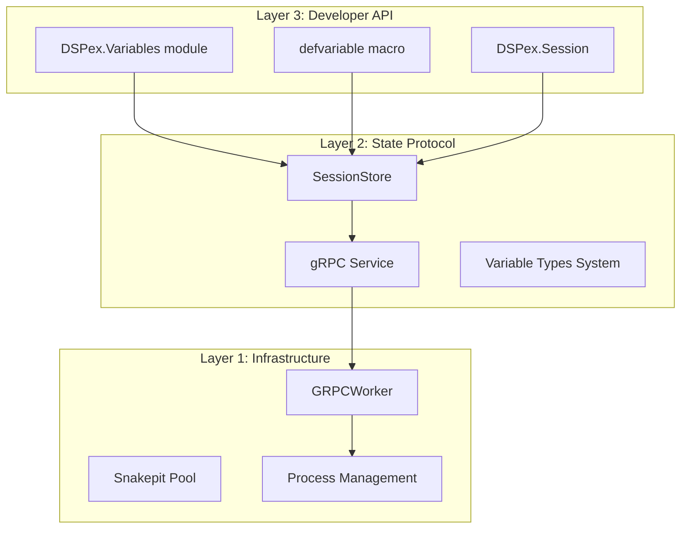
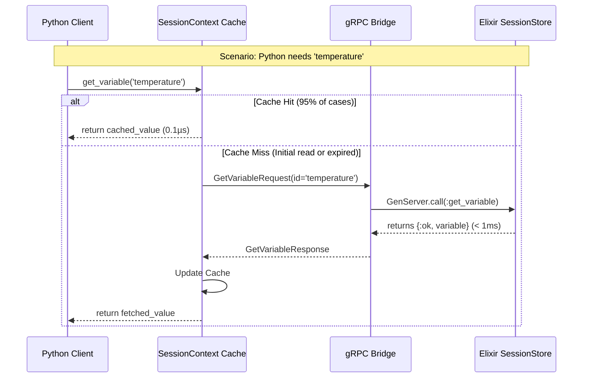

# Architectural Synthesis: Pure DSPex Variables & Layered Design

## Executive Summary

This document synthesizes the architectural discussion about pure DSPex variables versus the gRPC bridge approach. The key insight is that these are not competing approaches but complementary layers in a cohesive architecture. The gRPC bridge provides the **infrastructure layer** while DSPex Variables will provide the **cognitive layer**.

## The Layered Architecture

The strategy follows a classic layered architecture pattern:



This separation is intentional and crucial for long-term maintainability:

1. **Layer 1 (Infrastructure):** `snakepit`'s `Pool` and `GRPCWorker` - the raw process management and communication hardware
2. **Layer 2 (State Protocol):** The `SessionStore` and gRPC service - the operating system for state
3. **Layer 3 (Developer API):** The `DSPex.Variables` module - the user-friendly application layer

## The DSPex Variables API

### Core Concepts

1. **DSPex.Session:** A process that encapsulates a `session_id`, avoiding the need to pass session IDs everywhere
2. **defvariable Macro:** An idiomatic way to declare variables within modules, making definitions declarative and co-located with logic

### API Specification

```elixir
defmodule DSPex.Session do
  @moduledoc "Manages a DSPex execution session."
  
  @doc "Starts a new session and its underlying gRPC connection."
  @spec start(opts :: keyword()) :: {:ok, pid}
  def start(opts \\ [])

  @doc "Stops a session and cleans up all associated resources."
  @spec stop(session :: pid) :: :ok
  def stop(session)
end

defmodule DSPex.Variables do
  @moduledoc "The primary, high-level API for working with DSPex variables."

  @doc """
  A macro to declaratively register variables within a session's scope.
  This would typically be called inside a program's `init/1` callback.
  """
  defmacro defvariable(session, name, opts) do
    quote do
      DSPex.Variables.register(unquote(session), unquote(name), unquote(opts))
    end
  end

  @doc "Programmatically registers a variable in a session."
  @spec register(session :: pid, name :: atom, opts :: keyword()) :: {:ok, var_id :: String.t()} | {:error, term}
  def register(session, name, opts)

  @doc "Gets a variable's value from a session."
  @spec get(session :: pid, name :: atom, default :: any()) :: any
  def get(session, name, default \\ nil)

  @doc "Sets a variable's value in a session."
  @spec set(session :: pid, name :: atom, value :: any, metadata :: map()) :: :ok | {:error, term}
  def set(session, name, value, metadata \\ %{})

  @doc "Watches a variable for changes, sending updates to the calling process."
  @spec watch(session :: pid, name :: atom) :: :ok | {:error, term}
  def watch(session, name)
end
```

### Example Usage

```elixir
defmodule MyResearchAgent do
  use DSPex.Program

  def init(session) do
    # Declaratively define variables this agent uses
    DSPex.Variables.defvariable(session, :temperature, 
      type: :float, 
      initial: 0.7, 
      constraints: %{min: 0.0, max: 1.5}
    )
    
    DSPex.Variables.defvariable(session, :reasoning_strategy, 
      type: :module, 
      initial: "ChainOfThought", 
      constraints: %{choices: ["Predict", "ChainOfThought"]}
    )
    
    # Python modules are created within session context
    DSPex.Modules.Predict.create("question -> answer", 
      store_as: "Predict", 
      session: session
    )
    DSPex.Modules.ChainOfThought.create("question -> answer", 
      store_as: "ChainOfThought", 
      session: session
    )
    
    :ok
  end

  def forward(session, question) do
    # Get current strategy from variable system
    strategy_module_name = DSPex.Variables.get(session, :reasoning_strategy)
    
    # Execute the dynamically selected module
    DSPex.Modules.execute(strategy_module_name, %{question: question}, session: session)
  end
end

# In application code
{:ok, session} = DSPex.Session.start()
MyResearchAgent.init(session)

# Agent initially uses ChainOfThought
DSPex.Program.run(MyResearchAgent, "What is Elixir?", session: session)

# Optimizer can change behavior at runtime
DSPex.Variables.set(session, :reasoning_strategy, "Predict")

# Next run automatically uses the faster Predict module
DSPex.Program.run(MyResearchAgent, "What is OTP?", session: session)

DSPex.Session.stop(session)
```

## Performance Analysis: Who "Eats" the Latency?

### Source of Truth

The single source of truth is the **Elixir SessionStore (backed by ETS)**:
- **Python:** Holds a *cache* of variable state (consumer, not owner)
- **Elixir:** Owns the state (single writer and arbiter)

### Latency Analysis

The **Python process eats the latency** on cache misses, which is acceptable because:

1. **Co-location:** RTT for local gRPC calls is typically **< 1ms**
2. **Nature of Variables:** Variables control configuration of long-running tasks (LLM calls take 500-30,000ms)
3. **Intelligent Caching:** Python's SessionContext cache absorbs majority of read latency
4. **Reactive Updates:** WatchVariables stream is push-based for immediate reactions

### Performance Flow



## Future Vision: Distributed Variables System

The current design is an **ideal stepping stone** towards distribution. The clean separation between user-facing API and state backend enables seamless evolution.

### Evolution Path

The `DSPex.Variables` and `DSPex.Session` modules remain unchanged. We simply swap the backend:

1. **Replace State Store:** ETS-backed SessionStore replaced with distributed backend
   - **Source of Truth:** Redis or FoundationDB (1-5ms latency)
   - **Minimal Impact:** Still negligible for LLM-scale operations

2. **Replace Observer Mechanism:** Direct PID messaging replaced with message bus
   - **Message Bus:** Redis Pub/Sub for cross-node updates
   - **Subscription:** gRPC handlers subscribe to channels

### Future Distributed Architecture

```mermaid
graph TD
    subgraph Users
        U1[User/Optimizer 1]
        U2[User/Optimizer 2]
    end

    subgraph Elixir Cluster
        N1[Node 1]
        N2[Node 2]
    end
    
    subgraph Python Workers
        P1[Python Node A]
        P2[Python Node B]
    end

    subgraph Distributed Backend
        DS[Redis / FoundationDB<br>(Source of Truth)]
        MB[Redis Pub/Sub<br>(Message Bus)]
    end

    U1 --> N1
    U2 --> N2
    
    N1 -- "gRPC" --> P1
    N2 -- "gRPC" --> P2
    
    N1 -- "Read/Write" --> DS
    N2 -- "Read/Write" --> DS
    
    N1 -- "Publish Updates" --> MB
    N2 -- "Publish Updates" --> MB
    
    MB -- "Push Updates" --> N1
    MB -- "Push Updates" --> N2
```

## Key Benefits of Layered Approach

1. **Progressive Enhancement:** Pure Elixir workflows avoid bridge overhead
2. **Unified Mental Model:** Developers think in DSPex variables, not bridge mechanics
3. **Performance:** Elixir-only workflows bypass gRPC when possible
4. **Flexibility:** Same code runs with or without Python components
5. **Future-Proof:** Distribution becomes an implementation detail

## Implementation Strategy

### Continue Current Stages (0-4)
Complete the gRPC bridge foundation as planned. This provides necessary infrastructure.

### Add DSPex Layer (Post-Stage 4)
1. Create `DSPex.Variables` module with native Elixir interface
2. Make SessionStore **optionally** back variables (only when bridge active)
3. Add variable-aware composition to `DSPex.Program`
4. Implement cognitive variable abstractions

## Conclusion

The current gRPC-based approach isn't wrong—it's building the necessary foundation. The layered architecture ensures:

- **Clean Separation:** Each layer has clear responsibilities
- **Flexibility:** Can run pure Elixir or hybrid workflows
- **Evolution:** Easy path to distributed systems
- **Developer Experience:** Simple, intuitive API hiding complexity

This is not a "bolted on" solution but a carefully designed system that honors both the immediate needs (Python integration) and the long-term vision (cognitive architecture).