Excellent and critical questions. This is precisely the right time to analyze the architecture from this perspective. We have not forgotten the pure `DSPex` side; in fact, the current strategy is designed to enable it as a clean, high-level abstraction.

The strategy is cohesive, not "bolted on." It follows a classic layered architecture:

1.  **Layer 1 (Infrastructure):** `snakepit`'s `Pool` and `GRPCWorker`. This is the raw process management and communication hardware.
2.  **Layer 2 (State Protocol):** The `SessionStore` and gRPC service. This is the operating system for state, defining the low-level rules for how state is managed and synchronized.
3.  **Layer 3 (Developer API):** The `DSPex.Variables` module. This is the user-friendly application layer that provides an ergonomic Elixir API, hiding the complexities of session IDs and gRPC calls.

This separation is intentional and crucial for long-term maintainability.

Here are the detailed design documents addressing your questions.

---

### **Doc 1: The DSPex Variables API - An Ergonomic Elixir Interface**

**Purpose:** To provide a high-level, developer-friendly API for working with variables within `DSPex` programs and sessions. This API acts as an abstraction layer over the lower-level `SessionStore` and gRPC bridge, making variables feel like a native feature of the framework.

**Core Concepts:**

1.  **The `DSPex.Session`:** A process (likely an Agent or a thin GenServer wrapper) that encapsulates a `session_id`. All operations are performed in the context of a session. This avoids passing the `session_id` string everywhere.
2.  **The `defvariable` Macro:** An idiomatic way to declare and register variables within a module, making their definition declarative and co-located with the logic that uses them.

**API Specification:**

```elixir
defmodule DSPex.Session do
  @moduledoc "Manages a DSPex execution session."
  
  @doc "Starts a new session and its underlying gRPC connection."
  @spec start(opts :: keyword()) :: {:ok, pid}
  def start(opts \\ [])

  @doc "Stops a session and cleans up all associated resources."
  @spec stop(session :: pid) :: :ok
  def stop(session)
end

defmodule DSPex.Variables do
  @moduledoc "The primary, high-level API for working with DSPex variables."

  @doc """
  A macro to declaratively register variables within a session's scope.
  This would typically be called inside a program's `init/1` callback.
  """
  defmacro defvariable(session, name, opts) do
    quote do
      # Macro expands to a call to SessionStore.register_variable
      # with type inference and default constraints.
      DSPex.Variables.register(unquote(session), unquote(name), unquote(opts))
    end
  end

  @doc "Programmatically registers a variable in a session."
  @spec register(session :: pid, name :: atom, opts :: keyword()) :: {:ok, var_id :: String.t()} | {:error, term}
  def register(session, name, opts)

  @doc "Gets a variable's value from a session."
  @spec get(session :: pid, name :: atom, default :: any()) :: any
  def get(session, name, default \\ nil)

  @doc "Sets a variable's value in a session."
  @spec set(session :: pid, name :: atom, value :: any, metadata :: map()) :: :ok | {:error, term}
  def set(session, name, value, metadata \\ %{})

  @doc "Watches a variable for changes, sending updates to the calling process."
  @spec watch(session :: pid, name :: atom) :: :ok | {:error, term}
  def watch(session, name)
end
```

**Example Usage:**

```elixir
defmodule MyResearchAgent do
  use DSPex.Program

  def init(session) do
    # Declaratively define the variables this agent uses.
    # This is clean, readable, and co-located with the agent's logic.
    DSPex.Variables.defvariable(session, :temperature, type: :float, initial: 0.7, constraints: %{min: 0.0, max: 1.5})
    DSPex.Variables.defvariable(session, :reasoning_strategy, type: :module, initial: "ChainOfThought", constraints: %{choices: ["Predict", "ChainOfThought"]})
    
    # Python modules are also created within the session context
    DSPex.Modules.Predict.create("question -> answer", store_as: "Predict", session: session)
    DSPex.Modules.ChainOfThought.create("question -> answer", store_as: "ChainOfThought", session: session)
    
    :ok
  end

  def forward(session, question) do
    # Get the current strategy from the variable system
    strategy_module_name = DSPex.Variables.get(session, :reasoning_strategy)
    
    # Execute the dynamically selected module
    DSPex.Modules.execute(strategy_module_name, %{question: question}, session: session)
  end
end

# --- In an application ---
{:ok, session} = DSPex.Session.start()
MyResearchAgent.init(session)

# The agent initially uses ChainOfThought
DSPex.Program.run(MyResearchAgent, "What is Elixir?", session: session)

# An optimizer (or another process) can now change the behavior at runtime
DSPex.Variables.set(session, :reasoning_strategy, "Predict")

# The *next* run of the agent will automatically use the faster Predict module
DSPex.Program.run(MyResearchAgent, "What is OTP?", session: session)

DSPex.Session.stop(session)
```

---

### **Doc 2: Analysis of Latency, Performance, and Source of Truth**

**Source of Truth:**

The single, unambiguous source of truth for all session state (tools and variables) is the **Elixir `SessionStore` (backed by ETS)**.
-   **Python:** Holds a *cache* of variable state. It is a consumer of state, not the owner.
-   **Elixir:** Owns the state. It is the single writer and arbiter of the canonical state.

This is a deliberate and critical design choice that leverages the strengths of the BEAM for state management and fault tolerance.

**Latency Analysis - Who "Eats" the Latency?**

The **Python process eats the latency** on cache misses. This is an acceptable and well-managed trade-off for the following reasons:

1.  **Co-location:** As assumed, the Elixir and Python nodes are on the same cluster, likely the same machine. The round-trip time (RTT) for a gRPC call over the loopback interface or local network is typically **< 1ms**.

2.  **The Nature of Variables:** These variables control the *configuration* of long-running tasks (LLM calls, data processing), not high-frequency events. An LLM call can take anywhere from 500ms to 30,000ms. A 1ms latency to fetch the correct `temperature` or `model` name before that call is completely negligible.

3.  **Intelligent Caching:** The Python `SessionContext` cache will absorb the vast majority of read latency. A variable like `temperature` might be read dozens of times within a single `forward` pass but will only result in one gRPC call per cache TTL.

4.  **Reactive Updates:** For use cases that require immediate reaction to state changes, the `WatchVariables` stream is **push-based**. Once the stream is established, Elixir pushes updates to Python with minimal latency. Python does not poll, so it doesn't "eat" any latency while waiting for a change.

**Visualizing the Flow:**

```mermaid
sequenceDiagram
    participant P as Python Client
    participant C as SessionContext Cache
    participant G as gRPC Bridge
    participant S as Elixir SessionStore

    Note over P,S: Scenario: Python needs 'temperature'
    
    P->>C: get_variable('temperature')
    alt Cache Hit (95% of cases)
        C-->>P: return cached_value (0.1µs)
    else Cache Miss (Initial read or expired)
        C->>G: GetVariableRequest(id='temperature')
        G->>S: GenServer.call(:get_variable)
        S-->>G: returns {:ok, variable} (< 1ms)
        G-->>C: GetVariableResponse
        C->>C: Update Cache
        C-->>P: return fetched_value
    end
```



---

### **Doc 3: Future Vision - A Distributed Variables System**

The current design is not only adaptable to a distributed system; it is the **ideal stepping stone** towards one. The clean separation between the user-facing API (`DSPex.Variables`) and the state backend (`SessionStore`) is the key to this evolution.

**The Challenge of Distribution:**

-   A single `GenServer` for the `SessionStore` becomes a bottleneck.
-   ETS is local to a single BEAM node.
-   Direct PID messaging for observers doesn't work across a cluster without `pg`.

**The Evolution Path:**

The `DSPex.Variables` and `DSPex.Session` modules remain unchanged from the user's perspective. We simply swap out the backend implementation.

1.  **Replace the State Store:** The ETS-backed `SessionStore` `GenServer` is replaced with a new module, e.g., `DSPex.Bridge.DistributedState`, that implements the same behaviour but uses a distributed backend.
    *   **Source of Truth:** A distributed, low-latency key-value store like **Redis** or **FoundationDB**. Redis is an excellent candidate due to its speed and built-in Pub/Sub capabilities.
    *   **Latency:** The latency cost increases from <1ms to ~1-5ms depending on the network, but this is still negligible for this use case.

2.  **Replace the Observer Mechanism:** The `ObserverManager`'s direct PID messaging is replaced with a message bus.
    *   **Message Bus:** **Redis Pub/Sub** is the simplest fit. When `update_variable` is called in any Elixir node, it publishes a message to a channel (e.g., `session:SESSION_ID:vars:VAR_ID`).
    *   **Subscription:** The gRPC stream handlers on each Elixir node subscribe to the relevant Redis channels and push messages to their connected Python clients.

**Future Distributed Architecture:**

```mermaid
graph TD
    subgraph Users
        U1[User/Optimizer 1]
        U2[User/Optimizer 2]
    end

    subgraph Elixir Cluster
        N1[Node 1]
        N2[Node 2]
    end
    
    subgraph Python Workers
        P1[Python Node A]
        P2[Python Node B]
    end

    subgraph Distributed Backend
        DS[Redis / FoundationDB<br>(Source of Truth)]
        MB[Redis Pub/Sub<br>(Message Bus)]
    end

    U1 --> N1
    U2 --> N2
    
    N1 -- "gRPC" --> P1
    N2 -- "gRPC" --> P2
    
    N1 -- "Read/Write" --> DS
    N2 -- "Read/Write" --> DS
    
    N1 -- "Publish Updates" --> MB
    N2 -- "Publish Updates" --> MB
    
    MB -- "Push Updates" --> N1
    MB -- "Push Updates" --> N2
```

**Adaptability Verdict:**

The current variables design is **highly adaptable** to a distributed architecture. The layered design ensures that the move to a distributed backend is an *implementation detail* of the state management layer, requiring **zero changes** to the user-facing `DSPex` APIs or the Python client code. The gRPC protocol itself is inherently distributed and remains perfectly suitable. We would simply be pointing the Elixir gRPC servers to a shared, distributed backend instead of a local `GenServer`.
