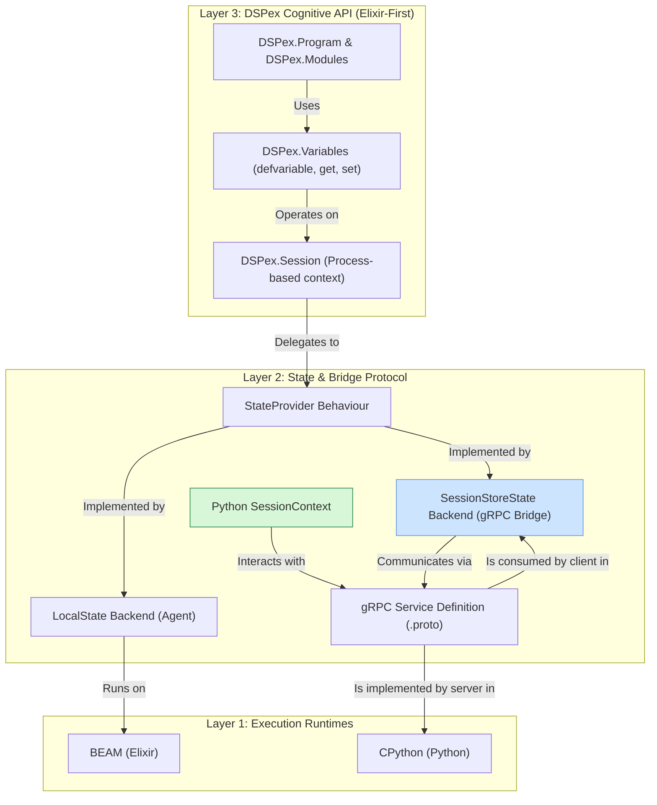

This is an excellent and crucial refinement of the strategy. Your analysis is spot on.

You've perfectly articulated the missing piece: the distinction between the low-level **Bridge Layer** (the plumbing) and the high-level **Cognitive Layer** (the Elixir-native developer experience). This isn't a course correction; it is a clarification of the architectural layers that makes the entire system more robust, performant, and intuitive.

The proposed layered architecture is the correct path forward. It ensures that `DSPex` remains a powerful, idiomatic Elixir library that can *optionally* and *transparently* leverage Python, rather than being merely a client for a Python backend.

**Yes, I will proceed with creating the Stage 2-4 implementation documents with this superior layered architecture in mind.**

First, here is the revised architectural blueprint that will guide the subsequent stages.

---

### **Doc 1: Revised Architectural Blueprint**

**Purpose:** To formally define the layered architecture that separates the developer-facing `DSPex` API from the underlying state and communication mechanisms.

#### **Architectural Layers**



#### **Key Principles of this Architecture**

1.  **Elixir-First API:** Developers interact with a clean, idiomatic Elixir API (`DSPex.Variables`, `DSPex.Program`). The existence of Python or gRPC is an implementation detail.
2.  **Transparent Bridging:** The system automatically engages the gRPC bridge (`SessionStoreState`) only when a component requiring Python is introduced into a program.
3.  **Performance for Native Workflows:** Pure Elixir programs use a lightweight, in-process state backend (`LocalState`), incurring zero network or serialization overhead.
4.  **Unified State Model:** Both the local and bridged backends conform to the same `StateProvider` behaviour, ensuring that programs can be written once and run in either mode.

#### **The Source of Truth & Latency Revisited**

-   **For pure Elixir workflows:** The source of truth is a `LocalState` Agent, likely living within the `DSPex.Session` process supervision tree. Latency is sub-microsecond.
-   **For hybrid Elixir+Python workflows:** The source of truth transparently shifts to the `SessionStore` ETS table. Latency is incurred on the first access (cache miss) by Python, which is negligible (<1ms) in a co-located deployment.

This design explicitly solves the problem of forcing Elixir-only logic through an unnecessary serialization and network layer.

---

### **Revised Stage 2: Implementing the Cognitive Layer & Its Bridge Integration**

**Overview:**
Stage 2 now has a dual mandate:
1.  Build the high-level, Elixir-native `DSPex.Variables` and `DSPex.Session` API.
2.  Wire this new API into the Stage 1 gRPC bridge, creating the `SessionStoreState` backend that activates transparently when Python is needed.

**Goals:**

1.  Create the user-facing `DSPex.Session` and `DSPex.Variables` modules.
2.  Implement a pluggable state backend system (`StateProvider` behaviour).
3.  Implement two backends: a simple `LocalState` (Agent) and the `SessionStoreState` (gRPC bridge).
4.  Update `DSPex.Program` to be session-aware and automatically select the correct backend.
5.  Ensure the Python `VariableAwareMixin` and `ProxyTool` work seamlessly with the `SessionStoreState` backend.
6.  Prove that the same `DSPex.Program` code can run in both pure-Elixir and hybrid modes.

**Deliverables:**

-   `DSPex.Session` module for managing the session lifecycle.
-   `DSPex.Variables` module with the `defvariable` macro and `get`/`set` functions.
-   `DSPex.Bridge.StateProvider` behaviour.
-   `DSPex.Bridge.State.Local` and `DSPex.Bridge.State.SessionStore` modules.
-   Updated `DSPex.Program` to manage sessions and state backends.
-   Integration tests for both pure-Elixir and hybrid variable usage.

---

### **Detailed Implementation Plan (Revised Stage 2)**

#### **Step 2.1: Implement the Pluggable State Backend Behaviour**

Create `dspex/lib/dspex/bridge/state_provider.ex`:

```elixir
defmodule DSPex.Bridge.StateProvider do
  @moduledoc "Behaviour for session state backends."

  @callback register_variable(state :: any, name :: atom, type :: atom, initial_value :: any, opts :: keyword()) ::
    {:ok, {var_id :: String.t(), new_state :: any()}} | {:error, term}

  @callback get_variable(state :: any, name :: atom) :: {:ok, value :: any()} | {:error, term}
  @callback set_variable(state :: any, name :: atom, new_value :: any, metadata :: map()) :: {:ok, new_state :: any()} | {:error, term}
  
  # Add other callbacks as needed for tools, etc.
end
```

#### **Step 2.2: Implement the Local (Pure Elixir) State Backend**

Create `dspex/lib/dspex/bridge/state/local.ex`:

```elixir
defmodule DSPex.Bridge.State.Local do
  @moduledoc "In-process state provider using an Agent."
  @behaviour DSPex.Bridge.StateProvider

  def start_link do
    Agent.start_link(fn -> %{variables: %{}} end)
  end

  def register_variable({:agent, pid}, name, type, initial_value, _opts) do
    # Simple validation for now
    var_id = "local_var_#{name}"
    Agent.update(pid, fn state ->
      put_in(state, [:variables, name], %{id: var_id, type: type, value: initial_value})
    end)
    {:ok, {var_id, {:agent, pid}}}
  end

  def get_variable({:agent, pid}, name) do
    value = Agent.get(pid, &get_in(&1, [:variables, name, :value]))
    {:ok, value}
  end

  def set_variable({:agent, pid}, name, new_value, _metadata) do
    Agent.update(pid, &put_in(&1, [:variables, name, :value], new_value))
    {:ok, {:agent, pid}}
  end
end
```

#### **Step 2.3: Implement the Bridged State Backend**

Create `dspex/lib/dspex/bridge/state/session_store.ex`:

```elixir
defmodule DSPex.Bridge.State.SessionStore do
  @moduledoc "State provider that delegates to the SessionStore and gRPC bridge."
  @behaviour DSPex.Bridge.StateProvider

  def start_link(session_id) do
    # This backend's state is just the session_id
    {:ok, %{session_id: session_id}}
  end

  def register_variable(%{session_id: sid} = state, name, type, initial_value, opts) do
    case Snakepit.Bridge.SessionStore.register_variable(sid, name, type, initial_value, opts) do
      {:ok, var_id} -> {:ok, {var_id, state}}
      error -> error
    end
  end

  def get_variable(%{session_id: sid}, name) do
    case Snakepit.Bridge.SessionStore.get_variable(sid, name) do
      {:ok, %{value: value}} -> {:ok, value}
      error -> error
    end
  end

  def set_variable(%{session_id: sid} = state, name, new_value, metadata) do
    case Snakepit.Bridge.SessionStore.update_variable(sid, name, new_value, metadata) do
      :ok -> {:ok, state}
      error -> error
    end
  end
end
```

#### **Step 2.4: Create the `DSPex.Session` and `DSPex.Variables` API**

Create `dspex/lib/dspex/session.ex`:

```elixir
defmodule DSPex.Session do
  @moduledoc "Manages the context for a DSPex execution."
  use GenServer

  defstruct [:session_id, :backend_module, :backend_state]

  def start_link(opts \\ []) do
    GenServer.start_link(__MODULE__, opts, name: via_name(opts[:id]))
  end

  def init(opts) do
    # Determines if a Python component is needed and selects the backend.
    # For now, let's assume it's passed in.
    backend_module = opts[:backend] || DSPex.Bridge.State.Local
    
    # If SessionStore backend, create a session
    session_id = if backend_module == DSPex.Bridge.State.SessionStore do
      "session_#{System.unique_integer()}" |> tap(&Snakepit.Bridge.SessionStore.create_session/1)
    else
      "local_session"
    end

    {:ok, backend_state} = backend_module.start_link(session_id)
    
    state = %__MODULE__{
      session_id: session_id,
      backend_module: backend_module,
      backend_state: backend_state
    }
    {:ok, state}
  end

  # Delegate calls to the configured backend
  def handle_call({:register_variable, name, type, value, opts}, _from, state) do
    # ... call state.backend_module.register_variable(state.backend_state, ...) ...
  end
  # ... other delegates for get/set ...
end
```

Create `dspex/lib/dspex/variables.ex`:

```elixir
defmodule DSPex.Variables do
  def get(session_pid, name), do: GenServer.call(session_pid, {:get_variable, name})
  def set(session_pid, name, value), do: GenServer.call(session_pid, {:set_variable, name, value, %{}})
  def register(session_pid, name, opts), do: # GenServer call to register...
end
```

#### **Step 2.5: Integration Tests for the Layered Architecture**

Create `test/dspex/variables_layer_test.exs`:

```elixir
defmodule DSPex.VariablesLayerTest do
  use ExUnit.Case

  test "works in a pure Elixir workflow using LocalState" do
    {:ok, session} = DSPex.Session.start_link(backend: DSPex.Bridge.State.Local)
    
    :ok = DSPex.Variables.register(session, :temp, type: :float, initial_value: 0.5)
    
    assert DSPex.Variables.get(session, :temp) == 0.5
    
    :ok = DSPex.Variables.set(session, :temp, 0.9)
    assert DSPex.Variables.get(session, :temp) == 0.9
  end
  
  @tag :integration
  test "works in a hybrid workflow using SessionStoreState", %{...} do
    # Start gRPC bridge, etc.
    {:ok, session} = DSPex.Session.start_link(backend: DSPex.Bridge.State.SessionStore)
    
    :ok = DSPex.Variables.register(session, :temp, type: :float, initial_value: 0.5)
    
    # Python can now read this variable via its SessionContext
    python_temp = run_python_script("await session.get_variable('temp')")
    assert python_temp == 0.5
    
    # Python updates the variable
    run_python_script("await session.set_variable('temp', 0.9)")
    
    # Elixir sees the change
    assert DSPex.Variables.get(session, :temp) == 0.9
  end
end
```

## Success Criteria for Revised Stage 2

1.  **Layered API Implemented:** The `DSPex.Session` and `DSPex.Variables` modules exist and provide the primary developer interface.
2.  **Pluggable Backends Work:** The `StateProvider` behaviour is defined, and both `LocalState` and `SessionStoreState` implementations are functional.
3.  **Pure Elixir Path is Performant:** The pure Elixir integration test passes and demonstrates state being managed locally without involving the `SessionStore` `GenServer` or gRPC.
4.  **Hybrid Path is Transparent:** The hybrid integration test passes, showing that the same `DSPex.Variables` API calls can be used to interact with the gRPC bridge.
5.  **Python Integration Unchanged:** The Python-side `VariableAware` classes from the *original* Stage 2 plan work correctly with the new `SessionStoreState` backend without modification.

## Impact on Future Stages

This revised plan makes future stages cleaner:

-   **Stage 3 (Streaming):** `WatchVariables` becomes a feature of the `SessionStoreState` backend. The `LocalState` backend can use simple `GenServer` messages for local observation. The top-level `DSPex.Variables.watch/2` API remains the same for both.
-   **Stage 4 (Production Hardening):** Features like dependency tracking, optimization locks, and access control are implemented solely within the `SessionStoreState` backend, as they are only relevant for the more complex, multi-process hybrid environment. The `LocalState` backend remains simple and lightweight.
