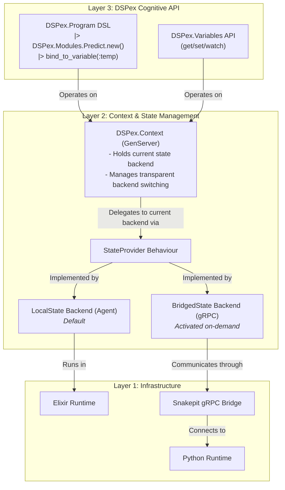

Yes, absolutely. The document you provided, `30_claude_architectural_synthesis.md`, is not just "good enough"—it's a critical synthesis that provides the missing link between the low-level bridge implementation and the high-level cognitive architecture.

My last response correctly identified the need for a layered approach, but this document provides a much more elegant and concrete vision for what that top layer, the **DSPex Cognitive Layer**, should look like. It introduces two key concepts that significantly improve the plan:

1.  **The Unified `DSPex.Context`:** A single, process-bound context that elegantly manages the state backend, session ID, and gRPC channel. This is a cleaner abstraction than my proposed `DSPex.Session`.
2.  **Automatic Backend Switching:** The idea that the `DSPex.Context` can *transparently upgrade itself* from a lightweight local state to the full gRPC-bridged state the moment a Python-dependent component is added is brilliant. It perfectly realizes the goal of "progressive enhancement" and keeps pure Elixir workflows completely free of bridge overhead.

My last response was a good plan. Incorporating these ideas makes it an **excellent** one.

Here is the revised blueprint and implementation plan, fully integrating the insights from the synthesis document. This should be considered the new canonical plan for moving forward.

---

### **Doc 1: Revised Blueprint (Post-Synthesis)**

**Purpose:** To define the refined, layered architecture that provides a seamless developer experience, whether workflows are pure Elixir or hybrid Elixir+Python.

#### **Core Architectural Principles**

1.  **Context is King:** All operations occur within a `DSPex.Context` process, which is the single source of truth for an execution's configuration and state backend.
2.  **Pluggable & Automatic State:** The context uses a `StateProvider` behaviour. It starts with a lightweight `LocalState` backend and automatically, transparently upgrades to a `BridgedState` backend as needed.
3.  **Elixir-First DSL:** The developer interacts with a clean, pipe-based `DSPex.Program` DSL. The complexity of state management and cross-language communication is completely abstracted away.

#### **Refined Architecture Diagram**



---

### **Doc 2: The `DSPex.Context` and Program DSL**

**Purpose:** To specify the high-level API developers will use.

#### **The `DSPex.Context`**

This is the central process managing a single, isolated execution context.

```elixir
defmodule DSPex.Context do
  @moduledoc """
  Manages an isolated execution context, including its state backend and resources.
  """

  @doc "Starts a new context. It begins with a lightweight local state."
  @spec start_link(opts :: keyword()) :: GenServer.on_start()
  def start_link(opts \\ [])

  @doc "Stops the context and cleans up all associated resources."
  @spec stop(context :: pid) :: :ok
  def stop(context)

  @doc "Ensures the context is upgraded to support Python bridging if not already."
  @spec ensure_bridged(context :: pid) :: :ok
  def ensure_bridged(context)

  # Internal logic will handle the automatic switch from LocalState to BridgedState
end
```

#### **The `DSPex.Program` DSL**

The program definition becomes a clean, readable pipeline that explicitly declares its variables and their bindings.

```elixir
defmodule MyDSPexProgram do
  use DSPex.Program

  def build do
    # This is a pure data structure defining the program
    DSPex.Program.new()
    |> DSPex.Program.defvariable(:temperature, :float, initial: 0.7)
    |> DSPex.Program.defvariable(:model, :choice, initial: "gpt-4", constraints: %{choices: ["gpt-4", "claude-3"]})
    
    |> DSPex.Program.chain([
      # This is a native Elixir module. The context remains local.
      DSPex.Native.Modules.QueryClassifier.new()
      |> bind_to_variable(:model, as: :llm_model),

      # This is a Python module. Adding it will trigger the context to
      # automatically upgrade to the gRPC-bridged backend.
      DSPex.Modules.ChainOfThought.new("question -> answer")
      |> bind_to_variable(:temperature)
    ])
  end
end

# Execution
{:ok, context} = DSPex.Context.start_link()
program_spec = MyDSPexProgram.build()

# Running the program compiles the spec against the context.
# The context will see the Python module and upgrade its backend automatically.
{:ok, result} = DSPex.Program.run(program_spec, %{question: "What is DSPex?"}, context: context)

# An optimizer can now interact with the context's variables
DSPex.Variables.set(context, :temperature, 0.9)

# The next run will use the new temperature value
{:ok, result2} = DSPex.Program.run(program_spec, %{question: "How does it work?"}, context: context)
```

---

### **Doc 3: Revised Implementation Plan (Incorporating Synthesis)**

This plan integrates the refined architecture.

#### **Stage 0 & 1: Unchanged**
Continue as planned. The low-level gRPC plumbing and the `SessionStore` logic are still required as the implementation for the `BridgedState` backend.

#### **Revised Stage 2: Implement the Cognitive Layer**

**Goal:** Build the `DSPex.Context`, the pluggable state backends, and the automatic switching mechanism.

1.  **Implement `StateProvider` Behaviour:** Create the `DSPex.Bridge.StateProvider` behaviour as defined previously.

2.  **Implement `LocalState` Backend:** Create the `DSPex.Bridge.State.Local` Agent-based backend. This will be simple and fast for Elixir-only workflows.

3.  **Implement `BridgedState` Backend:** Create the `DSPex.Bridge.State.Bridged`. This module will be a client for the `SessionStore` GenServer and the `Snakepit.GRPC.Client`. All its functions will delegate to the gRPC bridge. This is the adapter that connects our high-level API to the low-level infrastructure.

4.  **Implement `DSPex.Context` GenServer:**
    *   `init/1`: Starts with `backend_module: LocalState` and an instance of it in `:backend_state`.
    *   `handle_call({:get_variable, ...})`: Delegates the call to the module stored in `state.backend_module`.
    *   `handle_call(:ensure_bridged, ...)`: This is the key function.
        *   If the current backend is already `BridgedState`, do nothing and reply `:ok`.
        *   If the current backend is `LocalState`:
            a. Start a new `GRPCWorker`.
            b. Create a new `SessionStore` session.
            c. Create an instance of the `BridgedState` backend.
            d. **Migrate state:** Read all variables from the `LocalState` Agent and register them in the new `SessionStore` session via the `BridgedState` backend.
            e. Atomically swap the context's state to `backend_module: BridgedState` and the new `:backend_state`.
            f. Terminate the old `LocalState` Agent.
            g. Reply `:ok`.

5.  **Update `DSPex.Program`:**
    *   `DSPex.Program.run/3` will now be responsible for analyzing the program spec.
    *   Before executing the chain, it will inspect the modules. If it finds any Python-based module (e.g., `DSPex.Modules.ChainOfThought`), it will call `DSPex.Context.ensure_bridged(context)` before proceeding. This triggers the transparent upgrade.

#### **Revised Stage 3: Reactive Features for the Cognitive Layer**

**Goal:** Expose the gRPC streaming capabilities through the high-level `DSPex.Context` API.

1.  **Implement `watch` in `StateProvider`:** Add a `watch_variables/3` callback to the `StateProvider` behaviour.
2.  **Implement `watch` in `LocalState`:** The `LocalState` backend will implement watching via simple `GenServer.cast` messages from the Agent to the watching process.
3.  **Implement `watch` in `BridgedState`:** This backend will delegate to the gRPC streaming client implemented in the original Stage 3 plan.
4.  **Create `DSPex.Variables.watch/2`:** This public API function will simply call the `watch_variables` function on the `DSPex.Context` process, which then delegates to its current backend. This way, the user doesn't need to know or care which backend is active.

#### **Revised Stage 4: Production Hardening the `BridgedState` Backend**

**Goal:** Implement the advanced production features (dependencies, optimization locks, etc.) *specifically within the `BridgedState` backend*.

1.  **Implement Dependency Logic:** The dependency graph, cycle detection, etc., are implemented as part of the `BridgedState` backend, interacting directly with the `SessionStore`. The `LocalState` backend can have a no-op implementation for these features, as they are irrelevant in a single-process context.
2.  **Implement Optimization & Security:** The optimizer locks and access control logic are also implemented exclusively in the `BridgedState` backend.
3.  **Expose via API:** The `DSPex.Variables` and `DSPex.Context` APIs are updated to expose these features, which will return `{:error, :not_supported_by_backend}` if called when the context is still in `LocalState` mode, or handle them gracefully.

By targeting the advanced features to the `BridgedState` backend, we keep the pure Elixir path maximally lightweight and simple, while providing the full suite of production capabilities for the more complex, hybrid workflows that require them. This is the essence of the refined, layered strategy.
