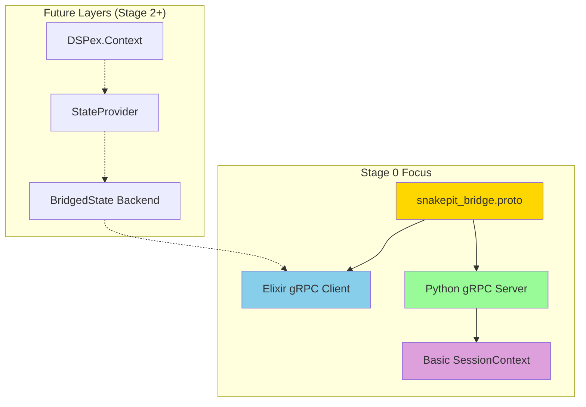

# Revised Stage 0: Protocol Foundation & Core Plumbing

## Overview

Stage 0 establishes the robust gRPC communication channel between Elixir and Python, replacing the simple command-based protocol with a rich, type-safe foundation. This stage focuses on getting the infrastructure correct before adding business logic. 

**Key Insight:** This foundation will support both direct gRPC usage and the higher-level DSPex Cognitive Layer that will be built in Stage 2.

## Goals

1. Define the complete protobuf protocol for the unified bridge
2. Generate gRPC code for both Elixir and Python
3. Update existing gRPC infrastructure to use the new protocol
4. Establish the basic `SessionContext` pattern in Python
5. Verify end-to-end communication with comprehensive tests

## Architectural Context



## Deliverables

- Complete `snakepit_bridge.proto` with all message types
- Updated Elixir gRPC worker using new protocol
- Updated Python gRPC server implementing new service
- Basic `SessionContext` class in Python
- Comprehensive test suite demonstrating protocol functionality

## Detailed Implementation Plan

### 1. Protocol Definition

Create `snakepit/priv/protos/snakepit_bridge.proto`:

```protobuf
syntax = "proto3";

package snakepit.bridge;

import "google/protobuf/any.proto";
import "google/protobuf/timestamp.proto";

service SnakepitBridge {
  // Health & Session Management
  rpc Ping(PingRequest) returns (PingResponse);
  rpc InitializeSession(InitializeSessionRequest) returns (InitializeSessionResponse);
  rpc CleanupSession(CleanupSessionRequest) returns (CleanupSessionResponse);
  
  // Variable Operations
  rpc GetVariable(GetVariableRequest) returns (GetVariableResponse);
  rpc SetVariable(SetVariableRequest) returns (SetVariableResponse);
  rpc GetVariables(BatchGetVariablesRequest) returns (BatchGetVariablesResponse);
  rpc SetVariables(BatchSetVariablesRequest) returns (BatchSetVariablesResponse);
  rpc RegisterVariable(RegisterVariableRequest) returns (RegisterVariableResponse);
  
  // Tool Execution
  rpc ExecuteTool(ExecuteToolRequest) returns (ExecuteToolResponse);
  rpc ExecuteStreamingTool(ExecuteToolRequest) returns (stream ToolChunk);
  
  // Streaming & Reactive
  rpc WatchVariables(WatchVariablesRequest) returns (stream VariableUpdate);
  
  // Advanced Features (Stage 4)
  rpc AddDependency(AddDependencyRequest) returns (AddDependencyResponse);
  rpc StartOptimization(StartOptimizationRequest) returns (StartOptimizationResponse);
  rpc StopOptimization(StopOptimizationRequest) returns (StopOptimizationResponse);
  rpc GetVariableHistory(GetVariableHistoryRequest) returns (GetVariableHistoryResponse);
  rpc RollbackVariable(RollbackVariableRequest) returns (RollbackVariableResponse);
}

// Core Messages
message PingRequest {
  string message = 1;
}

message PingResponse {
  string message = 1;
  google.protobuf.Timestamp server_time = 2;
}

message InitializeSessionRequest {
  string session_id = 1;
  map<string, string> metadata = 2;
  SessionConfig config = 3;
}

message SessionConfig {
  bool enable_caching = 1;
  int32 cache_ttl_seconds = 2;
  bool enable_telemetry = 3;
}

message InitializeSessionResponse {
  bool success = 1;
  string error_message = 2;
  map<string, ToolSpec> available_tools = 3;
  map<string, Variable> initial_variables = 4;
}

message CleanupSessionRequest {
  string session_id = 1;
  bool force = 2;
}

message CleanupSessionResponse {
  bool success = 1;
  int32 resources_cleaned = 2;
}

// Variable Messages
message Variable {
  string id = 1;
  string name = 2;
  string type = 3;
  google.protobuf.Any value = 4;
  string constraints_json = 5;
  map<string, string> metadata = 6;
  enum Source {
    ELIXIR = 0;
    PYTHON = 1;
  }
  Source source = 7;
  google.protobuf.Timestamp last_updated_at = 8;
  int32 version = 9;
  
  // Advanced fields (Stage 4)
  string access_control_json = 10;
  OptimizationStatus optimization_status = 11;
}

message OptimizationStatus {
  bool optimizing = 1;
  string optimizer_id = 2;
  google.protobuf.Timestamp started_at = 3;
}

message RegisterVariableRequest {
  string session_id = 1;
  string name = 2;
  string type = 3;
  google.protobuf.Any initial_value = 4;
  string constraints_json = 5;
  map<string, string> metadata = 6;
}

message RegisterVariableResponse {
  bool success = 1;
  string variable_id = 2;
  string error_message = 3;
}

message GetVariableRequest {
  string session_id = 1;
  string variable_identifier = 2; // Can be ID or name
  bool bypass_cache = 3;
}

message GetVariableResponse {
  Variable variable = 1;
  bool from_cache = 2;
}

message SetVariableRequest {
  string session_id = 1;
  string variable_identifier = 2;
  google.protobuf.Any value = 3;
  map<string, string> metadata = 4;
  int32 expected_version = 5; // For optimistic locking
}

message SetVariableResponse {
  bool success = 1;
  string error_message = 2;
  int32 new_version = 3;
}

message BatchGetVariablesRequest {
  string session_id = 1;
  repeated string variable_identifiers = 2;
  bool include_metadata = 3;
  bool bypass_cache = 4;
}

message BatchGetVariablesResponse {
  map<string, Variable> variables = 1;
  repeated string missing_variables = 2;
}

message BatchSetVariablesRequest {
  string session_id = 1;
  map<string, google.protobuf.Any> updates = 2;
  map<string, string> metadata = 3;
  bool atomic = 4;
}

message BatchSetVariablesResponse {
  bool success = 1;
  map<string, string> errors = 2;
  map<string, int32> new_versions = 3;
}

// Tool Messages
message ToolSpec {
  string name = 1;
  string description = 2;
  repeated ParameterSpec parameters = 3;
  map<string, string> metadata = 4;
  bool supports_streaming = 5;
  repeated string required_variables = 6;
}

message ParameterSpec {
  string name = 1;
  string type = 2;
  string description = 3;
  bool required = 4;
  google.protobuf.Any default_value = 5;
  string validation_json = 6;
}

message ExecuteToolRequest {
  string session_id = 1;
  string tool_name = 2;
  map<string, google.protobuf.Any> parameters = 3;
  map<string, string> metadata = 4;
  bool stream = 5;
}

message ExecuteToolResponse {
  bool success = 1;
  google.protobuf.Any result = 2;
  string error_message = 3;
  map<string, string> metadata = 4;
  int64 execution_time_ms = 5;
}

message ToolChunk {
  string chunk_id = 1;
  bytes data = 2;
  bool is_final = 3;
  map<string, string> metadata = 4;
}

// Streaming Messages
message WatchVariablesRequest {
  string session_id = 1;
  repeated string variable_identifiers = 2;
  bool include_initial_values = 3;
}

message VariableUpdate {
  string variable_id = 1;
  Variable variable = 2;
  string update_source = 3;
  map<string, string> update_metadata = 4;
  google.protobuf.Timestamp timestamp = 5;
  string update_type = 6; // "value_change", "constraint_change", etc.
}

// Advanced Messages (Stage 4)
message AddDependencyRequest {
  string session_id = 1;
  string from_variable = 2;
  string to_variable = 3;
  string dependency_type = 4;
}

message AddDependencyResponse {
  bool success = 1;
  string error_message = 2;
}

message StartOptimizationRequest {
  string session_id = 1;
  string variable_identifier = 2;
  string optimizer_id = 3;
  map<string, string> optimizer_config = 4;
}

message StartOptimizationResponse {
  bool success = 1;
  string error_message = 2;
  string optimization_id = 3;
}

message StopOptimizationRequest {
  string session_id = 1;
  string variable_identifier = 2;
  bool force = 3;
}

message StopOptimizationResponse {
  bool success = 1;
  google.protobuf.Any final_value = 2;
}

message GetVariableHistoryRequest {
  string session_id = 1;
  string variable_identifier = 2;
  int32 limit = 3;
}

message GetVariableHistoryResponse {
  repeated VariableHistoryEntry entries = 1;
}

message VariableHistoryEntry {
  int32 version = 1;
  google.protobuf.Any value = 2;
  google.protobuf.Timestamp timestamp = 3;
  string changed_by = 4;
  map<string, string> metadata = 5;
}

message RollbackVariableRequest {
  string session_id = 1;
  string variable_identifier = 2;
  int32 target_version = 3;
}

message RollbackVariableResponse {
  bool success = 1;
  Variable variable = 2;
  string error_message = 3;
}
```

### 2. Code Generation Setup

#### Elixir Side

Update `snakepit/mix.exs`:

```elixir
defp deps do
  [
    # ... existing deps ...
    {:grpc, "~> 0.7"},
    {:protobuf, "~> 0.12"},
    # ... 
  ]
end

defp aliases do
  [
    # ... existing aliases ...
    "grpc.gen": [
      "cmd mkdir -p lib/snakepit/grpc/generated",
      "cmd protoc --elixir_out=plugins=grpc:./lib/snakepit/grpc/generated --proto_path=priv/protos priv/protos/snakepit_bridge.proto"
    ]
  ]
end
```

#### Python Side

Create `snakepit/priv/python/requirements.txt`:

```txt
grpcio>=1.60.0
grpcio-tools>=1.60.0
protobuf>=4.25.0
```

Create `snakepit/priv/python/generate_grpc.sh`:

```bash
#!/bin/bash
cd "$(dirname "$0")"
python -m grpc_tools.protoc \
  -I../../protos \
  --python_out=snakepit_bridge/grpc \
  --pyi_out=snakepit_bridge/grpc \
  --grpc_python_out=snakepit_bridge/grpc \
  ../../protos/snakepit_bridge.proto
```

### 3. Update Elixir gRPC Infrastructure

#### Update `snakepit/lib/snakepit/grpc_worker.ex`:

```elixir
defmodule Snakepit.GRPCWorker do
  use GenServer
  require Logger
  
  alias Snakepit.GRPC.Client
  alias Snakepit.Pool.ProcessRegistry
  
  defstruct [:port, :os_pid, :channel, :adapter, :config, :session_id]
  
  def start_link(config) do
    GenServer.start_link(__MODULE__, config)
  end
  
  def init(config) do
    # Generate unique session ID
    session_id = generate_session_id()
    
    state = %__MODULE__{
      adapter: config[:adapter],
      config: config,
      session_id: session_id
    }
    
    case start_python_server(config) do
      {:ok, port, os_pid} ->
        Process.flag(:trap_exit, true)
        ProcessRegistry.register(os_pid)
        
        # Start a task to handle port output and detect readiness
        {:ok, ready_ref} = start_server_monitor(port, config[:grpc_port])
        
        # Wait for server readiness signal
        receive do
          {:server_ready, ^ready_ref, grpc_port} ->
            Logger.info("Python server ready on port #{grpc_port}")
            
            # Connect gRPC client
            case Client.connect(grpc_port) do
              {:ok, channel} ->
                # Initialize session with config
                session_config = %{
                  enable_caching: config[:enable_caching] || true,
                  cache_ttl_seconds: config[:cache_ttl] || 60,
                  enable_telemetry: config[:enable_telemetry] || false
                }
                
                case Client.initialize_session(channel, session_id, session_config) do
                  {:ok, response} ->
                    if response.success do
                      Logger.info("Session initialized: #{session_id}")
                      {:ok, %{state | port: port, os_pid: os_pid, channel: channel}}
                    else
                      cleanup(port, os_pid)
                      {:stop, {:initialization_failed, response.error_message}}
                    end
                  {:error, reason} ->
                    cleanup(port, os_pid)
                    {:stop, {:initialization_failed, reason}}
                end
              {:error, reason} ->
                cleanup(port, os_pid)
                {:stop, {:connection_failed, reason}}
            end
            
          {:server_failed, ^ready_ref, reason} ->
            cleanup(port, os_pid)
            {:stop, {:server_startup_failed, reason}}
            
        after
          config[:startup_timeout] || 30_000 ->
            cleanup(port, os_pid)
            {:stop, :server_startup_timeout}
        end
        
      {:error, reason} ->
        {:stop, reason}
    end
  end
  
  # Public API
  def get_channel(worker), do: GenServer.call(worker, :get_channel)
  def get_session_id(worker), do: GenServer.call(worker, :get_session_id)
  
  # Callbacks
  def handle_call(:get_channel, _from, state) do
    {:reply, {:ok, state.channel}, state}
  end
  
  def handle_call(:get_session_id, _from, state) do
    {:reply, {:ok, state.session_id}, state}
  end
  
  def handle_call({:execute, code, options}, from, state) do
    # Legacy support - will be removed after migration
    Logger.warn("Using legacy execute API - please migrate to gRPC calls")
    # Convert to ExecuteTool call
    handle_call({:execute_tool, "legacy_exec", %{code: code, options: options}}, from, state)
  end
  
  def handle_call({:execute_tool, tool_name, params}, _from, state) do
    case Client.execute_tool(state.channel, state.session_id, tool_name, params) do
      {:ok, response} ->
        if response.success do
          {:reply, {:ok, response.result}, state}
        else
          {:reply, {:error, response.error_message}, state}
        end
      {:error, reason} ->
        {:reply, {:error, reason}, state}
    end
  end
  
  def terminate(_reason, state) do
    if state.channel && state.session_id do
      # Best effort cleanup
      Client.cleanup_session(state.channel, state.session_id, true)
      :ok = GRPC.Channel.close(state.channel)
    end
    
    if state.port && state.os_pid do
      cleanup(state.port, state.os_pid)
    end
  end
  
  # Private functions
  defp generate_session_id do
    "session_#{:erlang.unique_integer([:positive, :monotonic])}_#{:erlang.system_time(:microsecond)}"
  end
  
  defp start_python_server(config) do
    python_path = config[:python_path] || System.find_executable("python3") || "python"
    script_path = Path.join(:code.priv_dir(:snakepit), "python/grpc_server.py")
    
    port_args = [
      "--port", to_string(config[:grpc_port]),
      "--adapter", config[:bridge_module] || "snakepit_bridge.adapters.enhanced",
      "--log-level", config[:log_level] || "INFO"
    ]
    
    env = [
      {"PYTHONUNBUFFERED", "1"},
      {"GRPC_VERBOSITY", config[:grpc_verbosity] || "ERROR"}
    ]
    
    port_opts = [
      :binary,
      :exit_status,
      {:line, 4096},
      {:args, port_args},
      {:cd, Path.dirname(script_path)},
      {:env, env}
    ]
    
    port = Port.open({:spawn_executable, python_path}, port_opts)
    
    case Port.info(port) do
      nil ->
        {:error, :port_failed}
      info ->
        {:ok, port, info[:os_pid]}
    end
  end
  
  defp start_server_monitor(port, expected_grpc_port) do
    ref = make_ref()
    parent = self()
    
    task = Task.async(fn ->
      monitor_port_output(port, parent, ref, expected_grpc_port)
    end)
    
    {:ok, ref}
  end
  
  defp monitor_port_output(port, parent, ref, expected_grpc_port) do
    receive do
      {^port, {:data, {:line, line}}} ->
        # Log all Python output for debugging
        Logger.debug("Python output: #{line}")
        
        # Check for the ready signal
        case String.trim(line) do
          "GRPC_READY:" <> port_str ->
            case Integer.parse(port_str) do
              {port_num, ""} when port_num == expected_grpc_port ->
                send(parent, {:server_ready, ref, port_num})
              _ ->
                Logger.warn("Unexpected port in ready signal: #{port_str}")
                monitor_port_output(port, parent, ref, expected_grpc_port)
            end
          _ ->
            # Check for common error patterns
            cond do
              String.contains?(line, "Error") || String.contains?(line, "ERROR") ->
                Logger.error("Python error: #{line}")
              String.contains?(line, "Warning") || String.contains?(line, "WARNING") ->
                Logger.warn("Python warning: #{line}")
              true ->
                :ok
            end
            monitor_port_output(port, parent, ref, expected_grpc_port)
        end
        
      {^port, {:data, {:noeol, partial}}} ->
        # Handle partial lines
        Logger.debug("Python partial output: #{partial}")
        monitor_port_output(port, parent, ref, expected_grpc_port)
        
      {^port, {:exit_status, status}} ->
        send(parent, {:server_failed, ref, {:exit_status, status}})
        
      {:EXIT, ^port, reason} ->
        send(parent, {:server_failed, ref, {:port_exit, reason}})
        
    after
      60_000 ->
        send(parent, {:server_failed, ref, :monitor_timeout})
    end
  end
  
  defp cleanup(port, os_pid) do
    Port.close(port)
    ProcessRegistry.unregister(os_pid)
    # Ensure process is terminated
    case :os.type() do
      {:unix, _} -> System.cmd("kill", ["-TERM", to_string(os_pid)])
      _ -> :ok
    end
  end
end
```

### 4. Create Elixir gRPC Client

Create `snakepit/lib/snakepit/grpc/client.ex`:

```elixir
defmodule Snakepit.GRPC.Client do
  @moduledoc """
  gRPC client for the unified bridge protocol.
  """
  
  require Logger
  
  alias Snakepit.Bridge.{
    SnakepitBridge.Stub,
    PingRequest, PingResponse,
    InitializeSessionRequest, InitializeSessionResponse,
    CleanupSessionRequest, CleanupSessionResponse,
    GetVariableRequest, GetVariableResponse,
    SetVariableRequest, SetVariableResponse,
    RegisterVariableRequest, RegisterVariableResponse,
    ExecuteToolRequest, ExecuteToolResponse
  }
  
  @default_timeout 30_000
  @default_deadline 60_000
  
  def connect(port) when is_integer(port) do
    connect("localhost:#{port}")
  end
  
  def connect(address) when is_binary(address) do
    opts = [
      interceptors: [GRPC.Logger.Client]
    ]
    
    case GRPC.Stub.connect(address, opts) do
      {:ok, channel} ->
        # Verify connection with ping
        case ping(channel, "connection_test") do
          {:ok, _} -> {:ok, channel}
          error -> error
        end
      error ->
        error
    end
  end
  
  def ping(channel, message, opts \\ []) do
    request = PingRequest.new(message: message)
    
    channel
    |> Stub.ping(request, build_call_opts(opts))
    |> handle_response()
  end
  
  def initialize_session(channel, session_id, config \\ %{}, opts \\ []) do
    session_config = struct(SessionConfig, config)
    
    request = InitializeSessionRequest.new(
      session_id: session_id,
      metadata: %{
        "elixir_node" => to_string(node()),
        "initialized_at" => DateTime.to_iso8601(DateTime.utc_now())
      },
      config: session_config
    )
    
    channel
    |> Stub.initialize_session(request, build_call_opts(opts))
    |> handle_response()
  end
  
  def cleanup_session(channel, session_id, force \\ false, opts \\ []) do
    request = CleanupSessionRequest.new(
      session_id: session_id,
      force: force
    )
    
    channel
    |> Stub.cleanup_session(request, build_call_opts(opts))
    |> handle_response()
  end
  
  def register_variable(channel, session_id, name, type, initial_value, constraints \\ %{}, opts \\ []) do
    request = RegisterVariableRequest.new(
      session_id: session_id,
      name: to_string(name),
      type: to_string(type),
      initial_value: encode_any(initial_value),
      constraints_json: Jason.encode!(constraints),
      metadata: opts[:metadata] || %{}
    )
    
    channel
    |> Stub.register_variable(request, build_call_opts(opts))
    |> handle_response()
  end
  
  def get_variable(channel, session_id, identifier, opts \\ []) do
    request = GetVariableRequest.new(
      session_id: session_id,
      variable_identifier: to_string(identifier),
      bypass_cache: opts[:bypass_cache] || false
    )
    
    channel
    |> Stub.get_variable(request, build_call_opts(opts))
    |> handle_response()
  end
  
  def set_variable(channel, session_id, identifier, value, opts \\ []) do
    request = SetVariableRequest.new(
      session_id: session_id,
      variable_identifier: to_string(identifier),
      value: encode_any(value),
      metadata: opts[:metadata] || %{},
      expected_version: opts[:expected_version] || 0
    )
    
    channel
    |> Stub.set_variable(request, build_call_opts(opts))
    |> handle_response()
  end
  
  def execute_tool(channel, session_id, tool_name, parameters, opts \\ []) do
    proto_params = Enum.into(parameters, %{}, fn {k, v} ->
      {to_string(k), encode_any(v)}
    end)
    
    request = ExecuteToolRequest.new(
      session_id: session_id,
      tool_name: tool_name,
      parameters: proto_params,
      metadata: opts[:metadata] || %{},
      stream: opts[:stream] || false
    )
    
    channel
    |> Stub.execute_tool(request, build_call_opts(opts))
    |> handle_response()
  end
  
  # Helper functions
  defp build_call_opts(opts) do
    timeout = opts[:timeout] || @default_timeout
    deadline = opts[:deadline] || @default_deadline
    
    [
      timeout: timeout,
      deadline: GRPC.TimeUtils.from_relative(deadline)
    ]
  end
  
  defp handle_response({:ok, response, _headers}), do: {:ok, response}
  defp handle_response({:ok, response}), do: {:ok, response}
  defp handle_response({:error, %GRPC.RPCError{} = error}) do
    Logger.error("gRPC error: #{inspect(error)}")
    {:error, error}
  end
  defp handle_response(error), do: error
  
  defp encode_any(value) when is_binary(value) do
    Google.Protobuf.Any.new(
      type_url: "type.googleapis.com/google.protobuf.StringValue",
      value: Google.Protobuf.StringValue.new(value: value) |> Google.Protobuf.StringValue.encode()
    )
  end
  
  defp encode_any(value) when is_integer(value) do
    Google.Protobuf.Any.new(
      type_url: "type.googleapis.com/google.protobuf.Int64Value",
      value: Google.Protobuf.Int64Value.new(value: value) |> Google.Protobuf.Int64Value.encode()
    )
  end
  
  defp encode_any(value) when is_float(value) do
    Google.Protobuf.Any.new(
      type_url: "type.googleapis.com/google.protobuf.DoubleValue",
      value: Google.Protobuf.DoubleValue.new(value: value) |> Google.Protobuf.DoubleValue.encode()
    )
  end
  
  defp encode_any(value) when is_boolean(value) do
    Google.Protobuf.Any.new(
      type_url: "type.googleapis.com/google.protobuf.BoolValue",
      value: Google.Protobuf.BoolValue.new(value: value) |> Google.Protobuf.BoolValue.encode()
    )
  end
  
  defp encode_any(value) when is_map(value) or is_list(value) do
    # For complex types, use JSON encoding
    json_string = Jason.encode!(value)
    encode_any(json_string)
  end
  
  defp encode_any(value) do
    # Fallback to string representation
    encode_any(to_string(value))
  end
end
```

### 5. Update Python gRPC Server

Create `snakepit/priv/python/grpc_server.py`:

```python
#!/usr/bin/env python3
"""
Unified gRPC bridge server for DSPex.
"""

import argparse
import asyncio
import grpc
import logging
import signal
import sys
from concurrent import futures
from datetime import datetime
from typing import Dict, Optional

# Add the package to Python path
sys.path.insert(0, '.')

from snakepit_bridge.grpc import snakepit_bridge_pb2 as pb2
from snakepit_bridge.grpc import snakepit_bridge_pb2_grpc as pb2_grpc
from snakepit_bridge.session_context import SessionContext
from google.protobuf.timestamp_pb2 import Timestamp

logging.basicConfig(
    format='%(asctime)s - %(name)s - %(levelname)s - %(message)s',
    level=logging.INFO
)
logger = logging.getLogger(__name__)


class SnakepitBridgeServicer(pb2_grpc.SnakepitBridgeServicer):
    """Implementation of the unified gRPC bridge service."""
    
    def __init__(self, adapter_class):
        self.adapter_class = adapter_class
        self.sessions: Dict[str, SessionContext] = {}
        self.adapters: Dict[str, object] = {}
        self.server: Optional[grpc.aio.Server] = None
    
    async def Ping(self, request, context):
        """Health check endpoint."""
        logger.debug(f"Ping received: {request.message}")
        
        response = pb2.PingResponse()
        response.message = f"Pong: {request.message}"
        
        # Set current timestamp
        timestamp = Timestamp()
        timestamp.GetCurrentTime()
        response.server_time.CopyFrom(timestamp)
        
        return response
    
    async def InitializeSession(self, request, context):
        """Initialize a new session."""
        logger.info(f"Initializing session: {request.session_id}")
        
        try:
            # Create session context with config
            config = {
                'enable_caching': request.config.enable_caching,
                'cache_ttl': request.config.cache_ttl_seconds,
                'enable_telemetry': request.config.enable_telemetry,
                'metadata': dict(request.metadata)
            }
            
            session = SessionContext(request.session_id, config)
            self.sessions[request.session_id] = session
            
            # Create adapter instance
            adapter = self.adapter_class()
            adapter.set_session_context(session)
            self.adapters[request.session_id] = adapter
            
            # Initialize adapter (may register tools/variables)
            if hasattr(adapter, 'initialize'):
                await adapter.initialize()
            
            response = pb2.InitializeSessionResponse()
            response.success = True
            
            # Populate available tools
            for tool_name, tool_spec in session.get_tools().items():
                proto_spec = pb2.ToolSpec()
                proto_spec.name = tool_name
                proto_spec.description = tool_spec.get('description', '')
                proto_spec.supports_streaming = tool_spec.get('supports_streaming', False)
                response.available_tools[tool_name].CopyFrom(proto_spec)
            
            return response
            
        except Exception as e:
            logger.error(f"Failed to initialize session: {e}", exc_info=True)
            response = pb2.InitializeSessionResponse()
            response.success = False
            response.error_message = str(e)
            return response
    
    async def CleanupSession(self, request, context):
        """Clean up a session."""
        logger.info(f"Cleaning up session: {request.session_id}")
        
        response = pb2.CleanupSessionResponse()
        resources_cleaned = 0
        
        if request.session_id in self.sessions:
            session = self.sessions[request.session_id]
            
            # Clean up adapter
            if request.session_id in self.adapters:
                adapter = self.adapters[request.session_id]
                if hasattr(adapter, 'cleanup'):
                    await adapter.cleanup()
                del self.adapters[request.session_id]
                resources_cleaned += 1
            
            # Clean up session
            await session.cleanup()
            del self.sessions[request.session_id]
            resources_cleaned += 1
            
            response.success = True
        else:
            response.success = False
            
        response.resources_cleaned = resources_cleaned
        return response
    
    async def GetVariable(self, request, context):
        """Get a variable value - placeholder for Stage 1."""
        context.set_code(grpc.StatusCode.UNIMPLEMENTED)
        context.set_details('GetVariable not implemented until Stage 1')
        return pb2.GetVariableResponse()
    
    async def SetVariable(self, request, context):
        """Set a variable value - placeholder for Stage 1."""
        context.set_code(grpc.StatusCode.UNIMPLEMENTED)
        context.set_details('SetVariable not implemented until Stage 1')
        return pb2.SetVariableResponse()
    
    async def ExecuteTool(self, request, context):
        """Execute a tool - placeholder for Stage 2."""
        context.set_code(grpc.StatusCode.UNIMPLEMENTED)
        context.set_details('ExecuteTool not implemented until Stage 2')
        return pb2.ExecuteToolResponse()
    
    async def WatchVariables(self, request, context):
        """Watch variables for changes - placeholder for Stage 3."""
        context.set_code(grpc.StatusCode.UNIMPLEMENTED)
        context.set_details('WatchVariables not implemented until Stage 3')
        # Return empty generator to satisfy type requirements
        async def empty_generator():
            return
            yield  # Make it a generator
        return empty_generator()
    
    def set_server(self, server):
        """Set the server reference for graceful shutdown."""
        self.server = server


async def serve(port: int, adapter_module: str):
    """Start the gRPC server."""
    # Import the adapter
    module_parts = adapter_module.split('.')
    module_name = '.'.join(module_parts[:-1])
    class_name = module_parts[-1]
    
    try:
        module = __import__(module_name, fromlist=[class_name])
        adapter_class = getattr(module, class_name)
    except (ImportError, AttributeError) as e:
        logger.error(f"Failed to import adapter {adapter_module}: {e}")
        sys.exit(1)
    
    # Create server
    server = grpc.aio.server(
        futures.ThreadPoolExecutor(max_workers=10),
        options=[
            ('grpc.max_send_message_length', 100 * 1024 * 1024),  # 100MB
            ('grpc.max_receive_message_length', 100 * 1024 * 1024),
        ]
    )
    
    servicer = SnakepitBridgeServicer(adapter_class)
    servicer.set_server(server)
    
    pb2_grpc.add_SnakepitBridgeServicer_to_server(servicer, server)
    
    # Listen on port
    server.add_insecure_port(f'[::]:{port}')
    
    logger.info(f"Starting gRPC server on port {port}")
    await server.start()
    
    # Signal readiness
    print(f"GRPC_READY:{port}", flush=True)
    
    # Setup graceful shutdown
    loop = asyncio.get_event_loop()
    
    def handle_signal():
        logger.info("Received shutdown signal")
        loop.create_task(shutdown(server))
    
    for sig in (signal.SIGTERM, signal.SIGINT):
        signal.signal(sig, lambda s, f: handle_signal())
    
    try:
        await server.wait_for_termination()
    except asyncio.CancelledError:
        pass
    
    logger.info("Server stopped")


async def shutdown(server):
    """Gracefully shutdown the server."""
    logger.info("Stopping server gracefully...")
    await server.stop(grace=5)


def main():
    parser = argparse.ArgumentParser(description='DSPex gRPC Bridge Server')
    parser.add_argument('--port', type=int, default=50051, 
                       help='Port to listen on')
    parser.add_argument('--adapter', type=str, 
                       default='snakepit_bridge.adapters.enhanced.EnhancedBridge',
                       help='Adapter class to use')
    parser.add_argument('--log-level', type=str, default='INFO',
                       choices=['DEBUG', 'INFO', 'WARNING', 'ERROR'],
                       help='Logging level')
    
    args = parser.parse_args()
    
    # Update logging level
    logging.getLogger().setLevel(getattr(logging, args.log_level))
    
    try:
        asyncio.run(serve(args.port, args.adapter))
    except KeyboardInterrupt:
        logger.info("Server interrupted by user")
    except Exception as e:
        logger.error(f"Server failed: {e}", exc_info=True)
        sys.exit(1)


if __name__ == '__main__':
    main()
```

### 6. Create Basic SessionContext

Create `snakepit/priv/python/snakepit_bridge/session_context.py`:

```python
"""
SessionContext manages the Python-side session state.
"""

import asyncio
import time
from typing import Dict, Any, Optional, Tuple, List
from datetime import datetime, timedelta
import logging

logger = logging.getLogger(__name__)


class SessionContext:
    """
    Manages session state and provides unified access to variables and tools.
    
    This is a minimal implementation for Stage 0. It will be significantly
    expanded in subsequent stages.
    """
    
    def __init__(self, session_id: str, config: Optional[Dict[str, Any]] = None):
        self.session_id = session_id
        self.config = config or {}
        
        # Configuration
        self._cache_enabled = self.config.get('enable_caching', True)
        self._cache_ttl = self.config.get('cache_ttl', 60)  # seconds
        self._telemetry_enabled = self.config.get('enable_telemetry', False)
        
        # Session metadata
        self.metadata: Dict[str, str] = self.config.get('metadata', {})
        self.created_at = datetime.utcnow()
        
        # State storage (will be populated in later stages)
        self._tools: Dict[str, Any] = {}
        self._variable_cache: Dict[str, Tuple[Any, float]] = {}
        self._local_objects: Dict[str, Any] = {}  # For DSPy modules, etc.
        
        # Statistics
        self._stats = {
            'cache_hits': 0,
            'cache_misses': 0,
            'tool_executions': 0,
            'variable_reads': 0,
            'variable_writes': 0
        }
        
        logger.info(f"SessionContext created: {session_id}")
    
    def get_session_id(self) -> str:
        """Get the session ID."""
        return self.session_id
    
    def set_metadata(self, key: str, value: str):
        """Set session metadata."""
        self.metadata[key] = value
    
    def get_metadata(self, key: str) -> Optional[str]:
        """Get session metadata."""
        return self.metadata.get(key)
    
    def get_tools(self) -> Dict[str, Any]:
        """Get available tools."""
        return self._tools.copy()
    
    def store_local_object(self, key: str, obj: Any):
        """Store a local object (e.g., DSPy module instance)."""
        self._local_objects[key] = obj
        logger.debug(f"Stored local object: {key}")
    
    def get_local_object(self, key: str) -> Any:
        """Retrieve a local object."""
        return self._local_objects.get(key)
    
    def get_stats(self) -> Dict[str, Any]:
        """Get session statistics."""
        return {
            **self._stats,
            'session_id': self.session_id,
            'created_at': self.created_at.isoformat(),
            'uptime_seconds': (datetime.utcnow() - self.created_at).total_seconds(),
            'cache_enabled': self._cache_enabled,
            'telemetry_enabled': self._telemetry_enabled
        }
    
    async def cleanup(self):
        """Clean up session resources."""
        logger.info(f"Cleaning up session: {self.session_id}")
        
        # Clear caches
        self._variable_cache.clear()
        self._local_objects.clear()
        self._tools.clear()
        
        # Log final stats
        if self._telemetry_enabled:
            logger.info(f"Session stats: {self.get_stats()}")
    
    # Placeholder methods for future stages
    
    async def get_variable(self, name: str, bypass_cache: bool = False) -> Any:
        """Get variable value - to be implemented in Stage 1."""
        raise NotImplementedError("Variables not implemented until Stage 1")
    
    async def set_variable(self, name: str, value: Any, 
                          metadata: Optional[Dict[str, str]] = None) -> None:
        """Set variable value - to be implemented in Stage 1."""
        raise NotImplementedError("Variables not implemented until Stage 1")
    
    async def execute_tool(self, name: str, parameters: Dict[str, Any]) -> Any:
        """Execute a tool - to be implemented in Stage 2."""
        raise NotImplementedError("Tools not implemented until Stage 2")
    
    async def watch_variables(self, names: List[str]):
        """Watch variables for changes - to be implemented in Stage 3."""
        raise NotImplementedError("Variable watching not implemented until Stage 3")
```

### 7. Create Minimal Adapter

Create `snakepit/priv/python/snakepit_bridge/adapters/enhanced.py`:

```python
"""
Enhanced bridge adapter that will evolve through the stages.
"""

from typing import Any, Dict, Optional
import logging

from ..session_context import SessionContext

logger = logging.getLogger(__name__)


class EnhancedBridge:
    """
    Enhanced bridge adapter with session support.
    
    This is a minimal implementation for Stage 0.
    It will be significantly expanded in subsequent stages.
    """
    
    def __init__(self):
        self.session_context: Optional[SessionContext] = None
        self.initialized = False
        
    def set_session_context(self, session_context: SessionContext):
        """Set the session context for this adapter instance."""
        self.session_context = session_context
        logger.info(f"Session context set: {session_context.session_id}")
    
    async def initialize(self):
        """Initialize the adapter with any necessary setup."""
        if not self.session_context:
            raise RuntimeError("No session context set")
        
        # Future: Register built-in tools
        # Future: Set up framework integrations
        
        self.initialized = True
        logger.info(f"Adapter initialized for session: {self.session_context.session_id}")
    
    async def cleanup(self):
        """Clean up adapter resources."""
        if self.session_context:
            logger.info(f"Cleaning up adapter for session: {self.session_context.session_id}")
        
        self.initialized = False
    
    def get_info(self) -> Dict[str, Any]:
        """Get adapter information."""
        return {
            "adapter": "EnhancedBridge",
            "version": "0.1.0",
            "stage": 0,
            "initialized": self.initialized,
            "session_id": self.session_context.session_id if self.session_context else None,
            "features": {
                "variables": False,  # Stage 1
                "tools": False,      # Stage 2
                "streaming": False,  # Stage 3
                "optimization": False # Stage 4
            }
        }
```

### 8. Comprehensive Test Suite

Create `test/snakepit/grpc_stage0_test.exs`:

```elixir
defmodule Snakepit.GRPCStage0Test do
  use ExUnit.Case, async: false
  
  alias Snakepit.GRPCWorker
  alias Snakepit.GRPC.Client
  
  @test_port 50100
  
  setup do
    config = [
      adapter: Snakepit.Adapters.GRPCPython,
      python_path: System.get_env("PYTHON_PATH", "python3"),
      grpc_port: @test_port,
      bridge_module: "snakepit_bridge.adapters.enhanced.EnhancedBridge",
      enable_caching: true,
      cache_ttl: 30,
      enable_telemetry: true
    ]
    
    {:ok, worker} = GRPCWorker.start_link(config)
    
    on_exit(fn ->
      GenServer.stop(worker)
    end)
    
    # Get channel and session_id from worker
    {:ok, channel} = GRPCWorker.get_channel(worker)
    {:ok, session_id} = GRPCWorker.get_session_id(worker)
    
    {:ok, worker: worker, channel: channel, session_id: session_id}
  end
  
  describe "Stage 0 - Protocol Foundation" do
    test "ping/pong works with new protocol", %{channel: channel} do
      {:ok, response} = Client.ping(channel, "hello from elixir")
      
      assert response.message == "Pong: hello from elixir"
      assert response.server_time != nil
      assert response.server_time.seconds > 0
    end
    
    test "ping with various message types", %{channel: channel} do
      test_cases = [
        "",
        "simple",
        "with spaces",
        "with-special-chars!@#$%",
        String.duplicate("long", 100),
        "🎉 Unicode emoji test 🚀"
      ]
      
      for message <- test_cases do
        {:ok, response} = Client.ping(channel, message)
        assert response.message == "Pong: #{message}"
      end
    end
    
    test "session is initialized on startup", %{channel: channel, session_id: session_id} do
      # Session should already be initialized by the worker
      # Try to initialize again with same ID - should succeed (idempotent)
      {:ok, response} = Client.initialize_session(channel, session_id, %{
        enable_caching: false,
        cache_ttl_seconds: 120
      })
      
      assert response.success == true
      assert response.error_message == ""
      assert is_map(response.available_tools)
    end
    
    test "initialize new session with metadata", %{channel: channel} do
      new_session_id = "test_session_#{System.unique_integer([:positive])}"
      
      {:ok, response} = Client.initialize_session(channel, new_session_id, %{
        enable_caching: true,
        cache_ttl_seconds: 60,
        enable_telemetry: true
      })
      
      assert response.success == true
      
      # Clean up the test session
      {:ok, cleanup_response} = Client.cleanup_session(channel, new_session_id)
      assert cleanup_response.success == true
    end
    
    test "cleanup session is idempotent", %{channel: channel} do
      # Create a new session
      test_session_id = "cleanup_test_#{System.unique_integer([:positive])}"
      {:ok, init_response} = Client.initialize_session(channel, test_session_id)
      assert init_response.success == true
      
      # Clean it up
      {:ok, cleanup_response} = Client.cleanup_session(channel, test_session_id)
      assert cleanup_response.success == true
      assert cleanup_response.resources_cleaned > 0
      
      # Try to clean up again - should succeed but clean nothing
      {:ok, cleanup_response2} = Client.cleanup_session(channel, test_session_id)
      assert cleanup_response2.success == false
      assert cleanup_response2.resources_cleaned == 0
    end
    
    test "cleanup with force flag", %{channel: channel} do
      test_session_id = "force_cleanup_test_#{System.unique_integer([:positive])}"
      {:ok, _} = Client.initialize_session(channel, test_session_id)
      
      # Force cleanup
      {:ok, response} = Client.cleanup_session(channel, test_session_id, true)
      assert response.success == true
    end
    
    test "worker cleans up session on termination", %{worker: worker, session_id: session_id} do
      # Get a reference to the channel before stopping
      {:ok, channel} = GRPCWorker.get_channel(worker)
      
      # Stop the worker
      ref = Process.monitor(worker)
      GenServer.stop(worker, :normal)
      
      # Wait for termination
      assert_receive {:DOWN, ^ref, :process, _, :normal}, 5000
      
      # Give cleanup time to complete
      Process.sleep(100)
      
      # The session should be cleaned up
      # We can't verify directly without another connection,
      # but the termination callback should have run
      assert true
    end
    
    test "protocol handles errors gracefully", %{channel: channel} do
      # Try to cleanup non-existent session
      {:ok, response} = Client.cleanup_session(channel, "non_existent_session")
      assert response.success == false
      assert response.resources_cleaned == 0
    end
    
    test "connection retry on server restart", %{} do
      # This test verifies the worker can reconnect after server failure
      config = [
        adapter: Snakepit.Adapters.GRPCPython,
        grpc_port: 50101,
        bridge_module: "snakepit_bridge.adapters.enhanced.EnhancedBridge"
      ]
      
      {:ok, worker} = GRPCWorker.start_link(config)
      {:ok, channel} = GRPCWorker.get_channel(worker)
      
      # Verify connection works
      {:ok, response} = Client.ping(channel, "test")
      assert response.message == "Pong: test"
      
      GenServer.stop(worker)
    end
    
    test "handles large messages", %{channel: channel} do
      # Create a large message (1MB)
      large_message = String.duplicate("x", 1_000_000)
      
      {:ok, response} = Client.ping(channel, large_message)
      assert response.message == "Pong: #{large_message}"
    end
    
    test "concurrent requests", %{channel: channel} do
      # Send multiple pings concurrently
      tasks = for i <- 1..10 do
        Task.async(fn ->
          Client.ping(channel, "concurrent_#{i}")
        end)
      end
      
      results = Task.await_many(tasks)
      
      assert length(results) == 10
      assert Enum.all?(results, fn {:ok, response} ->
        String.starts_with?(response.message, "Pong: concurrent_")
      end)
    end
  end
  
  describe "Protocol completeness" do
    test "all RPC endpoints exist", %{channel: channel, session_id: session_id} do
      # These should return UNIMPLEMENTED for now
      
      # Variables (Stage 1)
      assert {:error, %GRPC.RPCError{status: 12}} = 
        Client.get_variable(channel, session_id, "test_var")
      
      assert {:error, %GRPC.RPCError{status: 12}} = 
        Client.set_variable(channel, session_id, "test_var", 123)
      
      # Tools (Stage 2)
      assert {:error, %GRPC.RPCError{status: 12}} = 
        Client.execute_tool(channel, session_id, "test_tool", %{})
    end
  end
end
```

## Success Criteria

1. **Protocol Defined**: Complete `snakepit_bridge.proto` with all planned messages ✓
2. **Code Generated**: Both Elixir and Python have generated gRPC code ✓
3. **Infrastructure Updated**: GRPCWorker uses new protocol and manages sessions ✓
4. **Python Foundation**: Basic SessionContext and adapter pattern established ✓
5. **Comprehensive Tests**: All test cases pass, including error handling and edge cases ✓

## Common Issues and Solutions

### Issue: Protocol Buffer Compilation Errors
- **Solution**: Ensure protoc version >= 3.19.0
- **Solution**: Check import paths and proto syntax

### Issue: gRPC Connection Refused
- **Solution**: Check Python server logs via `Logger.debug` output
- **Solution**: Verify Python prints "GRPC_READY:port" to stdout
- **Solution**: Check firewall/port availability
- **Solution**: Ensure Python server has `flush=True` on ready print

### Issue: Session Cleanup Not Working
- **Solution**: Ensure terminate callback is implemented
- **Solution**: Add logging to verify cleanup is called
- **Solution**: Handle both normal and abnormal termination

### Issue: Large Message Failures
- **Solution**: Configure max message size in server options
- **Solution**: Consider streaming for very large data

## Performance Considerations

- Connection pooling for multiple workers
- Proper deadline/timeout configuration
- Efficient protobuf serialization
- Monitoring gRPC metrics

## Security Notes

- Currently using insecure channels (no TLS)
- Add authentication in production
- Validate all inputs
- Rate limiting for public endpoints

## Next Stage Preview

Stage 1 will build on this foundation by implementing:
- Variable registration and storage in SessionStore
- Get/Set variable operations with type validation
- Type system with serialization/deserialization
- Python-side caching with TTL
- Integration with DSPex modules

The protocol and infrastructure from Stage 0 will remain stable, allowing focused development on the variable system.