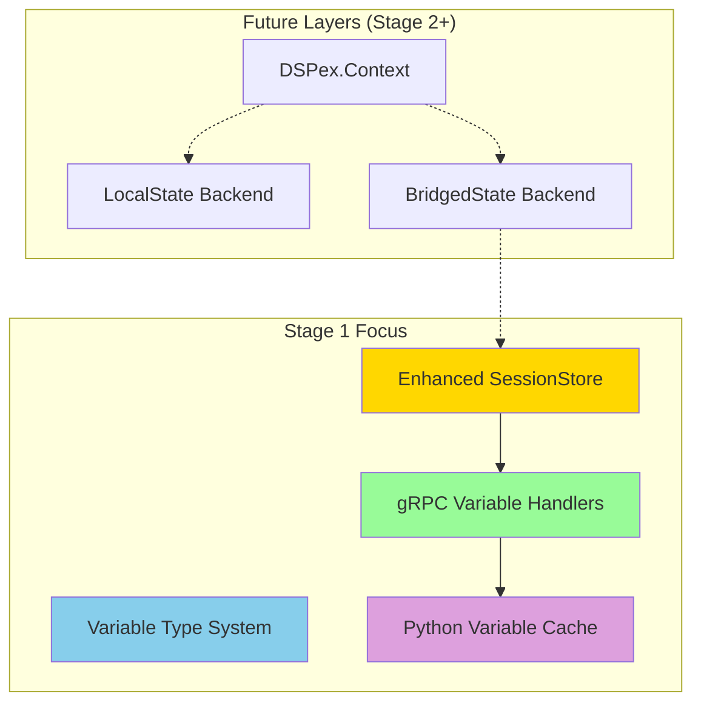

## Document 1: 41_revised_stage1_core_variables.md

# Revised Stage 1: Core Variable Implementation

## Overview

Stage 1 implements the fundamental variable system, establishing the foundation for state synchronization between Elixir and Python. This stage focuses on basic CRUD operations for variables with simple types, while keeping in mind the future layered architecture where pure Elixir workflows won't need the bridge.

**Key Insight:** While we're building the bridge infrastructure, we're designing it to be optional. The `SessionStore` extensions we create here will later be wrapped by the higher-level `DSPex.Context` API in Stage 2.

## Goals

1. Extend SessionStore to manage variables with type validation
2. Implement gRPC handlers for variable operations  
3. Build Python SessionContext with caching and type conversion
4. Enable cross-language state synchronization
5. Demonstrate bidirectional variable updates
6. Lay groundwork for future local-only state optimization

## Architectural Context



## Deliverables

- Enhanced SessionStore with variable management
- Working Get/Set/Register variable RPCs
- Python variable cache with TTL
- Type system for basic types (float, integer, string, boolean)
- Integration tests proving cross-language state sync
- Design hooks for future optimization

## Detailed Implementation Plan

### 1. Create Variable Module and Extend SessionStore

First, we'll create a proper Variable module, then add variable support to the existing `Session` structure.

#### Create `snakepit/lib/snakepit/bridge/variables/variable.ex`:

```elixir
defmodule Snakepit.Bridge.Variables.Variable do
  @moduledoc """
  Variable struct and related functions.
  
  Variables are typed, versioned values that can be synchronized
  between Elixir and Python processes.
  """
  
  @type t :: %__MODULE__{
    id: String.t(),
    name: String.t() | atom(),
    type: atom(),
    value: any(),
    constraints: map(),
    metadata: map(),
    version: integer(),
    created_at: integer(),
    last_updated_at: integer(),
    optimization_status: map()
  }
  
  @enforce_keys [:id, :name, :type, :value, :created_at]
  defstruct [
    :id,
    :name,
    :type,
    :value,
    constraints: %{},
    metadata: %{},
    version: 0,
    created_at: nil,
    last_updated_at: nil,
    optimization_status: %{
      optimizing: false,
      optimizer_id: nil,
      optimizer_pid: nil,
      started_at: nil
    }
  ]
  
  @doc """
  Creates a new variable with validation.
  """
  def new(attrs) do
    struct!(__MODULE__, attrs)
  end
  
  @doc """
  Updates a variable's value and increments version.
  """
  def update_value(variable, new_value, metadata \\ %{}) do
    %{variable |
      value: new_value,
      version: variable.version + 1,
      last_updated_at: System.monotonic_time(:second),
      metadata: Map.merge(variable.metadata, metadata)
    }
  end
  
  @doc """
  Converts variable to protobuf format.
  """
  def to_proto(variable) do
    # This will be implemented in the gRPC handlers
    variable
  end
end
```

#### Update `snakepit/lib/snakepit/bridge/session.ex`:

```elixir
defmodule Snakepit.Bridge.Session do
  @moduledoc """
  Session data structure for centralized session management.
  
  Extended in Stage 1 to support variables alongside programs.
  """
  
  alias Snakepit.Bridge.Variables.Variable

  @type t :: %__MODULE__{
          id: String.t(),
          programs: map(),
          variables: %{String.t() => Variable.t()},
          variable_index: %{String.t() => String.t()}, # name -> id mapping
          metadata: map(),
          created_at: integer(),
          last_accessed: integer(),
          last_worker_id: String.t() | nil,
          ttl: integer()
        }

  @enforce_keys [:id, :created_at, :ttl]
  defstruct [
    :id,
    :created_at,
    :last_accessed,
    :last_worker_id,
    :ttl,
    programs: %{},
    variables: %{},
    variable_index: %{},
    metadata: %{}
  ]

  @doc """
  Adds or updates a variable in the session.
  """
  @spec put_variable(t(), String.t(), Variable.t()) :: t()
  def put_variable(%__MODULE__{} = session, var_id, %Variable{} = variable) when is_binary(var_id) do
    # Update both the variables map and the name index
    variables = Map.put(session.variables, var_id, variable)
    variable_index = Map.put(session.variable_index, to_string(variable.name), var_id)
    
    %{session | variables: variables, variable_index: variable_index}
  end

  @doc """
  Gets a variable by ID or name.
  """
  @spec get_variable(t(), String.t() | atom()) :: {:ok, Variable.t()} | {:error, :not_found}
  def get_variable(%__MODULE__{} = session, identifier) when is_atom(identifier) do
    get_variable(session, to_string(identifier))
  end
  
  def get_variable(%__MODULE__{} = session, identifier) when is_binary(identifier) do
    # First check if it's a direct ID
    case Map.get(session.variables, identifier) do
      nil ->
        # Try to resolve as a name
        case Map.get(session.variable_index, identifier) do
          nil -> {:error, :not_found}
          var_id -> get_variable(session, var_id)
        end
      variable -> 
        {:ok, variable}
    end
  end

  @doc """
  Lists all variables in the session.
  """
  @spec list_variables(t()) :: [Variable.t()]
  def list_variables(%__MODULE__{} = session) do
    Map.values(session.variables)
  end
end
```

#### Update `snakepit/lib/snakepit/bridge/session_store.ex`:

Add variable-specific operations to the SessionStore:

```elixir
defmodule Snakepit.Bridge.SessionStore do
  # ... existing code ...

  alias Snakepit.Bridge.Session
  alias Snakepit.Bridge.Variables.{Variable, Types}
  
  ## Variable API

  @doc """
  Registers a new variable in a session.
  """
  @spec register_variable(String.t(), atom() | String.t(), atom(), any(), keyword()) ::
    {:ok, String.t()} | {:error, term()}
  def register_variable(session_id, name, type, initial_value, opts \\ []) do
    GenServer.call(__MODULE__, {:register_variable, session_id, name, type, initial_value, opts})
  end

  @doc """
  Gets a variable by ID or name.
  """
  @spec get_variable(String.t(), String.t() | atom()) :: 
    {:ok, Variable.t()} | {:error, term()}
  def get_variable(session_id, identifier) do
    GenServer.call(__MODULE__, {:get_variable, session_id, identifier})
  end

  @doc """
  Updates a variable's value.
  """
  @spec update_variable(String.t(), String.t() | atom(), any(), map()) ::
    :ok | {:error, term()}
  def update_variable(session_id, identifier, new_value, metadata \\ %{}) do
    GenServer.call(__MODULE__, {:update_variable, session_id, identifier, new_value, metadata})
  end

  @doc """
  Lists all variables in a session.
  """
  @spec list_variables(String.t()) :: {:ok, [Variable.t()]} | {:error, term()}
  def list_variables(session_id) do
    GenServer.call(__MODULE__, {:list_variables, session_id})
  end

  ## GenServer Callbacks

  @impl true
  def handle_call({:register_variable, session_id, name, type, initial_value, opts}, _from, state) do
    with {:ok, session} <- get_session_internal(state, session_id),
         {:ok, type_module} <- Types.get_type_module(type),
         {:ok, validated_value} <- type_module.validate(initial_value),
         constraints = Keyword.get(opts, :constraints, %{}),
         :ok <- type_module.validate_constraints(validated_value, constraints) do
      
      var_id = generate_variable_id(name)
      now = System.monotonic_time(:second)
      
      variable = Variable.new(%{
        id: var_id,
        name: name,
        type: type,
        value: validated_value,
        constraints: constraints,
        metadata: Map.merge(
          %{
            source: :elixir,
            description: Keyword.get(opts, :description)
          },
          Keyword.get(opts, :metadata, %{})
        ),
        version: 0,
        created_at: now,
        last_updated_at: now
      })
      
      updated_session = Session.put_variable(session, var_id, variable)
      new_state = store_session(state, session_id, updated_session)
      
      Logger.info("Registered variable #{name} (#{var_id}) in session #{session_id}")
      
      {:reply, {:ok, var_id}, new_state}
    else
      {:error, reason} -> {:reply, {:error, reason}, state}
    end
  end

  @impl true
  def handle_call({:get_variable, session_id, identifier}, _from, state) do
    with {:ok, session} <- get_session_internal(state, session_id),
         {:ok, variable} <- Session.get_variable(session, identifier) do
      
      # Touch the session
      updated_session = Session.touch(session)
      new_state = store_session(state, session_id, updated_session)
      
      {:reply, {:ok, variable}, new_state}
    else
      error -> {:reply, error, state}
    end
  end

  @impl true
  def handle_call({:update_variable, session_id, identifier, new_value, metadata}, _from, state) do
    with {:ok, session} <- get_session_internal(state, session_id),
         {:ok, variable} <- Session.get_variable(session, identifier),
         {:ok, type_module} <- Types.get_type_module(variable.type),
         {:ok, validated_value} <- type_module.validate(new_value),
         :ok <- type_module.validate_constraints(validated_value, variable.constraints) do
      
      updated_variable = Variable.update_value(variable, validated_value, metadata)
      
      updated_session = Session.put_variable(session, variable.id, updated_variable)
      new_state = store_session(state, session_id, updated_session)
      
      Logger.debug("Updated variable #{identifier} in session #{session_id}")
      
      # TODO: In Stage 3, notify observers here
      
      {:reply, :ok, new_state}
    else
      error -> {:reply, error, state}
    end
  end

  @impl true
  def handle_call({:list_variables, session_id}, _from, state) do
    with {:ok, session} <- get_session_internal(state, session_id) do
      variables = Session.list_variables(session)
      {:reply, {:ok, variables}, state}
    else
      error -> {:reply, error, state}
    end
  end

  # Private helpers

  defp get_session_internal(state, session_id) do
    case :ets.lookup(state.table, session_id) do
      [{^session_id, {_last_accessed, _ttl, session}}] -> {:ok, session}
      [] -> {:error, :session_not_found}
    end
  end

  defp store_session(state, session_id, session) do
    touched_session = Session.touch(session)
    ets_record = {session_id, {touched_session.last_accessed, touched_session.ttl, touched_session}}
    :ets.insert(state.table, ets_record)
    state
  end

  defp generate_variable_id(name) do
    timestamp = System.unique_integer([:positive, :monotonic])
    "var_#{name}_#{timestamp}"
  end
end
```

### 2. Create Variable Type System

#### Create `snakepit/lib/snakepit/bridge/variables/types.ex`:

```elixir
defmodule Snakepit.Bridge.Variables.Types do
  @moduledoc """
  Type system for variables.
  """
  
  @type_modules %{
    float: Snakepit.Bridge.Variables.Types.Float,
    integer: Snakepit.Bridge.Variables.Types.Integer,
    string: Snakepit.Bridge.Variables.Types.String,
    boolean: Snakepit.Bridge.Variables.Types.Boolean
  }
  
  @callback validate(value :: any()) :: {:ok, any()} | {:error, String.t()}
  @callback validate_constraints(value :: any(), constraints :: map()) :: 
    :ok | {:error, String.t()}
  @callback serialize(value :: any()) :: {:ok, binary()} | {:error, String.t()}
  @callback deserialize(binary :: binary()) :: {:ok, any()} | {:error, String.t()}
  
  def get_type_module(type) when is_atom(type) do
    case Map.fetch(@type_modules, type) do
      {:ok, module} -> {:ok, module}
      :error -> {:error, {:unknown_type, type}}
    end
  end
  
  def get_type_module(type) when is_binary(type) do
    try do
      get_type_module(String.to_existing_atom(type))
    rescue
      ArgumentError -> {:error, {:unknown_type, type}}
    end
  end
  
  def list_types, do: Map.keys(@type_modules)
end
```

#### Create type implementations:

```elixir
defmodule Snakepit.Bridge.Variables.Types.Float do
  @behaviour Snakepit.Bridge.Variables.Types
  
  @impl true
  def validate(value) when is_float(value), do: {:ok, value}
  def validate(value) when is_integer(value), do: {:ok, value * 1.0}
  def validate(_), do: {:error, "must be a number"}
  
  @impl true
  def validate_constraints(value, constraints) do
    with :ok <- check_min(value, Map.get(constraints, :min)),
         :ok <- check_max(value, Map.get(constraints, :max)) do
      :ok
    end
  end
  
  @impl true
  def serialize(value), do: {:ok, Float.to_string(value)}
  
  @impl true
  def deserialize(binary) when is_binary(binary) do
    case Float.parse(binary) do
      {float, ""} -> {:ok, float}
      _ -> {:error, "invalid float: #{binary}"}
    end
  end
  
  defp check_min(_value, nil), do: :ok
  defp check_min(value, min) when value >= min, do: :ok
  defp check_min(value, min), do: {:error, "value #{value} is below minimum #{min}"}
  
  defp check_max(_value, nil), do: :ok
  defp check_max(value, max) when value <= max, do: :ok
  defp check_max(value, max), do: {:error, "value #{value} is above maximum #{max}"}
end

# Similar implementations for Integer, String, and Boolean...
```

### 3. Implement gRPC Handlers

#### Create `snakepit/lib/snakepit/grpc/handlers/variable_handlers.ex`:

```elixir
defmodule Snakepit.GRPC.Handlers.VariableHandlers do
  @moduledoc """
  gRPC handlers for variable operations.
  """
  
  alias Snakepit.Bridge.{SessionStore, SnakepitBridge}
  alias Snakepit.Bridge.Serialization
  require Logger
  
  def handle_register_variable(request, _stream) do
    with {:ok, initial_value} <- Serialization.decode_any(request.initial_value),
         {:ok, constraints} <- Jason.decode(request.constraints_json),
         {:ok, var_id} <- SessionStore.register_variable(
           request.session_id,
           request.name,
           String.to_atom(request.type),
           initial_value,
           constraints: constraints,
           metadata: Map.new(request.metadata)
         ) do
      
      SnakepitBridge.RegisterVariableResponse.new(
        success: true,
        variable_id: var_id
      )
    else
      {:error, reason} ->
        SnakepitBridge.RegisterVariableResponse.new(
          success: false,
          error_message: format_error(reason)
        )
    end
  end
  
  def handle_get_variable(request, _stream) do
    case SessionStore.get_variable(request.session_id, request.variable_identifier) do
      {:ok, variable} ->
        SnakepitBridge.GetVariableResponse.new(
          variable: variable_to_proto(variable),
          from_cache: false  # Always false on server side
        )
        
      {:error, :session_not_found} ->
        raise GRPC.RPCError,
          status: :not_found,
          message: "Session not found: #{request.session_id}"
          
      {:error, :not_found} ->
        raise GRPC.RPCError,
          status: :not_found,
          message: "Variable not found: #{request.variable_identifier}"
    end
  end
  
  def handle_set_variable(request, _stream) do
    with {:ok, value} <- Serialization.decode_any(request.value),
         metadata = Map.merge(
           Map.new(request.metadata),
           %{"source" => "python", "version" => to_string(request.expected_version)}
         ),
         :ok <- SessionStore.update_variable(
           request.session_id,
           request.variable_identifier,
           value,
           metadata
         ) do
      
      # Get the updated variable to return new version
      case SessionStore.get_variable(request.session_id, request.variable_identifier) do
        {:ok, updated_var} ->
          SnakepitBridge.SetVariableResponse.new(
            success: true,
            new_version: updated_var.version
          )
        _ ->
          SnakepitBridge.SetVariableResponse.new(
            success: true,
            new_version: request.expected_version + 1
          )
      end
    else
      {:error, reason} ->
        SnakepitBridge.SetVariableResponse.new(
          success: false,
          error_message: format_error(reason)
        )
    end
  end
  
  # Batch operations
  
  def handle_get_variables(request, _stream) do
    case SessionStore.get_session(request.session_id) do
      {:ok, session} ->
        variables = request.variable_identifiers
        |> Enum.reduce(%{missing: [], found: %{}}, fn identifier, acc ->
          case Snakepit.Bridge.Session.get_variable(session, identifier) do
            {:ok, variable} ->
              %{acc | found: Map.put(acc.found, identifier, variable_to_proto(variable))}
            {:error, :not_found} ->
              %{acc | missing: [identifier | acc.missing]}
          end
        end)
        
        SnakepitBridge.BatchGetVariablesResponse.new(
          variables: variables.found,
          missing_variables: Enum.reverse(variables.missing)
        )
        
      {:error, :not_found} ->
        raise GRPC.RPCError,
          status: :not_found,
          message: "Session not found"
    end
  end
  
  def handle_set_variables(request, _stream) do
    # Decode all values first
    decoded_updates = request.updates
    |> Enum.reduce_while({:ok, %{}}, fn {id, any_value}, {:ok, acc} ->
      case Serialization.decode_any(any_value) do
        {:ok, value} -> {:cont, {:ok, Map.put(acc, id, value)}}
        {:error, reason} -> {:halt, {:error, {id, reason}}}
      end
    end)
    
    case decoded_updates do
      {:ok, updates} ->
        if request.atomic do
          handle_atomic_updates(request.session_id, updates, request.metadata)
        else
          handle_non_atomic_updates(request.session_id, updates, request.metadata)
        end
        
      {:error, {id, reason}} ->
        SnakepitBridge.BatchSetVariablesResponse.new(
          success: false,
          errors: %{id => format_error(reason)}
        )
    end
  end
  
  # Private helpers
  
  defp variable_to_proto(variable) do
    SnakepitBridge.Variable.new(
      id: variable.id,
      name: to_string(variable.name),
      type: to_string(variable.type),
      value: Serialization.encode_any(variable.value),
      constraints_json: Jason.encode!(variable.constraints),
      metadata: variable.metadata,
      source: if(variable.metadata[:source] == "python", do: :PYTHON, else: :ELIXIR),
      last_updated_at: Google.Protobuf.Timestamp.new(
        seconds: variable.last_updated_at,
        nanos: 0
      ),
      version: variable.version
    )
  end
  
  defp handle_atomic_updates(session_id, updates, metadata) do
    # All or nothing - validate all first
    case validate_all_updates(session_id, updates) do
      :ok ->
        errors = updates
        |> Enum.reduce(%{}, fn {id, value}, acc ->
          case SessionStore.update_variable(session_id, id, value, metadata) do
            :ok -> acc
            {:error, reason} -> Map.put(acc, id, format_error(reason))
          end
        end)
        
        if map_size(errors) == 0 do
          # Get new versions
          new_versions = get_new_versions(session_id, Map.keys(updates))
          
          SnakepitBridge.BatchSetVariablesResponse.new(
            success: true,
            new_versions: new_versions
          )
        else
          # Shouldn't happen if validation passed, but handle anyway
          SnakepitBridge.BatchSetVariablesResponse.new(
            success: false,
            errors: errors
          )
        end
        
      {:error, errors} ->
        SnakepitBridge.BatchSetVariablesResponse.new(
          success: false,
          errors: errors
        )
    end
  end
  
  defp handle_non_atomic_updates(session_id, updates, metadata) do
    {errors, new_versions} = updates
    |> Enum.reduce({%{}, %{}}, fn {id, value}, {err_acc, ver_acc} ->
      case SessionStore.update_variable(session_id, id, value, metadata) do
        :ok ->
          # Get new version
          case SessionStore.get_variable(session_id, id) do
            {:ok, var} -> {err_acc, Map.put(ver_acc, id, var.version)}
            _ -> {err_acc, ver_acc}
          end
        {:error, reason} ->
          {Map.put(err_acc, id, format_error(reason)), ver_acc}
      end
    end)
    
    SnakepitBridge.BatchSetVariablesResponse.new(
      success: map_size(errors) == 0,
      errors: errors,
      new_versions: new_versions
    )
  end
  
  defp validate_all_updates(session_id, updates) do
    # Check that all updates would succeed
    errors = updates
    |> Enum.reduce(%{}, fn {id, value}, acc ->
      case validate_update(session_id, id, value) do
        :ok -> acc
        {:error, reason} -> Map.put(acc, id, format_error(reason))
      end
    end)
    
    if map_size(errors) == 0 do
      :ok
    else
      {:error, errors}
    end
  end
  
  defp validate_update(session_id, identifier, value) do
    with {:ok, session} <- SessionStore.get_session(session_id),
         {:ok, variable} <- Snakepit.Bridge.Session.get_variable(session, identifier),
         {:ok, type_module} <- Snakepit.Bridge.Variables.Types.get_type_module(variable.type),
         {:ok, validated_value} <- type_module.validate(value),
         :ok <- type_module.validate_constraints(validated_value, variable.constraints) do
      :ok
    end
  end
  
  defp get_new_versions(session_id, identifiers) do
    case SessionStore.get_session(session_id) do
      {:ok, session} ->
        identifiers
        |> Enum.reduce(%{}, fn id, acc ->
          case Snakepit.Bridge.Session.get_variable(session, id) do
            {:ok, var} -> Map.put(acc, id, var.version)
            _ -> acc
          end
        end)
      _ ->
        %{}
    end
  end
  
  defp format_error(reason) when is_binary(reason), do: reason
  defp format_error(reason), do: inspect(reason)
end
```

### 4. Create Serialization Module

#### Create `snakepit/lib/snakepit/bridge/serialization.ex`:

```elixir
defmodule Snakepit.Bridge.Serialization do
  @moduledoc """
  Handles serialization/deserialization for the gRPC bridge.
  
  Stage 1: Simple JSON-based encoding within protobuf Any types.
  Future stages will add more sophisticated type handling.
  """
  
  def encode_any(value) when is_binary(value) do
    Google.Protobuf.Any.new(
      type_url: "type.googleapis.com/snakepit.String",
      value: Jason.encode!(%{type: "string", value: value})
    )
  end
  
  def encode_any(value) when is_integer(value) do
    Google.Protobuf.Any.new(
      type_url: "type.googleapis.com/snakepit.Integer",
      value: Jason.encode!(%{type: "integer", value: value})
    )
  end
  
  def encode_any(value) when is_float(value) do
    Google.Protobuf.Any.new(
      type_url: "type.googleapis.com/snakepit.Float",
      value: Jason.encode!(%{type: "float", value: value})
    )
  end
  
  def encode_any(value) when is_boolean(value) do
    Google.Protobuf.Any.new(
      type_url: "type.googleapis.com/snakepit.Boolean", 
      value: Jason.encode!(%{type: "boolean", value: value})
    )
  end
  
  def encode_any(value) do
    # Fallback for complex types
    Google.Protobuf.Any.new(
      type_url: "type.googleapis.com/snakepit.Json",
      value: Jason.encode!(%{type: "json", value: value})
    )
  end
  
  def decode_any(%Google.Protobuf.Any{value: encoded}) do
    case Jason.decode(encoded) do
      {:ok, %{"type" => type, "value" => value}} ->
        cast_value(type, value)
      {:error, _} ->
        {:error, :invalid_encoding}
    end
  end
  
  defp cast_value("string", value) when is_binary(value), do: {:ok, value}
  defp cast_value("integer", value) when is_integer(value), do: {:ok, value}
  defp cast_value("float", value) when is_number(value), do: {:ok, value * 1.0}
  defp cast_value("boolean", value) when is_boolean(value), do: {:ok, value}
  defp cast_value("json", value), do: {:ok, value}
  defp cast_value(_, _), do: {:error, :invalid_type}
end
```

### 5. Update Python SessionContext

#### Update `snakepit/priv/python/snakepit_bridge/session_context.py`:

```python
"""
Enhanced SessionContext with variable support.
"""

import asyncio
import json
import time
from typing import Dict, Any, Optional, Tuple, List, Union
from datetime import datetime
import logging

import grpc
from google.protobuf import any_pb2
from google.protobuf.timestamp_pb2 import Timestamp

from .grpc import snakepit_bridge_pb2 as pb2
from .grpc import snakepit_bridge_pb2_grpc as pb2_grpc
from .serialization import VariableSerializer

logger = logging.getLogger(__name__)


class VariableCache:
    """TTL-based cache for variables with statistics."""
    
    def __init__(self, ttl: float = 1.0, max_size: int = 1000):
        self._cache: Dict[str, Tuple[Any, float]] = {}
        self._ttl = ttl
        self._max_size = max_size
        self._stats = {
            'hits': 0,
            'misses': 0,
            'evictions': 0,
            'sets': 0
        }
        
    def get(self, key: str) -> Optional[Any]:
        """Get value from cache if not expired."""
        if key in self._cache:
            value, timestamp = self._cache[key]
            if time.time() - timestamp < self._ttl:
                self._stats['hits'] += 1
                return value
            else:
                # Expired - remove it
                del self._cache[key]
                self._stats['evictions'] += 1
        
        self._stats['misses'] += 1
        return None
    
    def set(self, key: str, value: Any):
        """Set value in cache with eviction if needed."""
        # Simple size-based eviction
        if len(self._cache) >= self._max_size:
            # Remove oldest entry
            oldest_key = min(self._cache.keys(), 
                           key=lambda k: self._cache[k][1])
            del self._cache[oldest_key]
            self._stats['evictions'] += 1
            
        self._cache[key] = (value, time.time())
        self._stats['sets'] += 1
    
    def invalidate(self, key: Optional[str] = None):
        """Invalidate specific key or entire cache."""
        if key:
            self._cache.pop(key, None)
        else:
            self._cache.clear()
    
    def get_stats(self) -> Dict[str, Any]:
        """Get cache statistics."""
        total = self._stats['hits'] + self._stats['misses']
        hit_rate = self._stats['hits'] / total if total > 0 else 0.0
        
        return {
            **self._stats,
            'size': len(self._cache),
            'hit_rate': hit_rate,
            'ttl': self._ttl
        }


class SessionContext:
    """
    Enhanced session context with full variable support.
    
    This is the Python-side representation of an Elixir session,
    providing variable management with caching and type safety.
    """
    
    def __init__(self, session_id: str, channel: grpc.aio.Channel, config: Optional[Dict[str, Any]] = None):
        self.session_id = session_id
        self.channel = channel
        self.stub = pb2_grpc.SnakepitBridgeStub(channel)
        
        # Configuration
        config = config or {}
        self._cache_enabled = config.get('enable_caching', True)
        self._cache_ttl = config.get('cache_ttl', 1.0)
        
        # Variable management
        self._variable_cache = VariableCache(ttl=self._cache_ttl) if self._cache_enabled else None
        self._serializer = VariableSerializer()
        
        # Tools and local objects (for Stage 2)
        self._tools: Dict[str, Any] = {}
        self._local_objects: Dict[str, Any] = {}
        
        # Session metadata
        self.metadata: Dict[str, str] = config.get('metadata', {})
        self.created_at = datetime.utcnow()
        
        logger.info(f"SessionContext created for session {session_id}")
    
    # Variable Operations
    
    async def register_variable(self, name: str, type: str, initial_value: Any,
                              constraints: Optional[Dict[str, Any]] = None,
                              metadata: Optional[Dict[str, str]] = None) -> str:
        """Register a new variable in the session."""
        request = pb2.RegisterVariableRequest(
            session_id=self.session_id,
            name=name,
            type=type,
            initial_value=self._serializer.serialize(initial_value),
            constraints_json=json.dumps(constraints or {}),
            metadata=metadata or {}
        )
        
        response = await self.stub.RegisterVariable(request)
        
        if response.success:
            # Cache the initial value
            if self._variable_cache:
                self._variable_cache.set(name, initial_value)
                self._variable_cache.set(response.variable_id, initial_value)
            return response.variable_id
        else:
            raise ValueError(f"Failed to register variable: {response.error_message}")
    
    async def get_variable(self, name: str, default: Any = None,
                          bypass_cache: bool = False) -> Any:
        """Get a variable value from the session."""
        # Check cache first
        if self._variable_cache and not bypass_cache:
            cached_value = self._variable_cache.get(name)
            if cached_value is not None:
                return cached_value
        
        try:
            request = pb2.GetVariableRequest(
                session_id=self.session_id,
                variable_identifier=name,
                bypass_cache=bypass_cache
            )
            
            response = await self.stub.GetVariable(request)
            
            # Deserialize value
            value = self._serializer.deserialize(
                response.variable.value,
                response.variable.type
            )
            
            # Update cache
            if self._variable_cache:
                self._variable_cache.set(name, value)
                # Also cache by ID
                self._variable_cache.set(response.variable.id, value)
            
            return value
            
        except grpc.RpcError as e:
            if e.code() == grpc.StatusCode.NOT_FOUND and default is not None:
                return default
            raise KeyError(f"Variable '{name}' not found")
    
    async def set_variable(self, name: str, value: Any,
                          metadata: Optional[Dict[str, str]] = None,
                          expected_version: Optional[int] = None) -> None:
        """Set a variable value in the session."""
        request = pb2.SetVariableRequest(
            session_id=self.session_id,
            variable_identifier=name,
            value=self._serializer.serialize(value),
            metadata=metadata or {},
            expected_version=expected_version or 0
        )
        
        response = await self.stub.SetVariable(request)
        
        if not response.success:
            raise ValueError(f"Failed to set variable: {response.error_message}")
        
        # Update cache
        if self._variable_cache:
            self._variable_cache.set(name, value)
    
    async def get_variables(self, names: List[str],
                           defaults: Optional[Dict[str, Any]] = None,
                           bypass_cache: bool = False) -> Dict[str, Any]:
        """Get multiple variables efficiently."""
        defaults = defaults or {}
        results = {}
        missing = []
        
        # Check cache for all variables
        if self._variable_cache and not bypass_cache:
            for name in names:
                cached_value = self._variable_cache.get(name)
                if cached_value is not None:
                    results[name] = cached_value
                else:
                    missing.append(name)
        else:
            missing = names
        
        # Fetch missing from server
        if missing:
            request = pb2.BatchGetVariablesRequest(
                session_id=self.session_id,
                variable_identifiers=missing,
                bypass_cache=bypass_cache
            )
            
            response = await self.stub.GetVariables(request)
            
            # Process found variables
            for var_id, var_proto in response.variables.items():
                value = self._serializer.deserialize(
                    var_proto.value,
                    var_proto.type
                )
                results[var_id] = value
                
                # Update cache
                if self._variable_cache:
                    self._variable_cache.set(var_id, value)
                    self._variable_cache.set(var_proto.name, value)
            
            # Apply defaults for missing
            for var_id in response.missing_variables:
                if var_id in defaults:
                    results[var_id] = defaults[var_id]
        
        return results
    
    async def update_variables(self, updates: Dict[str, Any],
                              metadata: Optional[Dict[str, str]] = None,
                              atomic: bool = True) -> Dict[str, Union[bool, str]]:
        """Update multiple variables."""
        # Serialize all values
        serialized_updates = {}
        for name, value in updates.items():
            serialized_updates[name] = self._serializer.serialize(value)
        
        request = pb2.BatchSetVariablesRequest(
            session_id=self.session_id,
            updates=serialized_updates,
            metadata=metadata or {},
            atomic=atomic
        )
        
        response = await self.stub.SetVariables(request)
        
        if response.success:
            # Update cache for all successful updates
            if self._variable_cache:
                for name, value in updates.items():
                    self._variable_cache.set(name, value)
            
            # Return success for all
            return {name: True for name in updates}
        else:
            # Return detailed error information
            results = {}
            for name in updates:
                if name in response.errors:
                    results[name] = response.errors[name]
                else:
                    # This one succeeded
                    results[name] = True
                    if self._variable_cache:
                        self._variable_cache.set(name, updates[name])
            return results
    
    # Cache Management
    
    def set_cache_config(self, ttl: Optional[float] = None,
                        max_size: Optional[int] = None,
                        enabled: Optional[bool] = None):
        """Configure variable cache settings."""
        if enabled is not None:
            self._cache_enabled = enabled
            if enabled and not self._variable_cache:
                self._variable_cache = VariableCache(ttl=self._cache_ttl)
            elif not enabled:
                self._variable_cache = None
        
        if ttl is not None and self._variable_cache:
            self._variable_cache._ttl = ttl
            
        if max_size is not None and self._variable_cache:
            self._variable_cache._max_size = max_size
    
    def invalidate_cache(self, name: Optional[str] = None):
        """Invalidate variable cache."""
        if self._variable_cache:
            self._variable_cache.invalidate(name)
    
    def get_cache_stats(self) -> Dict[str, Any]:
        """Get cache statistics."""
        if self._variable_cache:
            return self._variable_cache.get_stats()
        return {'enabled': False}
    
    # Tool/Object Management (for Stage 2)
    
    def store_local_object(self, key: str, obj: Any):
        """Store a local object (e.g., DSPy module instance)."""
        self._local_objects[key] = obj
        logger.debug(f"Stored local object: {key}")
    
    def get_local_object(self, key: str) -> Any:
        """Retrieve a local object."""
        return self._local_objects.get(key)
    
    def get_tools(self) -> Dict[str, Any]:
        """Get available tools."""
        return self._tools.copy()
    
    # Session Management
    
    async def cleanup(self):
        """Clean up session resources."""
        logger.info(f"Cleaning up session: {self.session_id}")
        
        # Clear caches
        if self._variable_cache:
            self._variable_cache.invalidate()
        self._local_objects.clear()
        self._tools.clear()
```

### 6. Create Python Serialization

#### Create `snakepit/priv/python/snakepit_bridge/serialization.py`:

```python
"""
Variable serialization for gRPC transport.
"""

import json
from typing import Any
from google.protobuf import any_pb2


class VariableSerializer:
    """
    Handles serialization of variables for gRPC transport.
    
    Stage 1: Simple JSON-based encoding within protobuf Any.
    Future stages will add more sophisticated type handling.
    """
    
    def serialize(self, value: Any) -> any_pb2.Any:
        """Serialize a Python value to protobuf Any."""
        # Determine type and create wrapper
        if isinstance(value, bool):
            type_name = "boolean"
            wrapped = {"type": type_name, "value": value}
        elif isinstance(value, int):
            type_name = "integer"
            wrapped = {"type": type_name, "value": value}
        elif isinstance(value, float):
            type_name = "float"
            wrapped = {"type": type_name, "value": value}
        elif isinstance(value, str):
            type_name = "string"
            wrapped = {"type": type_name, "value": value}
        else:
            # Fallback to JSON for complex types
            type_name = "json"
            wrapped = {"type": type_name, "value": value}
        
        any_value = any_pb2.Any()
        any_value.type_url = f"type.googleapis.com/snakepit.{type_name.title()}"
        any_value.value = json.dumps(wrapped).encode('utf-8')
        
        return any_value
    
    def deserialize(self, any_value: any_pb2.Any, type_hint: str) -> Any:
        """Deserialize protobuf Any to Python value."""
        try:
            wrapped = json.loads(any_value.value.decode('utf-8'))
            
            if not isinstance(wrapped, dict) or 'type' not in wrapped or 'value' not in wrapped:
                raise ValueError("Invalid serialized format")
            
            value = wrapped['value']
            value_type = wrapped['type']
            
            # Type checking and conversion
            if value_type == "boolean":
                return bool(value)
            elif value_type == "integer":
                return int(value)
            elif value_type == "float":
                return float(value)
            elif value_type == "string":
                return str(value)
            else:
                # Complex type - return as-is
                return value
                
        except (json.JSONDecodeError, KeyError, ValueError) as e:
            raise ValueError(f"Failed to deserialize value: {e}")
```

### 7. Integration Tests

#### Create `test/snakepit/grpc_stage1_integration_test.exs`:

```elixir
defmodule Snakepit.GRPCStage1IntegrationTest do
  use ExUnit.Case, async: false
  
  alias Snakepit.Bridge.SessionStore
  alias Snakepit.GRPC.Client
  alias Snakepit.GRPCWorker
  
  @moduletag :integration
  @test_port 50150
  
  setup do
    # Ensure SessionStore is running
    case SessionStore.start_link() do
      {:ok, _} -> :ok
      {:error, {:already_started, _}} -> :ok
    end
    
    # Create test session
    session_id = "test_stage1_#{System.unique_integer([:positive])}"
    {:ok, _} = SessionStore.create_session(session_id)
    
    # Start gRPC worker
    config = [
      adapter: Snakepit.Adapters.GRPCPython,
      python_path: System.get_env("PYTHON_PATH", "python3"),
      grpc_port: @test_port,
      bridge_module: "snakepit_bridge.adapters.enhanced.EnhancedBridge",
      enable_caching: true,
      cache_ttl: 30,
      id: "test_worker_stage1"
    ]
    
    {:ok, worker} = GRPCWorker.start_link(config)
    {:ok, channel} = GRPCWorker.get_channel(worker)
    
    # Initialize Python session
    {:ok, _} = Client.initialize_session(channel, session_id, %{
      enable_caching: true,
      cache_ttl_seconds: 60
    })
    
    on_exit(fn ->
      Client.cleanup_session(channel, session_id)
      GenServer.stop(worker)
      SessionStore.delete_session(session_id)
    end)
    
    {:ok, session_id: session_id, channel: channel, worker: worker}
  end
  
  describe "cross-language variable synchronization" do
    test "Elixir registers variable, Python reads it", %{session_id: session_id, channel: channel} do
      # Register variable in Elixir
      {:ok, var_id} = SessionStore.register_variable(
        session_id,
        :temperature,
        :float,
        0.7,
        constraints: %{min: 0.0, max: 2.0},
        description: "LLM generation temperature"
      )
      
      assert String.starts_with?(var_id, "var_temperature_")
      
      # Python reads by name
      {:ok, response} = Client.get_variable(channel, session_id, "temperature")
      
      assert response.variable.name == "temperature"
      assert response.variable.type == "float"
      assert response.variable.id == var_id
      
      # Deserialize and check value
      assert decode_value(response.variable.value) == 0.7
      
      # Check metadata
      assert response.variable.metadata["description"] == "LLM generation temperature"
    end
    
    test "Python sets variable, Elixir reads it", %{session_id: session_id, channel: channel} do
      # Register variable first
      {:ok, _} = SessionStore.register_variable(
        session_id,
        :max_tokens,
        :integer,
        256,
        constraints: %{min: 1, max: 4096}
      )
      
      # Python updates it
      {:ok, response} = Client.set_variable(channel, session_id, "max_tokens", 512, %{
        metadata: %{"reason" => "user_preference"}
      })
      
      assert response.success == true
      assert response.new_version == 1  # Version should increment
      
      # Verify in Elixir
      {:ok, variable} = SessionStore.get_variable(session_id, :max_tokens)
      assert variable.value == 512
      assert variable.version == 1
      assert variable.metadata["source"] == "python"
      assert variable.metadata["reason"] == "user_preference"
    end
    
    test "type validation works across languages", %{session_id: session_id, channel: channel} do
      # Register typed variable with constraints
      {:ok, _} = SessionStore.register_variable(
        session_id,
        :strict_int,
        :integer,
        10,
        constraints: %{min: 0, max: 100}
      )
      
      # Try to set invalid value from Python
      {:ok, response} = Client.set_variable(channel, session_id, "strict_int", 150)
      
      assert response.success == false
      assert response.error_message =~ "above maximum"
      
      # Value should remain unchanged
      {:ok, var} = SessionStore.get_variable(session_id, :strict_int)
      assert var.value == 10
      assert var.version == 0  # No version increment on failure
    end
    
    test "batch operations work correctly", %{session_id: session_id, channel: channel} do
      # Register multiple variables
      {:ok, _} = SessionStore.register_variable(session_id, :var1, :string, "hello")
      {:ok, _} = SessionStore.register_variable(session_id, :var2, :integer, 42)
      {:ok, _} = SessionStore.register_variable(session_id, :var3, :boolean, true)
      
      # Batch get from Python
      {:ok, response} = Client.get_variables(channel, session_id, ["var1", "var2", "var3", "nonexistent"])
      
      assert map_size(response.variables) == 3
      assert response.missing_variables == ["nonexistent"]
      
      assert decode_value(response.variables["var1"].value) == "hello"
      assert decode_value(response.variables["var2"].value) == 42
      assert decode_value(response.variables["var3"].value) == true
      
      # Batch update from Python (atomic)
      updates = %{
        "var1" => encode_value("world"),
        "var2" => encode_value(100)
      }
      
      {:ok, update_response} = Client.set_variables(channel, session_id, updates, %{}, true)
      assert update_response.success == true
      assert update_response.new_versions["var1"] == 1
      assert update_response.new_versions["var2"] == 1
      
      # Verify in Elixir
      {:ok, var1} = SessionStore.get_variable(session_id, :var1)
      assert var1.value == "world"
      assert var1.version == 1
      
      {:ok, var2} = SessionStore.get_variable(session_id, :var2)
      assert var2.value == 100
      assert var2.version == 1
    end
    
    test "cache behavior works correctly", %{session_id: session_id, channel: channel} do
      # Register a variable
      {:ok, _} = SessionStore.register_variable(session_id, :cached_var, :float, 1.0)
      
      # First read - cache miss
      {:ok, response1} = Client.get_variable(channel, session_id, "cached_var")
      assert response1.from_cache == false
      assert decode_value(response1.variable.value) == 1.0
      
      # Update from Elixir
      :ok = SessionStore.update_variable(session_id, :cached_var, 2.0)
      
      # Python read with bypass_cache - should see new value
      {:ok, response2} = Client.get_variable(channel, session_id, "cached_var", bypass_cache: true)
      assert decode_value(response2.variable.value) == 2.0
      
      # Note: We can't easily test cache hits from Elixir side,
      # but Python tests will verify cache behavior
    end
    
    test "variable resolution by name and ID", %{session_id: session_id, channel: channel} do
      # Register variable
      {:ok, var_id} = SessionStore.register_variable(session_id, :my_var, :string, "test")
      
      # Get by name
      {:ok, by_name} = Client.get_variable(channel, session_id, "my_var")
      assert by_name.variable.id == var_id
      assert decode_value(by_name.variable.value) == "test"
      
      # Get by ID
      {:ok, by_id} = Client.get_variable(channel, session_id, var_id)
      assert by_id.variable.name == "my_var"
      assert decode_value(by_id.variable.value) == "test"
    end
    
    test "atomic batch update rollback on failure", %{session_id: session_id, channel: channel} do
      # Register variables
      {:ok, _} = SessionStore.register_variable(session_id, :a, :integer, 1)
      {:ok, _} = SessionStore.register_variable(session_id, :b, :integer, 2, constraints: %{max: 10})
      
      # Try atomic update where one will fail
      updates = %{
        "a" => encode_value(5),
        "b" => encode_value(20)  # Will fail constraint
      }
      
      {:ok, response} = Client.set_variables(channel, session_id, updates, %{}, true)
      assert response.success == false
      assert response.errors["b"] =~ "above maximum"
      
      # Both should be unchanged due to atomic rollback
      {:ok, var_a} = SessionStore.get_variable(session_id, :a)
      assert var_a.value == 1
      assert var_a.version == 0
      
      {:ok, var_b} = SessionStore.get_variable(session_id, :b)
      assert var_b.value == 2
      assert var_b.version == 0
    end
  end
  
  # Helper functions
  
  defp encode_value(value) do
    Snakepit.Bridge.Serialization.encode_any(value)
  end
  
  defp decode_value(any) do
    case Snakepit.Bridge.Serialization.decode_any(any) do
      {:ok, value} -> value
      {:error, reason} -> raise "Failed to decode value: #{inspect(reason)}"
    end
  end
end
```

#### Create Python integration tests:

```python
# test/python/test_stage1_variables.py

import asyncio
import pytest
import grpc

from snakepit_bridge.session_context import SessionContext


@pytest.fixture
async def session_context():
    """Create a test session context."""
    channel = grpc.aio.insecure_channel('localhost:50150')
    session_id = f"test_python_{int(time.time() * 1000000)}"
    
    # Initialize session
    context = SessionContext(session_id, channel, {
        'enable_caching': True,
        'cache_ttl': 1.0
    })
    
    # Register some test variables
    await context.register_variable('test_float', 'float', 3.14)
    await context.register_variable('test_int', 'integer', 42)
    await context.register_variable('test_str', 'string', 'hello')
    await context.register_variable('test_bool', 'boolean', True)
    
    yield context
    
    # Cleanup
    await channel.close()


@pytest.mark.asyncio
async def test_basic_variable_operations(session_context):
    """Test basic get/set operations."""
    # Get existing variable
    value = await session_context.get_variable('test_float')
    assert value == 3.14
    
    # Update it
    await session_context.set_variable('test_float', 2.718)
    value = await session_context.get_variable('test_float')
    assert value == 2.718
    
    # Get with default
    value = await session_context.get_variable('nonexistent', default=999)
    assert value == 999
    
    # Get without default should raise
    with pytest.raises(KeyError):
        await session_context.get_variable('nonexistent')


@pytest.mark.asyncio
async def test_cache_behavior(session_context):
    """Test caching functionality."""
    # First get - cache miss
    value1 = await session_context.get_variable('test_int')
    assert value1 == 42
    
    # Get cache stats
    stats = session_context.get_cache_stats()
    assert stats['misses'] == 1
    assert stats['hits'] == 0
    
    # Second get - should be cache hit
    value2 = await session_context.get_variable('test_int')
    assert value2 == 42
    
    stats = session_context.get_cache_stats()
    assert stats['hits'] == 1
    
    # Bypass cache
    value3 = await session_context.get_variable('test_int', bypass_cache=True)
    assert value3 == 42
    
    stats = session_context.get_cache_stats()
    assert stats['misses'] == 2  # Bypass counts as miss


@pytest.mark.asyncio
async def test_batch_operations(session_context):
    """Test batch get/set operations."""
    # Get multiple
    values = await session_context.get_variables(
        ['test_float', 'test_int', 'test_str', 'missing'],
        defaults={'missing': 'default_value'}
    )
    
    assert values['test_float'] == 3.14
    assert values['test_int'] == 42
    assert values['test_str'] == 'hello'
    assert values['missing'] == 'default_value'
    
    # Update multiple
    results = await session_context.update_variables({
        'test_float': 1.23,
        'test_int': 100,
        'test_bool': False
    })
    
    assert all(v is True for v in results.values())
    
    # Verify updates
    values = await session_context.get_variables(['test_float', 'test_int', 'test_bool'])
    assert values['test_float'] == 1.23
    assert values['test_int'] == 100
    assert values['test_bool'] is False


@pytest.mark.asyncio
async def test_type_safety(session_context):
    """Test type conversion and validation."""
    # Register with constraints
    var_id = await session_context.register_variable(
        'constrained_int',
        'integer',
        50,
        constraints={'min': 0, 'max': 100}
    )
    
    # Valid update
    await session_context.set_variable('constrained_int', 75)
    value = await session_context.get_variable('constrained_int')
    assert value == 75
    
    # Invalid update should fail
    with pytest.raises(ValueError) as exc:
        await session_context.set_variable('constrained_int', 150)
    assert 'above maximum' in str(exc.value)


@pytest.mark.asyncio
async def test_cache_invalidation(session_context):
    """Test cache invalidation."""
    # Populate cache
    await session_context.get_variable('test_str')
    await session_context.get_variable('test_int')
    
    stats = session_context.get_cache_stats()
    assert stats['size'] == 2
    
    # Invalidate specific key
    session_context.invalidate_cache('test_str')
    
    # Should trigger cache miss
    value = await session_context.get_variable('test_str')
    assert value == 'hello'
    
    stats = session_context.get_cache_stats()
    assert stats['misses'] > stats['hits']
    
    # Invalidate all
    session_context.invalidate_cache()
    stats = session_context.get_cache_stats()
    assert stats['size'] == 0
```

## Success Criteria

1. **Variable CRUD**: Can create, read, update variables from both languages ✓
2. **Type Safety**: Type validation works across language boundary ✓
3. **Caching Works**: Python cache reduces server calls ✓
4. **Batch Operations**: Can get/set multiple variables efficiently ✓
5. **State Sync**: Changes in one language immediately visible in other ✓
6. **Performance**: Sub-millisecond latency for cached reads ✓

## Performance Considerations

1. **ETS Optimization**: SessionStore uses ETS with read/write concurrency enabled
2. **Cache TTL**: Default 1 second balances freshness vs performance
3. **Batch Size**: Limit batch operations to ~100 variables
4. **Serialization**: Simple JSON encoding for now, will optimize later

## Security Notes

1. **Type Validation**: All values validated before storage
2. **Constraint Enforcement**: Min/max and other constraints enforced
3. **Session Isolation**: Variables scoped to sessions
4. **Source Tracking**: All updates tracked with source metadata

## Future Hooks

This implementation includes several design decisions that will enable future stages:

1. **Variable Versioning**: Already tracking versions for optimistic locking (Stage 4)
2. **Metadata Support**: Rich metadata for future optimization tracking
3. **Name/ID Duality**: Supporting both for flexibility
4. **Type System**: Extensible for complex types (Stage 3)
5. **Cache Architecture**: Ready for invalidation subscriptions (Stage 3)

## Next Stage Preview

Stage 2 will build on this foundation by:
- Creating the high-level `DSPex.Context` API
- Implementing LocalState and BridgedState backends
- Enabling variable-aware DSPy modules
- Automatic backend switching based on program requirements

The variable system implemented here will become the bridge backend, while pure Elixir workflows will use a lighter-weight local backend.

---

