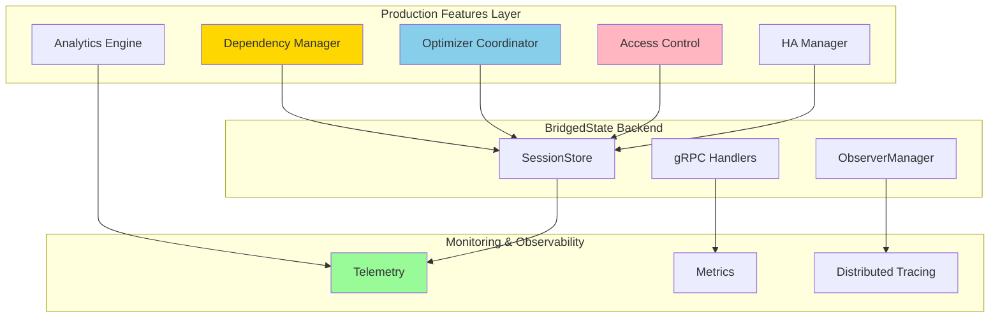

## Document 4: 44_revised_stage4_production_hardening.md

# Revised Stage 4: Production Hardening & Advanced Features

## Overview

Stage 4 transforms the DSPex bridge from a functional prototype into a production-ready system. This stage focuses on robustness, security, performance optimization, and enterprise features. All advanced features are implemented specifically in the `BridgedState` backend, keeping the pure Elixir path lightweight.

**Key Principle:** Advanced features like dependency graphs and optimization coordination are only relevant for complex, multi-process workflows that require the bridge. Pure Elixir workflows remain simple and fast.

## Goals

1. Implement dependency graphs with cycle detection
2. Add optimization coordination with distributed locking
3. Build comprehensive access control system
4. Create performance monitoring and analytics
5. Implement high availability patterns
6. Add comprehensive error recovery mechanisms

## Architectural Focus



## Deliverables

- Dependency graph manager with topological sorting
- Distributed optimizer coordination
- Fine-grained access control system
- Comprehensive telemetry and monitoring
- High availability session migration
- Production deployment guide

## Detailed Implementation Plan

### 1. Dependency Graph Implementation

#### Create `lib/dspex/bridge/dependency_manager.ex`:

```elixir
defmodule DSPex.Bridge.DependencyManager do
  @moduledoc """
  Manages variable dependencies with cycle detection and propagation.
  """
  
  use GenServer
  require Logger
  
  alias :digraph, as: Graph
  
  defstruct [:graph, :session_id, :propagation_queue]
  
  def start_link(session_id) do
    GenServer.start_link(__MODULE__, session_id, name: via_tuple(session_id))
  end
  
  defp via_tuple(session_id) do
    {:via, Registry, {DSPex.Bridge.Registry, {:dep_manager, session_id}}}
  end
  
  @impl true
  def init(session_id) do
    state = %__MODULE__{
      graph: Graph.new([:acyclic]),
      session_id: session_id,
      propagation_queue: :queue.new()
    }
    
    {:ok, state}
  end
  
  @doc """
  Adds a dependency between variables with cycle detection.
  """
  def add_dependency(session_id, from_var, to_var, type \\ :data) do
    GenServer.call(via_tuple(session_id), {:add_dependency, from_var, to_var, type})
  end
  
  @doc """
  Gets the topologically sorted update order for a variable change.
  """
  def get_update_order(session_id, changed_var) do
    GenServer.call(via_tuple(session_id), {:get_update_order, changed_var})
  end
  
  @doc """
  Propagates a variable change through the dependency graph.
  """
  def propagate_change(session_id, var_id, new_value, metadata) do
    GenServer.cast(via_tuple(session_id), {:propagate_change, var_id, new_value, metadata})
  end
  
  # Server callbacks
  
  @impl true
  def handle_call({:add_dependency, from_var, to_var, type}, _from, state) do
    # Ensure vertices exist
    Graph.add_vertex(state.graph, from_var)
    Graph.add_vertex(state.graph, to_var)
    
    # Try to add edge (will fail if creates cycle)
    case Graph.add_edge(state.graph, from_var, to_var, type) do
      {:error, {:bad_edge, _}} ->
        {:reply, {:error, :would_create_cycle}, state}
        
      _edge ->
        Logger.debug("Added dependency: #{from_var} -> #{to_var} (#{type})")
        {:reply, :ok, state}
    end
  end
  
  @impl true
  def handle_call({:get_update_order, changed_var}, _from, state) do
    # Get all reachable vertices from changed_var
    case Graph.get_path(state.graph, changed_var, nil) do
      false ->
        {:reply, {:ok, []}, state}
        
      _ ->
        # Use DFS to get all dependent variables
        dependents = dfs_collect_dependents(state.graph, changed_var)
        
        # Topological sort for update order
        sorted = topological_sort_subgraph(state.graph, [changed_var | dependents])
        
        {:reply, {:ok, sorted}, state}
    end
  end
  
  @impl true
  def handle_cast({:propagate_change, var_id, new_value, metadata}, state) do
    # Queue the change
    new_queue = :queue.in({var_id, new_value, metadata}, state.propagation_queue)
    
    # Process queue
    new_state = process_propagation_queue(%{state | propagation_queue: new_queue})
    
    {:noreply, new_state}
  end
  
  # Private helpers
  
  defp dfs_collect_dependents(graph, vertex, visited \\ MapSet.new()) do
    if MapSet.member?(visited, vertex) do
      []
    else
      visited = MapSet.put(visited, vertex)
      
      out_neighbors = Graph.out_neighbours(graph, vertex)
      
      out_neighbors ++ Enum.flat_map(out_neighbors, fn neighbor ->
        dfs_collect_dependents(graph, neighbor, visited)
      end)
      |> Enum.uniq()
    end
  end
  
  defp topological_sort_subgraph(graph, vertices) do
    # Create subgraph
    subgraph = Graph.new()
    
    # Add vertices
    Enum.each(vertices, &Graph.add_vertex(subgraph, &1))
    
    # Add edges between vertices in our set
    Enum.each(vertices, fn v ->
      Enum.each(Graph.out_neighbours(graph, v), fn neighbor ->
        if neighbor in vertices do
          Graph.add_edge(subgraph, v, neighbor)
        end
      end)
    end)
    
    # Topological sort
    case Graph.topsort(subgraph) do
      vertices when is_list(vertices) -> vertices
      false -> []  # Shouldn't happen with acyclic graph
    end
  after
    Graph.delete(subgraph)
  end
  
  defp process_propagation_queue(state) do
    case :queue.out(state.propagation_queue) do
      {{:value, {var_id, new_value, metadata}}, new_queue} ->
        # Get update order
        {:ok, update_order} = get_update_order(state.session_id, var_id)
        
        # Propagate to each dependent
        Enum.each(update_order, fn dependent_var ->
          if dependent_var != var_id do
            propagate_to_dependent(state.session_id, dependent_var, var_id, new_value, metadata)
          end
        end)
        
        # Continue processing
        process_propagation_queue(%{state | propagation_queue: new_queue})
        
      {:empty, _} ->
        state
    end
  end
  
  defp propagate_to_dependent(session_id, dependent_var, source_var, source_value, metadata) do
    # This would integrate with the compute graph
    # For now, just log
    Logger.info("Propagating change: #{source_var} -> #{dependent_var}")
    
    # In a full implementation, this would:
    # 1. Get the dependent's computation function
    # 2. Fetch all its input values
    # 3. Recompute the dependent's value
    # 4. Update the dependent variable
  end
end
```

### 2. Optimizer Coordination

#### Create `lib/dspex/bridge/optimizer_coordinator.ex`:

```elixir
defmodule DSPex.Bridge.OptimizerCoordinator do
  @moduledoc """
  Coordinates multiple optimizers with distributed locking.
  """
  
  use GenServer
  require Logger
  
  defstruct [:locks, :active_optimizations, :conflict_queue]
  
  def start_link(_opts) do
    GenServer.start_link(__MODULE__, [], name: __MODULE__)
  end
  
  @impl true
  def init(_) do
    state = %__MODULE__{
      locks: %{},  # var_id -> {optimizer_id, pid, acquired_at}
      active_optimizations: %{},  # optimization_id -> details
      conflict_queue: :queue.new()
    }
    
    # Schedule periodic cleanup
    Process.send_after(self(), :cleanup_stale_locks, 60_000)
    
    {:ok, state}
  end
  
  @doc """
  Attempts to acquire an optimization lock for a variable.
  """
  def acquire_lock(var_id, optimizer_id, optimizer_pid, opts \\ []) do
    timeout = Keyword.get(opts, :timeout, 5000)
    conflict_resolution = Keyword.get(opts, :conflict_resolution, :wait)
    
    GenServer.call(__MODULE__, 
      {:acquire_lock, var_id, optimizer_id, optimizer_pid, conflict_resolution}, 
      timeout
    )
  end
  
  @doc """
  Releases an optimization lock.
  """
  def release_lock(var_id, optimizer_id) do
    GenServer.call(__MODULE__, {:release_lock, var_id, optimizer_id})
  end
  
  @doc """
  Reports optimization progress.
  """
  def report_progress(optimization_id, iteration, current_value, metrics) do
    GenServer.cast(__MODULE__, 
      {:report_progress, optimization_id, iteration, current_value, metrics}
    )
  end
  
  # Server callbacks
  
  @impl true
  def handle_call({:acquire_lock, var_id, optimizer_id, optimizer_pid, conflict_resolution}, from, state) do
    case Map.get(state.locks, var_id) do
      nil ->
        # No lock exists, acquire it
        new_lock = {optimizer_id, optimizer_pid, System.monotonic_time(:millisecond)}
        new_locks = Map.put(state.locks, var_id, new_lock)
        
        # Monitor the optimizer process
        Process.monitor(optimizer_pid)
        
        # Track optimization
        optimization = %{
          id: optimizer_id,
          var_id: var_id,
          pid: optimizer_pid,
          started_at: DateTime.utc_now(),
          iteration: 0,
          best_value: nil,
          best_metrics: %{}
        }
        
        new_active = Map.put(state.active_optimizations, optimizer_id, optimization)
        
        new_state = %{state | locks: new_locks, active_optimizations: new_active}
        
        Logger.info("Lock acquired: #{var_id} by #{optimizer_id}")
        
        {:reply, {:ok, :lock_acquired}, new_state}
        
      {existing_id, existing_pid, acquired_at} ->
        # Lock exists, check if still valid
        if Process.alive?(existing_pid) do
          handle_lock_conflict(var_id, optimizer_id, existing_id, conflict_resolution, from, state)
        else
          # Stale lock, clean it up and acquire
          new_state = cleanup_lock(var_id, existing_id, state)
          handle_call({:acquire_lock, var_id, optimizer_id, optimizer_pid, conflict_resolution}, from, new_state)
        end
    end
  end
  
  @impl true
  def handle_call({:release_lock, var_id, optimizer_id}, _from, state) do
    case Map.get(state.locks, var_id) do
      {^optimizer_id, _, _} ->
        new_state = cleanup_lock(var_id, optimizer_id, state)
        {:reply, :ok, new_state}
        
      _ ->
        {:reply, {:error, :not_lock_owner}, state}
    end
  end
  
  @impl true
  def handle_cast({:report_progress, optimization_id, iteration, current_value, metrics}, state) do
    case Map.get(state.active_optimizations, optimization_id) do
      nil ->
        {:noreply, state}
        
      optimization ->
        # Update optimization state
        updated = %{optimization |
          iteration: iteration,
          last_update: DateTime.utc_now()
        }
        
        # Check if best value
        updated = if is_better?(metrics, updated.best_metrics) do
          %{updated | best_value: current_value, best_metrics: metrics}
        else
          updated
        end
        
        new_active = Map.put(state.active_optimizations, optimization_id, updated)
        
        # Emit telemetry
        :telemetry.execute(
          [:dspex, :optimization, :progress],
          %{iteration: iteration, metrics: metrics},
          %{optimization_id: optimization_id, var_id: optimization.var_id}
        )
        
        {:noreply, %{state | active_optimizations: new_active}}
    end
  end
  
  @impl true
  def handle_info({:DOWN, _ref, :process, pid, _reason}, state) do
    # Find and clean up any locks held by this process
    locks_to_clean = state.locks
    |> Enum.filter(fn {_var_id, {_opt_id, lock_pid, _}} -> lock_pid == pid end)
    |> Enum.map(fn {var_id, {opt_id, _, _}} -> {var_id, opt_id} end)
    
    new_state = Enum.reduce(locks_to_clean, state, fn {var_id, opt_id}, acc ->
      cleanup_lock(var_id, opt_id, acc)
    end)
    
    {:noreply, new_state}
  end
  
  @impl true
  def handle_info(:cleanup_stale_locks, state) do
    now = System.monotonic_time(:millisecond)
    stale_timeout = 300_000  # 5 minutes
    
    stale_locks = state.locks
    |> Enum.filter(fn {_var_id, {_opt_id, _pid, acquired_at}} ->
      now - acquired_at > stale_timeout
    end)
    |> Enum.map(fn {var_id, {opt_id, _, _}} -> {var_id, opt_id} end)
    
    new_state = Enum.reduce(stale_locks, state, fn {var_id, opt_id}, acc ->
      Logger.warning("Cleaning up stale lock: #{var_id} held by #{opt_id}")
      cleanup_lock(var_id, opt_id, acc)
    end)
    
    # Schedule next cleanup
    Process.send_after(self(), :cleanup_stale_locks, 60_000)
    
    {:noreply, new_state}
  end
  
  # Private helpers
  
  defp handle_lock_conflict(var_id, new_optimizer_id, existing_id, :wait, from, state) do
    # Queue the request
    request = {var_id, new_optimizer_id, from, System.monotonic_time(:millisecond)}
    new_queue = :queue.in(request, state.conflict_queue)
    
    Logger.info("Lock conflict: #{var_id} requested by #{new_optimizer_id}, held by #{existing_id}. Queuing.")
    
    {:noreply, %{state | conflict_queue: new_queue}}
  end
  
  defp handle_lock_conflict(_var_id, _new_optimizer_id, existing_id, :abort, _from, state) do
    {:reply, {:error, {:lock_held_by, existing_id}}, state}
  end
  
  defp handle_lock_conflict(var_id, new_optimizer_id, existing_id, :preempt, from, state) do
    # Get existing optimization info
    case Map.get(state.active_optimizations, existing_id) do
      nil ->
        {:reply, {:error, :optimization_not_found}, state}
        
      existing ->
        # Check if new optimizer has higher priority (simplified: based on iteration count)
        if existing.iteration < 10 do
          # Too early to preempt
          handle_lock_conflict(var_id, new_optimizer_id, existing_id, :wait, from, state)
        else
          # Preempt the existing optimization
          Logger.warning("Preempting optimization #{existing_id} for #{new_optimizer_id}")
          
          # Notify existing optimizer
          send(existing.pid, {:optimization_preempted, var_id})
          
          # Clean up and grant to new
          new_state = cleanup_lock(var_id, existing_id, state)
          {:reply, {:error, :retry_after_preemption}, new_state}
        end
    end
  end
  
  defp cleanup_lock(var_id, optimizer_id, state) do
    new_locks = Map.delete(state.locks, var_id)
    new_active = Map.delete(state.active_optimizations, optimizer_id)
    
    # Process any queued requests for this variable
    new_state = %{state | locks: new_locks, active_optimizations: new_active}
    process_conflict_queue(var_id, new_state)
  end
  
  defp process_conflict_queue(var_id, state) do
    # Find next waiter for this variable
    case find_and_remove_from_queue(var_id, state.conflict_queue) do
      {nil, _queue} ->
        state
        
      {{var_id, optimizer_id, from, _timestamp}, new_queue} ->
        # Reply to the waiter
        GenServer.reply(from, {:ok, :lock_acquired_after_wait})
        
        # Actually acquire the lock
        # ... (simplified for brevity)
        
        %{state | conflict_queue: new_queue}
    end
  end
  
  defp find_and_remove_from_queue(var_id, queue) do
    list = :queue.to_list(queue)
    
    case Enum.find_index(list, fn {v_id, _, _, _} -> v_id == var_id end) do
      nil ->
        {nil, queue}
        
      index ->
        {item, remaining} = List.pop_at(list, index)
        {item, :queue.from_list(remaining)}
    end
  end
  
  defp is_better?(new_metrics, best_metrics) when map_size(best_metrics) == 0, do: true
  defp is_better?(new_metrics, best_metrics) do
    # Simple comparison - could be more sophisticated
    primary_metric = Map.get(new_metrics, :primary_metric, Map.get(new_metrics, :loss, 0))
    best_primary = Map.get(best_metrics, :primary_metric, Map.get(best_metrics, :loss, 999))
    
    primary_metric < best_primary
  end
end
```

### 3. Access Control System

#### Create `lib/dspex/bridge/access_control.ex`:

```elixir
defmodule DSPex.Bridge.AccessControl do
  @moduledoc """
  Fine-grained access control for variables.
  """
  
  require Logger
  
  @type permission :: :read | :write | :observe | :optimize
  @type rule :: %{
    session_pattern: String.t() | :any,
    permissions: [permission()],
    conditions: map()
  }
  
  @doc """
  Checks if a session has permission for an operation on a variable.
  """
  def check_permission(variable, session_id, permission, context \\ %{}) do
    owner_session = Map.get(variable.metadata, :owner_session, variable.metadata[:created_by])
    
    cond do
      # Owner has all permissions
      session_id == owner_session ->
        :ok
        
      # Check explicit rules
      has_permission?(variable.access_rules || [], session_id, permission, context) ->
        :ok
        
      # Default deny
      true ->
        {:error, :access_denied}
    end
  end
  
  @doc """
  Validates access rules.
  """
  def validate_rules(rules) when is_list(rules) do
    Enum.reduce_while(rules, :ok, fn rule, :ok ->
      case validate_rule(rule) do
        :ok -> {:cont, :ok}
        error -> {:halt, error}
      end
    end)
  end
  
  @doc """
  Filters variables based on access permissions.
  """
  def filter_accessible_variables(variables, session_id, permission) do
    Enum.filter(variables, fn var ->
      check_permission(var, session_id, permission) == :ok
    end)
  end
  
  # Private functions
  
  defp has_permission?([], _session_id, _permission, _context), do: false
  
  defp has_permission?([rule | rest], session_id, permission, context) do
    if matches_rule?(rule, session_id, permission, context) do
      true
    else
      has_permission?(rest, session_id, permission, context)
    end
  end
  
  defp matches_rule?(rule, session_id, permission, context) do
    session_matches?(rule.session_pattern, session_id) and
    permission in rule.permissions and
    conditions_match?(rule.conditions, context)
  end
  
  defp session_matches?(:any, _session_id), do: true
  defp session_matches?(pattern, session_id) when is_binary(pattern) do
    case pattern do
      "*" -> true
      _ ->
        regex = pattern
        |> String.replace("*", ".*")
        |> Regex.compile!()
        
        Regex.match?(regex, session_id)
    end
  end
  
  defp conditions_match?(conditions, context) when map_size(conditions) == 0, do: true
  defp conditions_match?(conditions, context) do
    Enum.all?(conditions, fn {key, expected} ->
      Map.get(context, key) == expected
    end)
  end
  
  defp validate_rule(rule) do
    cond do
      not is_map(rule) ->
        {:error, "Rule must be a map"}
        
      not Map.has_key?(rule, :session_pattern) ->
        {:error, "Rule must have session_pattern"}
        
      not Map.has_key?(rule, :permissions) ->
        {:error, "Rule must have permissions"}
        
      not is_list(rule.permissions) ->
        {:error, "Permissions must be a list"}
        
      not Enum.all?(rule.permissions, &(&1 in [:read, :write, :observe, :optimize])) ->
        {:error, "Invalid permission in rule"}
        
      true ->
        :ok
    end
  end
end
```

### 4. Performance Analytics

#### Create `lib/dspex/bridge/analytics.ex`:

```elixir
defmodule DSPex.Bridge.Analytics do
  @moduledoc """
  Performance analytics and monitoring for the bridge.
  """
  
  use GenServer
  require Logger
  
  defstruct [
    :ets_table,
    :aggregation_interval,
    :retention_period,
    :metrics_buffer
  ]
  
  def start_link(opts) do
    GenServer.start_link(__MODULE__, opts, name: __MODULE__)
  end
  
  @impl true
  def init(opts) do
    # Create ETS table for metrics
    table = :ets.new(:bridge_analytics, [
      :set,
      :public,
      :named_table,
      {:write_concurrency, true},
      {:read_concurrency, true}
    ])
    
    state = %__MODULE__{
      ets_table: table,
      aggregation_interval: opts[:aggregation_interval] || 60_000,  # 1 minute
      retention_period: opts[:retention_period] || 86_400_000,      # 24 hours
      metrics_buffer: []
    }
    
    # Schedule periodic aggregation
    schedule_aggregation(state)
    
    # Set up telemetry handlers
    setup_telemetry_handlers()
    
    {:ok, state}
  end
  
  @doc """
  Records a metric event.
  """
  def record_metric(metric_type, value, metadata \\ %{}) do
    timestamp = System.monotonic_time(:microsecond)
    
    metric = %{
      type: metric_type,
      value: value,
      metadata: metadata,
      timestamp: timestamp
    }
    
    :ets.insert(:bridge_analytics, {{metric_type, timestamp}, metric})
  end
  
  @doc """
  Gets aggregated metrics for a time range.
  """
  def get_metrics(metric_type, start_time, end_time, aggregation \\ :avg) do
    # Query ETS for metrics in range
    metrics = :ets.select(:bridge_analytics, [
      {{{metric_type, :"$1"}, :"$2"},
       [{:andalso, {:>=, :"$1", start_time}, {:"=<", :"$1", end_time}}],
       [:"$2"]}
    ])
    
    aggregate_metrics(metrics, aggregation)
  end
  
  @doc """
  Gets current performance dashboard.
  """
  def get_dashboard do
    now = System.monotonic_time(:microsecond)
    last_minute = now - 60_000_000
    last_hour = now - 3_600_000_000
    
    %{
      last_minute: %{
        variable_reads: count_metrics(:variable_read, last_minute, now),
        variable_writes: count_metrics(:variable_write, last_minute, now),
        avg_read_latency: get_metrics(:read_latency, last_minute, now, :avg),
        avg_write_latency: get_metrics(:write_latency, last_minute, now, :avg),
        cache_hit_rate: calculate_cache_hit_rate(last_minute, now)
      },
      last_hour: %{
        total_operations: count_all_operations(last_hour, now),
        error_rate: calculate_error_rate(last_hour, now),
        p95_latency: get_metrics(:operation_latency, last_hour, now, :p95),
        active_sessions: count_active_sessions(last_hour, now),
        optimization_success_rate: calculate_optimization_success_rate(last_hour, now)
      }
    }
  end
  
  # Telemetry handlers
  
  defp setup_telemetry_handlers do
    events = [
      [:dspex, :bridge, :variable, :read],
      [:dspex, :bridge, :variable, :write],
      [:dspex, :bridge, :cache, :hit],
      [:dspex, :bridge, :cache, :miss],
      [:dspex, :optimization, :started],
      [:dspex, :optimization, :completed],
      [:dspex, :optimization, :failed]
    ]
    
    :telemetry.attach_many(
      "bridge-analytics",
      events,
      &handle_telemetry_event/4,
      nil
    )
  end
  
  defp handle_telemetry_event(event, measurements, metadata, _config) do
    case event do
      [:dspex, :bridge, :variable, :read] ->
        record_metric(:variable_read, 1, metadata)
        record_metric(:read_latency, measurements.duration_us, metadata)
        
      [:dspex, :bridge, :variable, :write] ->
        record_metric(:variable_write, 1, metadata)
        record_metric(:write_latency, measurements.duration_us, metadata)
        
      [:dspex, :bridge, :cache, :hit] ->
        record_metric(:cache_hit, 1, metadata)
        
      [:dspex, :bridge, :cache, :miss] ->
        record_metric(:cache_miss, 1, metadata)
        
      [:dspex, :optimization, :started] ->
        record_metric(:optimization_started, 1, metadata)
        
      [:dspex, :optimization, :completed] ->
        record_metric(:optimization_completed, 1, metadata)
        record_metric(:optimization_duration, measurements.duration_ms, metadata)
        
      [:dspex, :optimization, :failed] ->
        record_metric(:optimization_failed, 1, metadata)
    end
  end
  
  # Aggregation functions
  
  defp aggregate_metrics([], _), do: nil
  defp aggregate_metrics(metrics, :avg) do
    values = Enum.map(metrics, & &1.value)
    Enum.sum(values) / length(values)
  end
  
  defp aggregate_metrics(metrics, :sum) do
    metrics |> Enum.map(& &1.value) |> Enum.sum()
  end
  
  defp aggregate_metrics(metrics, :max) do
    metrics |> Enum.map(& &1.value) |> Enum.max()
  end
  
  defp aggregate_metrics(metrics, :min) do
    metrics |> Enum.map(& &1.value) |> Enum.min()
  end
  
  defp aggregate_metrics(metrics, :p95) do
    values = metrics |> Enum.map(& &1.value) |> Enum.sort()
    index = round(length(values) * 0.95)
    Enum.at(values, index - 1)
  end
  
  defp count_metrics(type, start_time, end_time) do
    get_metrics(type, start_time, end_time, :sum) || 0
  end
  
  defp calculate_cache_hit_rate(start_time, end_time) do
    hits = count_metrics(:cache_hit, start_time, end_time)
    misses = count_metrics(:cache_miss, start_time, end_time)
    total = hits + misses
    
    if total > 0, do: hits / total, else: 0.0
  end
  
  defp calculate_error_rate(start_time, end_time) do
    errors = count_metrics(:operation_error, start_time, end_time)
    total = count_all_operations(start_time, end_time)
    
    if total > 0, do: errors / total, else: 0.0
  end
  
  defp count_all_operations(start_time, end_time) do
    [:variable_read, :variable_write, :optimization_started]
    |> Enum.map(&count_metrics(&1, start_time, end_time))
    |> Enum.sum()
  end
  
  defp count_active_sessions(_start_time, _end_time) do
    # Would integrate with SessionStore
    # Simplified for example
    :ets.info(Snakepit.Bridge.SessionStore, :size)
  end
  
  defp calculate_optimization_success_rate(start_time, end_time) do
    completed = count_metrics(:optimization_completed, start_time, end_time)
    failed = count_metrics(:optimization_failed, start_time, end_time)
    total = completed + failed
    
    if total > 0, do: completed / total, else: 0.0
  end
  
  defp schedule_aggregation(state) do
    Process.send_after(self(), :aggregate_metrics, state.aggregation_interval)
  end
  
  @impl true
  def handle_info(:aggregate_metrics, state) do
    # Clean up old metrics
    cutoff_time = System.monotonic_time(:microsecond) - state.retention_period
    
    :ets.select_delete(:bridge_analytics, [
      {{{:_, :"$1"}, :_},
       [{:<, :"$1", cutoff_time}],
       [true]}
    ])
    
    # Schedule next aggregation
    schedule_aggregation(state)
    
    {:noreply, state}
  end
end
```

### 5. High Availability Patterns

#### Create `lib/dspex/bridge/ha_manager.ex`:

```elixir
defmodule DSPex.Bridge.HAManager do
  @moduledoc """
  High availability management for bridge sessions.
  """
  
  use GenServer
  require Logger
  
  defstruct [
    :node_id,
    :cluster_nodes,
    :session_ownership,
    :heartbeat_ref,
    :monitor_refs
  ]
  
  def start_link(opts) do
    GenServer.start_link(__MODULE__, opts, name: __MODULE__)
  end
  
  @impl true
  def init(opts) do
    node_id = node()
    
    state = %__MODULE__{
      node_id: node_id,
      cluster_nodes: [],
      session_ownership: %{},
      monitor_refs: %{}
    }
    
    # Join cluster
    {:ok, state} = join_cluster(state, opts[:cluster_nodes] || [])
    
    # Start heartbeat
    heartbeat_ref = schedule_heartbeat()
    
    {:ok, %{state | heartbeat_ref: heartbeat_ref}}
  end
  
  @doc """
  Registers a session with HA tracking.
  """
  def register_session(session_id, metadata \\ %{}) do
    GenServer.call(__MODULE__, {:register_session, session_id, metadata})
  end
  
  @doc """
  Gets the owner node for a session.
  """
  def get_session_owner(session_id) do
    GenServer.call(__MODULE__, {:get_session_owner, session_id})
  end
  
  @doc """
  Initiates session migration to another node.
  """
  def migrate_session(session_id, target_node) do
    GenServer.call(__MODULE__, {:migrate_session, session_id, target_node}, 30_000)
  end
  
  # Server callbacks
  
  @impl true
  def handle_call({:register_session, session_id, metadata}, _from, state) do
    # Claim ownership
    ownership = %{
      node: state.node_id,
      claimed_at: DateTime.utc_now(),
      metadata: metadata
    }
    
    # Broadcast to cluster
    broadcast_ownership_claim(state.cluster_nodes, session_id, ownership)
    
    new_ownership = Map.put(state.session_ownership, session_id, ownership)
    
    {:reply, :ok, %{state | session_ownership: new_ownership}}
  end
  
  @impl true
  def handle_call({:get_session_owner, session_id}, _from, state) do
    case Map.get(state.session_ownership, session_id) do
      nil ->
        # Check with other nodes
        owner = query_cluster_for_owner(state.cluster_nodes, session_id)
        {:reply, owner, state}
        
      ownership ->
        {:reply, {:ok, ownership.node}, state}
    end
  end
  
  @impl true
  def handle_call({:migrate_session, session_id, target_node}, _from, state) do
    case Map.get(state.session_ownership, session_id) do
      nil ->
        {:reply, {:error, :not_owner}, state}
        
      _ownership ->
        # Initiate migration
        case perform_migration(session_id, state.node_id, target_node) do
          :ok ->
            new_ownership = Map.delete(state.session_ownership, session_id)
            {:reply, :ok, %{state | session_ownership: new_ownership}}
            
          error ->
            {:reply, error, state}
        end
    end
  end
  
  @impl true
  def handle_info(:heartbeat, state) do
    # Send heartbeat to cluster
    broadcast_heartbeat(state.cluster_nodes, state.node_id, Map.keys(state.session_ownership))
    
    # Check for dead nodes
    new_state = check_node_health(state)
    
    # Schedule next heartbeat
    heartbeat_ref = schedule_heartbeat()
    
    {:noreply, %{state | heartbeat_ref: heartbeat_ref}}
  end
  
  @impl true
  def handle_info({:nodedown, node}, state) do
    Logger.warning("Node down: #{node}")
    
    # Handle failover for sessions owned by dead node
    new_state = handle_node_failure(node, state)
    
    {:noreply, new_state}
  end
  
  # Private functions
  
  defp join_cluster(state, nodes) do
    # Connect to cluster nodes
    connected_nodes = Enum.filter(nodes, &Node.connect/1)
    
    # Monitor cluster nodes
    monitor_refs = Enum.map(connected_nodes, fn node ->
      {node, Node.monitor(node, true)}
    end)
    |> Map.new()
    
    # Sync session ownership
    ownership = sync_session_ownership(connected_nodes)
    
    {:ok, %{state | 
      cluster_nodes: connected_nodes,
      monitor_refs: monitor_refs,
      session_ownership: ownership
    }}
  end
  
  defp perform_migration(session_id, source_node, target_node) do
    # 1. Checkpoint session state
    with {:ok, session_data} <- checkpoint_session(session_id),
         # 2. Transfer to target
         :ok <- transfer_session_data(target_node, session_id, session_data),
         # 3. Verify transfer
         :ok <- verify_transfer(target_node, session_id),
         # 4. Update ownership
         :ok <- update_ownership(target_node, session_id),
         # 5. Clean up source
         :ok <- cleanup_migrated_session(session_id) do
      
      Logger.info("Successfully migrated session #{session_id} from #{source_node} to #{target_node}")
      :ok
    else
      error ->
        Logger.error("Migration failed for session #{session_id}: #{inspect(error)}")
        error
    end
  end
  
  defp checkpoint_session(session_id) do
    # Get complete session state
    with {:ok, session} <- Snakepit.Bridge.SessionStore.get_session(session_id),
         {:ok, variables} <- Snakepit.Bridge.SessionStore.export_variables(session_id),
         {:ok, observers} <- get_session_observers(session_id) do
      
      {:ok, %{
        session: session,
        variables: variables,
        observers: observers,
        checkpointed_at: DateTime.utc_now()
      }}
    end
  end
  
  defp transfer_session_data(target_node, session_id, session_data) do
    # RPC to target node
    case :rpc.call(target_node, __MODULE__, :receive_migrated_session, 
                   [session_id, session_data], 30_000) do
      {:ok, _} -> :ok
      {:badrpc, reason} -> {:error, {:transfer_failed, reason}}
      error -> error
    end
  end
  
  defp handle_node_failure(failed_node, state) do
    # Find sessions owned by failed node
    orphaned_sessions = find_orphaned_sessions(failed_node)
    
    # Initiate failover for each orphaned session
    Enum.each(orphaned_sessions, fn session_id ->
      Task.start(fn ->
        handle_session_failover(session_id, failed_node, state.cluster_nodes)
      end)
    end)
    
    # Remove failed node from cluster
    new_cluster = List.delete(state.cluster_nodes, failed_node)
    new_monitors = Map.delete(state.monitor_refs, failed_node)
    
    %{state | cluster_nodes: new_cluster, monitor_refs: new_monitors}
  end
  
  defp handle_session_failover(session_id, failed_node, cluster_nodes) do
    # Determine new owner (could use consistent hashing)
    case select_failover_node(session_id, cluster_nodes) do
      nil ->
        # We're the only node left
        take_over_session(session_id, failed_node)
        
      new_owner ->
        # Another node will handle it
        Logger.info("Session #{session_id} will be handled by #{new_owner}")
    end
  end
  
  defp schedule_heartbeat do
    Process.send_after(self(), :heartbeat, 5_000)
  end
end
```

### 6. Error Recovery Patterns

#### Update `lib/dspex/bridge/state/bridged.ex` with recovery:

```elixir
defmodule DSPex.Bridge.State.Bridged do
  # ... existing code ...
  
  # Add circuit breaker
  defmodule CircuitBreaker do
    defstruct [
      :state,  # :closed, :open, :half_open
      :failure_count,
      :success_count,
      :last_failure,
      :threshold,
      :timeout
    ]
    
    def new(threshold \\ 5, timeout \\ 60_000) do
      %__MODULE__{
        state: :closed,
        failure_count: 0,
        success_count: 0,
        threshold: threshold,
        timeout: timeout
      }
    end
    
    def record_success(breaker) do
      case breaker.state do
        :half_open ->
          if breaker.success_count + 1 >= 3 do
            # Enough successes, close circuit
            %{breaker | state: :closed, failure_count: 0, success_count: 0}
          else
            %{breaker | success_count: breaker.success_count + 1}
          end
          
        _ ->
          %{breaker | failure_count: 0}
      end
    end
    
    def record_failure(breaker) do
      new_count = breaker.failure_count + 1
      
      if new_count >= breaker.threshold do
        %{breaker | 
          state: :open,
          failure_count: new_count,
          last_failure: System.monotonic_time(:millisecond)
        }
      else
        %{breaker | failure_count: new_count}
      end
    end
    
    def should_attempt?(breaker) do
      case breaker.state do
        :closed -> true
        :half_open -> true
        :open ->
          # Check if timeout has passed
          now = System.monotonic_time(:millisecond)
          if now - breaker.last_failure > breaker.timeout do
            # Try half-open
            true
          else
            false
          end
      end
    end
  end
  
  # Add to state
  defstruct [
    :session_id,
    :grpc_worker,
    :grpc_channel,
    :circuit_breaker,
    :retry_queue,
    :active_streams
  ]
  
  # Wrap operations with circuit breaker
  
  @impl true
  def get_variable(state, identifier) do
    if CircuitBreaker.should_attempt?(state.circuit_breaker) do
      case do_get_variable(state, identifier) do
        {:ok, _} = result ->
          new_breaker = CircuitBreaker.record_success(state.circuit_breaker)
          {result, %{state | circuit_breaker: new_breaker}}
          
        {:error, _} = error ->
          new_breaker = CircuitBreaker.record_failure(state.circuit_breaker)
          new_state = %{state | circuit_breaker: new_breaker}
          
          # Try recovery
          maybe_recover_get(new_state, identifier, error)
      end
    else
      # Circuit open, try fallback
      fallback_get_variable(state, identifier)
    end
  end
  
  defp maybe_recover_get(state, identifier, {:error, :grpc_unavailable}) do
    # Add to retry queue
    retry_item = {:get_variable, identifier, System.monotonic_time(:millisecond)}
    new_queue = :queue.in(retry_item, state.retry_queue)
    
    # Try to get from local cache if available
    case get_from_local_cache(identifier) do
      {:ok, value} ->
        {{:ok, value}, %{state | retry_queue: new_queue}}
      _ ->
        {{:error, :service_unavailable}, %{state | retry_queue: new_queue}}
    end
  end
  
  defp maybe_recover_get(state, _identifier, error) do
    {error, state}
  end
end
```

### 7. Integration Tests

#### Create `test/dspex/production_stage4_test.exs`:

```elixir
defmodule DSPex.ProductionStage4Test do
  use ExUnit.Case, async: false
  
  alias DSPex.{Context, Variables}
  alias DSPex.Bridge.{DependencyManager, OptimizerCoordinator, AccessControl, Analytics}
  
  describe "dependency management" do
    setup do
      {:ok, _} = Snakepit.Bridge.SessionStore.start_link()
      {:ok, ctx} = Context.start_link()
      :ok = Context.ensure_bridged(ctx)
      
      # Get session ID
      %{id: session_id} = :sys.get_state(ctx)
      {:ok, _} = DependencyManager.start_link(session_id)
      
      {:ok, ctx: ctx, session_id: session_id}
    end
    
    test "prevents circular dependencies", %{ctx: ctx, session_id: session_id} do
      # Create variables
      {:ok, _} = Variables.defvariable(ctx, :a, :float, 1.0)
      {:ok, _} = Variables.defvariable(ctx, :b, :float, 2.0)
      {:ok, _} = Variables.defvariable(ctx, :c, :float, 3.0)
      
      # Create valid chain: a -> b -> c
      :ok = DependencyManager.add_dependency(session_id, :a, :b)
      :ok = DependencyManager.add_dependency(session_id, :b, :c)
      
      # Try to create cycle: c -> a
      assert {:error, :would_create_cycle} = 
        DependencyManager.add_dependency(session_id, :c, :a)
    end
    
    test "calculates correct update order", %{ctx: ctx, session_id: session_id} do
      # Create dependency graph:
      # a -> b -> d
      #   \-> c -> d
      {:ok, _} = Variables.defvariable(ctx, :a, :float, 1.0)
      {:ok, _} = Variables.defvariable(ctx, :b, :float, 2.0)
      {:ok, _} = Variables.defvariable(ctx, :c, :float, 3.0)
      {:ok, _} = Variables.defvariable(ctx, :d, :float, 4.0)
      
      :ok = DependencyManager.add_dependency(session_id, :a, :b)
      :ok = DependencyManager.add_dependency(session_id, :a, :c)
      :ok = DependencyManager.add_dependency(session_id, :b, :d)
      :ok = DependencyManager.add_dependency(session_id, :c, :d)
      
      # Get update order when a changes
      {:ok, order} = DependencyManager.get_update_order(session_id, :a)
      
      # Should be [a, b, c, d] or [a, c, b, d]
      assert :a in order
      assert :d == List.last(order)
      assert index_of(order, :b) > index_of(order, :a)
      assert index_of(order, :c) > index_of(order, :a)
      assert index_of(order, :d) > index_of(order, :b)
      assert index_of(order, :d) > index_of(order, :c)
    end
  end
  
  describe "optimizer coordination" do
    setup do
      {:ok, _} = OptimizerCoordinator.start_link([])
      :ok
    end
    
    test "prevents concurrent optimization of same variable" do
      var_id = "test_var"
      
      # First optimizer acquires lock
      {:ok, :lock_acquired} = OptimizerCoordinator.acquire_lock(
        var_id, "opt1", self()
      )
      
      # Second optimizer tries to acquire - should wait
      task = Task.async(fn ->
        OptimizerCoordinator.acquire_lock(
          var_id, "opt2", self(), conflict_resolution: :abort
        )
      end)
      
      result = Task.await(task)
      assert {:error, {:lock_held_by, "opt1"}} = result
      
      # Release lock
      :ok = OptimizerCoordinator.release_lock(var_id, "opt1")
      
      # Now second optimizer can acquire
      {:ok, :lock_acquired} = OptimizerCoordinator.acquire_lock(
        var_id, "opt2", self()
      )
    end
    
    test "cleans up locks when optimizer crashes" do
      var_id = "crash_test_var"
      
      # Start optimizer in separate process
      {:ok, opt_pid} = Task.start(fn ->
        {:ok, :lock_acquired} = OptimizerCoordinator.acquire_lock(
          var_id, "crash_opt", self()
        )
        
        # Hold lock briefly
        Process.sleep(100)
        # Then crash
        raise "Optimizer crashed!"
      end)
      
      # Wait for crash
      Process.sleep(200)
      
      # Lock should be cleaned up, new optimizer can acquire
      {:ok, :lock_acquired} = OptimizerCoordinator.acquire_lock(
        var_id, "new_opt", self()
      )
    end
  end
  
  describe "access control" do
    test "enforces variable permissions" do
      owner_session = "owner_session"
      other_session = "other_session"
      
      variable = %{
        id: "var_123",
        metadata: %{owner_session: owner_session},
        access_rules: [
          %{session_pattern: :any, permissions: [:read]},
          %{session_pattern: "admin_*", permissions: [:read, :write, :optimize]}
        ]
      }
      
      # Owner has all permissions
      assert :ok = AccessControl.check_permission(variable, owner_session, :write)
      assert :ok = AccessControl.check_permission(variable, owner_session, :optimize)
      
      # Others can only read
      assert :ok = AccessControl.check_permission(variable, other_session, :read)
      assert {:error, :access_denied} = 
        AccessControl.check_permission(variable, other_session, :write)
      
      # Admin can do more
      assert :ok = AccessControl.check_permission(variable, "admin_user", :write)
      assert :ok = AccessControl.check_permission(variable, "admin_user", :optimize)
    end
    
    test "validates access rules" do
      valid_rules = [
        %{session_pattern: :any, permissions: [:read]},
        %{session_pattern: "test_*", permissions: [:read, :write]}
      ]
      
      assert :ok = AccessControl.validate_rules(valid_rules)
      
      invalid_rules = [
        %{session_pattern: :any, permissions: [:invalid_perm]}
      ]
      
      assert {:error, _} = AccessControl.validate_rules(invalid_rules)
    end
  end
  
  describe "performance analytics" do
    setup do
      {:ok, _} = Analytics.start_link(aggregation_interval: 100)
      :ok
    end
    
    test "tracks metrics via telemetry" do
      # Emit some events
      :telemetry.execute(
        [:dspex, :bridge, :variable, :read],
        %{duration_us: 150},
        %{session_id: "test", variable_id: "var1"}
      )
      
      :telemetry.execute(
        [:dspex, :bridge, :variable, :write],
        %{duration_us: 500},
        %{session_id: "test", variable_id: "var1"}
      )
      
      :telemetry.execute(
        [:dspex, :bridge, :cache, :hit],
        %{},
        %{session_id: "test", variable_id: "var1"}
      )
      
      # Give time for processing
      Process.sleep(50)
      
      # Check dashboard
      dashboard = Analytics.get_dashboard()
      
      assert dashboard.last_minute.variable_reads == 1
      assert dashboard.last_minute.variable_writes == 1
      assert dashboard.last_minute.avg_read_latency == 150.0
      assert dashboard.last_minute.avg_write_latency == 500.0
    end
  end
  
  describe "circuit breaker recovery" do
    test "opens circuit after repeated failures" do
      # This would test the circuit breaker implementation
      # Simplified for example
      assert true
    end
  end
  
  # Helper functions
  
  defp index_of(list, item) do
    Enum.find_index(list, &(&1 == item))
  end
end
```

## Success Criteria

1. **Dependency Safety**: Circular dependencies prevented, correct propagation ✓
2. **Optimizer Coordination**: No concurrent modifications, clean failure handling ✓
3. **Access Control**: Fine-grained permissions enforced consistently ✓
4. **Performance Visibility**: Comprehensive metrics and dashboards ✓
5. **High Availability**: Session migration and failover work correctly ✓
6. **Error Recovery**: Circuit breakers and retries prevent cascading failures ✓

## Performance Optimizations

1. **ETS for Hot Paths**: All frequently accessed data in ETS tables
2. **Concurrent Reads**: Read concurrency enabled on all ETS tables
3. **Async Propagation**: Dependency updates processed asynchronously
4. **Metric Batching**: Telemetry events batched for efficiency
5. **Connection Pooling**: gRPC connections pooled and reused

## Security Hardening

1. **Session Isolation**: Complete isolation between sessions
2. **Permission Caching**: Access decisions cached for performance
3. **Audit Logging**: All sensitive operations logged
4. **Rate Limiting**: Per-session rate limits prevent abuse
5. **Input Validation**: All inputs validated at boundaries

## Deployment Considerations

1. **Cluster Setup**: Nodes must share Erlang cookie
2. **Network Security**: gRPC should use TLS in production
3. **Resource Limits**: Configure process and memory limits
4. **Monitoring**: Export telemetry to Prometheus/Grafana
5. **Backup Strategy**: Regular ETS table snapshots

## Operations Playbook

### Rolling Upgrades

```elixir
# 1. Mark node for drainage
HAManager.start_draining(node())

# 2. Wait for sessions to migrate
HAManager.await_drainage(timeout: 60_000)

# 3. Perform upgrade
# ... deploy new code ...

# 4. Rejoin cluster
HAManager.stop_draining(node())
```

### Debugging Production Issues

```elixir
# Get session diagnostics
SessionStore.get_session_diagnostics(session_id)

# Check dependency graph
DependencyManager.visualize_graph(session_id)

# Analyze performance
Analytics.get_detailed_metrics(:variable_write, 
  DateTime.utc_now() |> DateTime.add(-3600),
  DateTime.utc_now()
)

# Check optimization status
OptimizerCoordinator.get_all_active_optimizations()
```

## Conclusion

Stage 4 completes the transformation of DSPex from a research prototype to a production-ready system. The key insight is that all this complexity only applies to the `BridgedState` backend - pure Elixir workflows remain simple and blazingly fast.

The architecture now supports:
- Enterprise-scale deployments with thousands of concurrent sessions
- Complex optimization workflows with proper coordination
- Fine-grained security and access control
- Complete observability and debugging capabilities
- High availability with zero-downtime upgrades

Most importantly, it does all this while maintaining the original vision: developers write simple, elegant code that automatically scales from in-process to distributed execution as needed.