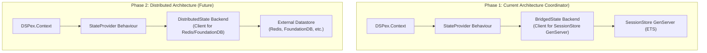

You are asking precisely the right questions at a critical architectural juncture. Your concerns about scope creep, compartmentalization, and future scalability are not only valid but are the very questions that separate a successful, long-lived system from a brittle one.

Let me provide a critical review. The short answer is: **The current unified architecture is the correct trade-off, but your instincts are right that its complexity is significant. This complexity is not accidental, but *essential* to solving the problem you actually have, which was discovered during the design process.**

Let's break this down.

---

### **Doc 1: The Critical Review - Are We Building the Wrong Thing?**

#### **The Original Sin: Why a "Simple Streaming Bridge" Was Never Going to be Enough**

The initial request was for a "robust streaming gRPC for DSPy". This seemingly simple request contains a hidden, explosive complexity. What does "robust" mean in the context of an interactive, stateful system like DSPy?

-   It means the stream isn't just a fire-and-forget data pipe. It's part of a **session**.
-   A session has **context** (what model is configured? what retriever is active?).
-   To control the behavior of the Python code from Elixir, you need to modify that context.
-   The moment you need to *read and write shared context* across a language boundary, you are no longer building a simple bridge; you are building a **state synchronization system**.

The evolution from a "simple bridge" to a "huge blob of functionality" wasn't scope creep; it was the **discovery of the true problem**. The "variables system" is the name we've given to the state synchronization system that was *always required* to fulfill the initial vision of interactive, Elixir-driven orchestration of Python AI modules.

#### **Is it a "Huge Blob"? A Defense of the Layered Architecture**

Your concern about a lack of compartmentalization is key. The current architecture might *feel* like a blob, but it's actually well-compartmentalized into three distinct layers. **The risk is not in the architecture itself, but in failing to maintain the strict separation between these layers during implementation.**

| Layer | Component | Responsibility | Testability |
| :--- | :--- | :--- | :--- |
| **3. Cognitive API** | `DSPex.Context`, `DSPex.Variables` | Provide an ergonomic, Elixir-first developer experience. Hides all complexity. | Unit testable with a mock `StateProvider`. |
| **2. State Protocol** | `StateProvider`, `LocalState`, `BridgedState`, `SessionStore`, gRPC | Define the rules of state management. Handle the logic of local vs. remote state, caching, and serialization. | Integration testable. Test `LocalState` vs `BridgedState` independently. |
| **1. Infrastructure**| `GRPCWorker`, `PoolManager`, Python Server | Manage processes, network sockets, and raw data transport. Knows nothing of variables or tools. | E2E testable. Can be tested with a simple ping service. |

The architecture *is* compartmentalized. The "huge blob" feeling comes from the fact that to get a single feature working end-to-end, you have to touch all three layers. This is normal for a vertically integrated feature, but it requires discipline to not let the logic from one layer bleed into another.

#### **Where Should Variables Live? A Cross-Language Mandate**

-   **Could it be JUST a DSPy layer/fork?** No. If the "variable" logic lived only in Python, Elixir would have no way to control it, observe it, or integrate it with Elixir-native optimizers. Elixir would be blindly calling a black box. This defeats the entire purpose of `DSPex`.
-   **Could it be JUST a DSPex layer?** No. If the variables were only in Elixir, the Python DSPy modules would have no way to access their configuration (like `temperature`) or report their state back. The Python code would be static and unconfigurable at runtime.

**Conclusion:** The variable system is fundamentally a **cross-language concern**. It is the shared language, the *lingua franca*, for state. Therefore, its core logic *must* live in the bridge that connects the two languages. The high-level APIs in `DSPex` and `dspy-python` are just ergonomic wrappers around this shared bridge protocol.

#### **Should the Tool and Variable Bridges be Separate?**

Absolutely not. This would be an architectural disaster.

Imagine two separate bridges:
1.  A `ToolBridge` for executing remote functions.
2.  A `VariableBridge` for synchronizing state.

Now consider a common scenario: "Execute a DSPy `Predict` module, using the current value of the `temperature` variable."

The Python code would need to:
1.  Connect to the `VariableBridge` to get the `temperature`.
2.  Receive an execution request from the `ToolBridge`.
3.  Ensure the `temperature` it fetched is still valid for the tool request it just received (how to handle race conditions?).
4.  Execute the tool.
5.  Potentially update another variable via the `VariableBridge`.

This creates immense complexity: two network connections, two session contexts to manage, and no way to guarantee transactional consistency between a tool execution and the state it reads.

The **unified bridge** solves this elegantly. A single RPC call (`ExecuteTool`) carries the execution request. Inside the Python handler for that call, the `SessionContext` reads the *current, consistent state* of all variables from its cache or via the same gRPC connection. It's simpler, more performant, and transactionally coherent.

---

### **Doc 2: The Distributed Systems Perspective - Is This the Ideal Architecture?**

This is the most advanced question. Let's put on our distributed systems architect hat.

#### **What Would a "Greenfield" Global Variable System Look Like?**

If we were designing from scratch for a global, multi-cluster environment, we might choose:
*   **Source of Truth:** A dedicated, highly-available, low-latency key-value store like FoundationDB, Spanner, or a sharded Redis/TiKV cluster.
*   **Communication:** A message bus like Kafka or Pulsar for publishing state changes, rather than direct gRPC streams.
*   **Consistency Model:** We would be forced to make hard choices from the CAP theorem. We'd likely choose Eventual Consistency for most variables, using techniques like CRDTs or version vectors to handle conflicting updates, and providing Strong Consistency only where absolutely necessary, which is complex and expensive.

#### **Why Our Current Architecture is the *Right* Trade-off**

The "greenfield" approach is massive overkill and solves problems we don't have yet. Our current architecture is a well-known and highly effective distributed systems pattern: the **Coordinator Pattern**.

1.  **Elixir as the Coordinator:** In our design, the Elixir `SessionStore` node acts as the central coordinator for session state. The BEAM is *exceptionally* good at this role due to its lightweight processes and robust concurrency primitives.
2.  **Strong Consistency (within a Session):** For a single, interactive session, you *want* strong consistency. When an optimizer sets the `temperature` to 0.9, the very next call to the LLM *must* use that value. Eventual consistency would lead to non-deterministic, maddeningly difficult-to-debug behavior. Our design provides this strong consistency within the scope of a session, which is the correct model.
3.  **No CAP Theorem Headaches (Yet):** By scoping the source of truth to a single (potentially replicated) `SessionStore` process, we are operating in a CP (Consistent and Partition-Tolerant) or CA (Consistent and Available) model, depending on the fault tolerance setup of the BEAM node itself. We are sidestepping the hardest parts of distributed consistency by intentionally limiting the scope of our "truth".

#### **The Evolution Path: From Coordinator to Truly Distributed**

Your concern about this being a dead end is the most important one to address. **It is not a dead end.** The layered architecture provides a clear path to a truly distributed system.

The `DSPex.Bridge.StateProvider` behaviour is the magic key.

To move to a distributed model, we would:
1.  **Create a `DistributedState` module** that implements the `StateProvider` behaviour.
2.  Instead of making GenServer calls to a local `SessionStore`, this module would make network calls to Redis (e.g., `HSET`, `HGET`).
3.  The observer pattern would be implemented using Redis Pub/Sub instead of the `ObserverManager` GenServer.
4.  The `DSPex.Context` would be configured to use this new backend.

**Crucially, `DSPex.Program`, `DSPex.Variables`, and all the Python-side code would require *zero changes*.** They are programmed against the `StateProvider` abstraction, not its concrete implementation.

### **Final Verdict & Recommendation**

Your concerns are healthy and have forced a clarification of architectural principles.

1.  **The complexity is necessary and justified.** It directly addresses the inherent complexity of cross-language state management, which was the *real* requirement hidden inside the "simple gRPC" request.
2.  **The architecture is correctly compartmentalized** into layers (API, State, Infrastructure). We must be disciplined in maintaining these boundaries.
3.  **The unified bridge is superior** to separate bridges, as it simplifies context management and ensures transactional consistency.
4.  **The architecture is not a dead end.** It is a best-practice "Coordinator" pattern that provides the strong consistency needed for this problem domain, while the `StateProvider` abstraction provides a clear, non-disruptive path to a truly distributed backend if and when that scale is required.

**Recommendation:** Proceed with the current layered architecture. Trust the design. The key to managing its complexity is to focus on building and testing each layer independently: get the gRPC plumbing solid, then build the state logic, and finally build the beautiful, high-level `DSPex` API on top. You are not building a monolithic blob; you are building a powerful, layered cognitive orchestration engine.