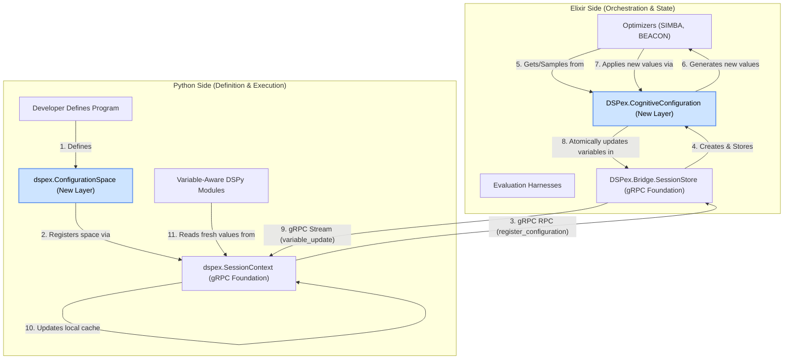

After thoroughly reviewing the unified gRPC bridge documentation, it's clear that the existing plan provides an excellent, robust, and necessary *foundational layer*. It defines the "nervous system" for state synchronization.

The next logical step is to build the "cognitive layer" on top of this foundation. This higher-level API will provide developers with an ergonomic, powerful, and safe way to manage and optimize entire sets of related variables, directly enabling the advanced concepts from Omar's vision like "Cognitive Control Planes."

Below is the technical design for this new layer, followed by the detailed API documentation for both Elixir and Python.

---

### 1. Technical Design: The Cognitive Configuration Layer

#### **Executive Summary**

The Cognitive Configuration Layer introduces a higher-level abstraction called a `ConfigurationSpace`. This abstraction moves beyond managing individual variables (`temperature`, `max_tokens`) to orchestrating cohesive sets of variables that define the complete, tunable behavior of a DSPy program or a multi-agent system. This layer is the primary interface for optimizers and evaluation harnesses, providing a clean, declarative API that uses the underlying unified gRPC bridge for state management.

#### **Problem Statement**

The unified gRPC bridge provides essential but low-level primitives like `get_variable`, `set_variable`, and `watch_variables`. While powerful, using these directly for complex optimization has several drawbacks:
1.  **Verbosity:** Optimizers would need to manage dozens of individual variable IDs.
2.  **Lack of Cohesion:** The relationship between variables (e.g., `model` and `temperature`) is not explicitly defined.
3.  **Validation Complexity:** Enforcing cross-variable constraints (e.g., "if `model` is X, `max_tokens` must be < 4096") becomes the optimizer's responsibility.
4.  **Atomicity Challenges:** Updating multiple related variables requires multiple RPC calls, risking inconsistent states.

The Cognitive Configuration Layer solves these problems by treating a set of variables as a single, atomic, and validatable unit.

#### **Architectural Placement & Interaction Flow**

This layer sits directly on top of the existing gRPC bridge components. It does not replace them but rather orchestrates them.



**Key Concepts:**

1.  **`dspex.ConfigurationSpace` (Python):** A developer-friendly, declarative class for defining a set of related variables, their types, constraints, and dependencies. Its primary role is to be defined in Python and then `register()`-ed with the Elixir session.
2.  **`DSPex.CognitiveConfiguration` (Elixir):** An Elixir struct and module that represents the registered configuration space on the server. It holds the canonical definition and provides functions for validation, sampling, and atomic updates. This is what Elixir-native optimizers interact with.

**The Workflow:**
A `ConfigurationSpace` is *defined* in Python, where the DSPy programs live. It is *managed* and *optimized* in Elixir, the orchestration environment. This clean separation of concerns is the core of the design.

---

### 2. Elixir API: `DSPex.CognitiveConfiguration`

This module provides the high-level API for Elixir-based optimizers and orchestrators to interact with entire variable spaces. It is a consumer of the `SessionStore`.

```elixir
defmodule DSPex.CognitiveConfiguration do
  @moduledoc """
  A higher-level abstraction for managing a cohesive set of variables.

  This module represents a named, versioned, and validatable "control panel"
  for a DSPy program or multi-agent system, using the SessionStore for
  underlying state management. It is the primary interface for optimizers.
  """

  alias DSPex.Bridge.SessionStore

  defstruct [
    :name,          # The unique name of this configuration space, e.g., :react_agent_config
    :session_id,    # The session this configuration belongs to
    :version,       # The version of this configuration, incremented on changes
    :variables,     # Map of variable_name => %VariableSpec{}
    :dependencies,  # Dependency graph for variables
    :constraints    # List of cross-variable validation functions
  ]

  @doc """
  Registers a new configuration space within a session.

  This is the primary entry point, typically called via gRPC from Python.
  It atomically registers all variables in the SessionStore and saves the
  configuration definition.

  ## Parameters
    - `session_id` - The session to register in.
    - `name` - The name of the configuration space (e.g., `:my_program_config`).
    - `space_definition` - A map defining the variables and constraints.

  ## Returns
    - `{:ok, %__MODULE__{}}` - The newly created configuration struct.
    - `{:error, reason}` - If validation fails or registration errors.
  """
  @spec register(String.t(), atom(), map()) :: {:ok, t()} | {:error, term()}
  def register(session_id, name, space_definition) do
    # 1. Validate the incoming space definition
    # 2. Create individual DSPex.Bridge.Variables.Variable structs
    # 3. Call SessionStore.register_variables/2 for atomic registration
    # 4. Store the CognitiveConfiguration definition in the SessionStore metadata
    # 5. Return the hydrated struct
  end

  @doc """
  Retrieves a registered configuration space from a session.
  """
  @spec get(String.t(), atom()) :: {:ok, t()} | {:error, :not_found}
  def get(session_id, name) do
    # Fetches the configuration definition from SessionStore metadata
  end

  @doc """
  Applies a map of new values to the configuration space atomically.

  This is the main function used by optimizers. It validates the new
  configuration and performs a single batch update via SessionStore.

  ## Returns
    - `{:ok, new_version}` - The new version number of the configuration.
    - `{:error, {:validation_failed, errors}}` - If the new values violate constraints.
  """
  @spec apply(t(), map(), map()) :: {:ok, integer()} | {:error, term()}
  def apply(%__MODULE__{} = config, new_values, metadata \\ %{}) do
    with {:ok, validated_values} <- validate(config, new_values) do
      # Convert to {var_id, value} map
      updates = build_update_map(config, validated_values)
      
      # Call the foundational SessionStore API for an atomic batch update
      case SessionStore.update_variables(config.session_id, updates, metadata) do
        :ok ->
          new_version = config.version + 1
          # Update config version in SessionStore metadata
          {:ok, new_version}
        error -> error
      end
    end
  end

  @doc """
  Retrieves the current values for all variables in this configuration space.
  """
  @spec get_current_values(t()) :: {:ok, map()} | {:error, term()}
  def get_current_values(%__MODULE__{} = config) do
    var_ids = Map.values(config.variables) |> Enum.map(& &1.id)
    SessionStore.get_variables(config.session_id, var_ids)
  end

  @doc """
  Generates a random, valid configuration from the space.

  Essential for random search optimizers and initialization. It respects
  all type, range, and cross-variable constraints.
  """
  @spec sample(t()) :: {:ok, map()}
  def sample(%__MODULE__{} = config) do
    # 1. Generate random values for each variable based on its type and constraints
    # 2. Retry generation until all cross-variable constraints are satisfied
    # 3. Returns a map of %{variable_name => sampled_value}
  end

  @doc """
  Validates a map of values against the configuration space's rules.
  """
  @spec validate(t(), map()) :: {:ok, map()} | {:error, {:validation_failed, list()}}
  def validate(%__MODULE__{} = config, values) do
    # 1. Check for missing/extra keys
    # 2. Validate each value against its variable type and constraints
    # 3. Check all cross-variable constraints
    # 4. Returns the validated (and possibly casted) map or a list of errors
  end
end
```

---

### 3. Python API: `dspex.ConfigurationSpace` & `SessionContext` Enhancements

This API provides a Pythonic, developer-friendly DSL for defining a configuration space and interacting with it.

#### **`dspex.ConfigurationSpace` Class**
```python
from typing import Any, Dict, List, Optional, Callable
from .session_context import SessionContext

class ConfigurationSpace:
    """A declarative API for defining and managing a cohesive set of variables."""

    def __init__(self, name: str, session_context: SessionContext):
        """
        Initializes a configuration space definition.

        Args:
            name: The unique name for this space (e.g., 'react_agent_config').
            session_context: The SessionContext instance to register with.
        """
        self.name = name
        self._session_context = session_context
        self._variables: Dict[str, Dict] = {}
        self._constraints: List[Dict] = []

    def add_variable(
        self,
        name: str,
        type: str,
        default: Any,
        constraints: Optional[Dict] = None,
        description: Optional[str] = None
    ) -> 'ConfigurationSpace':
        """
        Adds a variable definition to the space. Returns self for chaining.

        Args:
            name: The variable name.
            type: The variable type (e.g., 'float', 'integer', 'choice', 'module').
            default: The default value.
            constraints: A dict of type-specific constraints (e.g., {'min': 0, 'max': 1}).
            description: A human-readable description.
        """
        self._variables[name] = {
            'type': type,
            'default': default,
            'constraints': constraints or {},
            'description': description
        }
        return self

    def add_constraint(
        self,
        constraint_fn: Callable[[Dict], bool],
        error_message: str
    ) -> 'ConfigurationSpace':
        """
        Adds a cross-variable constraint.
        
        Note: The constraint function will be serialized and executed on the Elixir side.
        For Phase 1, this may be limited to simple expression strings.
        """
        # In a real implementation, this would involve serializing the function logic.
        # For now, we assume a mechanism exists to transport this constraint.
        self._constraints.append({'logic': str(constraint_fn), 'error': error_message})
        return self

    async def register(self) -> None:
        """
        Registers the defined space with the Elixir session.

        This sends the entire configuration definition over gRPC to be
        instantiated in the Elixir SessionStore. This should be called
        once after defining the space.
        """
        space_definition = {
            'variables': self._variables,
            'constraints': self._constraints
        }
        await self._session_context._register_configuration(self.name, space_definition)

    async def apply(self, new_values: Dict[str, Any], metadata: Dict = None) -> None:
        """Atomically applies a new set of values to the configuration."""
        await self._session_context._apply_configuration(self.name, new_values, metadata)

    async def get_current_values(self) -> Dict[str, Any]:
        """Fetches the current values for all variables in this space."""
        return await self._session_context._get_configuration_values(self.name)

    async def sample(self) -> Dict[str, Any]:
        """Requests a new, random, valid sample from the configuration space."""
        return await self._session_context._sample_configuration(self.name)
```

#### **`dspex.SessionContext` Enhancements**

The `SessionContext` is extended with methods that interact with the higher-level configuration objects in Elixir.

```python
# In class SessionContext:

def configuration_space(self, name: str) -> ConfigurationSpace:
    """
    Returns a handle to a configuration space for definition and interaction.

    Args:
        name: The unique name for the configuration space.

    Returns:
        A ConfigurationSpace instance bound to this session.
    """
    return ConfigurationSpace(name, self)

# These methods would be private, called by ConfigurationSpace instance methods.
# They would map to new gRPC RPCs.

async def _register_configuration(self, name: str, definition: Dict):
    # gRPC call to register the configuration space
    request = RegisterConfigurationRequest(session_id=self.session_id, name=name, definition=...)
    await self.stub.RegisterConfiguration(request)

async def _apply_configuration(self, name: str, values: Dict, metadata: Dict):
    # gRPC call for atomic batch-update of variables in the named space
    request = ApplyConfigurationRequest(session_id=self.session_id, name=name, values=...)
    await self.stub.ApplyConfiguration(request)

# ... and so on for _get_configuration_values and _sample_configuration
```

### **Example: Defining and Using a High-Level Configuration**

This example shows the end-to-end developer experience.

```python
import dspy
from dspex import SessionContext, VariableAwareReAct

async def main():
    # 1. Initialize session context (gRPC foundation)
    session = SessionContext("session-123", channel)
    await session.initialize()

    # 2. Get a handle to a new configuration space (New Higher-Level API)
    react_config = session.configuration_space("react_agent_config")

    # 3. Define the entire tunable configuration for a ReAct agent
    react_config.add_variable(
        name="temperature",
        type="float",
        default=0.7,
        constraints={'min': 0.0, 'max': 1.5}
    ).add_variable(
        name="max_iters",
        type="integer",
        default=5,
        constraints={'min': 3, 'max': 10}
    ).add_variable(
        name="reasoning_model",
        type="choice",
        default="gpt-4-turbo",
        constraints={'choices': ["gpt-4-turbo", "claude-3-opus", "gemini-1.5-pro"]}
    ).add_variable(
        name="tool_model",
        type="choice",
        default="gpt-3.5-turbo",
        constraints={'choices': ["gpt-3.5-turbo", "claude-3-sonnet"]}
    )

    # 4. Register the configuration space with the Elixir backend
    await react_config.register()
    print("ReAct agent configuration space registered.")

    # 5. Create a Variable-Aware DSPy module
    # The mixin allows it to automatically use variables from the session
    react_agent = VariableAwareReAct(
        "question -> answer",
        session_context=session,
        tools=[search_tool]
    )

    # 6. Bind module parameters to the variables in our configuration space
    await react_agent.bind_to_variable("temperature", "temperature")
    await react_agent.bind_to_variable("max_iters", "max_iters")
    # ... and so on

    # --- At this point, an Elixir-based optimizer can take over ---
    # It would get the "react_agent_config", sample new values,
    # and `apply()` them, which would be reflected in the Python agent.

    # 7. Example of a manual update from Python
    print(f"Current temperature: {await session.get_variable('temperature')}")
    
    await react_config.apply({'temperature': 0.0, 'max_iters': 4})
    
    print(f"New temperature after apply: {await session.get_variable('temperature')}")

    # The next call to react_agent will use temperature=0.0 and max_iters=4
    result = await react_agent.forward(question="What is DSPy?")
```
